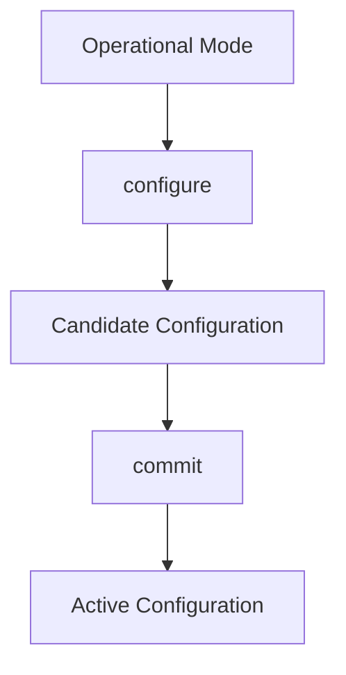
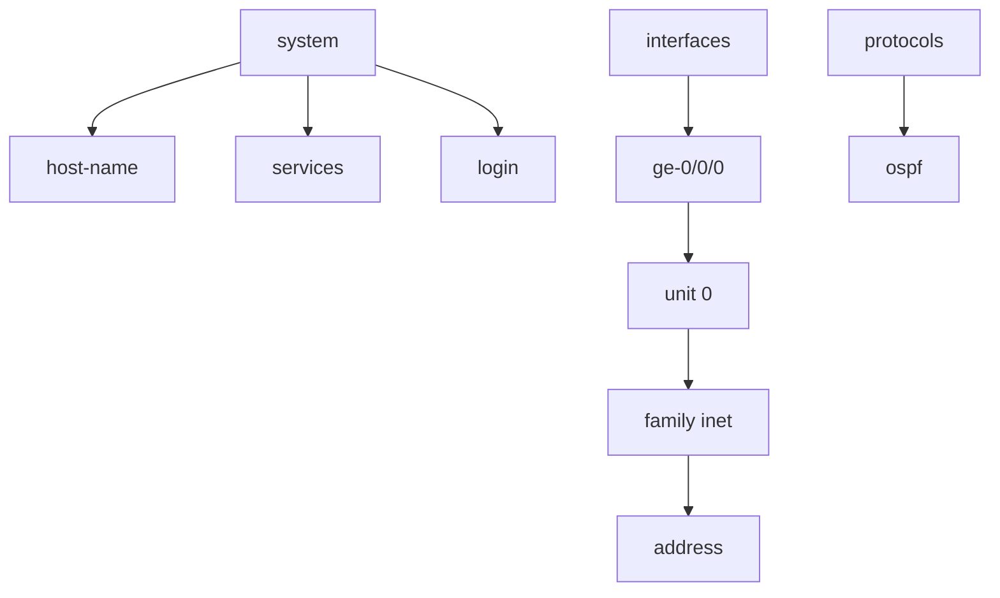
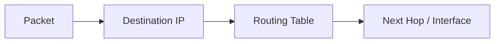
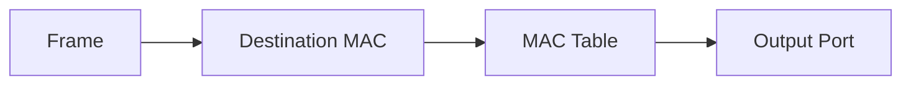
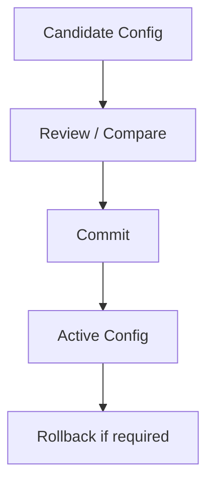

# Introduction to Junos OS

## Course Overview

**Junos OS** provides the foundational knowledge required to **configure, verify, and troubleshoot** Juniper devices.

### Core Topics

- Routers
    
- Switches
    
- Layer 3 interfaces
    
- Routing tables
    
- Static routes
    
- OSPF
    
- Layer 2 switchports
    
- User accounts
    
- Routing policies
    
- Firewall filters
    
- Junos OS troubleshooting
    
- Candidate configuration
    
- Rolling back changes
    
- Configuration hierarchy
    
- Junos software architecture
    
- Control Plane vs Data Plane
    
- Automation
    

> Source: Course overview and topic map — **Pages 1–4**.

---

## Junos OS Architecture

### Control Plane

Responsible for **network intelligence and decision-making**:

- Routing protocols
    
- Routing information
    
- Building routing tables
    
- System management
    
- Configuration
    

### Data Plane / Forwarding Plane

Responsible for **actually forwarding packets** based on forwarding information.

### Control Plane ↔ Data Plane Separation

- Control plane **learns and calculates** paths.
    
- Data plane **forwards packets** at high speed.
    
- Separation improves performance, stability, and scalability.
    

---

## Configuration Management

### Candidate Configuration

Junos uses a **candidate configuration** where changes are made before becoming active.

Basic workflow:



### Useful Commands

```bash
configure
```

Enter configuration mode.

```bash
show
```

View candidate configuration.

```bash
show | compare
```

Compare candidate configuration with the active configuration.

```bash
commit
```

Apply candidate configuration.

```bash
commit confirmed 5
```

Apply changes temporarily; automatically rollback if not confirmed within 5 minutes.

```bash
commit
```

Confirm the configuration before the timer expires.

```bash
rollback 0
```

Load the previous committed configuration into the candidate configuration.

```bash
rollback 1
```

Load the configuration from one commit before the current active configuration.

```bash
exit
```

Return to operational mode.

---

## Junos Configuration Hierarchy

Junos configuration is organized hierarchically rather than as a flat list.

Example:



**Key idea:** Understanding the hierarchy makes configuration and troubleshooting much easier.

---

## Routing Fundamentals

### Routers

Forward **packets** primarily using the **destination IP address**.



### Routing Table

Contains information used to determine where packets should be forwarded.

Common route types:

- **Direct/Local routes**
    
- **Static routes**
    
- **Dynamic routes** learned through routing protocols such as OSPF
    

### Static Route

Manually configured route.

### OSPF

A **dynamic link-state routing protocol** that automatically learns network paths.

---

## Switching Fundamentals

### Switches

Forward **Ethernet frames** using the **destination MAC address**.



### Layer 2 Switchport

An interface operating at Layer 2, commonly used to connect end hosts or other Ethernet devices.

---

## Network Addressing Refresher

### IPv4 `/24`

```text
/24 = 255.255.255.0
```

Total addresses:

```text
2^8 = 256
```

Traditionally usable host addresses:

```text
256 - Network Address - Broadcast Address
= 254 usable
```

Example:

```text
192.168.1.0/24

Network:    192.168.1.0
Usable:     192.168.1.1 – 192.168.1.254
Broadcast:  192.168.1.255
```

---

## OSI / TCP-IP Refresher

### MAC Address

- OSI: **Layer 2 – Data Link**
    
- Used for local Ethernet frame delivery.
    
- Switches use MAC addresses for forwarding.
    

### IP Address

- OSI: **Layer 3 – Network**
    
- Used for logical addressing and routing.
    
- Routers use destination IP information to select routes.
    

### Quick Comparison

|Device|Data|Main Forwarding Information|
|---|---|---|
|Switch|Frame|Destination MAC|
|Router|Packet|Destination IP|

---

## Course Prerequisites

Basic understanding of:

- IPv4
    
- IPv6
    
- Ethernet
    
- MAC address learning
    
- TCP
    
- UDP
    
- OSI model
    
- TCP/IP model
    
- Basic routing & switching
    

> Prerequisites are listed on **page 6**.

---

## Key Junos Concepts to Remember



### High-Value Exam Points

- **Router → Destination IP**
    
- **Switch → Destination MAC**
    
- **MAC → OSI Layer 2**
    
- **IPv4 /24 → 256 total, 254 traditionally usable**
    
- **Candidate configuration → Changes before commit**
    
- **Commit → Activates configuration**
    
- **Rollback → Revert/load previous configuration**
    
- **Control plane → Makes routing/control decisions**
    
- **Data plane → Forwards traffic**
    
- **OSPF → Dynamic link-state routing protocol**
    
- **Configuration hierarchy → Organizes Junos configuration logically**