# Junos OS — Configuration Power User Cheat Sheet

## 1. Locking the Candidate Configuration

### Shared Candidate Configuration

By default, all users work on **one shared candidate configuration**.

```bash
configure
```

Multiple users can enter configuration mode, but changes affect the same candidate configuration.

### `configure exclusive`

```bash
configure exclusive
```

- Locks the candidate configuration for one user.
    
- Other users can enter configuration mode but **cannot make changes**.
    
- Useful when one engineer needs exclusive control.
    

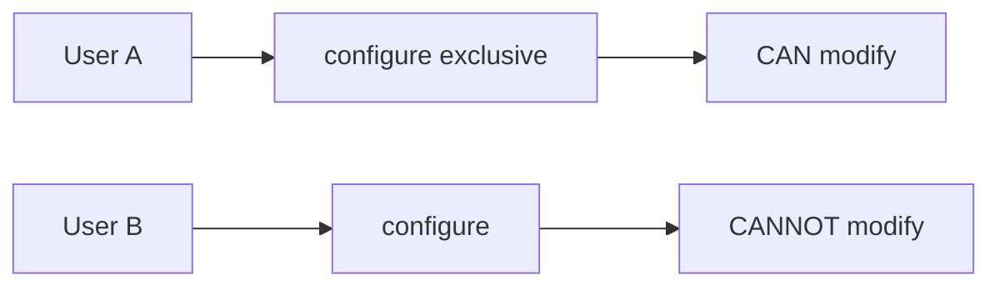

### `configure private`

```bash
configure private
```

- Gives each user a **temporary private candidate configuration**.
    
- Multiple users can modify different parts of the configuration simultaneously.
    
- Private configurations are based on a copy of the main configuration.
    
- **Uncommitted changes are discarded when exiting.**
    
- Commit must be performed from the top of the hierarchy.
    

```bash
configure private
```

---

# 2. Scheduled Commit

Schedule a configuration commit for later:

```bash
commit at "18:00:00"
```

Specific date + time:

```bash
commit at "2023-10-06 14:00:00"
```

Cancel a pending scheduled commit:

```bash
clear system commit
```

Useful when changes must be deployed during a maintenance window.

---

# 3. Disable Configuration

## Disable an Interface

```bash
set interfaces xe-0/1/3 disable
commit
```

The configuration remains present, but the interface is administratively disabled.

Re-enable:

```bash
delete interfaces xe-0/1/3 disable
commit
```

### Verify

```bash
show interfaces terse xe-0/1/3
```

Important columns:

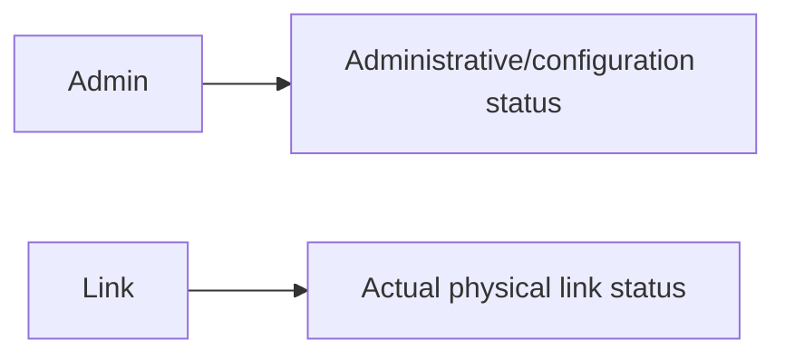

`Admin down` does **not necessarily mean the physical link is down**.

---

## Disable a Logical Unit

```bash
set interfaces xe-0/1/3 unit 0 disable
commit
```

Only that logical unit is disabled.

Useful when one physical interface hosts multiple customers/logical units.

---

# 4. Disable Protocols

`disable` can also be applied to protocols.

Example:

```bash
set protocols lldp interface xe-0/1/1 disable
```

Useful for:

- Maintenance
    
- Troubleshooting
    
- Temporarily stopping a protocol
    

---

# 5. `disable` vs `deactivate`

### `disable`

Used mainly to **administratively shut down** interfaces/protocols.

```bash
set interfaces xe-0/1/3 disable
```

### `deactivate`

Temporarily makes a configuration hierarchy **inactive**.

```bash
deactivate interfaces xe-0/1/3
```

- Configuration remains in the configuration.
    
- Junos does not process the inactive configuration.
    
- Useful for maintenance/testing.
    

Example:

```bash
deactivate interfaces xe-0/1/3
commit
```

Configuration appears with:

```text
inactive:
```

---

# 6. Reactivate Configuration

```bash
activate interfaces xe-0/1/3
commit
```

Removes the `inactive` state.

### Quick comparison

|Command|Purpose|
|---|---|
|`disable`|Disable interface/logical unit/protocol|
|`deactivate`|Make configuration hierarchy inactive|
|`activate`|Reactivate inactive configuration|

---

# 7. Configuration Hierarchy Navigation

Junos configuration is hierarchical.

Example:

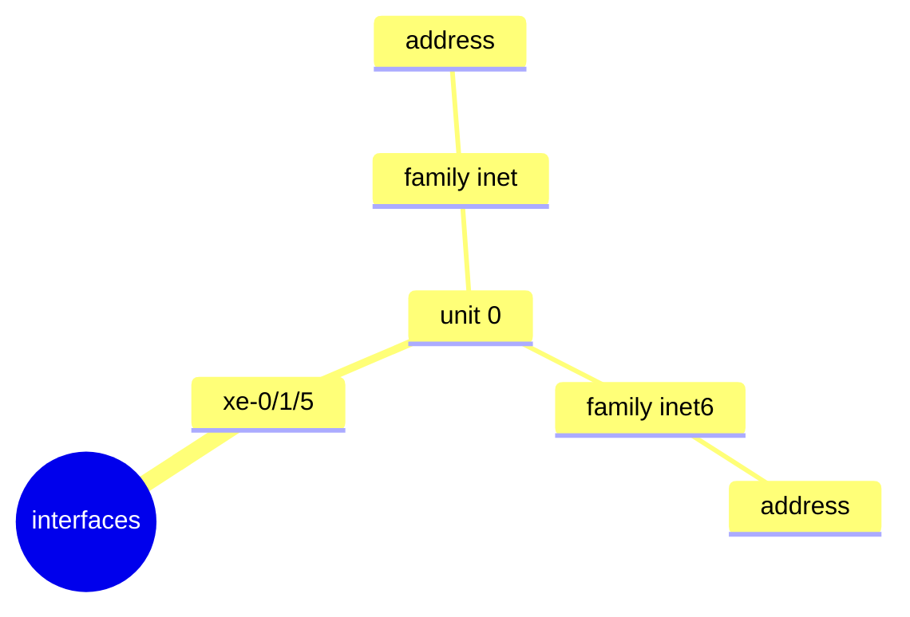

## `edit`

Move deeper into the hierarchy:

```bash
edit system
```

Then:

```text
[edit system]
```

Commands now apply relative to this location.

Example:

```bash
set host-name ROUTER1
```

is equivalent to:

```bash
set system host-name ROUTER1
```

---

# 8. `up`

Move **one level up**:

```bash
up
```

Example:

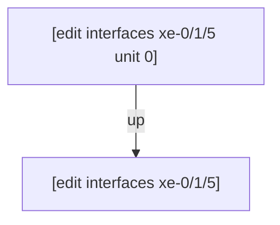

Multiple levels:

```bash
up 2
```

---

# 9. `top`

Return directly to the top:

```bash
top
```

Example:

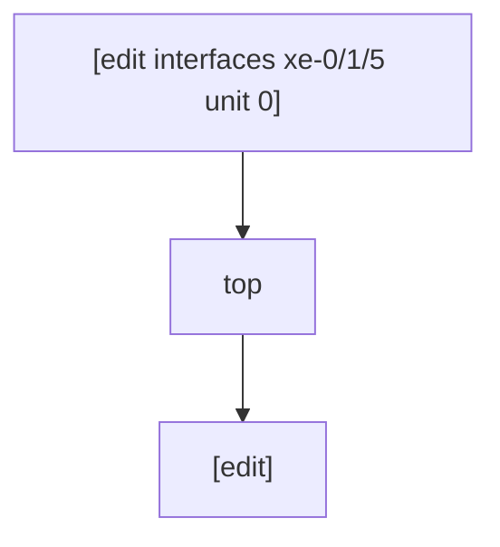

### Navigation Cheat Sheet

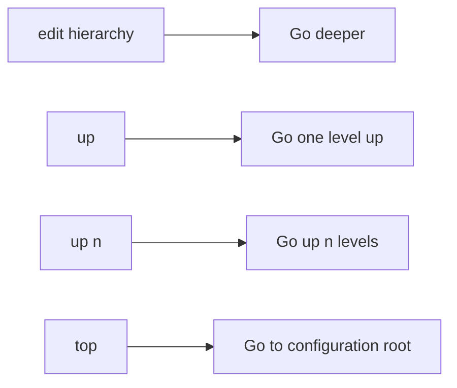

---

# 10. `show | compare` Is Hierarchy-Aware

At the top:

```bash
show | compare
```

→ Shows all candidate changes.

Inside a hierarchy:

```bash
[edit system]
show | compare
```

→ Shows changes **within the system hierarchy**.

Useful for reviewing only the relevant part of a large configuration.

---

# 11. Commit and Hierarchy Position

Normally:

```bash
commit
```

commits the **entire candidate configuration**, regardless of your current hierarchy.

### Exception: `configure private`

With private configuration:

```bash
configure private
```

you must commit from the **top** of the hierarchy.

Otherwise:

```text
error: can only commit from top of private configuration
```

Use:

```bash
top
commit
```

---

# 12. `rename`

`rename` changes an existing configuration value without requiring separate `delete` + `set`.

Example:

```bash
edit interfaces xe-0/1/3 unit 0 family inet

rename address 172.16.33.1/24 to address 172.16.30.1/24
```

Conceptually:

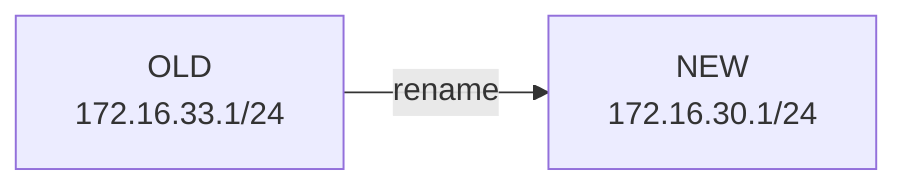

### Advantage

Instead of:

```bash
delete address OLD
set address NEW
```

use:

```bash
rename address OLD to address NEW
```

Less typing and less opportunity for mistakes.

---

# 13. `rename` Can Change Many Configuration Names

Can rename things such as:

- IP addresses
    
- Interface names
    
- Firewall filter names
    
- Security policy names
    
- Routing policy names
    

Example:

```bash
rename interfaces xe-0/1/2 to xe-0/1/4
```

---

# 14. Limitation of `rename`

`rename` changes the specified configuration hierarchy but may **not automatically update references elsewhere**.

Example:

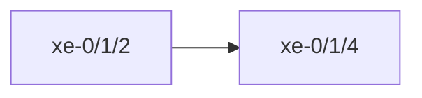

Other references may still contain:

```text
xe-0/1/2
```

Example:

```bash
show configuration | display set | match xe-0/1/2
```

Could show:

```text
set interfaces xe-0/1/2 ...
set protocols lldp interface xe-0/1/2
```

A simple `rename interfaces ...` does not necessarily solve every reference.

---

# 15. `replace pattern`

Use `replace pattern` to globally replace matching configuration text.

Syntax:

```bash
replace pattern <old> with <new>
```

Example:

```bash
replace pattern xe-0/1/2 with xe-0/1/4
```

This can change **all matching occurrences** within the applicable hierarchy.

### Important

At:

```text
[edit]
```

the replacement can affect the **entire configuration**.

At a deeper hierarchy, it is limited to that hierarchy.

---

# 16. `rename` vs `replace pattern`

|Command|Use|
|---|---|
|`rename`|Change a specific configuration occurrence|
|`replace pattern`|Replace matching text throughout configuration|

### Example

Changing **one IP address**:

```bash
rename address 10.8.9.1/24 to address 10.8.9.8/24
```

Changing **every occurrence** of an interface name:

```bash
replace pattern xe-0/1/2 with xe-0/1/4
```

### ⚠️ Warning

`replace pattern` can modify many unrelated configuration lines.

Always verify:

```bash
show | compare
```

before:

```bash
commit
```

---

# 17. Important Configuration Editing Commands

```text
set
delete
disable
activate
deactivate
edit
up
top
run
rename
replace pattern
copy
move
insert
annotate
save
load merge
load override
wildcard delete
```

---

# 18. CLI Keyboard Shortcuts

Junos CLI uses **Emacs-style shortcuts**.

## Delete Entire Word

```text
Ctrl-w
```

Deletes the word immediately before the cursor.

```text
set protocols lldp interface xe-0/1/2
                              ↑
                           Ctrl-w
```

---

## Start / End of Line

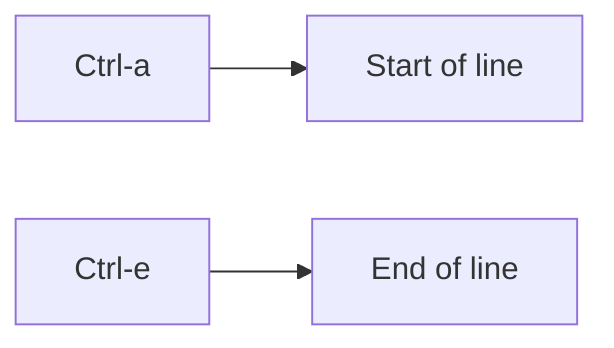

Memory trick:

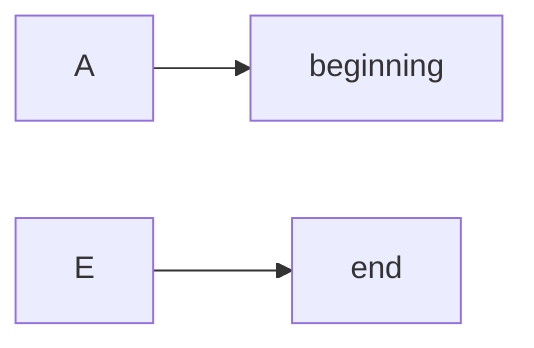

---

## Move by Word

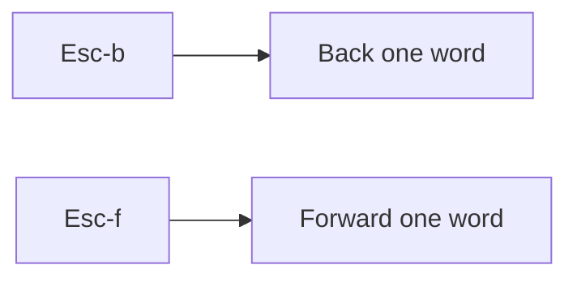

Memory:

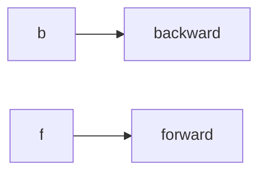

---

## Delete From Cursor to End

```text
Ctrl-k
```

Deletes everything from the cursor position onward.

```text
Before:
set protocols lldp interface xe-0/1/2
                 ↑ cursor

Ctrl-k

After:
set protocols lldp
```

Memory:

```text
K → kill remainder of line
```

---

# 19. Core Keyboard Shortcut Table

|Shortcut|Function|
|---|---|
|`Ctrl-w`|Delete previous word|
|`Ctrl-a`|Beginning of line|
|`Ctrl-e`|End of line|
|`Esc-b`|Back one word|
|`Esc-f`|Forward one word|
|`Ctrl-k`|Delete from cursor to end|

### High-Priority Shortcuts

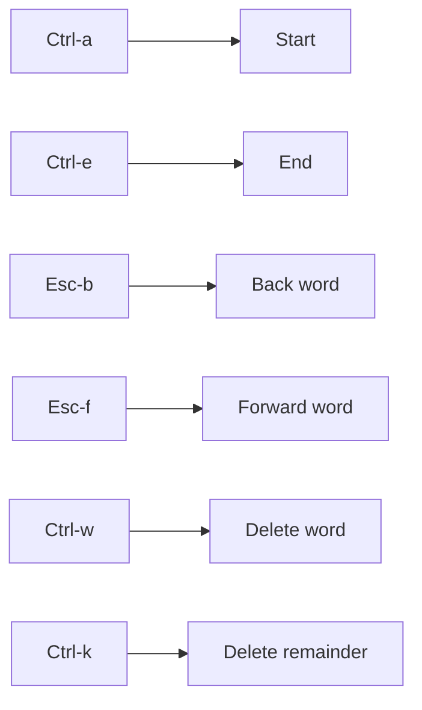

---

# ⭐ JNCIA Quick Revision

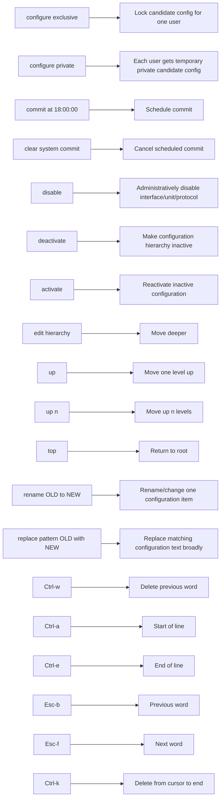

## ⭐ Exam Traps

```text
configure exclusive
❌ Does NOT create another candidate config
✅ Locks the shared candidate config

configure private
❌ Does NOT permanently create a separate config
✅ Creates a temporary private candidate config

disable
❌ Does NOT remove configuration
✅ Disables operation

deactivate
❌ Does NOT delete configuration
✅ Makes configuration inactive

rename
❌ Not a global text replacement
✅ Changes a specific configuration item

replace pattern
❌ Not limited to one occurrence
✅ Replaces matching occurrences within the hierarchy

Ctrl-w
❌ Not "delete to end"
✅ Delete previous word

Ctrl-k
❌ Not "delete word"
✅ Delete from cursor to end
```