# Junos OS — Routing Tables, Route Preference & Longest Prefix Match

## 1. Types of Routes

A router learns routes through **three primary methods**:

|Route Type|How Learned|Key Point|
|---|---|---|
|**Directly Connected**|Local interface is configured and operational|Automatically created|
|**Static**|Administrator manually configures route|Simple, predictable|
|**Dynamic**|Routing protocol learns route|Automatically adapts to topology|

### Directly Connected

If an interface is configured and **up**, Junos creates a route for that connected subnet.

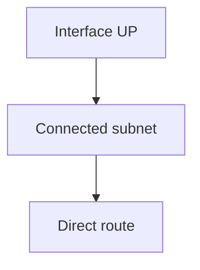

A directly connected route has **route preference 0**.

---

## 2. Static Routes

A static route is manually configured to reach a remote destination.

Example:

```bash
set routing-options static route 172.16.40.0/24 next-hop 10.1.2.2
```

Advantages:

- Simple
    
- Easy to understand
    
- Good for small/stable networks
    
- No routing protocol required
    

Disadvantage: does not automatically adapt to topology changes.

---

## 3. Dynamic Routes

Dynamic routing protocols automatically learn remote prefixes.

Common examples:

```text
OSPF
IS-IS
BGP
RIP
```

A dynamic routing protocol can:

- Learn remote networks
    
- Advertise local networks
    
- Re-advertise learned networks
    
- React to topology changes
    

---

# 4. What Makes a Route?

A route contains information needed to forward traffic:

```text
Destination prefix
Outgoing interface
Next-hop IP
Route source / protocol
```

Example:

```text
Destination:    172.16.40.0/24
Next-hop:       10.1.2.2
Interface:      xe-0/1/5.0
Protocol:       Static
```

---

# 5. Prefix Terminology

In routing, a subnet is commonly called a **prefix**.

Example:

```text
172.16.10.0/24
```

Breakdown:

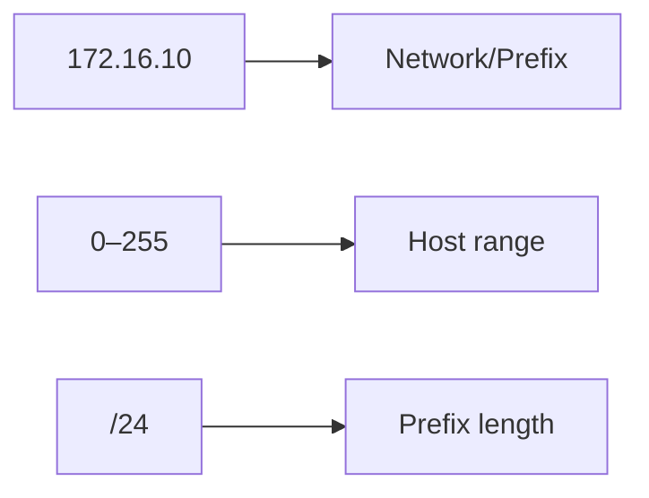

### Subnet vs Prefix

- **Subnet** → usually refers to IP address allocation/networking.
    
- **Prefix** → commonly used when discussing routing information.
    

---

# 6. Routing Table

Junos stores learned routes in routing tables.

The routing table contains routes learned from:

- Direct interfaces
    
- Static configuration
    
- Dynamic routing protocols
    
- Other routing mechanisms
    

Simplified example:

```text
10.20.30.0/24    Direct
192.168.77.0/24  Static
192.168.123.0/24 OSPF
```

The route entry also indicates **how Junos learned the route**.

---

# 7. Route Preference

A destination may be learned from multiple sources.

Junos uses **route preference** to choose between routes to the **same prefix**.

> **Lower numerical route preference = more preferred route**

Important values:

|Route Source|Preference|
|---|--:|
|Directly connected|**0**|
|Static|**5**|

Example:

```text
192.168.2.0/24

Direct   preference 0
Static   preference 5
```

The **Direct** route becomes the active route.

### Memory Trick

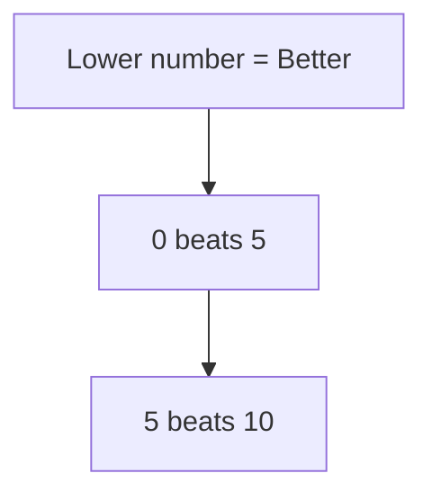

---

# 8. Route Preference Is NOT the First Decision

This is a major exam concept.

Junos first considers **prefix specificity**.

Then route preference is used when comparing routes for the **same prefix**.

### Decision Order

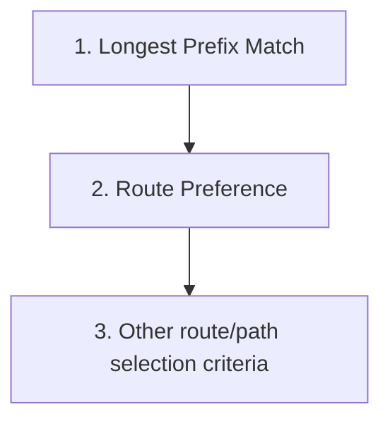

So:

> **More-specific route beats less-specific route, even if its route preference is worse.**

---

# 9. Longest Prefix Match (LPM)

The **longest prefix match** determines which route is most specific for a destination IP.

Example:

```text
172.16.40.0/24
172.16.40.0/25
```

`/25` is more specific than `/24`.

Therefore:

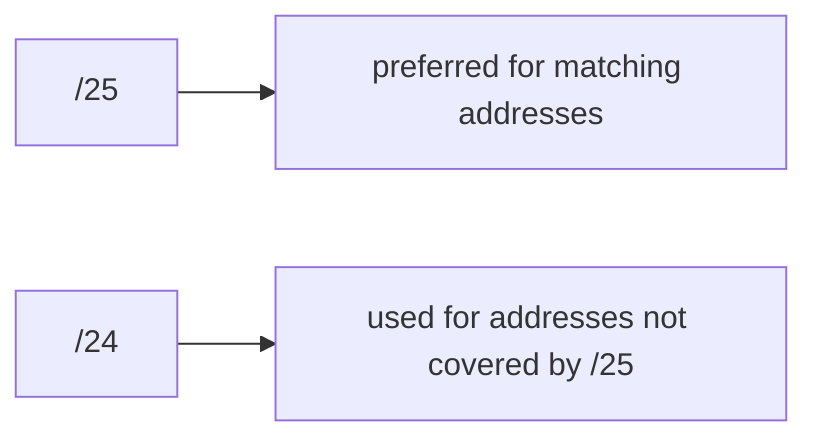

### Prefix Length

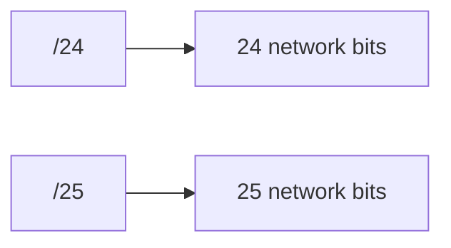

Therefore:

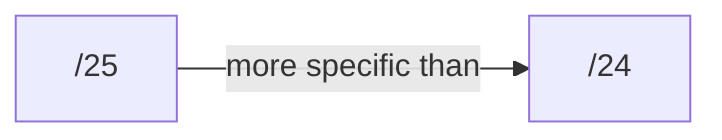

---

# 10. Example of Longest Prefix Match

Routing table:

```text
10.0.0.0/8
10.1.0.0/16
10.1.73.0/24
```

Destination:

```text
10.1.73.50
```

All three routes may match, but:

```text
10.1.73.0/24
```

is the **longest/more-specific match**.

Therefore traffic uses the `/24`.

---

# 11. More-Specific Route Beats Route Preference

Example:

```text
172.16.40.0/24   Static   preference 5
172.16.40.0/25   OSPF     preference 10
```

Destination:

```text
172.16.40.50
```

Result:

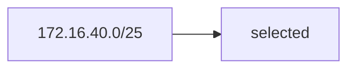

Even though:

```text
OSPF preference = 10
Static preference = 5
```

The `/25` wins because it is **more specific**.

---

# 12. Routing Table vs Forwarding Table

### Routing Table

Contains:

- All known routes/prefixes
    
- Routes from different protocols
    
- Active and inactive routes
    

### Forwarding Table

Contains:

- Selected **active/best routes**
    
- Information actually used to forward packets
    

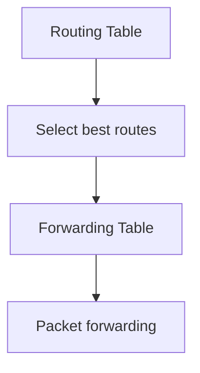

---

# 13. Junos Routing Tables

By default, Junos has two important routing tables:

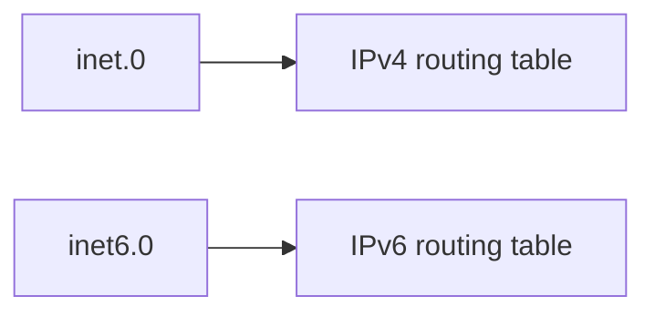

Pronunciation:

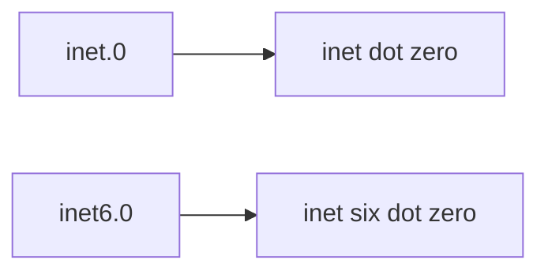

Other tables can exist for specialized purposes such as multicast/MPLS.

---

# 14. Viewing Routing Tables

Show the routing table:

```bash
show route
```

Show a specific table:

```bash
show route table inet.0
```

IPv6:

```bash
show route table inet6.0
```

---

# 15. Search for a Specific Prefix

```bash
show route 172.16.10.0/24
```

This searches for the prefix across routing tables.

To search a specific table:

```bash
show route table inet.0 172.16.10.0/24
```

Alternative form:

```bash
show route 172.16.10.0/24 table inet.0
```

Useful when multiple routing tables exist.

---

# 16. Read a Routing Table Entry

Example:

```text
172.16.10.0/24
    *[Direct/0] 00:12:20
      via xe-0/1/1.0

172.16.10.1/32
    *[Local/0] 00:12:20
      Local via xe-0/1/1.0
```

### Important Symbols

```text
* = Active route
```

An asterisk indicates the route selected as the **active route** when multiple routes exist.

---

# 17. `>` Symbol

Example:

```text
*[OSPF/10] ...
  > via xe-0/1/2.0
```

The `>` indicates the **best path between multiple paths learned from the same protocol**.

### Remember

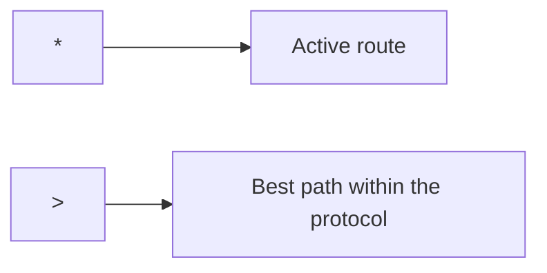

---

# 18. `/32` Local Route

When an interface has an IP address, Junos can install a `/32` **local route** for that exact address.

Example:

```text
172.16.10.0/24
172.16.10.1/32
```

The `/32` identifies the router's own interface address.

This helps ensure traffic destined specifically for the router's address is handled locally.

---

# 19. Viewing Routes Learned by a Protocol

You can filter routes based on how they were learned.

Example:

```bash
show route table inet.0 protocol direct
```

This displays directly connected routes.

You can similarly inspect routes learned through routing protocols:

```bash
show route protocol ospf
```

---

# 20. Route Table Output Interpretation

Typical format:

```text
Prefix
[Protocol/Preference]
Age
Next-hop / Interface
```

Example:

```text
192.168.20.0/24
*[Direct/0] 00:04:33
  via xe-0/1/5.0
```

Interpretation:

```text
Prefix      = 192.168.20.0/24
Protocol    = Direct
Preference  = 0
*           = Active
Interface   = xe-0/1/5.0
```

---

# 21. Full Routing Table Organization

A routing table may contain multiple entries for the same network.

Example:

```text
192.168.2.0/24
    Direct / 0
    Static / 5
```

Junos can keep both routes in the routing table, but only the **best route becomes active**.

The selected route is then installed into the forwarding table.

---

# 22. IPv6 Routing Table

IPv6 uses:

```text
inet6.0
```

Example:

```bash
show route table inet6.0
```

Specific IPv6 prefix:

```bash
show route 2001:db8:10::/64
```

The same basic concepts apply:

```text
Prefix
Next-hop
Interface
Protocol
Route preference
Longest prefix match
Active route
```

---

# 23. IPv4 vs IPv6 Table

|Address Family|Default Table|
|---|---|
|IPv4|`inet.0`|
|IPv6|`inet6.0`|

⚠️ **Exam trap:** `inet6.0`, not `inet.6`.

---

# ⭐ Routing Decision Cheat Sheet

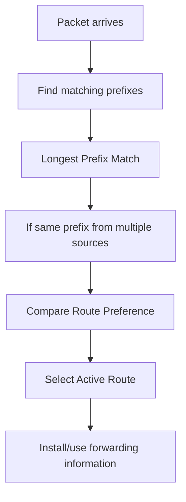

### Example

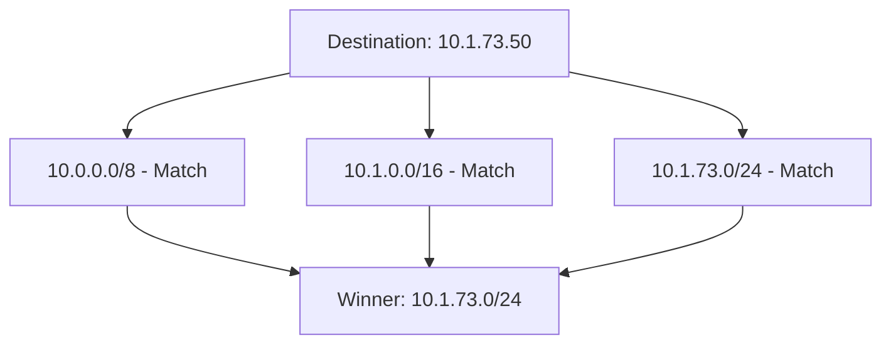

---

# ⭐ Essential Commands

```bash
# View routes
show route

# View IPv4 routing table
show route table inet.0

# View IPv6 routing table
show route table inet6.0

# Search for a prefix
show route 172.16.10.0/24

# Search prefix in specific table
show route table inet.0 172.16.10.0/24

# View routes from a protocol
show route protocol direct
show route protocol ospf
```

---

# ⭐ JNCIA Exam Traps

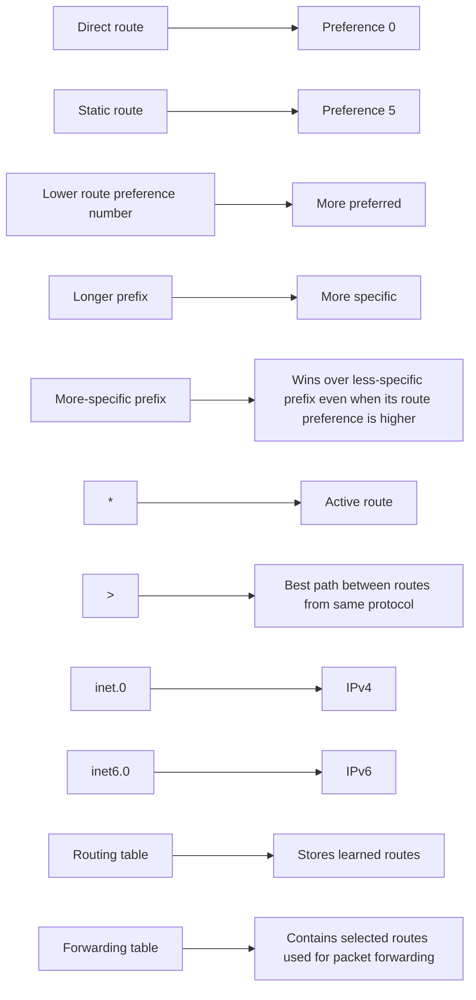

## One-Line Memory

> **Longest Prefix Match first → Route Preference breaks ties between identical prefixes → Active route goes to the forwarding table.**