# Junos OS — IPv4 & IPv6 Static Routes

## 1. Static Route

A **static route** is manually configured to reach a remote destination.

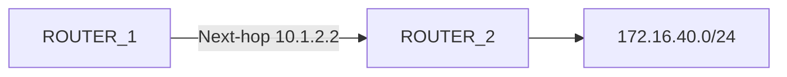

Example:

```bash
set routing-options static route 172.16.40.0/24 next-hop 10.1.2.2
```

Static routes are useful when:

- Network is small
    
- Only one path exists
    
- Predictable routing is required
    
- Low-powered/simple routers are used
    

---

# 2. Verify Connectivity Before Configuration

Before adding a static route, verify the next-hop/interface.

### IPv4

```bash
ping 10.1.2.2
```

### IPv6

```bash
ping 2001:db8:1:2::2 count 2
```

`ping` verifies that the neighboring router/interface is reachable.

Stop continuous ping:

```text
Ctrl+C
```

---

# 3. Source Address with `ping`

By default, Junos uses the **outgoing interface's address** as the source.

You can explicitly select the source:

```bash
ping 10.1.2.2 source 172.16.10.1
```

Useful for testing whether a remote device has a return path.

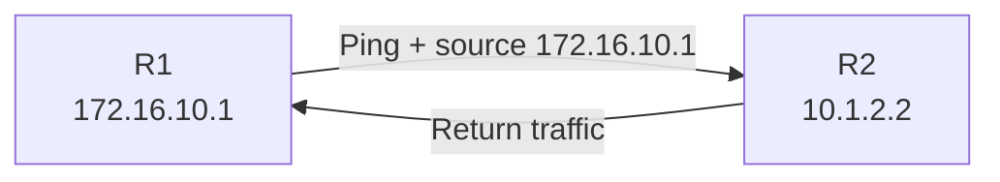

If the ping fails only when using a particular source address, a missing/incorrect return route may be the problem.

---

# 4. Check Existing Route Before Making Changes

```bash
show route 172.16.40.0/24
```

If there is no output:

```text
No route exists
```

For IPv6:

```bash
show route 2001:db8:0:40::/64
```

Always verify the routing table **before and after** configuration.

---

# 5. IPv4 Static Route Syntax

Static routes are configured under:

```text
routing-options
└── static
    └── route
```

Command:

```bash
set routing-options static route 172.16.40.0/24 next-hop 10.1.2.2
```

Read it naturally:

```text
Create a static route
to 172.16.40.0/24
using next-hop 10.1.2.2
```

Verify candidate change:

```bash
show | compare
```

Then:

```bash
commit
```

---

# 6. Verify IPv4 Static Route

```bash
show route 172.16.40.0/24
```

Expected:

```text
172.16.40.0/24
    *[Static/5]
      > to 10.1.2.2 via xe-0/1/5.0
```

Interpretation:

```text
Static       → Route learned from static configuration
5            → Route preference
10.1.2.2     → Next-hop
xe-0/1/5.0   → Outgoing interface
*            → Active route
```

Static routes have a default **route preference of 5**.

---

# 7. Test the IPv4 Static Route

After committing:

```bash
ping 172.16.40.1 count 2
```

Successful replies confirm end-to-end connectivity.

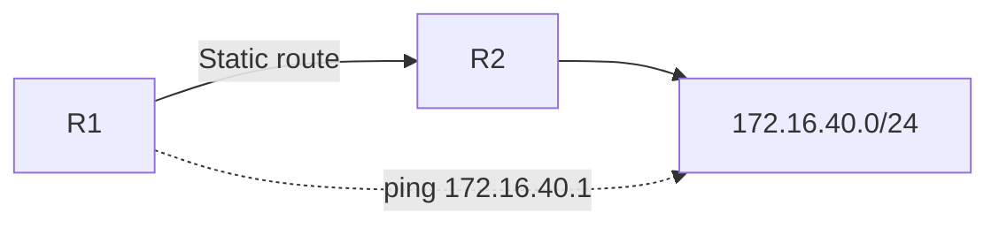

⚠️ A successful ping is useful evidence, but failure does **not always mean the route is wrong**. The destination host may simply block ICMP.

---

# 8. IPv6 Static Routes

IPv6 static routes are stored in the IPv6 RIB:

```text
inet6.0
```

For an IPv6 static route, explicitly specify the IPv6 routing table:

```bash
set routing-options rib inet6.0 static route 2001:db8:0:40::/64 next-hop 2001:db8:1:2::2
```

### Important difference

```text
IPv4:
routing-options static route ...

IPv6:
routing-options rib inet6.0 static route ...
```

---

# 9. Verify IPv6 Static Route

```bash
show route 2001:db8:0:40::/64
```

Expected structure:

```text
2001:db8:0:40::/64
    *[Static/5]
      > to 2001:db8:1:2::2 via xe-0/1/5.0
```

Then test:

```bash
ping 2001:db8:0:40::1 count 1
```

---

# 10. IPv4 vs IPv6 Static Route

||IPv4|IPv6|
|---|---|---|
|Routing table|`inet.0`|`inet6.0`|
|Configuration|`routing-options static`|`routing-options rib inet6.0 static`|
|Example destination|`172.16.40.0/24`|`2001:db8:0:40::/64`|
|Next-hop|IPv4 address|IPv6 address|
|Verification|`show route`|`show route`|

---

# 11. RIB and FIB

### RIB — Routing Information Base

Formal name for the **routing table**.

```text
IPv4 RIB → inet.0
IPv6 RIB → inet6.0
```

### FIB — Forwarding Information Base

Contains the selected forwarding information used to actually forward packets.

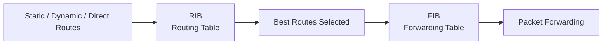

---

# 12. Static Route Advantages

### Simple

Easy to configure:

```bash
set routing-options static route <prefix> next-hop <IP>
```

### Predictable

Administrator explicitly determines the path.

### Low Overhead

No routing-protocol exchanges are required.

### Good for Small Networks

Especially useful when there is only one path to a destination.

---

# 13. Static Route Trade-offs

Static routes have three major disadvantages:

### 1. No Intelligent Topology Reaction

If the path fails, the static route does not automatically discover a better path.

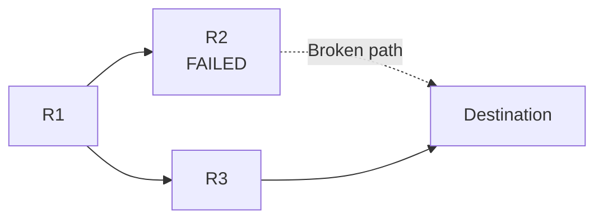

Without additional configuration, R1 does not automatically learn that R2 failed and switch to R3.

---

### 2. Manual Maintenance

When a new subnet is added, administrators may need to configure/update routes on multiple routers.

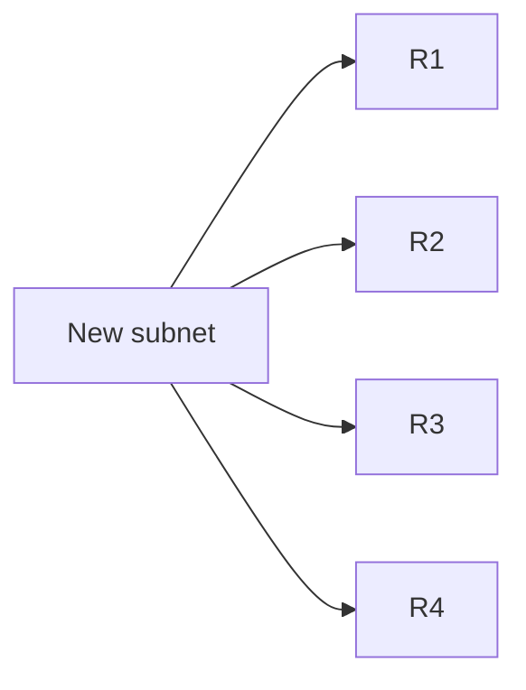

As the network grows, manual configuration becomes increasingly difficult.

---

### 3. No Route-Knowledge Verification

Routers do not communicate with each other to verify that manually configured static-route knowledge is correct.

Example:

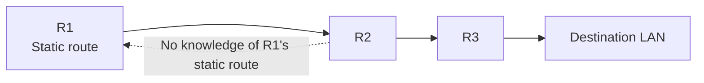

If R1 is configured incorrectly, R2 does not automatically tell R1 that its static-route assumption is wrong.

---

# 14. When to Use Static Routes

Good choices:

```text
✓ Very small networks
✓ Low-powered routers
✓ One path to destination
✓ Simple/stable topology
✓ Specific predictable routes
✓ Default route toward an upstream router
```

Poor choices:

```text
✗ Very large networks
✗ Frequently changing topology
✗ Many redundant paths
✗ Networks requiring automatic failover
```

---

# 15. Default Route

A **default route** is the catch-all route used when no more-specific route exists.

### IPv4

```text
0.0.0.0/0
```

### IPv6

```text
::/0
```

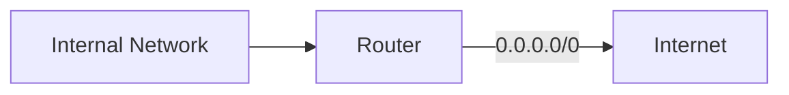

---

# 16. IPv4 Default Static Route

Two equivalent forms:

```bash
set routing-options static route 0.0.0.0/0 next-hop 10.1.254.254
```

or:

```bash
set routing-options static route 0/0 next-hop 10.1.254.254
```

Junos expands the shorthand in the stored configuration.

---

# 17. IPv6 Default Static Route

```bash
set routing-options rib inet6.0 static route ::/0 next-hop 2001:db8:1:254::254
```

Remember:

```text
IPv4 → 0.0.0.0/0
IPv6 → ::/0
```

---

# 18. Why `/0` Is a Default Route

`/0` contains **zero fixed network bits**.

Therefore, it can match any destination that does not have a more-specific route.

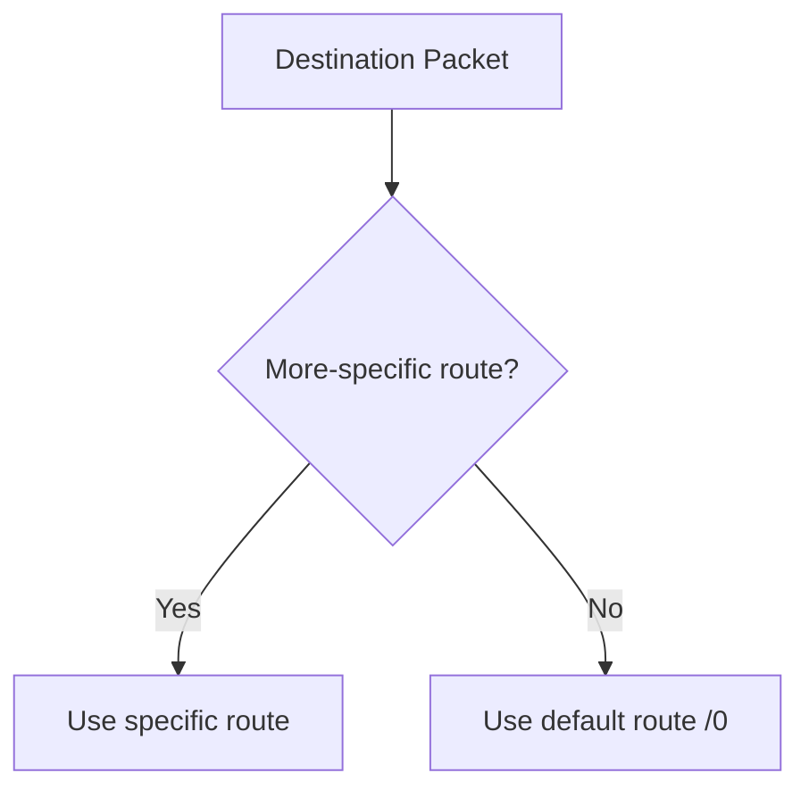

---

# 19. Default Route Does NOT Always Win

A default route has the least specificity.

Example:

```text
0.0.0.0/0
172.16.0.0/16
172.16.10.0/24
```

Destination:

```text
172.16.10.50
```

All may match, but:

```text
172.16.10.0/24
```

is the longest prefix match.

```text
/24 > /16 > /0
```

Therefore the `/24` is selected.

---

# 20. Verify Default Route

```bash
show route 0/0 exact
```

IPv6:

```bash
show route ::/0 exact
```

The `exact` option ensures you are viewing the exact prefix rather than related more-specific routes.

---

# 21. Testing Internet Connectivity

Check the default route:

```bash
show route 0/0 exact
```

Then test a reachable Internet address:

```bash
ping 203.0.113.5 count 2
```

Concept:

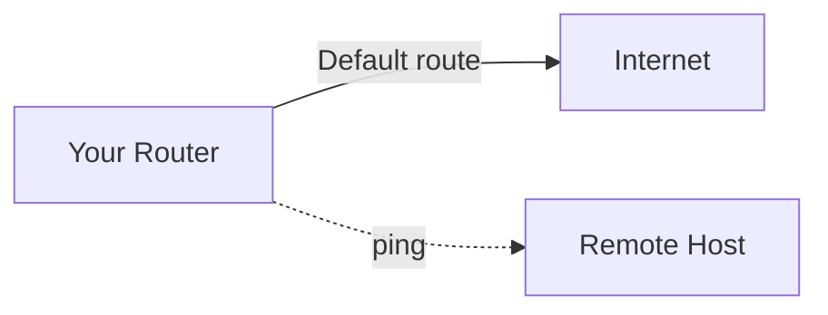

⚠️ Ping failure does not automatically prove the default route is incorrect because some Internet hosts/firewalls block ICMP.

---

# 22. View All Static Routes

```bash
show route protocol static
```

This displays static routes in the routing tables.

Useful for verifying both:

```text
IPv4 static routes
IPv6 static routes
```

---

# 23. Static Route Verification Workflow

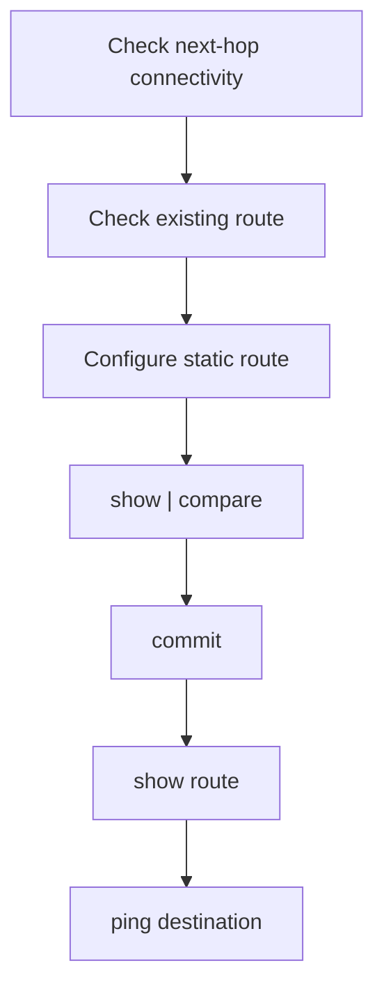

### Commands

```bash
ping <next-hop>

show route <destination-prefix>

configure

set routing-options static route <prefix> next-hop <next-hop>

show | compare

commit

show route <destination-prefix>

ping <destination>
```

---

# 24. Static Route Configuration Examples

### IPv4 remote LAN

```bash
set routing-options static route 172.16.40.0/24 next-hop 10.1.2.2
```

### IPv6 remote LAN

```bash
set routing-options rib inet6.0 static route 2001:db8:0:40::/64 next-hop 2001:db8:1:2::2
```

### IPv4 default route

```bash
set routing-options static route 0/0 next-hop 10.1.254.254
```

### IPv6 default route

```bash
set routing-options rib inet6.0 static route ::/0 next-hop 2001:db8:1:254::254
```

---

# 25. Key Route Concepts

```text
Direct route
→ Automatically created from an operational local interface

Static route
→ Manually configured

Dynamic route
→ Learned through a routing protocol
```

```text
RIB
→ Routing information / routing table

FIB
→ Forwarding information used to forward packets
```

```text
inet.0
→ IPv4 routing table

inet6.0
→ IPv6 routing table
```

---

# ⭐ JNCIA Cheat Sheet

```bash
# Check next-hop
ping 10.1.2.2

# Ping a fixed number of times
ping 10.1.2.2 count 2

# Specify ping source
ping 10.1.2.2 source 172.16.10.1

# Check route
show route 172.16.40.0/24

# IPv6 route
show route 2001:db8:0:40::/64

# IPv4 static route
set routing-options static route 172.16.40.0/24 next-hop 10.1.2.2

# IPv6 static route
set routing-options rib inet6.0 static route 2001:db8:0:40::/64 next-hop 2001:db8:1:2::2

# IPv4 default route
set routing-options static route 0/0 next-hop 10.1.254.254

# IPv6 default route
set routing-options rib inet6.0 static route ::/0 next-hop 2001:db8:1:254::254

# Review changes
show | compare

# Validate/activate
commit

# View all static routes
show route protocol static

# Exact default route
show route 0/0 exact
show route ::/0 exact
```

---

# ⭐ Exam Memory

```text
IPv4 default route → 0.0.0.0/0
IPv6 default route → ::/0

IPv4 RIB → inet.0
IPv6 RIB → inet6.0

Static preference → 5
Direct preference → 0

RIB → Routing decisions
FIB → Packet forwarding
```

### Static Route Decision

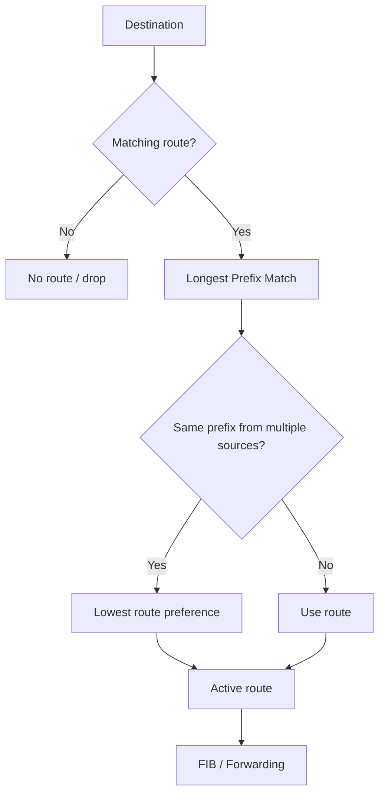

> **Most important:** Static routes are simple and predictable, but they are **manual** and do not inherently react intelligently to topology changes.