# Junos OS — Dynamic Routing Protocols: Theory

## 1. Dynamic Routing

Dynamic routing protocols allow routers to **automatically learn remote networks**, advertise their own networks, and adapt when topology changes.

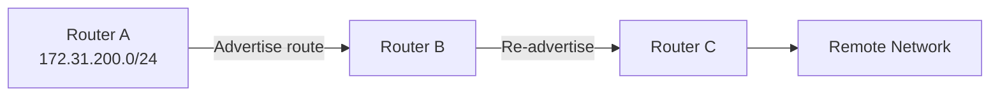

### Dynamic routing solves major problems of static routes

1. Automatically finds paths to destinations.
    
2. Reacts dynamically to topology changes.
    
3. Routers learn routing information from neighboring routers.
    

---

# 2. Distance-Vector Protocols

A distance-vector protocol views routing in terms of **distance/hops toward a destination**.


A basic distance-vector protocol primarily considers:

```text
Distance → Number of hops
Vector   → Direction / next-hop information
```

### Important

- Traditional distance-vector protocols do **not learn the complete network topology**.
    
- They primarily use hop count to determine the best path.
    
- A path with fewer hops can be selected even if the links are slower.
    

Example:

```text
A → B → E
2 hops

A → C → D → E
3 hops
```

A traditional hop-count-based protocol prefers:

```text
A → B → E
```

even if the second path has faster links.

---

# 3. RIP — Routing Information Protocol

**RIP** is a classic distance-vector routing protocol.

```text
RIP
├── Distance-vector
├── Uses hop count
├── Simple
├── Legacy
└── Rarely used today
```

### Key characteristics

- One of the earliest routing protocols.
    
- Uses **hop count** as its metric.
    
- Can make poor routing decisions when link speeds differ.
    
- Mainly important for understanding the fundamentals of dynamic routing.
    

> Junos supports RIP as its distance-vector protocol in this module.

---

# 4. Link-State Protocols

Link-state protocols learn information about the **network topology**, rather than only learning distance to destinations.

Think of each advertisement as a **jigsaw puzzle piece**.

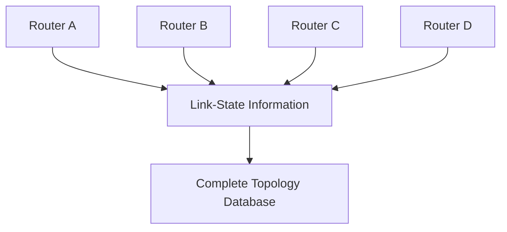

Each router collects information such as:

- Router identity
    
- Network prefixes
    
- Links to neighboring routers
    
- Metrics associated with links
    

---

# 5. Link-State Advertisements

The information exchanged allows routers to build a topology database.

For example:

```text
Router E
├── Router ID
├── Prefixes
│   └── 172.31.200.0/24
├── Connection → B
│   └── Metric 1000
└── Connection → D
    └── Metric 10
```

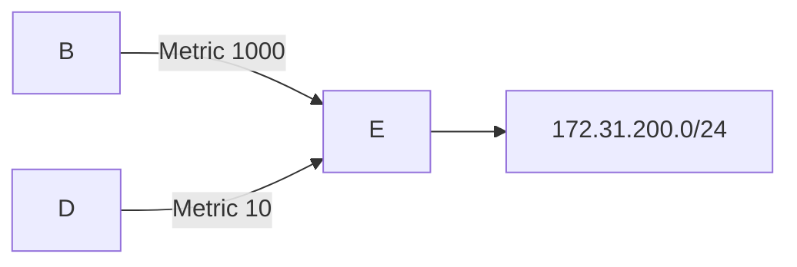

### Metric

Lower total metric generally represents the **better path**.

---

# 6. Link-State Metrics

Link-state protocols calculate the total metric across a path.

Example:

```text
A → B → E
1000 + 1000 = 2000

A → C → D → E
10 + 10 + 10 = 30
```

Therefore:

```text
30 < 2000
```

The second path is selected.

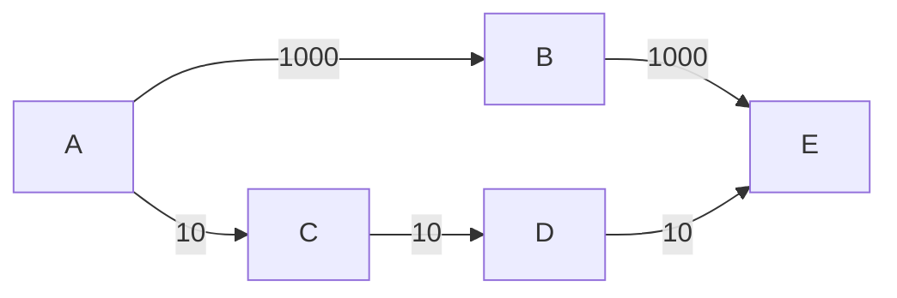

**Key difference from basic distance-vector:** link-state routing can consider link metrics rather than simply counting hops.

---

# 7. Common Link-State Metrics

The module illustrates a common speed-to-metric relationship:

|Link Speed|Example Metric|
|--:|--:|
|100 Gbps|1|
|10 Gbps|10|
|1 Gbps|100|
|100 Mbps|1000|

Lower metric = better path.

> The exact metric calculation depends on the routing protocol and its configuration.

---

# 8. Shortest Path First (SPF)

Link-state routers flood topology information throughout the network.

Each router then builds the topology and calculates the best paths using the **Shortest Path First (SPF)** algorithm.

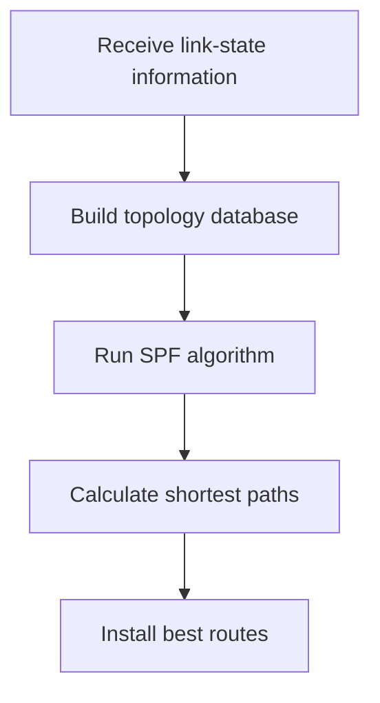

The SPF algorithm is commonly associated with **Dijkstra's algorithm**.

---

# 9. OSPF

**OSPF = Open Shortest Path First**

It is a widely used **link-state Interior Gateway Protocol (IGP)**.

### Characteristics

- Open standard.
    
- Uses link-state information.
    
- Uses SPF to calculate paths.
    
- Common in enterprise networks, service providers, and data centers.
    

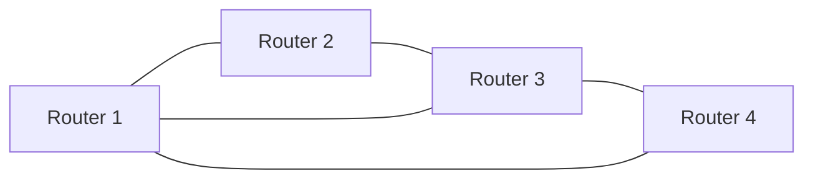

---

# 10. IS-IS

**IS-IS = Intermediate System to Intermediate System**

Another major **link-state IGP**.

### Characteristics

- Link-state protocol.
    
- Uses topology information and SPF.
    
- Popular in service-provider networks and data centers.
    
- Less commonly used in enterprise networks compared with OSPF.
    

### Easy comparison

```text
OSPF → Open Shortest Path First
IS-IS → Intermediate System to Intermediate System
```

---

# 11. OSPF vs IS-IS

|OSPF|IS-IS|
|---|---|
|Open Shortest Path First|Intermediate System to Intermediate System|
|Link-state|Link-state|
|Uses LSAs|Uses LSPs|
|Popular enterprise + service provider|Strong service-provider usage|
|Uses SPF|Uses SPF|

### Terminology

```text
OSPF
→ LSA = Link-State Advertisement

IS-IS
→ LSP = Link-State PDU
```

Both essentially distribute topology information so routers can build a view of the network.

---

# 12. OSPF & IS-IS Similarities

Both:

- Build a topology view using link-state information.
    
- Use metrics to evaluate paths.
    
- Use SPF to calculate shortest paths.
    
- Can react to topology changes.
    
- Can divide larger networks into smaller logical areas/levels.
    

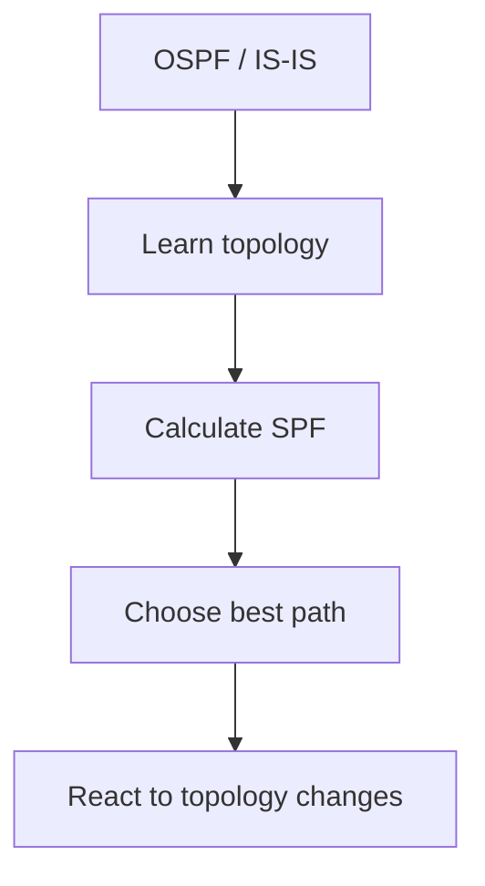

---

# 13. Dynamic Routes vs Static Routes

### Static routing


### Dynamic routing

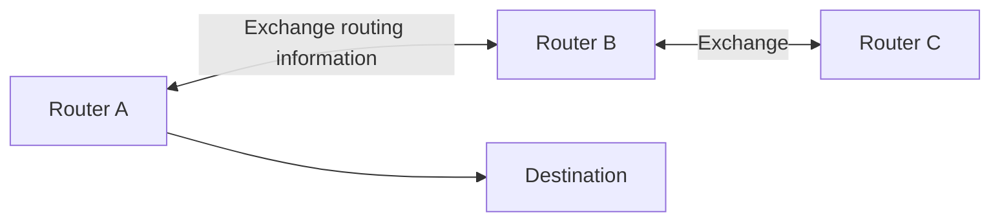

Dynamic protocols reduce the amount of manual configuration required.

---

# 14. How Dynamic Routing Solves Static-Route Problems

### Problem 1 — Manual path selection

Dynamic protocols automatically calculate suitable paths.

```text
Static → Administrator chooses path
Dynamic → Protocol calculates path
```

### Problem 2 — Topology changes

If a path fails, dynamic protocols can calculate an alternative path.

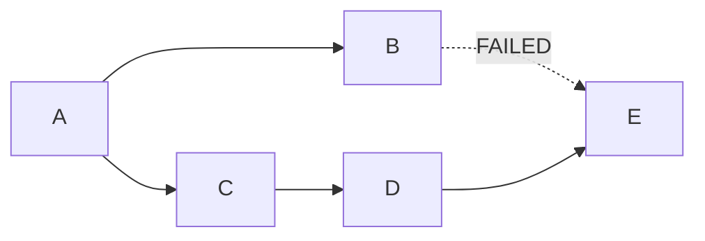

Instead of requiring an administrator to manually update routes, the routing protocol can react to the failure.

### Problem 3 — No routing knowledge exchange

Dynamic protocols exchange routing information between neighboring routers.

---

# 15. Neighbors and Adjacencies

Before routers exchange routing information, they must establish a relationship.

The module uses two terms:

```text
Neighbor
Adjacency
```

They refer to closely related concepts in this context.

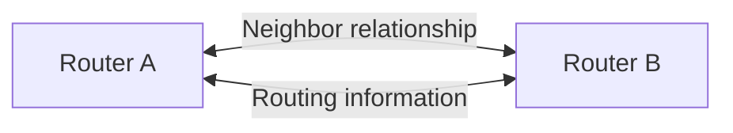

Before forming the relationship, routers must agree on protocol-related parameters such as:

- Packet size
    
- Timers
    
- Other protocol settings
    

Once they agree, they can exchange routing information.

---

# 16. Interior Gateway Protocols — IGP

An **Interior Gateway Protocol** operates **within one organization/autonomous system**.

Examples:

```text
OSPF
IS-IS
RIP
```

Used to learn internal/infrastructure prefixes.

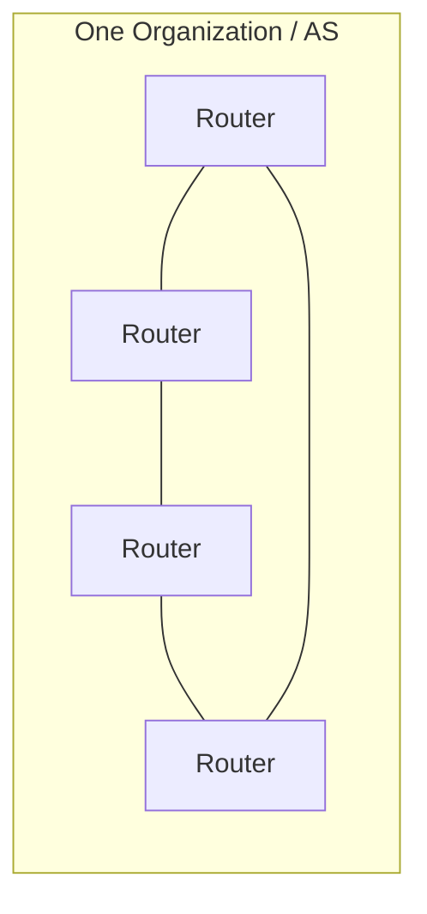

### IGP advantages

- Reacts quickly to internal topology changes.
    
- Can discover detailed network information.
    
- Automatically learns infrastructure prefixes.
    

---

# 17. Exterior Gateway Protocols — EGP

Exterior Gateway Protocols operate **between organizations/autonomous systems**.

The major modern EGP is:

```text
BGP
```

**BGP = Border Gateway Protocol**

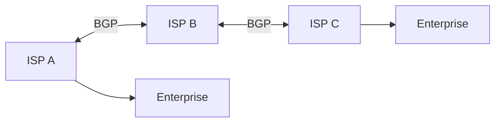

BGP is used to exchange routing information between separate networks/organizations and is fundamental to Internet routing.

---

# 18. IGP vs EGP

|IGP|EGP|
|---|---|
|Inside one organization|Between organizations|
|Internal routing|External/inter-domain routing|
|OSPF|BGP|
|IS-IS|BGP|
|RIP|—|
|Learns infrastructure prefixes|Exchanges routes between networks|

### Memory Trick

```text
I = Inside
E = External
```

---

# 19. Types of IGP

The module divides IGPs mainly into:

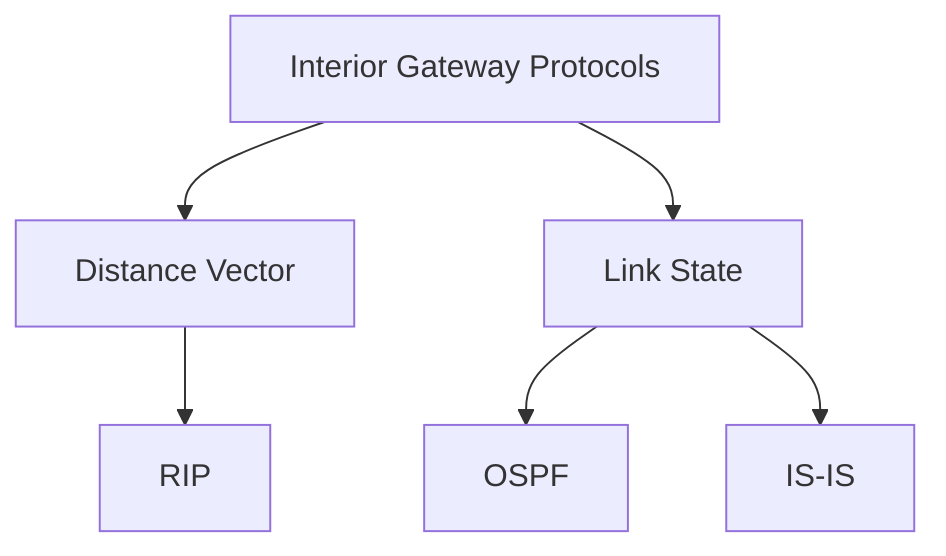

### Distance Vector

```text
Very basic
↓
Primarily hop-based
↓
Legacy / rarely used
```

### Link State

```text
More advanced
↓
Learns topology
↓
Calculates paths using metrics
↓
Common in modern internal networks
```

---

# ⭐ Comparison: Distance Vector vs Link State

|Feature|Distance Vector|Link State|
|---|---|---|
|Topology knowledge|Limited|Detailed|
|Basic path calculation|Distance/hops|Topology + metric|
|SPF|❌|✅|
|Example|RIP|OSPF, IS-IS|
|Complexity|Lower|Higher|
|Scalability|Limited|Better|
|Modern usage|Limited|Common|

---

# ⭐ Static vs Dynamic Routing

|Static|Dynamic|
|---|---|
|Manually configured|Automatically learns routes|
|Does not inherently adapt|Reacts to topology changes|
|Simple|More complex|
|Minimal protocol overhead|Uses CPU/memory|
|Good for simple networks|Good for larger/changing networks|
|No route information exchange|Routers exchange routing information|

---

# ⭐ Dynamic Routing Trade-offs

Dynamic routing is powerful, but not always the best choice.

### 1. Complexity

Routing protocols require more concepts and configuration.

### 2. Resource Usage

They consume:

```text
CPU
Memory
Bandwidth
```

for maintaining routing information.

### 3. Unnecessary for Simple Networks

If there is only **one path to everything outside the network**, a static/default route may be simpler.

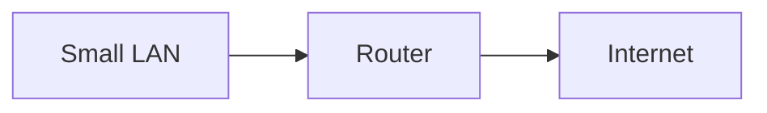

In this scenario, dynamic routing may provide little benefit.

---

# ⭐ Important Exam Points

```text
Distance Vector
→ Learns routes based primarily on distance/hops

RIP
→ Legacy distance-vector protocol

Link State
→ Learns topology information

OSPF
→ Open standard link-state IGP

IS-IS
→ Link-state IGP, widely used by service providers

SPF
→ Shortest Path First algorithm

LSA
→ OSPF link-state advertisement

LSP
→ IS-IS link-state PDU

IGP
→ Routing within one organization

EGP
→ Routing between organizations

BGP
→ Modern Internet-scale exterior routing protocol
```

---

# 🧠 Final Mental Model

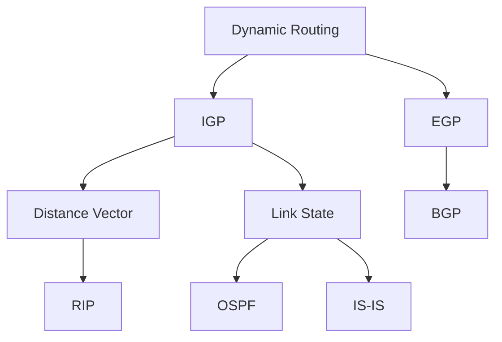

```text
Distance Vector
    ↓
"How far is the destination?"

Link State
    ↓
"What does the network topology look like?"

OSPF / IS-IS
    ↓
Build topology + metrics
    ↓
SPF calculation
    ↓
Best path
```

> **Core JNCIA concept:** Dynamic routing protocols solve the major limitations of static routes by automatically learning routes, calculating paths, and reacting to topology changes.