# Junos OS — Configuring & Verifying Basic OSPF

## 1. OSPF Overview

**OSPF (Open Shortest Path First)** is a **link-state Interior Gateway Protocol (IGP)** used to dynamically exchange routes within an organization.

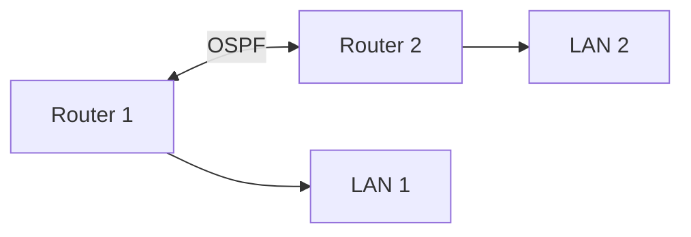

OSPF:

- Learns network topology.
    
- Forms neighbor relationships.
    
- Exchanges LSAs.
    
- Uses SPF to calculate best paths.
    
- Automatically reacts to topology changes.
    

---

# 2. OSPF Areas

Every OSPF interface must belong to an **OSPF area**.

For a basic deployment, use:

```text
Area 0
```

Area IDs are **32-bit values** and can be written as:

```text
0
```

Junos interprets:

```text
area 0
```

as:

```text
0.0.0.0
```

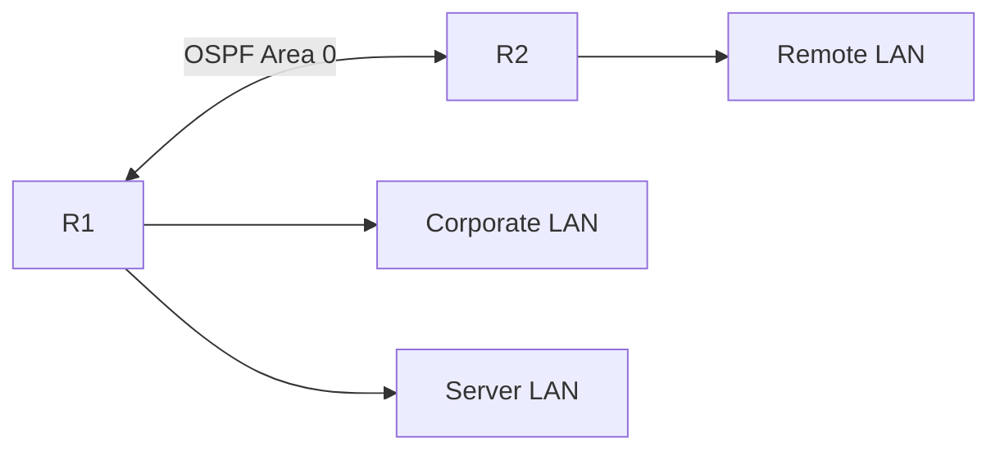

### Why areas?

Large OSPF networks can be divided into smaller logical sections.

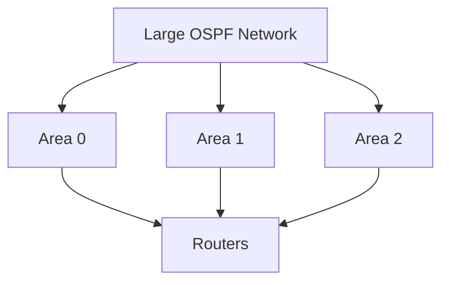

For simple networks, a **single Area 0** is often sufficient.

---

# 3. Basic IPv4 OSPF Configuration

OSPF is configured under:

```text
protocols ospf
```

Example:

```bash
set protocols ospf area 0 interface xe-0/1/5.0
```

This enables OSPF on:

```text
xe-0/1/5.0
```

inside:

```text
Area 0
```

### Configuration hierarchy

```text
protocols
└── ospf
    └── area 0
        └── interface xe-0/1/5.0
```

---

# 4. Typical Two-Router OSPF Topology

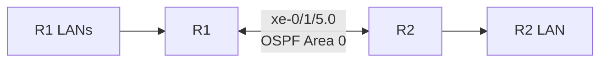

Configure both routers:

```bash
# R1
set protocols ospf area 0 interface xe-0/1/5.0

# R2
set protocols ospf area 0 interface xe-0/1/5.0
```

Then:

```bash
commit
```

---

# 5. Review OSPF Configuration

Use:

```bash
show configuration protocols ospf
```

Example:

```text
ospf {
    area 0.0.0.0 {
        interface xe-0/1/5.0;
    }
}
```

Alternative:

```bash
show configuration protocols ospf | display set
```

Output:

```bash
set protocols ospf area 0.0.0.0 interface xe-0/1/5.0
```

---

# 6. OSPF Hello Messages

After OSPF is enabled, routers send **Hello packets** through OSPF-enabled interfaces.

Purpose:

- Discover neighbors.
    
- Maintain neighbor relationships.
    
- Verify that the neighbor is still reachable.
    

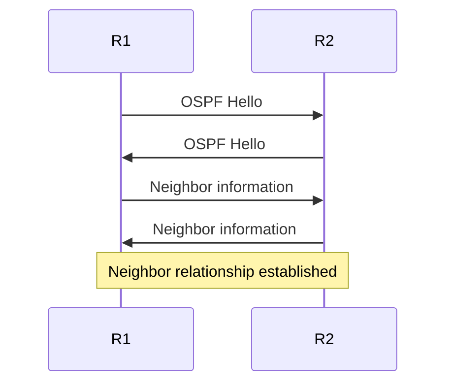

---

# 7. OSPF Hello Parameters

The module's example shows:

```text
Destination: 224.0.0.5
Hello Interval: 10
Dead Interval: 40
Area: 0.0.0.0
```

### Important values

|Parameter|Meaning|
|---|---|
|`224.0.0.5`|All OSPF routers multicast address|
|Hello Interval|Frequency of Hello packets|
|Dead Interval|Time before neighbor is considered down|
|Area|OSPF area associated with interface|

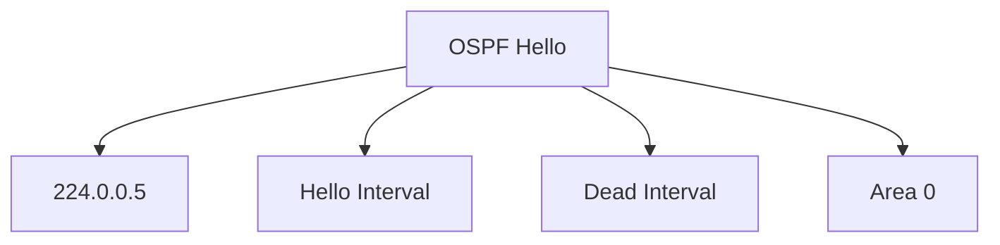

---

# 8. OSPF Neighbor Formation

When routers receive each other's Hellos, they attempt to become neighbors.

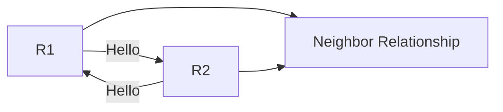

Verify with:

```bash
show ospf neighbor
```

Example:

```text
Address     Interface     State   ID
10.1.2.2    xe-0/1/5.0    Full    10.1.2.2
```

---

# 9. Understanding `show ospf neighbor`

Example:

```text
Address     Interface     State   ID       Pri   Dead
10.1.2.2    xe-0/1/5.0    Full    10.1.2.2 128   31
```

### Fields

```text
Address
→ Neighbor's IP address

Interface
→ Local outgoing interface

State
→ OSPF neighbor state

ID
→ Neighbor Router ID

Pri
→ OSPF interface priority

Dead
→ Remaining dead timer
```

### Most important

```text
Full
```

means the OSPF neighbor relationship has successfully completed.

---

# 10. OSPF Neighbor State — `Full`

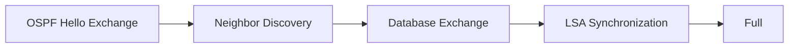

`Full` indicates the routers have successfully synchronized their relevant link-state information.

---

# 11. OSPF Router ID

Every OSPF router needs a **Router ID**.

It uniquely identifies the router within the OSPF topology.

Example:

```text
Router ID = 10.1.2.2
```

In:

```bash
show ospf neighbor
```

the `ID` field represents the neighbor's OSPF Router ID.

---

# 12. OSPF Route Preference

The module shows:

```text
Directly connected → 0
Static             → 5
OSPF               → 10
```

```text
Lower numerical preference = preferred
```

Therefore:

```text
0 < 5 < 10
```

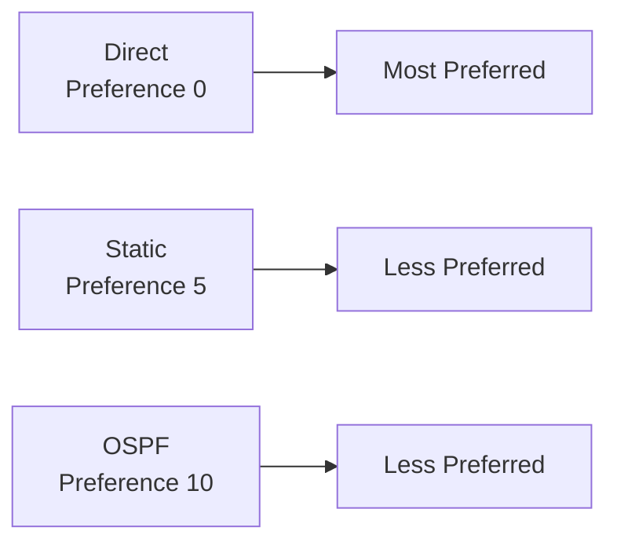

⚠️ Route preference is used when comparing routes to the **same destination/prefix**; longest-prefix matching is considered first.

---

# 13. Verify OSPF Routes

```bash
show route protocol ospf
```

Example:

```text
172.16.40.0/24
*[OSPF/10] ...
    > to 10.1.2.2 via xe-0/1/5.0
```

Interpretation:

```text
OSPF
→ Route learned through OSPF

10
→ OSPF route preference

*
→ Active route

>
→ Best path

10.1.2.2
→ Next hop
```

---

# 14. Verify the Exact Route

```bash
show route 172.16.40.0/24
```

For an exact default route:

```bash
show route 0.0.0.0/0 exact
```

Useful for checking whether OSPF has actually installed the expected route.

---

# 15. OSPF Passive Interfaces

An OSPF-enabled LAN interface can create a security problem if it sends Hello packets where no OSPF neighbor should exist.

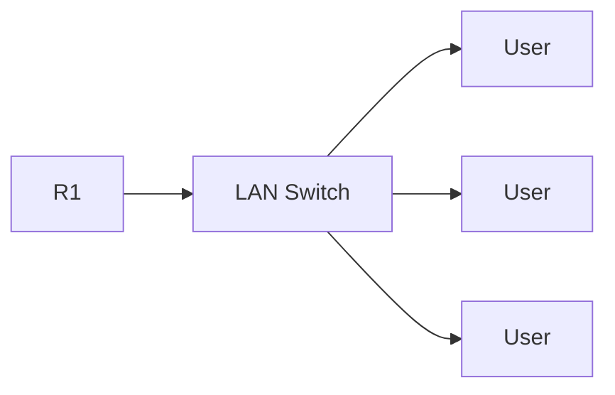

If OSPF is active on that LAN:

```text
Router
 ↓
OSPF Hello
 ↓
LAN
 ↓
Potential unauthorized OSPF neighbor
```

---

# 16. Passive Interface

Configure a LAN interface as passive:

```bash
set protocols ospf area 0 interface xe-0/1/1.0 passive
```

A passive OSPF interface:

- Can advertise its connected network into OSPF.
    
- Does **not send OSPF Hello packets** through that interface.
    
- Does not form OSPF neighbor relationships there.
    

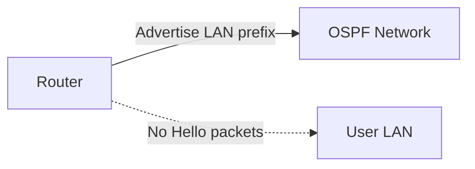

---

# 17. Active vs Passive OSPF Interface

|Active OSPF Interface|Passive OSPF Interface|
|---|---|
|Sends Hello packets|Does not send Hello packets|
|Can form neighbors|Does not form neighbors|
|Exchanges OSPF information|Still advertises connected prefix|
|Used toward routers|Typically used toward end-user LANs|

### Typical design

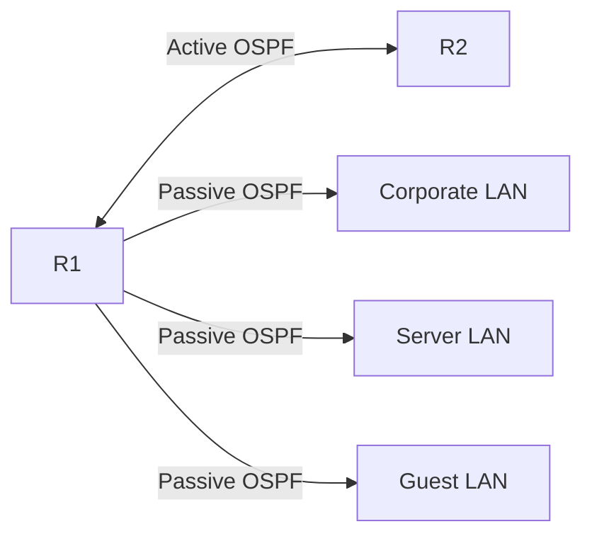

---

# 18. Configuring Multiple Passive Interfaces

Example:

```bash
set protocols ospf area 0 interface xe-0/1/1.0 passive
set protocols ospf area 0 interface xe-0/1/2.0 passive
set protocols ospf area 0 interface xe-0/1/3.0 passive
```

Only the router-to-router interface remains active:

```bash
set protocols ospf area 0 interface xe-0/1/5.0
```

---

# 19. Why Passive Interfaces Matter

Without passive mode:

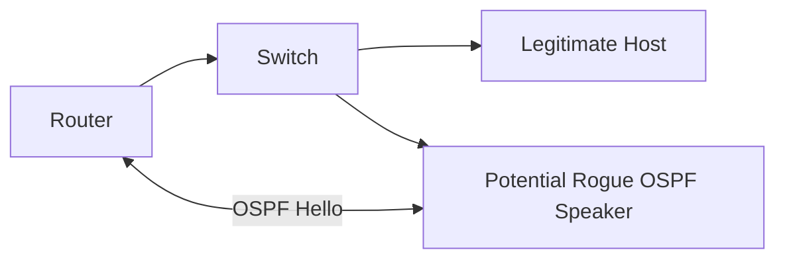

With passive mode:

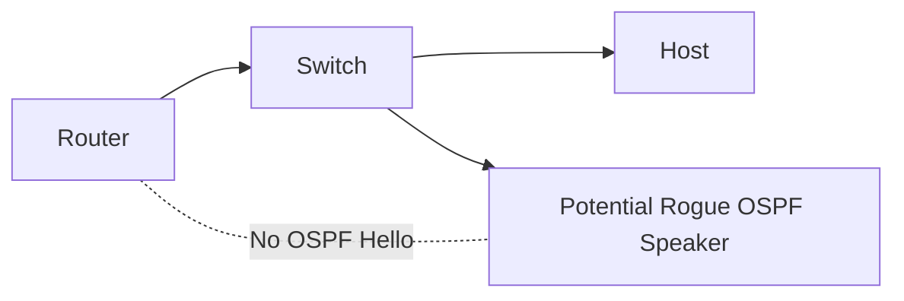

Passive interfaces reduce unnecessary OSPF neighbor formation opportunities on user-facing networks.

---

# 20. Advertising LAN Prefixes

OSPF advertises prefixes associated with OSPF-enabled interfaces.

Example:

```text
R1
├── Corporate LAN
├── Server LAN
└── Guest LAN
```

When those interfaces participate in OSPF, their prefixes can be advertised to neighboring OSPF routers.

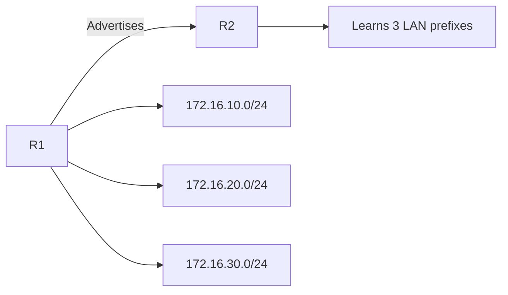

---

# 21. OSPF Only Advertises What You Tell It To

A key concept:

> OSPF does not automatically advertise every route known by the router.

By default, OSPF advertises:

- Prefixes associated with OSPF-enabled interfaces.
    
- Prefixes learned through OSPF.
    

Other routes, such as static routes, require **route redistribution/policy** if they need to be advertised into OSPF.

---

# 22. Static Routes + OSPF

Suppose R1 has:

```text
Internet
   ↓
Static default route
   ↓
R1
```

R1's OSPF neighbor does **not automatically learn that static default route**.

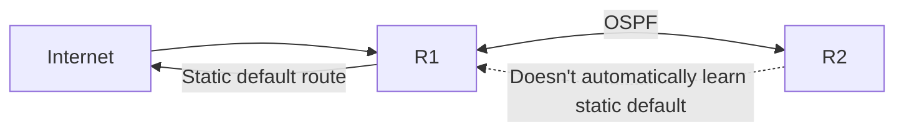

To advertise a static route into OSPF, routing policy/appropriate OSPF configuration is required.

---

# 23. Routing Policy and Redistribution

Routing policies can control which routes are imported/exported between routing protocols.

Concept:

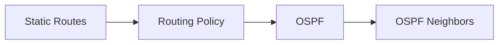

This process is commonly referred to as **route redistribution**.

Example use case:

```text
Static default route
        ↓
Routing policy
        ↓
OSPF
        ↓
Internal routers learn default route
```

---

# 24. OSPF Default Route Advertisement

The module demonstrates that a router's default route is **not automatically advertised into OSPF** merely because the router has a default route.

```bash
show route 0.0.0.0/0 exact
```

on the neighbor may return no route.

This requires the appropriate OSPF default-route configuration/policy.

---

# 25. IPv4 OSPF Basic Workflow

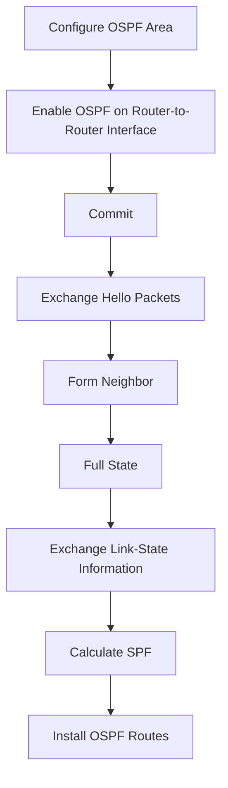

---

# 26. OSPFv2 vs OSPFv3

## OSPFv2

Primarily used for:

```text
IPv4
```

Junos configuration:

```bash
set protocols ospf ...
```

## OSPFv3

Used for:

```text
IPv6
```

Junos configuration:

```bash
set protocols ospf3 ...
```

---

# 27. OSPFv2 vs OSPFv3 — Key Differences

|OSPFv2|OSPFv3|
|---|---|
|IPv4|IPv6|
|`ospf`|`ospf3`|
|IPv4 prefixes|IPv6 prefixes|
|Link-state|Link-state|
|Uses LSAs|Uses LSAs|
|SPF calculation|SPF calculation|

The module notes that **IS-IS can advertise IPv4 and IPv6**, while OSPF traditionally uses separate versions for the address families.

---

# 28. OSPFv3 Configuration

Example:

```bash
set protocols ospf3 area 0 interface xe-0/1/5.0
```

Passive:

```bash
set protocols ospf3 area 0 interface xe-0/1/1.0 passive
```

Hierarchy:

```text
protocols
└── ospf3
    └── area 0
        └── interface xe-0/1/5.0
```

---

# 29. Verify OSPFv3 Neighbors

```bash
show ospf3 neighbor
```

Example output contains:

```text
ID
Interface
State
Pri
Dead
```

A successful relationship should reach:

```text
Full
```

---

# 30. Verify OSPFv3 Routes

```bash
show route protocol ospf3
```

IPv6 routes appear in:

```text
inet6.0
```

Example:

```text
2001:db8:10::/64
2001:db8:20::/64
2001:db8:30::/64
```

---

# 31. OSPFv3 Verification Workflow

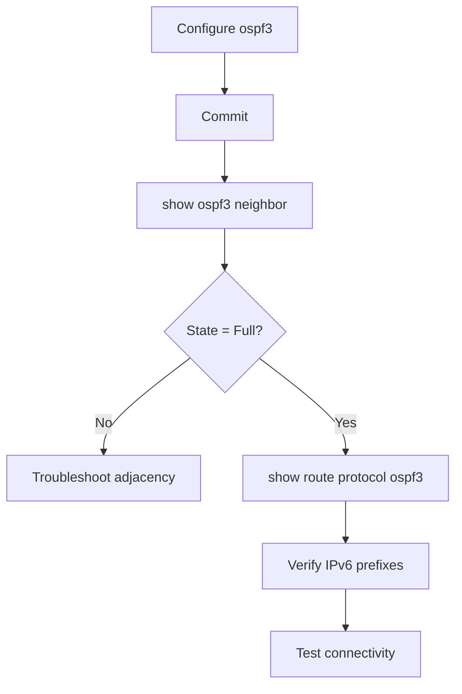

---

# 32. OSPFv2 vs OSPFv3 Commands

```bash
# OSPFv2
show ospf neighbor
show route protocol ospf

# OSPFv3
show ospf3 neighbor
show route protocol ospf3
```

Configuration:

```bash
# IPv4
set protocols ospf area 0 interface xe-0/1/5.0

# IPv6
set protocols ospf3 area 0 interface xe-0/1/5.0
```

---

# 33. OSPF Configuration Verification

### Configuration

```bash
show configuration protocols ospf
```

### Neighbor

```bash
show ospf neighbor
```

### Routes

```bash
show route protocol ospf
```

### IPv6 configuration

```bash
show configuration protocols ospf3
```

### IPv6 neighbor

```bash
show ospf3 neighbor
```

### IPv6 routes

```bash
show route protocol ospf3
```

---

# 34. Basic OSPF Troubleshooting

If the neighbor isn't `Full`, check:

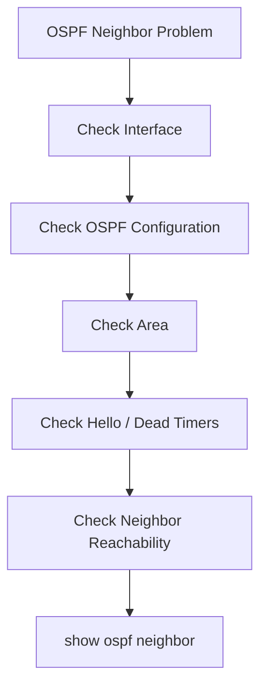

Important things to verify:

```text
✓ Interface is operational
✓ OSPF enabled on interface
✓ Same OSPF area
✓ Compatible Hello/Dead intervals
✓ Neighbor connectivity
✓ Interface not incorrectly passive
✓ Correct Router IDs
```

---

# 35. Real-World OSPF Enhancements

The module identifies several enhancements commonly used in production:

```text
Better automatic link metrics
Faster Hello/Dead timers
Custom Router ID
Authentication
```

### Custom Router ID

Makes routers easier to identify in OSPF databases.

### Authentication

Helps prevent accidental or malicious OSPF neighbors.

```mermaid
flowchart LR
    R1["R1"] -->|"Authenticated OSPF"| R2["R2"]
    X["Unauthorized Router"] -. "Rejected" .-> R1
```

---

# ⭐ JNCIA OSPF Cheat Sheet

```bash
# Enter configuration
configure

# Enable IPv4 OSPF on interface
set protocols ospf area 0 interface xe-0/1/5.0

# Configure passive interface
set protocols ospf area 0 interface xe-0/1/1.0 passive

# Enable IPv6 OSPF
set protocols ospf3 area 0 interface xe-0/1/5.0

# IPv6 passive interface
set protocols ospf3 area 0 interface xe-0/1/1.0 passive

# Review OSPF config
show configuration protocols ospf

# Review OSPF config in set format
show configuration protocols ospf | display set

# Check IPv4 neighbors
show ospf neighbor

# Check IPv6 neighbors
show ospf3 neighbor

# Check IPv4 OSPF routes
show route protocol ospf

# Check IPv6 OSPF routes
show route protocol ospf3

# Check exact route
show route <prefix>

# Commit
commit
```

---

# ⭐ Must Remember

```text
OSPF
→ Link-state IGP

OSPFv2
→ IPv4

OSPFv3
→ IPv6

Area 0
→ Backbone area / common basic deployment area

Hello
→ Discover and maintain neighbors

Full
→ Neighbor relationship successfully established

224.0.0.5
→ All OSPF routers multicast address

Passive interface
→ Advertise prefix but don't form OSPF neighbors/send Hellos

OSPF preference
→ 10

Static preference
→ 5

Direct preference
→ 0

LSA
→ Link-State Advertisement

SPF
→ Shortest Path First

RIB
→ Routing information

FIB
→ Forwarding information
```

---

# 🧠 Complete OSPF Mental Model

```mermaid
flowchart TD
    I["OSPF Interface"] --> H["Hello Packets"]
    H --> N["Neighbor"]
    N --> F["Full Adjacency"]
    F --> L["Exchange LSAs"]
    L --> T["Link-State Database"]
    T --> S["SPF Calculation"]
    S --> R["Best OSPF Routes"]
    R --> FIB["Forwarding Table"]
```

### IPv4 vs IPv6

```mermaid
flowchart LR
    O["OSPF"] --> V2["OSPFv2<br/>IPv4<br/>protocols ospf"]
    O --> V3["OSPFv3<br/>IPv6<br/>protocols ospf3"]
```

### Production-style design

```mermaid
flowchart LR
    LAN1["Corporate LAN"] --> R1["R1"]
    LAN2["Server LAN"] --> R1
    LAN3["Guest LAN"] --> R1
    R1 <-->|"Active OSPF"| R2["R2"]
    R2 --> LAN4["Remote LAN"]
```

**Core rule:** Use **active OSPF interfaces between routers** to form adjacencies, and typically use **passive OSPF interfaces toward end-user LANs** so their prefixes are advertised without allowing OSPF neighbor formation.