# Junos OS — Juniper Switches, VLANs, Access Ports & MAC Tables

## 1. Juniper EX4300 Switch

Juniper switches run **Junos OS**, using the same general CLI experience as Juniper routers and firewalls.

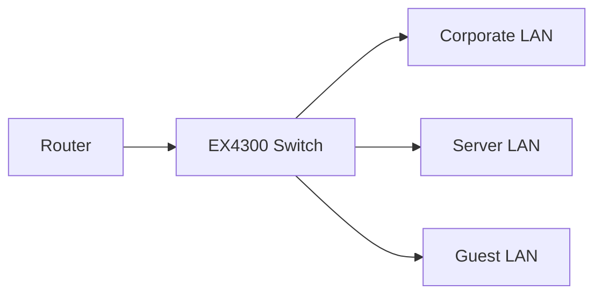

### EX4300-24T

- **24 × 1-Gbps copper ports**
    
- **4 × 10-Gbps fiber uplink ports**
    
- Ports are organized into **PICs**.
    
- `PIC 0` → `ge-0/0/0` through `ge-0/0/23`
    
- `PIC 2` → `xe-0/2/0` through `xe-0/2/3`
    
- `PIC 1` can provide additional functionality/VC-related ports.
    

---

# 2. Junos Interface Naming

Typical switch interfaces:

```text
ge-0/0/0
│  │ │
│  │ └── Port
│  └──── PIC
└─────── FPC
```

### Speed prefixes

```text
ge → Gigabit Ethernet
xe → 10-Gigabit Ethernet
```

Example:

```text
ge-0/0/1
xe-0/2/0
```

---

# 3. Virtual Chassis

EX4300 switches can be connected together using **Virtual Chassis (VC)**.

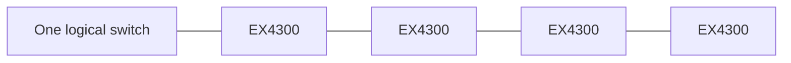

Multiple physical switches can operate as a **single logical switch** for management.

> VC is a later/advanced topic; focus first on VLANs, access ports and MAC learning.

---

# 4. VLAN Fundamentals

A **VLAN (Virtual LAN)** logically separates Layer-2 networks on the same physical switch.

Example:

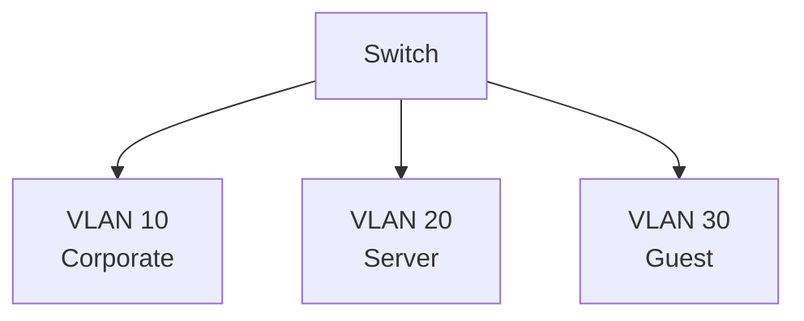

Example VLANs from the module:

|VLAN|Name|
|--:|---|
|10|Corporate|
|20|Server|
|30|Guest|

---

# 5. VLAN = Broadcast Domain

Ports belonging to the same VLAN form the same **Layer-2 broadcast domain**.

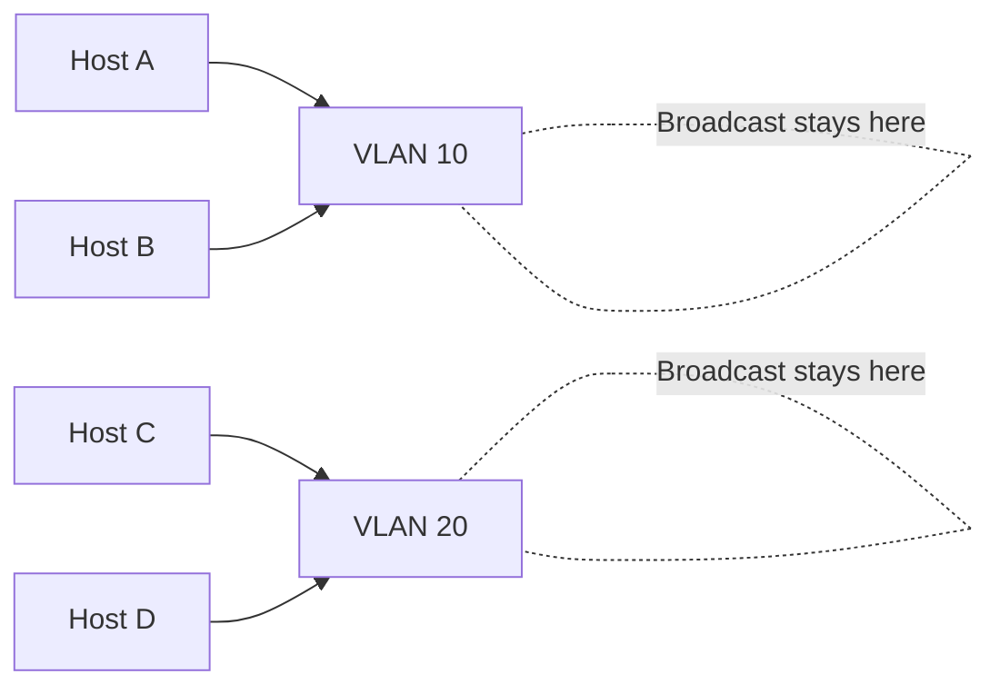

Hosts in different VLANs are logically separated at Layer 2.

---

# 6. Verify VLANs

Main command:

```bash
show vlans
```

Useful output:

```text
Routing instance    VLAN name    Tag    Interfaces

default-switch      Corporate    10     ...
default-switch      Server       20     ...
default-switch      Guest        30     ...
default-switch      default       1     ...
```

### Important fields

```text
VLAN name
→ Logical VLAN name

Tag
→ VLAN ID

Interfaces
→ Interfaces currently associated with VLAN
```

---

# 7. VLAN Configuration

Create a VLAN:

```bash
set vlans Guest vlan-id 30
```

Example:

```bash
set vlans Corporate vlan-id 10
set vlans Server vlan-id 20
set vlans Guest vlan-id 30
```

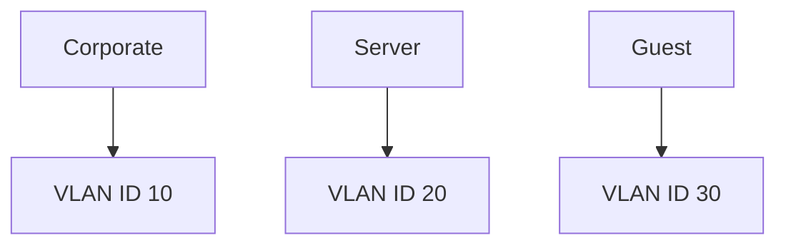

### Important

VLAN names are **case-sensitive**.

```text
Guest ≠ guest
Corporate ≠ corporate
```

---

# 8. Verify VLAN Configuration

```bash
show configuration vlans
```

Example:

```text
Corporate {
    vlan-id 10;
}
Server {
    vlan-id 20;
}
Guest {
    vlan-id 30;
}
```

Set-format:

```bash
show configuration vlans | display set
```

Output:

```bash
set vlans Corporate vlan-id 10
set vlans Server vlan-id 20
set vlans Guest vlan-id 30
```

---

# 9. Creating a VLAN — Workflow

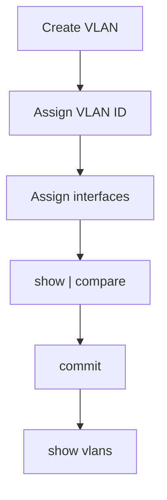

Commands:

```bash
configure

set vlans Guest vlan-id 30

show | compare

commit
```

---

# 10. VLAN Creation ≠ Port Assignment

Creating a VLAN does **not automatically move existing interfaces into it**.

Example:

```bash
set vlans Guest vlan-id 30
```

creates VLAN 30.

But interfaces may still remain in:

```text
default VLAN
```

You must explicitly assign access ports.

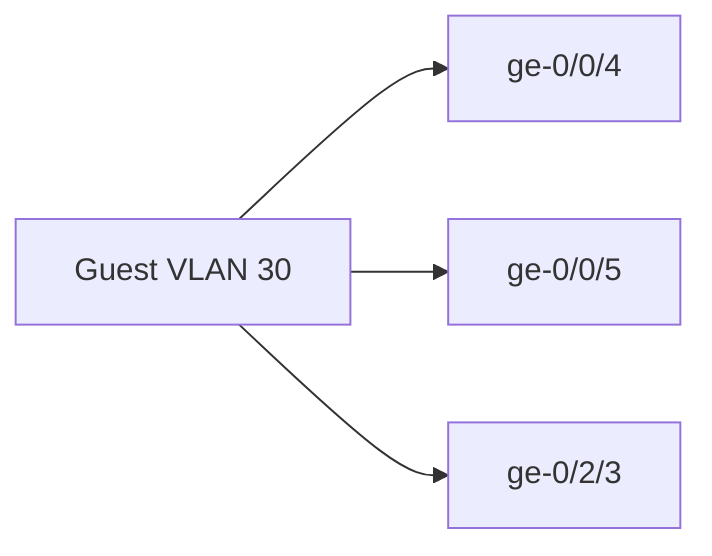

---

# 11. Access Ports

An **access port** belongs to a single VLAN.

Typical use:

```text
PC
Printer
Server
IP Phone
End-user device
```

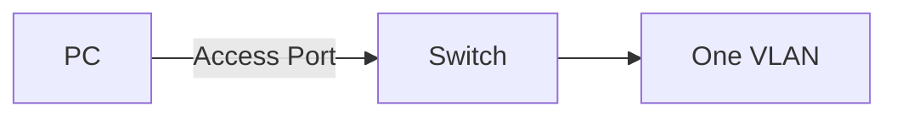

The module notes that switch ports are **access ports by default**.

---

# 12. Access Port Configuration

Example:

```bash
set interfaces ge-0/0/1 unit 0 family ethernet-switching interface-mode access
set interfaces ge-0/0/1 unit 0 family ethernet-switching vlan members Corporate
```

Two important pieces:

```text
interface-mode access
        +
vlan members Corporate
```

---

# 13. Access Port Configuration Hierarchy

```text
interfaces
└── ge-0/0/1
    └── unit 0
        └── family ethernet-switching
            ├── interface-mode access
            └── vlan members Corporate
```

Equivalent configuration:

```text
ge-0/0/1
    unit 0
        family ethernet-switching {
            interface-mode access;
            vlan {
                members Corporate;
            }
        }
```

---

# 14. Assign Multiple Ports to a VLAN

Example Guest VLAN:

```bash
set interfaces ge-0/0/4 unit 0 family ethernet-switching vlan members Guest
set interfaces ge-0/0/5 unit 0 family ethernet-switching vlan members Guest
set interfaces xe-0/2/3 unit 0 family ethernet-switching vlan members Guest
```

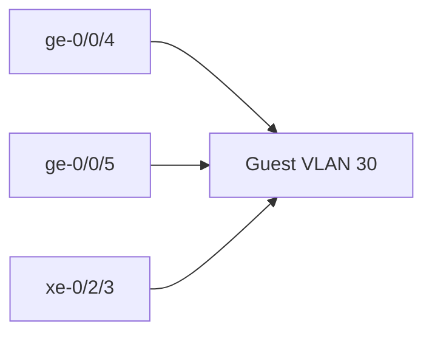

---

# 15. Verify VLAN Interface Membership

```bash
show vlans Guest
```

Expected:

```text
VLAN name   Tag   Interfaces
Guest       30    ge-0/0/4.0
                  ge-0/0/5.0
                  xe-0/2/3.0
```

This confirms the interfaces are actually members of the VLAN.

---

# 16. Default VLAN

The switch contains a default VLAN.

Example:

```text
default
VLAN ID = 1
```

Interfaces that have not been assigned appropriately may remain in the default VLAN.

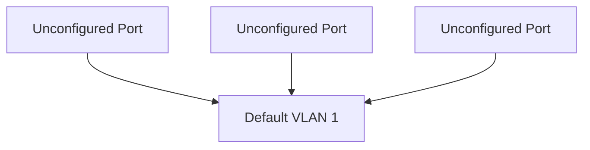

⚠️ Operationally, don't assume that leaving production/user ports in the default VLAN is desirable. The module specifically highlights that many interfaces can remain there until correctly assigned.

---

# 17. Layer 2 Switch

A Layer-2 switch primarily forwards Ethernet frames based on **MAC addresses**.

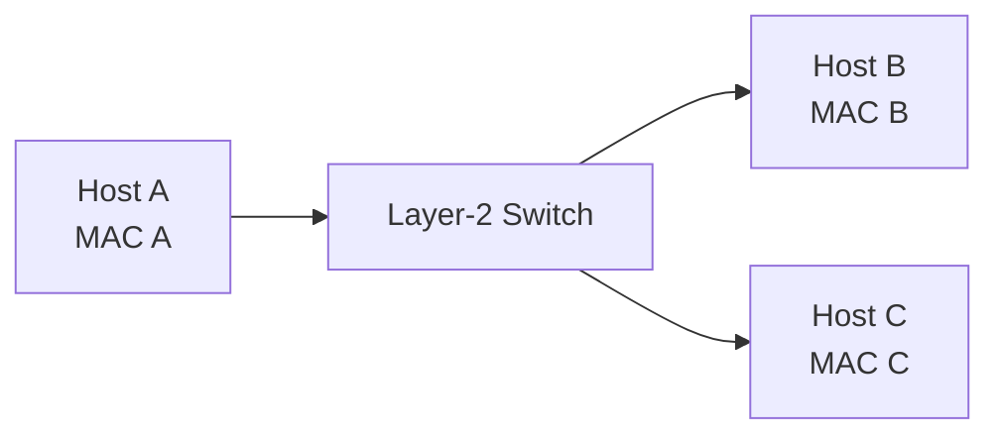

The switch learns:

```text
MAC address → Interface
```

---

# 18. MAC Address Table

The switch dynamically learns MAC addresses by examining the **source MAC address of incoming frames**.

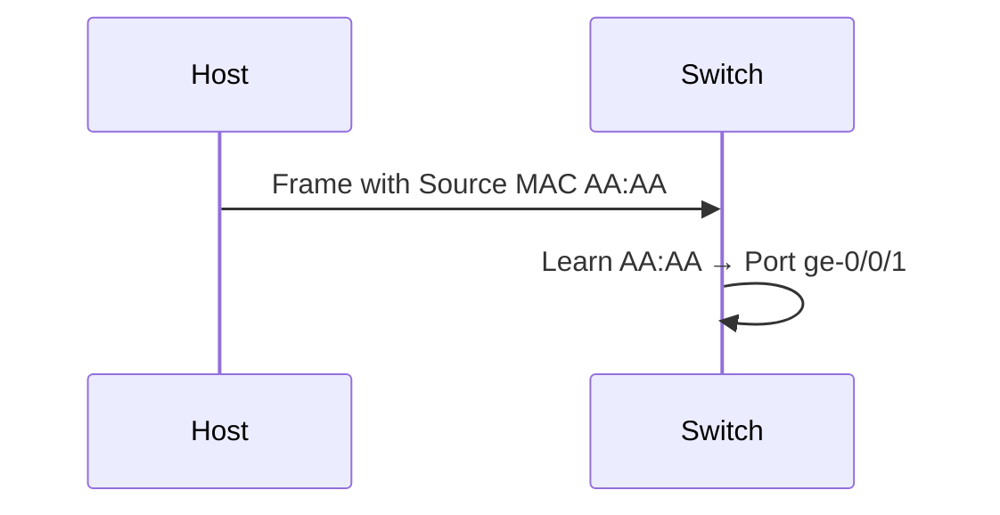

This creates entries in the Ethernet switching table.

---

# 19. MAC Table Verification

View the MAC table:

```bash
show ethernet-switching table
```

For a specific VLAN:

```bash
show ethernet-switching table vlan Corporate
```

Example:

```text
VLAN        MAC address        MAC flags
Corporate   38:4f:...          D
Corporate   74:8f:...          D
Corporate   94:bf:...          D
```

---

# 20. MAC Table Flags

The module shows important MAC flags:

```text
S → Static MAC
D → Dynamic MAC
L → Locally learned
P → Persistent static
C → Control MAC
SE → Statistics enabled
NM → Non-configured MAC
R → Remote PE MAC
O → OVSDB MAC
```

### Most important for JNCIA

```text
D → Dynamic
S → Static
L → Locally learned
```

---

# 21. Dynamic MAC Learning

`D` means the MAC address was **dynamically learned**.


Example:

```text
MAC: 38:4f:...
Flag: D
Interface: ge-0/0/1.0
```

The switch learned that MAC from traffic arriving on that interface.

---

# 22. MAC Table and VLANs

MAC entries are associated with VLANs.

```text
VLAN       MAC              Interface
Corporate  AA:AA:AA...     ge-0/0/1.0
Server     BB:BB:BB...     ge-0/0/2.0
Guest      CC:CC:CC...     ge-0/0/4.0
```

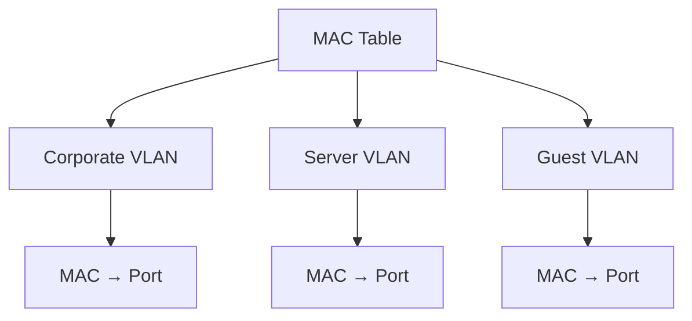

---

# 23. View MACs for a Specific VLAN

```bash
show ethernet-switching table vlan Corporate
```

To view all VLANs:

```bash
show ethernet-switching table
```

This is useful when troubleshooting:

```text
Host connectivity
Wrong VLAN assignment
Unexpected MAC location
MAC learning
Layer-2 problems
```

---

# 24. MAC Learning Example

Suppose:

```text
PC-A → ge-0/0/1
PC-B → ge-0/0/2
```

PC-A sends traffic.

The switch learns:

```text
PC-A MAC → ge-0/0/1
```

PC-B sends traffic:

```text
PC-B MAC → ge-0/0/2
```

Result:

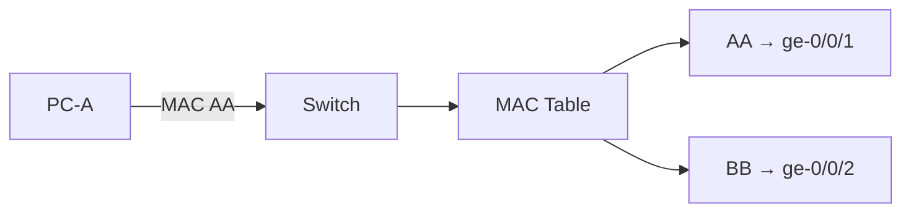

---

# 25. Management Access Without a Transit IP

A switch can be managed using a **dedicated management interface/IP**, separate from the transit/user network.

Example from the module:

```text
SSH → 172.25.1.12
```


This is an example of **out-of-band management**.

---

# 26. Router vs Layer-2 Switch

|Device|Main Layer|Primary Function|
|---|---|---|
|Router|L3|Route IP packets|
|Layer-2 Switch|L2|Forward Ethernet frames|
|Layer-3 Switch|L2/L3|Switching + routing|

The module's understanding question highlights that a **Layer-3 switch** combines switching and routing functionality.

---

# 27. Important `show` Commands

### VLANs

```bash
show vlans
```

### VLAN configuration

```bash
show configuration vlans
```

### Set-format VLAN configuration

```bash
show configuration vlans | display set
```

### Interface configuration

```bash
show configuration interfaces ge-0/0/1
```

### MAC table

```bash
show ethernet-switching table
```

### MAC table for one VLAN

```bash
show ethernet-switching table vlan Corporate
```

---

# 28. Troubleshooting Workflow

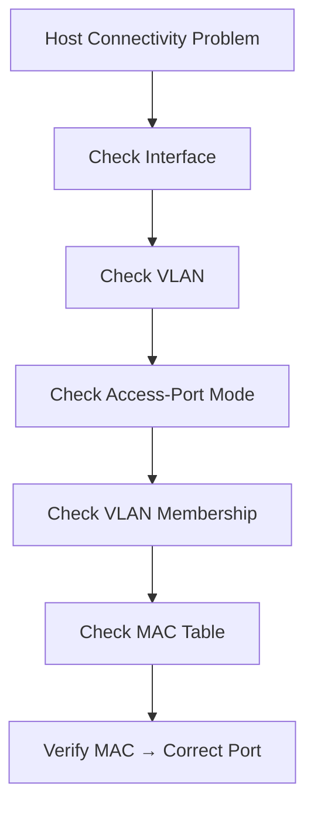

### Commands

```bash
show interfaces terse
show vlans
show configuration interfaces ge-0/0/1
show ethernet-switching table
show ethernet-switching table vlan Corporate
```

---

# 29. Common Configuration Mistake

Creating the VLAN alone:

```bash
set vlans Guest vlan-id 30
```

is **not enough**.

You also need:

```bash
set interfaces ge-0/0/4 unit 0 family ethernet-switching interface-mode access
set interfaces ge-0/0/4 unit 0 family ethernet-switching vlan members Guest
```


---

# 30. VLAN + Access Port + MAC Table

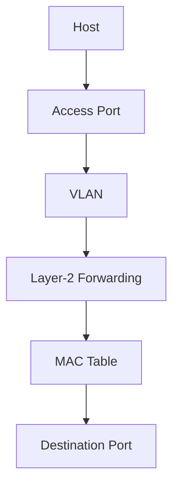

Remember the relationship:

```text
VLAN
 ↓
Access Port
 ↓
Host Traffic
 ↓
MAC Learning
 ↓
MAC Table
 ↓
Frame Forwarding
```

---

# ⭐ JNCIA Cheat Sheet

```bash
# Create VLAN
set vlans Guest vlan-id 30

# Configure access port
set interfaces ge-0/0/4 unit 0 family ethernet-switching interface-mode access

# Assign VLAN to access port
set interfaces ge-0/0/4 unit 0 family ethernet-switching vlan members Guest

# Verify VLANs
show vlans

# Verify VLAN configuration
show configuration vlans

# Set-format
show configuration vlans | display set

# Verify interface configuration
show configuration interfaces ge-0/0/4

# Verify all MAC addresses
show ethernet-switching table

# Verify MACs in a VLAN
show ethernet-switching table vlan Guest

# Review changes
show | compare

# Apply
commit
```

---

# ⭐ Must Remember

```text
EX4300-24T
→ 24 × 1G copper + 4 × 10G fiber uplinks

ge-
→ Gigabit Ethernet

xe-
→ 10-Gigabit Ethernet

VLAN
→ Logical Layer-2 broadcast domain

VLAN 10
→ Corporate

VLAN 20
→ Server

VLAN 30
→ Guest

Access port
→ Belongs to one VLAN

Default VLAN
→ VLAN ID 1

show vlans
→ View VLANs + membership

show ethernet-switching table
→ View MAC table

D
→ Dynamic MAC

S
→ Static MAC

L
→ Locally learned MAC

MAC learning
→ Source MAC + incoming interface
```

# 🧠 Final Mental Model

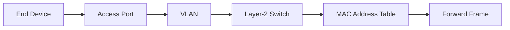

> **Core concept:** A VLAN creates the Layer-2 logical network, an access port places an end device into that VLAN, and the switch dynamically learns the device's MAC address so it knows where to forward frames.