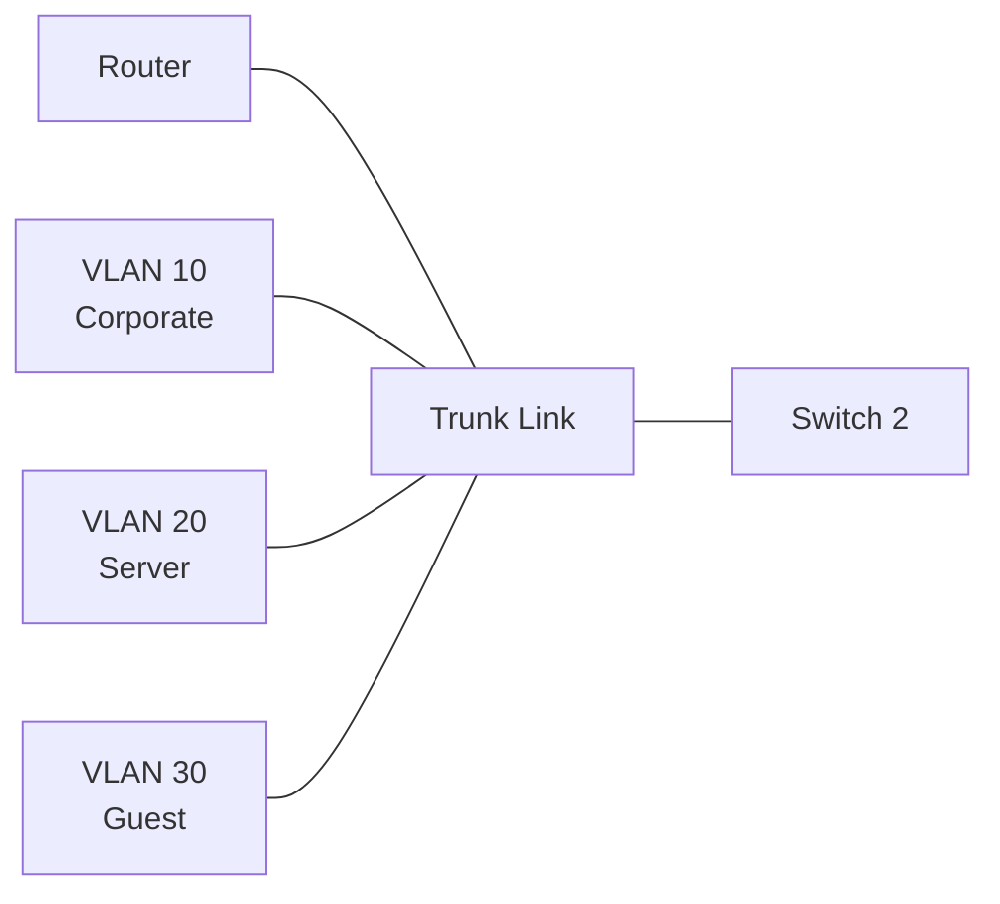
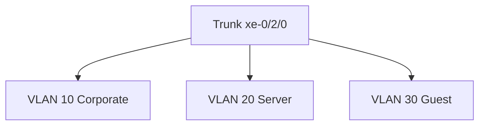
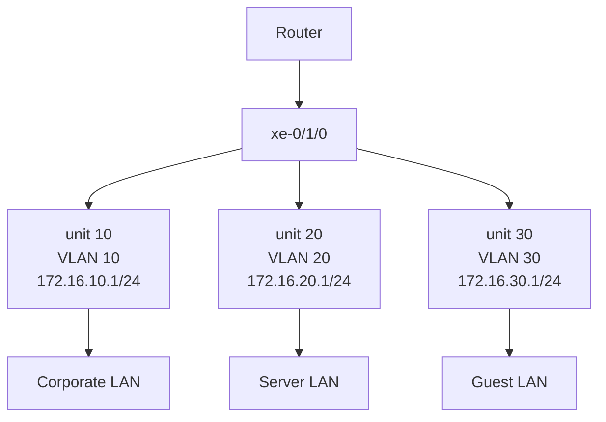
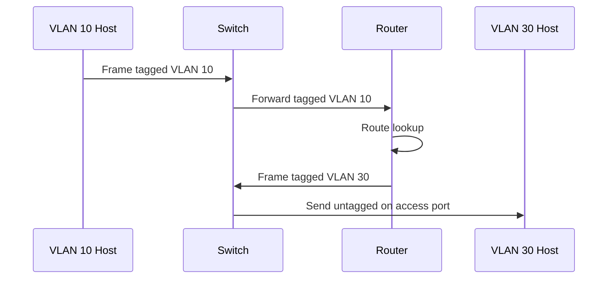
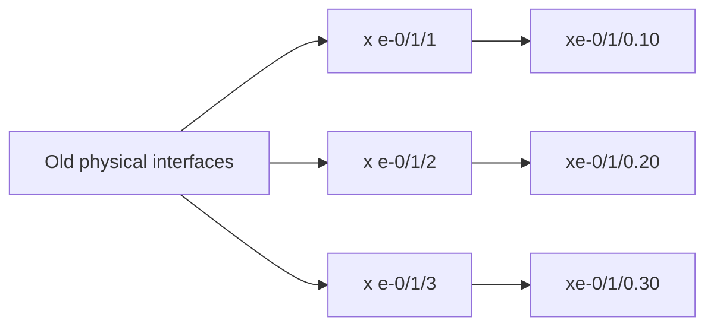
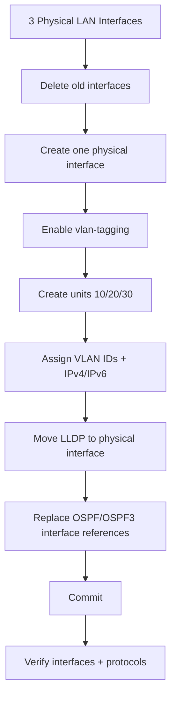
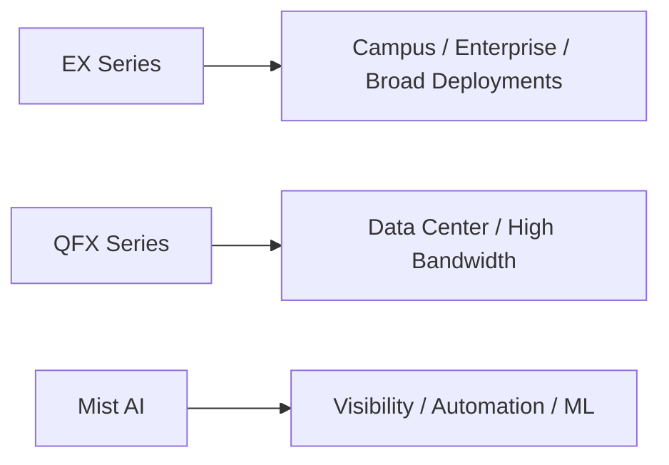
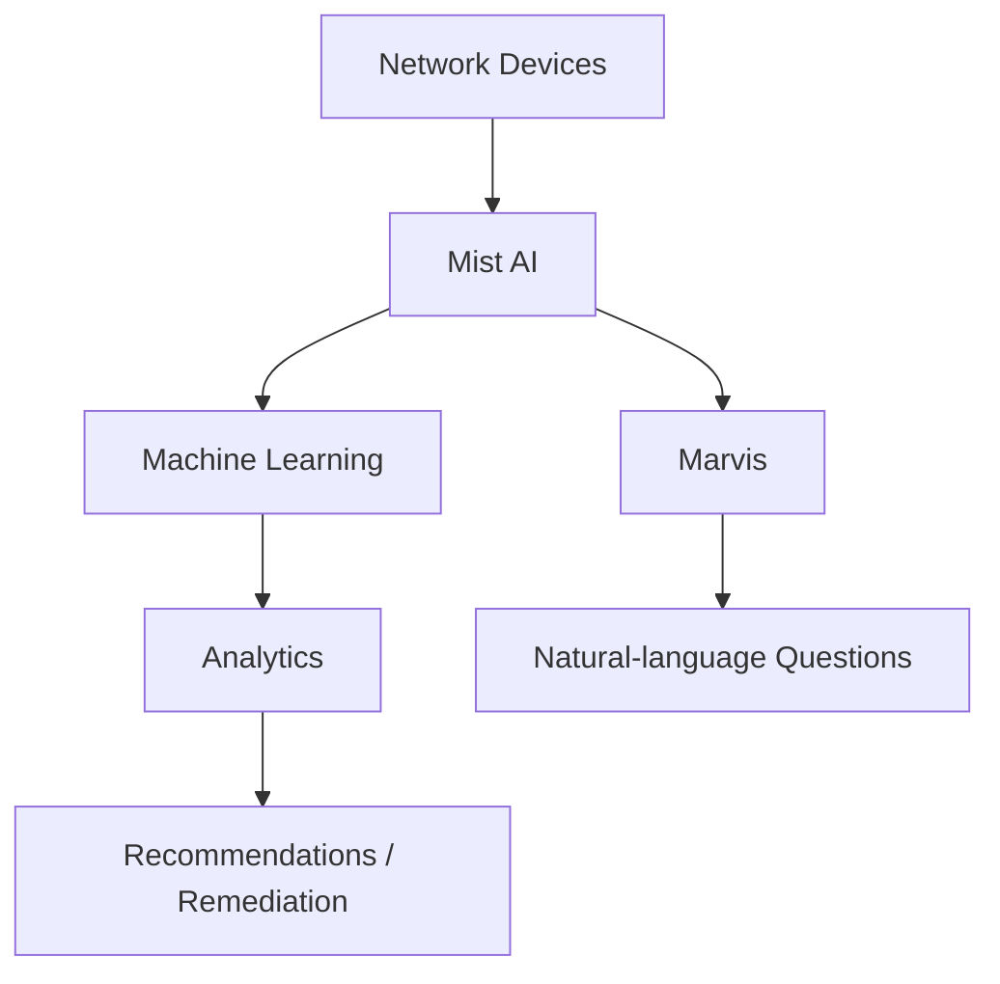

# JNCIA-Junos — Trunk Ports & Multiple Logical Units

## 1. Trunk Ports

### Why Trunk Ports?

- An **access port** carries traffic for one VLAN.
    
- Multiple VLANs between switches would otherwise require **one physical connection per VLAN**.
    
- A **trunk port** carries traffic for **multiple VLANs over one physical link**.
    
- VLAN identification is preserved using **VLAN tags**.
    



**Example:**

- VLAN 10 → Corporate
    
- VLAN 20 → Server
    
- VLAN 30 → Guest
    

### Main benefit

> **1 physical link → multiple VLANs**

---

## 2. Configure a Trunk Port

### Step 1 — Change interface to trunk mode

```bash
set interfaces xe-0/2/0 unit 0 family ethernet-switching interface-mode trunk
```

The interface changes from an access-style port to a **Layer-2 trunk**.

### Step 2 — Specify allowed VLANs

Individual VLANs:

```bash
set interfaces xe-0/2/0 unit 0 family ethernet-switching vlan members Corporate
set interfaces xe-0/2/0 unit 0 family ethernet-switching vlan members Server
set interfaces xe-0/2/0 unit 0 family ethernet-switching vlan members Guest
```

Or configure them together:

```bash
set interfaces xe-0/2/0 unit 0 family ethernet-switching vlan members { Corporate Server Guest }
```

### Allow all VLANs

```bash
set interfaces xe-0/2/0 unit 0 family ethernet-switching vlan members all
```

### Why explicitly list VLANs?

Prefer:

```bash
vlan members { Corporate Server Guest }
```

over:

```bash
vlan members all
```

because restricting VLANs limits unnecessary broadcast traffic and reduces the broadcast domain carried across the trunk.

---

## 3. Trunk Verification

```bash
show configuration interfaces xe-0/2/0
```

Expected hierarchy:

```text
unit 0 {
    family ethernet-switching {
        interface-mode trunk;
        vlan {
            members [ Corporate Server Guest ];
        }
    }
}
```

Check VLAN membership:

```bash
show vlans
```

The trunk interface should appear under every VLAN assigned to it.



---

# 4. LLDP Configuration During Trunk Migration

The existing switch already has:

```bash
set protocols lldp interface all
```

Therefore, **LLDP does not need to be reconfigured** simply because an interface is changed.

A useful shortcut is:

```bash
set protocols lldp interface all
```

This applies LLDP to all interfaces.

---

# 5. Multiple Logical Units on One Physical Interface

Instead of:

```text
Physical interface 1 → VLAN 10
Physical interface 2 → VLAN 20
Physical interface 3 → VLAN 30
```

one physical interface can host multiple **logical units**:

```text
xe-0/1/0
 ├── unit 10 → VLAN 10
 ├── unit 20 → VLAN 20
 └── unit 30 → VLAN 30
```

This is the basis of a **router-on-a-stick** design.



---

# 6. VLAN Tagging on Routed Interfaces

Enable VLAN tagging on the physical interface:

```bash
set interfaces xe-0/1/0 vlan-tagging
```

Then configure logical units.

### VLAN 10

```bash
set interfaces xe-0/1/0 unit 10 vlan-id 10
set interfaces xe-0/1/0 unit 10 description "Corporate LAN"
set interfaces xe-0/1/0 unit 10 family inet address 172.16.10.1/24
set interfaces xe-0/1/0 unit 10 family inet6 address 2001:db8:0:10::1/64
```

### VLAN 20

```bash
set interfaces xe-0/1/0 unit 20 vlan-id 20
set interfaces xe-0/1/0 unit 20 description "Server LAN"
set interfaces xe-0/1/0 unit 20 family inet address 172.16.20.1/24
set interfaces xe-0/1/0 unit 20 family inet6 address 2001:db8:0:20::1/64
```

### VLAN 30

```bash
set interfaces xe-0/1/0 unit 30 vlan-id 30
set interfaces xe-0/1/0 unit 30 description "Guest LAN"
set interfaces xe-0/1/0 unit 30 family inet address 172.16.30.1/24
set interfaces xe-0/1/0 unit 30 family inet6 address 2001:db8:0:30::1/64
```

### Important

The **unit number does not have to equal the VLAN ID**, although matching them makes configuration easier to understand.

```text
xe-0/1/0.10
        │
        └── logical unit 10

vlan-id 10
        │
        └── VLAN tag 10
```

---

# 7. Hierarchical View

```bash
show configuration interfaces xe-0/1/0
```

Conceptually:

```text
xe-0/1/0 {
    vlan-tagging;

    unit 10 {
        description "Corporate LAN";
        vlan-id 10;

        family inet {
            address 172.16.10.1/24;
        }

        family inet6 {
            address 2001:db8:0:10::1/64;
        }
    }

    unit 20 {
        ...
    }

    unit 30 {
        ...
    }
}
```

### Key idea

All IP configuration belongs to the **logical unit**, not directly to the physical interface.

---

# 8. Verification

### Check all logical units

```bash
show interfaces terse xe-0/1/0
```

You should see:

```text
xe-0/1/0.10    up    up
xe-0/1/0.20    up    up
xe-0/1/0.30    up    up
```

A special logical unit such as `.32767` may also appear internally.

### Check an individual logical interface

```bash
show interfaces terse xe-0/1/0.20
```

Verify:

- Interface is `up/up`
    
- IPv4 address
    
- IPv6 address
    

### Test connectivity

```bash
ping 172.16.20.21
```

This confirms Layer-3 reachability to the destination.

---

# 9. Router-on-a-Stick

A **router-on-a-stick** uses:

```text
Router
   │
   │ One physical trunk
   │
 Switch
 ├── VLAN 10
 ├── VLAN 20
 └── VLAN 30
```

The router uses separate logical units/subinterfaces to represent the VLANs.

### Traffic flow

Example: VLAN 10 host → VLAN 30 host



**Process:**

1. VLAN 10 host sends traffic to VLAN 30 host.
    
2. Switch tags/forwards the frame with VLAN 10.
    
3. Router receives it on the VLAN 10 logical unit.
    
4. Router performs Layer-3 routing.
    
5. Router sends it back through the same physical interface using VLAN 30.
    
6. Switch sends it through a VLAN 30 access port.
    

---

# 10. Migrating Existing Interfaces to Logical Units

Suppose existing interfaces are:

```text
xe-0/1/1
xe-0/1/2
xe-0/1/3
```

and each currently has:

- LLDP
    
- OSPF
    
- OSPF3
    
- IP configuration.
    

First identify the configuration:

```bash
show configuration | display set | match xe-0/1/[1-3]
```

The `[1-3]` pattern allows multiple interface names to be matched.

---

## 11. Remove Old LLDP Configuration

Delete the complete LLDP hierarchy:

```bash
delete protocols lldp
```

Then configure LLDP only on the new physical interface:

```bash
set protocols lldp interface xe-0/1/0
```

Result:

```text
LLDP → xe-0/1/0
```

---

# 12. `replace pattern` — Key Junos Migration Tool

Instead of manually deleting and recreating many protocol statements, use:

```bash
replace pattern <old> with <new>
```

Example:

```bash
replace pattern xe-0/1/1 with xe-0/1/0.10
replace pattern xe-0/1/2 with xe-0/1/0.20
replace pattern xe-0/1/3 with xe-0/1/0.30
```

This efficiently changes interface references throughout the configuration.



### Why useful?

Without `replace pattern`, you may need many:

```bash
delete ...
set ...
```

commands.

`replace pattern` can migrate multiple configuration references quickly.

---

# 13. OSPF / OSPF3 After Migration

After moving IP interfaces to logical units:

```text
xe-0/1/1 → xe-0/1/0.10
xe-0/1/2 → xe-0/1/0.20
xe-0/1/3 → xe-0/1/0.30
```

OSPF and OSPF3 references must also point to the new logical units.

The resulting configuration uses:

```text
OSPF:
xe-0/1/0.10 passive
xe-0/1/0.20 passive
xe-0/1/0.30 passive

OSPF3:
xe-0/1/0.10 passive
xe-0/1/0.20 passive
xe-0/1/0.30 passive
```

### Verify

```bash
show configuration protocols ospf | display set
```

```bash
show configuration protocols ospf3 | display set
```

```bash
show configuration protocols lldp | display set
```

---

# 14. Passive Interface

A passive OSPF/OSPF3 interface can still participate in route advertisement while **not forming OSPF neighbor relationships** on that interface.

Useful for LAN-facing interfaces where no OSPF neighbor should exist.

---

# 15. Complete Migration Model



---

# 16. Important Commands Cheat Sheet

|Task|Command|
|---|---|
|Trunk mode|`set interfaces <if> unit 0 family ethernet-switching interface-mode trunk`|
|Add VLAN|`set interfaces <if> unit 0 family ethernet-switching vlan members <VLAN>`|
|Multiple VLANs|`vlan members { VLAN1 VLAN2 VLAN3 }`|
|All VLANs|`vlan members all`|
|Show VLANs|`show vlans`|
|Show interface config|`show configuration interfaces <if>`|
|Enable VLAN tagging|`set interfaces <if> vlan-tagging`|
|Create logical unit|`set interfaces <if> unit <unit>`|
|VLAN ID|`set interfaces <if> unit <unit> vlan-id <id>`|
|IPv4|`family inet address <IP>/<prefix>`|
|IPv6|`family inet6 address <IPv6>/<prefix>`|
|Interface status|`show interfaces terse <if>`|
|Search config|`show configuration \| display set \| match <pattern>`|
|Delete LLDP hierarchy|`delete protocols lldp`|
|Configure LLDP|`set protocols lldp interface <if>`|
|Bulk migration|`replace pattern <old> with <new>`|
|Verify OSPF|`show configuration protocols ospf \| display set`|
|Verify OSPF3|`show configuration protocols ospf3 \| display set`|

---

# 17. EX vs QFX vs Mist AI

## EX Series

Designed for a broad range of deployments:

- Small offices → large data centers
    
- Port security
    
- Loop-prevention protocols
    
- PoE
    
- Virtual Chassis
    
- MACsec encryption
    
- EVPN-VXLAN
    
- Ethernet frames can be tunneled over IP networks.
    

Examples shown:

- EX2300
    
- EX3400
    
- EX2300
    
- EX4600/EX4650
    
- EX9250
    
- EX9200
    

## QFX Series

Designed primarily for:

- Data centers
    
- Large enterprises
    
- High-bandwidth environments
    
- Server/storage connectivity
    
- Data-center protocols
    

Characteristics:

- Layer-3 switching
    
- Large MAC tables
    
- Large routing tables
    
- Optimized for data-center workloads
    



---

# 18. Juniper Mist AI

Mist can manage EX switches and provides:

- Visibility
    
- Control
    
- Automation
    
- Network learning
    
- Traffic monitoring
    
- AI/ML-driven analysis
    
- Consistent deployment templates
    
- Automatic device onboarding
    

The module highlights **proactive remediation**, such as:

- Missing VLANs added
    
- Wi-Fi problems fixed
    
- Problematic ports bounced
    

### Marvis

**Marvis** is the virtual network assistant behind the Mist AI platform.

Example questions:

- Which users/devices have problems?
    
- Why is a particular user experiencing packet loss?
    



---

# 19. Exam/Revision Traps

- **Multiple VLANs on one switch link → Trunk**
    
- Trunk interface uses:
    
    ```bash
    family ethernet-switching
    interface-mode trunk
    ```
    
- Trunk VLAN membership:
    
    ```bash
    vlan members { VLAN1 VLAN2 VLAN3 }
    ```
    
- `vlan members all` allows every VLAN.
    
- **Router-on-a-stick → one physical interface + multiple logical units**
    
- Routed VLAN logical units require:
    
    ```bash
    vlan-tagging
    vlan-id
    ```
    
- VLAN tag and logical-unit number **do not have to be identical**.
    
- `replace pattern` is the Junos tool for bulk configuration migration.
    
- LLDP can be configured on the new physical interface while OSPF/OSPF3 references move to logical units.
    
- **EX → broad enterprise/campus switch family**
    
- **QFX → data-center/high-bandwidth focus**
    
- **Mist AI → ML/AI-based network visibility, automation and troubleshooting**
    
- **Marvis → virtual network assistant**
    

### Core mental model

```text
ACCESS
1 VLAN
   ↓
TRUNK
Many VLANs / 1 physical link
   ↓
VLAN TAGGING
Identify VLAN
   ↓
LOGICAL UNITS
1 physical routed interface → many VLAN interfaces
   ↓
ROUTER-ON-A-STICK
Inter-VLAN routing through one physical link
```