# JNCIA-Junos — Device Administration

## 1. Out-of-Band (OOB) Management

### In-Band Management

Management traffic uses the **same network interfaces/path as normal production traffic**.

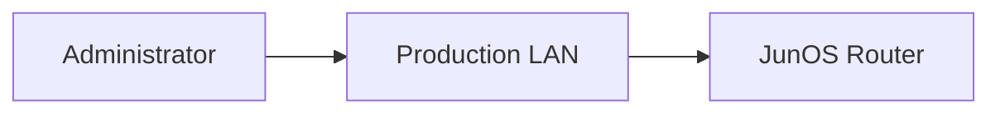

### Problems with In-Band Management

SSH access can fail when:

- The production/LAN interface goes down.
    
- The network is congested/flooded.
    
- Transit network problems affect the management path.
    

---

## 2. Out-of-Band Management

OOB uses a **dedicated management interface/network** separate from normal transit traffic.


### Advantages

- Management remains reachable even when production interfaces fail.
    
- Management traffic is isolated from regular transit traffic.
    
- Can connect to a dedicated management network.
    
- Useful for:
    
    - Monitoring systems
        
    - Backup servers
        
    - Administrative access
        

### Traffic separation

|Traffic direction|Allowed?|
|---|---|
|Network interface → Network interface|✅|
|Management interface → Network interface|❌|

The separation prevents normal network problems from directly affecting the management path.

---

# 3. Management Interface Names

The physical management interface name varies by Junos platform.

Common examples:

```text
fxp0
me0
em0
re0:mgmt-0
re1:mgmt-0
re0:mgmt-1
re1:mgmt-1
```

### Common platform examples

- Routers commonly use **fxp0**
    
- EX4300 shown in the module commonly uses **me0**
    
- PTX10003 examples use management interfaces such as:
    
    - `re0:mgmt-0`
        
    - `re0:mgmt-1`
        

> Always check the specific platform documentation for the actual management-interface name.

---

# 4. Configuring a Management Interface

The management interface is configured like a normal routed interface.

Example:

```bash
set interfaces fxp0 unit 0 family inet address 172.25.11.1/24
commit
```

Management network:

```text
172.25.11.0/24
```

Example topology:

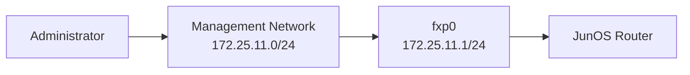

---

# 5. Ways to Use the Management Interface

The module presents two common deployment models:

### Dedicated Internet connection

Useful when administrators need remote access and there is no permanent management network.

```text
Device ─── Dedicated connection ─── Internet
```

### Dedicated management network

Better suited to environments with many managed devices.

```text
Devices ─── Dedicated Management Network ─── Administrators
```

The actual interface configuration remains essentially the same.

---

# 6. Why Accurate Time Matters

Accurate device time is critical for:

- Event correlation
    
- Troubleshooting
    
- Comparing logs across devices
    
- Auditing
    
- Configuration-change tracking
    
- Security investigations
    

Junos commit history and system logs contain timestamps.

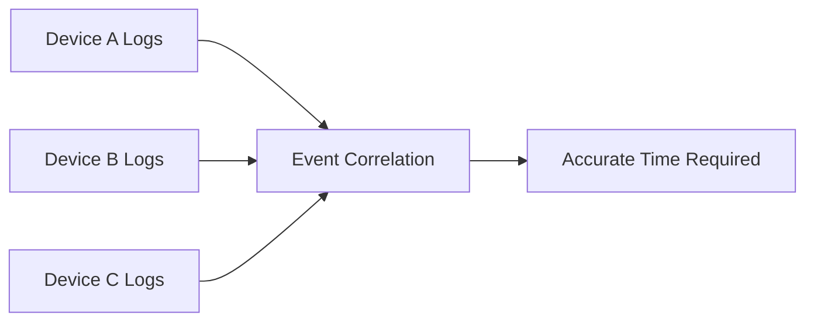

If device clocks differ significantly, determining the true order of events becomes difficult.

---

# 7. Setting Time

Two methods:

|Method|Advantage|Trade-off|
|---|---|---|
|Manual|Simple|Clock can drift|
|NTP|Keeps devices synchronized|Requires reachable NTP server|

---

## 8. Manual Time Configuration

### Step 1 — Configure time zone

```bash
set system time-zone US/Eastern
```

### Step 2 — Set current date/time

Run in **operational mode**:

```bash
set date YYYYMMDDHHMM.SS
```

Example from the module:

```bash
set date 202309051530.00
```

### Important

The **time zone is configuration**, while the actual current time is set operationally.

---

# 9. NTP — Network Time Protocol

NTP automatically synchronizes the device clock with a time server.

Configuration is under:

```text
system ntp
```

Example:

```bash
set system ntp server 203.0.113.47
commit
```

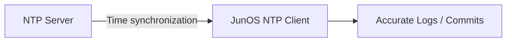

### Verify current time

```bash
show system uptime
```

Important output includes:

```text
Current time:
Time Source:
System booted:
```

After synchronization:

```text
Time Source: NTP CLOCK
```

---

# 10. Verify NTP

```bash
show ntp associations
```

Example concept:

```text
remote              refid      st
*ntp-server         ...        3
```

### `*` meaning

`*` indicates the device is **synchronized with that NTP server**.

### Stratum

The `st` value is the **NTP stratum**.

It indicates the server's distance from an authoritative/reference clock.

```text
Lower stratum → closer to reference clock
Higher stratum → farther from reference clock
```

### Important NTP fields

```text
remote
refid
st
t
when
poll
reach
delay
offset
jitter
```

---

# 11. NTP Mental Model

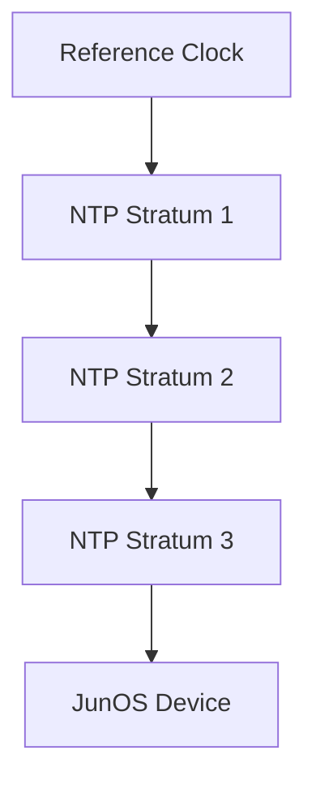

**Added exam knowledge:** NTP uses UDP **port 123**.

---

# 12. DNS Resolution

DNS translates:

```text
Domain name → IP address
```

Example:

```text
www.juniper.net
        ↓
104.124.181.195
```

### Terminology

|Term|Example|
|---|---|
|Domain|`juniper.net`|
|Subdomain|`www`|
|FQDN|`www.juniper.net`|

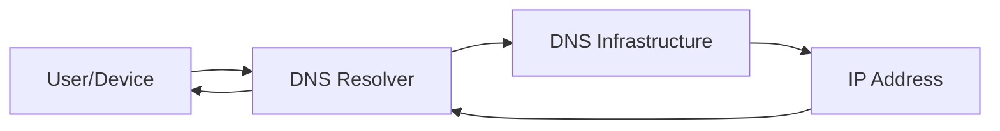

The resolver performs the lookup on behalf of the client.

---

# 13. Configure DNS Resolver

Configuration is under the `system` hierarchy.

```bash
set system name-server 203.0.113.5
commit
```

Multiple DNS servers can be configured when redundancy is required.

### Test DNS

```bash
ping juniper.net
```

If DNS works, Junos resolves the hostname to an IP address before sending the ICMP packets.

---

# 14. DNS Troubleshooting

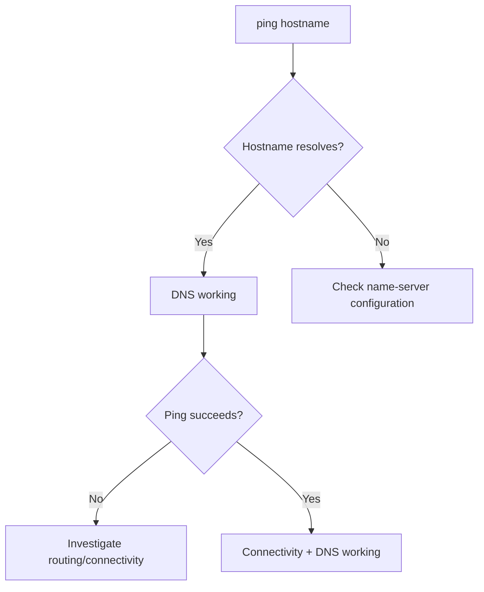

**Important:** A failed `ping hostname` does not automatically mean DNS is broken. The destination itself may simply be unreachable or may block ICMP.

---

# 15. Local User Accounts

Junos supports locally configured users.

A user account can contain:

- Username
    
- UID (optional)
    
- Login class
    
- Authentication method
    

Example shown:

```text
Username: employee
UID: 2000
Class: super-user
Authentication: encrypted-password
```

---

# 16. Creating a User

Example:

```bash
set system login user r.chen class super-user authentication plain-text-password
```

Junos prompts for the password.

Then:

```bash
commit
```

---

# 17. Password Authentication

Two important methods:

### `plain-text-password`

```bash
set system login user employee authentication plain-text-password
```

- Password is entered normally at the CLI.
    
- Junos encrypts/hashes it for storage.
    
- Password itself is not displayed while typing.
    

### `encrypted-password`

```bash
set system login user employee authentication encrypted-password "$6$..."
```

- Used when supplying an already encrypted password string.
    
- Useful when migrating/copying an existing password hash.
    

---

# 18. Password Hashing

Junos uses **SHA-512 by default** in the example/module.

A stored password may begin with:

```text
$6$
```

`$6$` identifies **SHA-512 crypt-style hashing**.


### Security principle

Passwords should not be stored as plaintext.

> **Hash ≠ encryption**  
> A password hash is intended to be one-way, while encryption is designed to be reversible with a key.

---

# 19. Change an Existing User Password

```bash
set system login user employee authentication plain-text-password
```

Junos prompts twice:

```text
New password:
Retype new password:
```

Then:

```bash
commit
```

Verify:

```bash
show configuration system login user employee | display set
```

The stored output shows the resulting encrypted/hashed password rather than the plaintext password.

---

# 20. User Login Classes

A **login class** is a collection of permissions assigned to users.

It controls:

- Operational commands
    
- Configuration access
    
- Commands a user can execute
    
- Configuration hierarchy portions visible to the user
    

Four default classes:

```text
super-user
operator
read-only
unauthorized
```

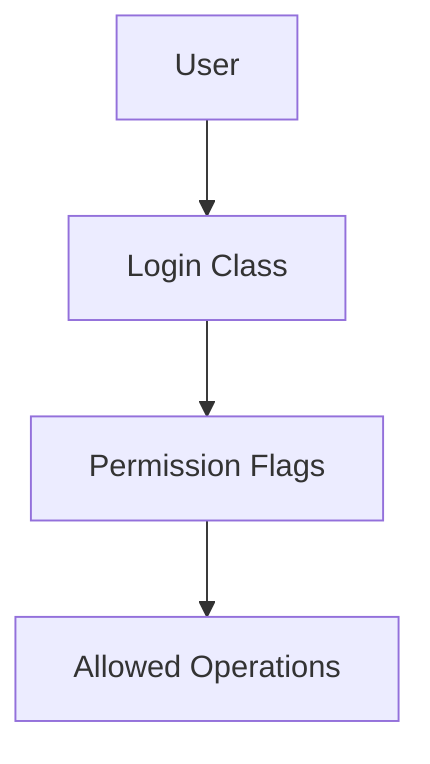

Custom login classes can also be created.

---

# 21. Permission Flags

Permissions are grouped into **permission flags**.

Common flags from the module:

|Flag|Purpose|
|---|---|
|`all`|All operational + configuration commands|
|`clear`|Allows `clear` commands|
|`configure`|Enter configuration mode + commit|
|`network`|`ping`, `ssh`, `telnet`, `traceroute`|
|`view`|View system/routing/protocol information|

Multiple permission flags can be assigned to a class.

---

# 22. Default Login Classes

## `super-user`

- Full administrative access.
    
- Includes the `all` permission.
    
- Intended for trusted administrators.
    

```text
super-user
   ↓
all permissions
```

### Security principle

Do not give `super-user` privileges unnecessarily.

---

## `unauthorized`

At the opposite end of the permission spectrum.

- No permission flags.
    
- Useful for users who need an account but should not actively access/configure the device.
    
- The module notes that it can have uses such as tracking users/limiting authentication-server access.
    

---

## `operator`

Designed primarily for basic troubleshooting.

Typical permissions shown:

```text
view     → View information
clear    → Run clear commands
reset    → Restart Junos processes
trace    → View/configure debugging information
network  → ping / ssh / telnet / traceroute
```

Useful for:

- First-line support
    
- Troubleshooting
    
- Users who should not receive full configuration privileges
    

---

## `read-only`

Contains only the:

```text
view
```

permission flag.

User can:

- View network status
    
- Run permitted `show` commands
    

User cannot:

- Modify configuration
    
- Perform configuration changes
    
- Use commands such as `ping` if not permitted by the class
    

Example:

```text
test.user> show configuration
```

Configuration portions may appear as:

```text
/* ACCESS-DENIED */
```

---

# 23. Login-Class Comparison

|Class|Main purpose|
|---|---|
|`super-user`|Full administration|
|`operator`|Troubleshooting|
|`read-only`|View-only access|
|`unauthorized`|No operational permissions|


This represents the **general permission scope**, not an exact inheritance relationship.

---

# 24. Creating a Super-User

Example:

```bash
set system login user r.chen class super-user authentication plain-text-password
```

Then:

```bash
commit
```

The new user can authenticate with super-user privileges.

---

# 25. J-Web

**J-Web** is a graphical/web-based management interface for Junos devices.

It provides an alternative to CLI.

Useful for:

- Day-to-day administration
    
- Monitoring
    
- Device health/status
    
- Network configuration
    
- Security configuration
    

The module notes that J-Web is available on a **limited number of platforms**, with examples including SRX devices.

---

# 26. J-Web Main Areas

J-Web contains several functional areas:

|Area|Purpose|
|---|---|
|Dashboard|Customizable device monitoring|
|Monitor|Interface status, traffic statistics, events|
|Device Administration|Device administration features|
|Network|Interfaces, routing and network settings|
|Security Policies & Objects|Security policy/object management|
|Security Services|Advanced security services|

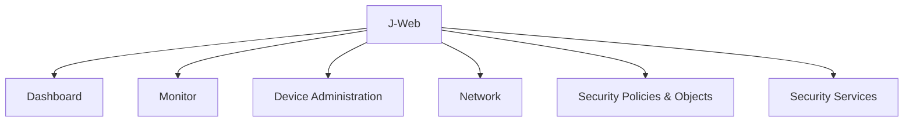

---

# 27. HTTP vs HTTPS

### HTTP

**Hypertext Transfer Protocol**

- Data transmitted without encryption.
    
- Easier to configure.
    
- Provides weaker security for management traffic.
    

### HTTPS

**Hypertext Transfer Protocol Secure**

- Encrypts communication.
    
- Requires a digital certificate.
    
- Preferred for secure web-based management.
    

|HTTP|HTTPS|
|---|---|
|Unencrypted|Encrypted|
|Simpler|Requires certificate|
|Less suitable for sensitive management|Suitable for secure management|

---

# 28. Enable J-Web

### HTTP

```bash
set system services web-management http
```

### HTTPS with system-generated certificate

```bash
set system services web-management https system-generated-certificate
```

Then:

```bash
commit
```

The module notes that a certificate can alternatively be obtained from a **certificate authority (CA)**.

---

# 29. Accessing J-Web

After enabling J-Web, access the device using an interface with an IP address:

```text
https://<device-IP>
```

Example from the module:

```text
https://172.25.11.1
```

Then authenticate with a valid Junos user account.

---

# 30. Secure J-Web Deployment

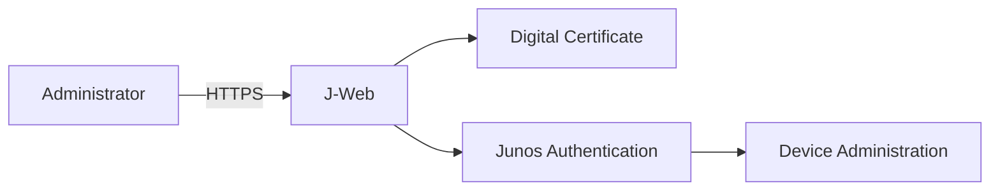

**Added security knowledge:**

- Prefer HTTPS over HTTP.
    
- Restrict J-Web access to the management network when possible.
    
- Avoid exposing administrative web interfaces directly to the public Internet.
    
- Use least-privilege accounts where practical.
    

---

# 31. Complete Device Administration Workflow

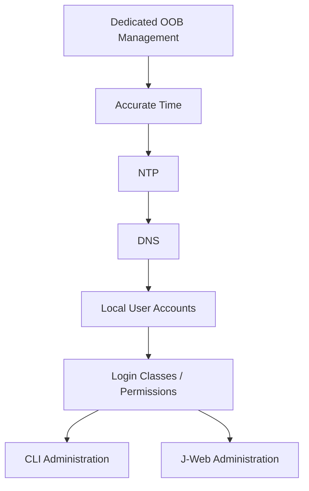

---

# 32. Practical Secure Management Architecture

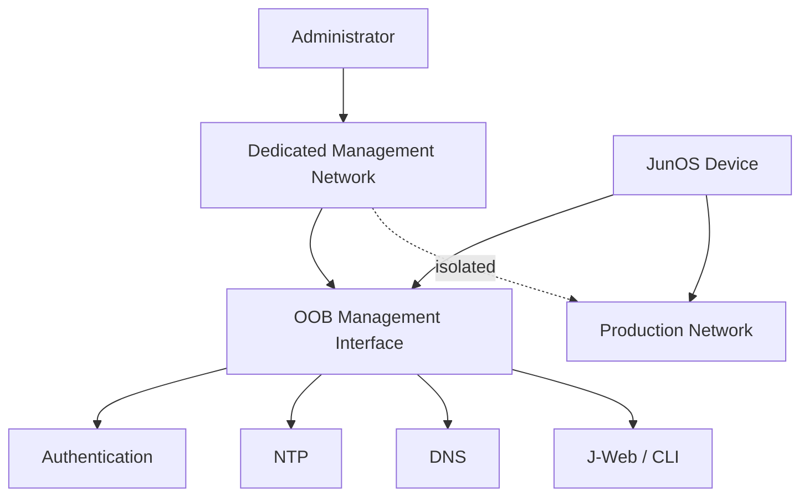

---

# 33. Important Commands Cheat Sheet

### Management

```bash
set interfaces fxp0 unit 0 family inet address 172.25.11.1/24
```

### Time

```bash
set system time-zone US/Eastern
set date YYYYMMDDHHMM.SS
show system uptime
```

### NTP

```bash
set system ntp server 203.0.113.47
show ntp associations
```

### DNS

```bash
set system name-server 203.0.113.5
ping juniper.net
```

### Users

```bash
set system login user <username> class <class> authentication plain-text-password
```

### View user configuration

```bash
show configuration system login user <username> | display set
```

### J-Web HTTP

```bash
set system services web-management http
```

### J-Web HTTPS

```bash
set system services web-management https system-generated-certificate
```

---

# 34. Exam Traps

- **OOB management** = separate management path from production traffic.
    
- Main benefit of OOB = **management access can remain available when the production network fails**.
    
- Management interface names vary by Junos platform.
    
- `fxp0` is a common router management interface.
    
- EX4300 example uses `me0`.
    
- Time zone configuration:
    
    ```bash
    set system time-zone ...
    ```
    
- Manual clock setting uses operational mode:
    
    ```bash
    set date ...
    ```
    
- NTP configuration:
    
    ```bash
    set system ntp server <IP>
    ```
    
- Current time:
    
    ```bash
    show system uptime
    ```
    
- NTP status:
    
    ```bash
    show ntp associations
    ```
    
- `*` in NTP association output = selected/synchronized server.
    
- DNS resolver:
    
    ```bash
    set system name-server <IP>
    ```
    
- DNS converts **names → IP addresses**.
    
- `plain-text-password` = enter password normally; Junos protects it in configuration.
    
- `encrypted-password` = provide an already encrypted/hash string.
    
- `$6$` = SHA-512 password hash identifier.
    
- `super-user` = full privileges.
    
- `operator` = troubleshooting-oriented permissions.
    
- `read-only` = view-only.
    
- `unauthorized` = no permission flags.
    
- `network` permission includes `ping`, `ssh`, `telnet`, `traceroute`.
    
- `configure` permission allows configuration mode and commits.
    
- J-Web = graphical alternative to CLI.
    
- J-Web network configuration is under **Network**.
    
- J-Web monitoring is under **Monitor**.
    
- Secure web access = **HTTPS**.
    
- HTTPS requires a certificate.
    
- J-Web HTTPS can use:
    
    ```bash
    system-generated-certificate
    ```
    

## Final Mental Model

```text
OOB
│
├── Dedicated management interface
│      └── Management network
│
├── Accurate Time
│      └── NTP
│
├── DNS
│      └── hostname → IP
│
├── Authentication
│      └── Local users
│
├── Authorization
│      └── Login classes → permission flags
│
└── Management Interfaces
       ├── CLI
       └── J-Web
              └── HTTPS + certificate
```