# JNCIA-Junos — Setting Up a Brand-New Junos OS Device

## 1. Default Junos Configuration

Junos devices **do not all have identical factory configurations**. Defaults vary by platform.

- Read the factory-default configuration before changing it.
    
- Some platforms have additional security-related defaults.
    
- Basic logging settings are generally preconfigured.
    
- Some protocols are enabled by default on specific platforms.
    

### Example — RSTP

Switches may have **Rapid Spanning Tree Protocol (RSTP)** enabled by default.

```text
RSTP → prevents Layer 2 loops
       ↓
Loop detected
       ↓
Port can be placed into blocking/down state
```

Routers/firewalls generally do not need RSTP preconfigured in the same way as switches.

---

## 2. Network Interfaces on New Devices

Defaults vary:

- Most routers/firewalls have **blank Layer-3 interfaces**.
    
- Some smaller devices can ship with preconfigured LAN interfaces.
    
- Example from the module: SRX320 can provide a LAN IP using **DHCP**.
    

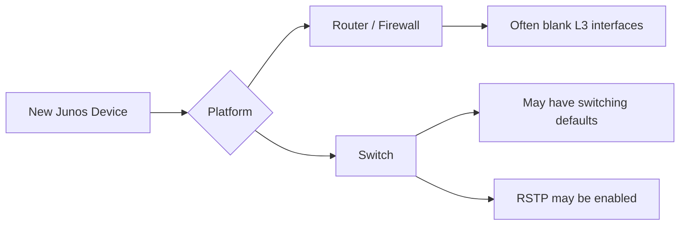

---

# 3. Console Port

The console port provides **direct device access without requiring an IP address**.

### Characteristics

- Direct computer → device connection.
    
- Uses a serial console connection.
    
- Based on **RS-232**.
    
- Does not require network connectivity or an IP address.
    
- Useful for initial setup and recovery.
    


### Important

The physical connector may look like an RJ45 Ethernet connector, but the Junos console port is **not an Ethernet network port**.

---

# 4. Console Cables

Common console cable types:

### DB9

- Older computers commonly provide DB9 serial ports.
    
- Connector is shaped roughly like a `D`.
    

### USB

- Modern computers commonly use USB.
    
- USB-to-serial console adapters may be required.
    

```text
Computer
   │
   ├── DB9 ───────── Console
   │
   └── USB/Serial ── Console
```

---

# 5. Connecting Through PuTTY

PuTTY can provide console access.

Typical process:

1. Connect console cable.
    
2. Identify serial device/COM port.
    
3. Open PuTTY.
    
4. Select **Serial**.
    
5. Select the appropriate COM/serial interface.
    
6. Configure the console speed according to the device/platform.
    

The module example uses **9600 baud**.

```text
Connection type → Serial
Serial line     → COMx
Speed           → 9600
```

> USB console connections may require additional driver/software setup.

---

# 6. First Login — Root Account

A brand-new Junos device initially provides the **`root`** user.

Example:

```text
login: root
```

The new device does **not have a root password configured initially**.

### `Amnesiac`

You may see:

```text
Amnesiac
```

This indicates that the device does not yet have a hostname configured.

Example:

```text
Amnesiac (ttyu0)
login: root
```

---

# 7. Junos and the Underlying Unix Shell

Junos OS is based on **FreeBSD**.

The underlying Unix shell is available to the `root` user.

### Enter Junos CLI

From the Unix shell:

```bash
cli
```

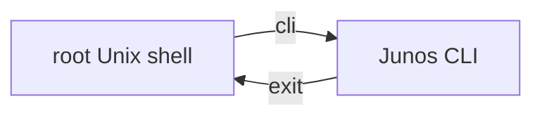

### Important

```text
root@device% 
```

→ Unix shell

```text
root@device>
```

→ Junos operational mode

Typing:

```bash
cli
```

takes you into Junos CLI.

---

# 8. Mandatory Initial Configuration

A brand-new Junos device has **one critical mandatory configuration requirement**:

> **Set a root authentication password.**

Without it, commits are rejected.

Example:

```bash
configure
set system host-name TEST_DEVICE
commit
```

May fail with:

```text
missing mandatory statement:
root-authentication
```

---

## 9. Configure Root Password

```bash
set system root-authentication plain-text-password
```

Enter:

```text
New password:
Retype new password:
```

Junos then stores the password in protected/encrypted form.

Verify the pending configuration:

```bash
show | compare
```

Then:

```bash
commit
```

or:

```bash
commit and-quit
```

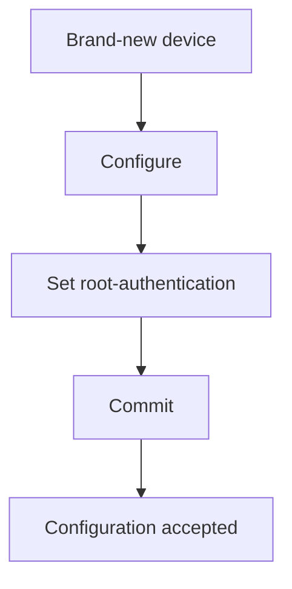

---

# 10. Recommended Initial Settings

After satisfying the mandatory root-password requirement, configure useful administrative settings.

### Recommended

- Create at least one **named user**.
    
- Set a meaningful hostname.
    
- Configure accurate time.
    
- Configure management interface.
    
- Enable SSH for remote administration.
    
- Prefer encrypted remote-management protocols.
    
- Configure login messages/banners.
    
- Consider NTP and DNS.
    
- Create a rescue configuration.
    

### Why named users?

Using only `root` creates **anonymity** in administrative actions.

Named accounts allow administrators to identify **who performed a task**.

```text
root
 ↓
Shared identity / poor accountability

named-user
 ↓
Individual accountability
```

---

# 11. SSH Remote Access

For remote management, use **SSH** rather than Telnet whenever possible.

The module specifically recommends encrypted sessions.


Remote root login can also be configured using:

```bash
set system login ssh root-login allow
```

> Use remote root access carefully; named administrative accounts are generally preferable for accountability.

---

# 12. System Hostname

Set a meaningful hostname:

```bash
set system host-name R1
```

Example:

```text
R1
R2
CORE-SW1
EDGE-FW1
```

Benefits:

- Easier identification.
    
- Better troubleshooting.
    
- More useful logs.
    
- Easier multi-device administration.
    

---

# 13. Login Message vs Announcement

Junos supports two useful login messages.

### `message`

Displayed **before the login prompt**.

```bash
set system login message "Beware all ye who enter here!"
```

Flow:

```text
Message
   ↓
login:
   ↓
password
```

### `announcement`

Displayed **after successful authentication**.

```bash
set system login announcement "This is line 1\nand this is line 2"
```

`\n` creates a new line.

Flow:

```text
login → authentication → announcement
```

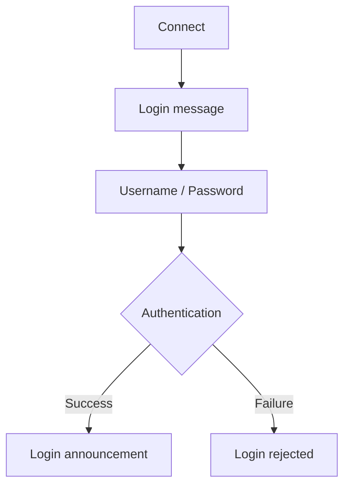

---

# 14. Factory-Default Configuration

Junos can load the factory-default configuration into the **candidate configuration**.

```bash
load factory-default
```

### Important

This command does **not immediately factory-reset the device**.

It loads the factory configuration into the candidate configuration.

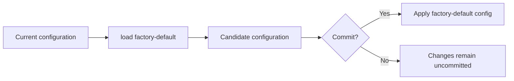

You can inspect changes before committing:

```bash
show | compare
```

---

# 15. Factory Settings Section

The module shows that `load factory-default` can add:

```text
system {
    commit {
        factory-settings;
    }
}
```

If you want to remove this before committing:

```bash
delete system commit factory-settings
```

### Important warning

The module specifically warns to use this procedure **only when connected through the console cable**, because changing configuration may remove remote access.

---

# 16. Rescue Configuration

A **rescue configuration** is a known-good configuration snapshot that can be restored later.

Useful when:

- Testing configuration changes.
    
- Performing risky network modifications.
    
- Recovering from a configuration mistake.
    
- Working in lab environments.
    

### Save rescue configuration

```bash
request system configuration rescue save
```

### Restore rescue configuration

```bash
rollback rescue
```

### Delete rescue configuration

```bash
request system configuration rescue delete
```

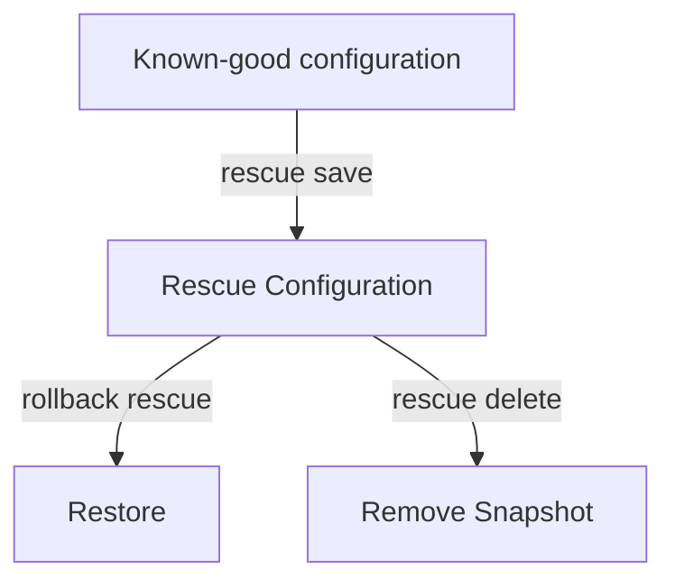

The module notes that the rescue configuration can provide a fallback for **up to 49 previous configurations**.

---

# 17. Factory Default vs Rescue

|Feature|Command|Purpose|
|---|---|---|
|Factory default|`load factory-default`|Load vendor default configuration|
|Rescue save|`request system configuration rescue save`|Save known-good configuration|
|Rescue restore|`rollback rescue`|Return to saved rescue configuration|
|Rescue delete|`request system configuration rescue delete`|Delete rescue snapshot|

### Critical distinction

```text
Factory default ≠ Rescue configuration
```

**Factory default** = vendor baseline.

**Rescue** = administrator's saved known-good configuration.

---

# 18. Rebooting Junos

Junos is an operating system running on hardware with CPU, RAM, storage, etc.

Gracefully reboot using:

```bash
request system reboot
```

Junos asks for confirmation:

```text
Reboot the system? [yes,no]
```

Enter:

```text
yes
```

The device then shuts down/reboots gracefully.

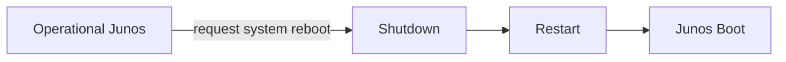

---

# 19. Zero-Touch Provisioning — ZTP

**Zero-Touch Provisioning (ZTP)** automates deployment of new Junos devices.

Instead of manually configuring every device:

```text
Device joins network
        ↓
Obtains network information
        ↓
Finds ZTP resources
        ↓
Downloads configuration/software
        ↓
Device becomes provisioned
```

### Main benefit

**Large-scale deployments become much faster and require less manual work.**

---

# 20. ZTP Components

The module shows a network containing:

- ZTP server
    
- Junos image server
    
- Configuration server
    

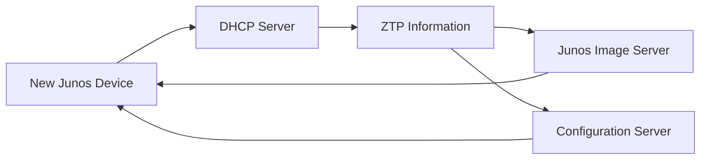

The ZTP server provides information telling the device **where to find the required resources**.

---

# 21. DHCP — Key to ZTP

DHCP drives the ZTP process.

DHCP can provide:

- IP address
    
- Network information
    
- ZTP-related information/options
    
- Locations of required servers/resources
    

The module uses the term **ZTP server** for the server involved in this process, but emphasizes that DHCP is the protocol driving ZTP.

---

# 22. DHCP DORA

DHCP uses four major steps:

```text
D → Discover
O → Offer
R → Request
A → Acknowledge
```

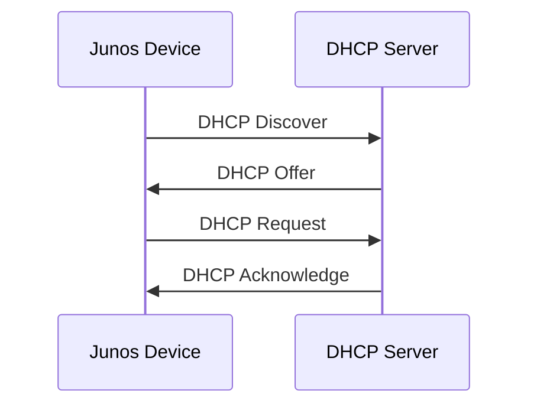

### 1. Discover

Initial broadcast from the host to find a DHCP server.

### 2. Offer

DHCP server offers IP/network information.

### 3. Request

Client requests the offered information.

### 4. Acknowledge

Server confirms the IP allocation.

---

# 23. DHCP Options + ZTP

DHCP messages contain a **DHCP Options** field.

ZTP can use DHCP-provided information to discover:

- Where to obtain a Junos image upgrade.
    
- Where to obtain configuration.
    
- How to download the files.
    
- Temporary IP/interface information.
    

The module notes that exact ZTP option details are an advanced topic, but the important concept is:

```text
DHCP
 ↓
Network information + ZTP information
 ↓
Junos device automatically finds required resources
```

---

# 24. ZTP Deployment Flow

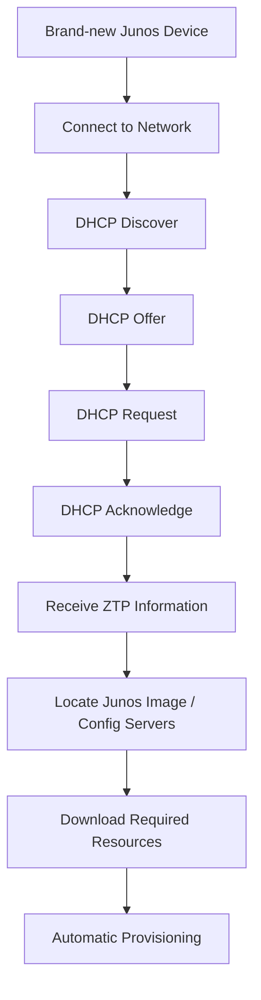

---

# 25. ZTP Advantages

- Minimal manual configuration.
    
- Faster deployment of many devices.
    
- Devices can request configuration/software after joining the network.
    
- Useful for large hardware rollouts.
    
- Reduces repetitive initial configuration work.
    
- Can automate software and configuration deployment.
    

```text
Manual deployment:
Device → Console → Configure → Test → Repeat × 100

ZTP:
Device → Network → DHCP/ZTP → Auto-provision
```

---

# 26. Important Exam Traps

### Default configuration

- Junos defaults **vary by platform**.
    
- Switches may have RSTP enabled.
    
- Some devices have preconfigured LAN interfaces.
    
- Basic logging is commonly present.
    

### Console

- Console access **does not require an IP address**.
    
- Console communication uses **RS-232**.
    
- RJ45-looking console connector ≠ Ethernet.
    
- `9600` baud is used in the module's PuTTY example.
    

### New device

- Initial login user = `root`.
    
- `Amnesiac` indicates no hostname has been configured.
    
- Brand-new device requires a **root authentication password before commit**.
    

### Root password

```bash
set system root-authentication plain-text-password
```

### Unix → Junos CLI

```bash
cli
```

### Factory default

```bash
load factory-default
```

**Does not instantly erase the device.**

### Rescue

```bash
request system configuration rescue save
rollback rescue
request system configuration rescue delete
```

### Reboot

```bash
request system reboot
```

### ZTP

```text
DHCP → DORA → ZTP information → Image/Config → Auto-provision
```

---

# 27. Command Cheat Sheet

```bash
# Enter configuration mode
configure

# Hostname
set system host-name R1

# Root password
set system root-authentication plain-text-password

# Named user
set system login user admin class super-user authentication plain-text-password

# SSH root access
set system login ssh root-login allow

# Login warning
set system login message "Authorized access only"

# Login announcement
set system login announcement "Welcome to R1\nAuthorized users only"

# Factory default
load factory-default

# Compare changes
show | compare

# Save rescue configuration
request system configuration rescue save

# Restore rescue configuration
rollback rescue

# Delete rescue configuration
request system configuration rescue delete

# Reboot
request system reboot

# Enter Junos CLI from Unix shell
cli
```

# 28. New Device Initial-Setup Sequence

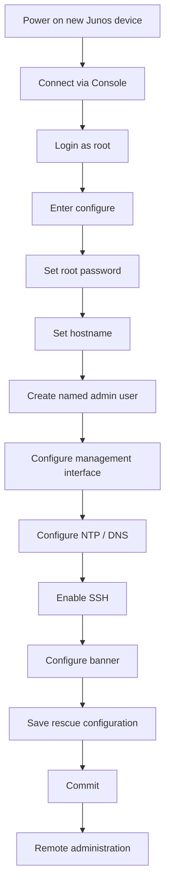

## Quick Revision

```text
NEW JUNOS DEVICE
│
├── Console → Direct access, no IP required
├── root → Initial account
├── Amnesiac → No hostname configured
│
├── Mandatory
│   └── root-authentication
│
├── Recommended
│   ├── Hostname
│   ├── Named user
│   ├── Management interface
│   ├── NTP
│   ├── DNS
│   ├── SSH
│   └── Login banner
│
├── Recovery
│   ├── load factory-default
│   └── rescue configuration
│
└── Automation
    └── ZTP
        └── DHCP → DORA → ZTP info → Image/Config
```

### JNCIA Must-Know

| Question                     | Answer                                     |
| ---------------------------- | ------------------------------------------ |
| Direct access without IP?    | **Console**                                |
| Console protocol?            | **RS-232**                                 |
| Initial username?            | **root**                                   |
| `Amnesiac`?                  | No hostname configured                     |
| Mandatory new-device config? | **Root password**                          |
| Root password hierarchy?     | `system root-authentication`               |
| Factory config command?      | `load factory-default`                     |
| Save rescue?                 | `request system configuration rescue save` |
| Restore rescue?              | `rollback rescue`                          |
| Reboot?                      | `request system reboot`                    |
| Automation?                  | **ZTP**                                    |
| Protocol driving ZTP?        | **DHCP**                                   |
| DHCP sequence?               | **DORA**                                   |
| DORA?                        | Discover → Offer → Request → Acknowledge   |
| ZTP can provide?             | Image/config server information            |
| Main ZTP benefit?            | Faster large-scale deployment              |