# Junos OS — Advantages of Junos OS

## 1. Junos OS Overview

- **Junos OS** = operating system used across Juniper networking devices.
    
- Runs on:
    
    - Routers
        
    - Switches
        
    - Firewalls
        
- Same fundamental OS across different device types → **consistent management and configuration**.
    
- Junos manages:
    
    - Hardware/chassis power & cooling
        
    - Network protocols
        
    - Interfaces
        
    - Routing/switching
        
    - Security functions
        

> **Key idea:** Learn Junos once and the core CLI/configuration concepts transfer across many Juniper platforms.

---

# 2. Advantages of Junos OS

### Consistent OS

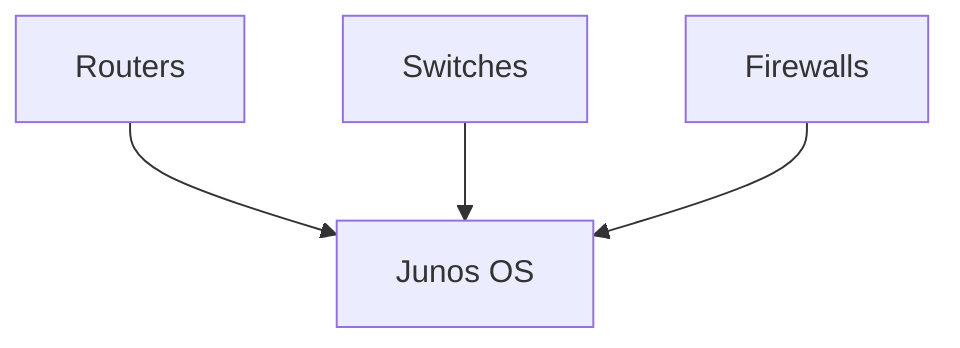

- Common operating environment across the Juniper portfolio.
    
- Major Junos releases maintain consistency.
    
- Device-specific features may still vary by hardware.
    

### CLI

Junos CLI is:

- Powerful
    
- Fast
    
- Consistent
    
- Text-based
    
- Hierarchical
    

Basic interaction:


Example:

```bash
show interfaces
show system uptime
show configuration
```

---

# 3. Junos Configuration Hierarchy

Junos configuration is **hierarchical and logical**.

Top-level configuration hierarchies include:

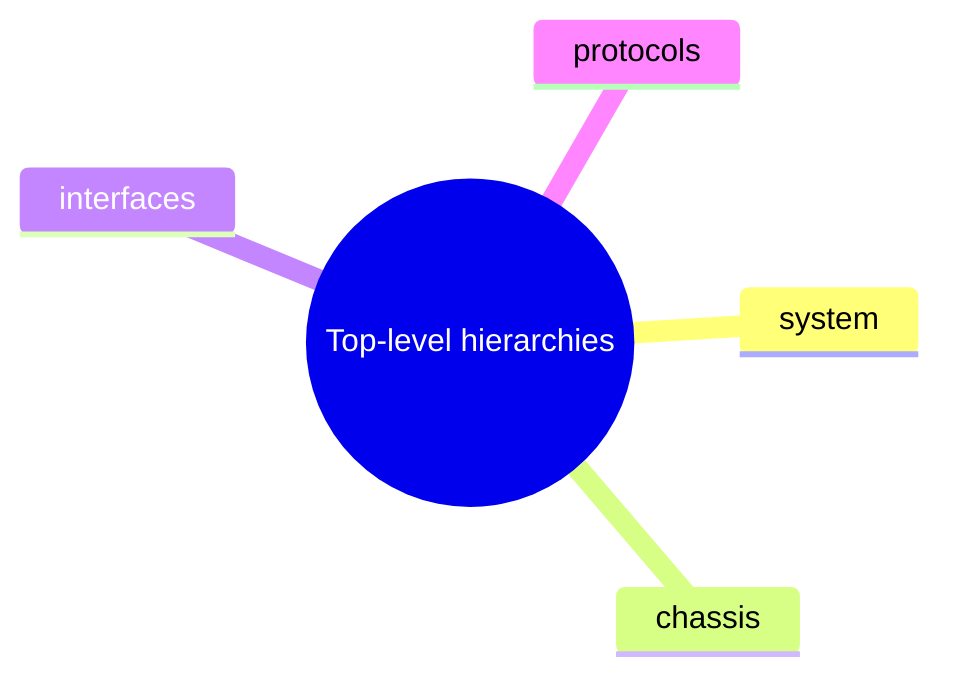

Example:

```text
interfaces {
    ge-0/0/0 {
        unit 0 {
            family inet {
                address 192.168.1.1/24;
            }
        }
    }
}
```

### Benefits

- Predictable configuration structure
    
- Easier to read
    
- Easier to learn
    
- Related settings are grouped together
    
- Configuration commands can often be predicted from the hierarchy
    

---

# 4. Safe Configuration & Change Management

Unlike systems that immediately apply every command, Junos uses a **candidate configuration**.

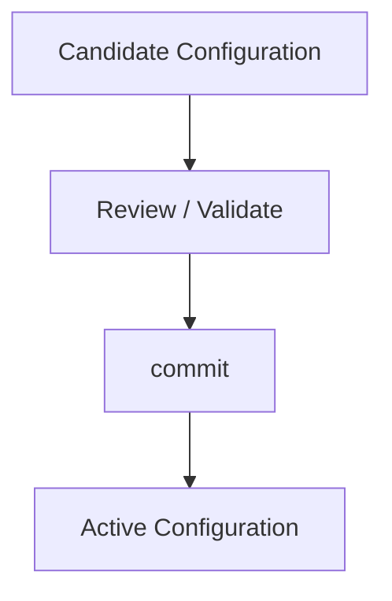

### Verify changes before deployment

```bash
show | compare
```

Shows differences between the candidate and active configuration.

### Why this matters

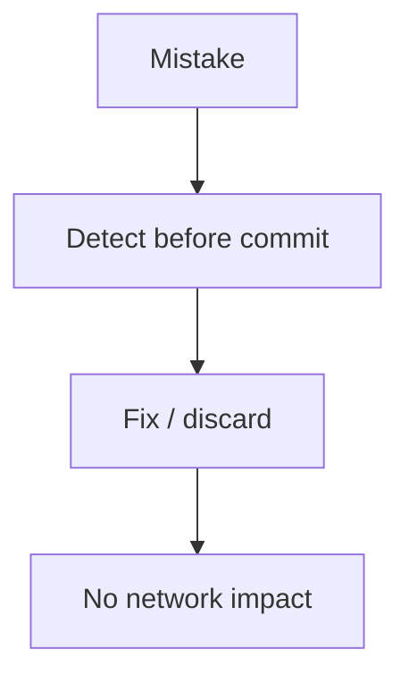

This provides a safer configuration workflow, especially on remote devices.

---

# 5. Configuration Rollback

Junos maintains historical configurations.

The module states that Junos can keep **up to 49 previous configurations**.

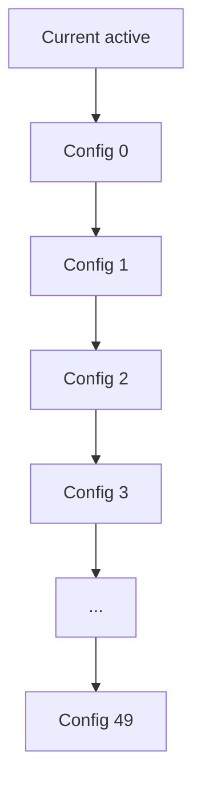

### Rollback

```bash
rollback 1
```

Loads the previous configuration into the candidate configuration.

```bash
commit
```

Apply it.

### Important

Rollback and commit are separate:

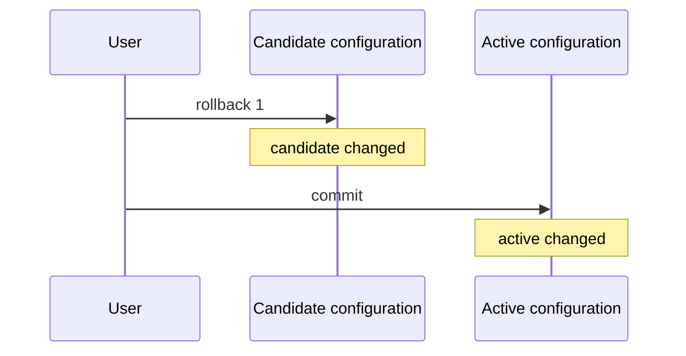

---

# 6. Automatic Rollback / Protection

Junos provides mechanisms to protect against configuration mistakes.

### `commit confirmed`

```bash
commit confirmed 5
```

- Commits configuration temporarily.
    
- If you don't confirm the commit within the specified time, Junos automatically rolls back to the previous configuration.
    

Typical remote-management scenario:

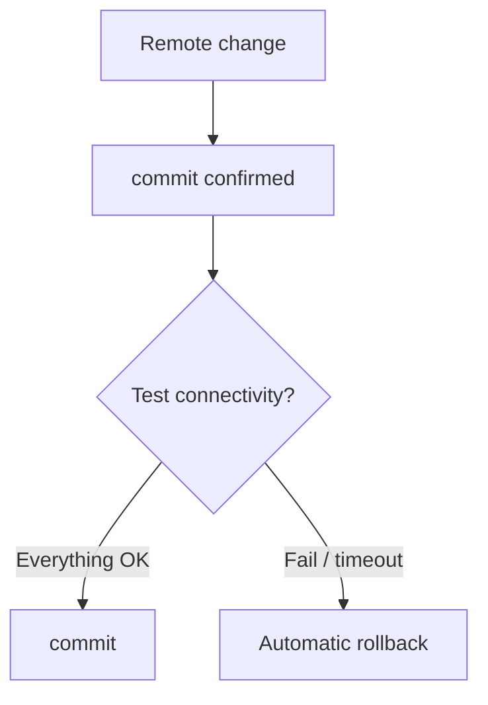

Useful when a configuration mistake could disconnect you from a remote device.

---

# 7. Managing Junos Devices

Junos supports multiple management methods.

### Traditional

|Method|Best suited for|
|---|---|
|**CLI**|Powerful administration, complex configuration|
|**J-Web GUI**|Simple administration and smaller deployments|

### Programmatic / Automation

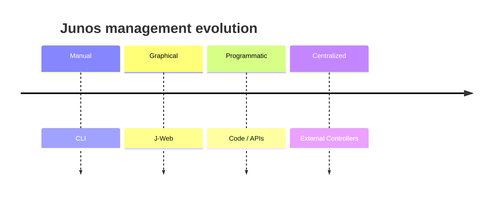

Junos can be managed through:

- APIs
    
- Python
    
- Automation frameworks
    
- External controllers
    

---

# 8. On-Box vs Off-Box Automation

### On-Box Scripts

Code is stored **on the Junos device** and can run automatically.

Useful for:

- Device health checks
    
- Configuration/status checks
    
- Automated actions based on conditions
    

### Off-Box Scripts

Code runs **outside the Junos device**.

Advantages:

- Can use different programming languages/tools.
    
- Can manage many devices.
    
- Suitable for centralized automation.
    

Example from the module:

```python
from jnpr.junos import Device

with Device(host="router1") as dev:
    print(dev.facts)
```

`jnpr.junos` / **PyEZ** provides Python-based interaction with Junos devices.

---

# 9. External Controllers

External platforms can provide **single-pane-of-glass management** for many Junos devices.

Examples mentioned:

- Mist
    
- Apstra
    
- Paragon Pathfinder
    
- Ansible
    
- Puppet
    
- Chef
    
- SaltStack
    

### Concept

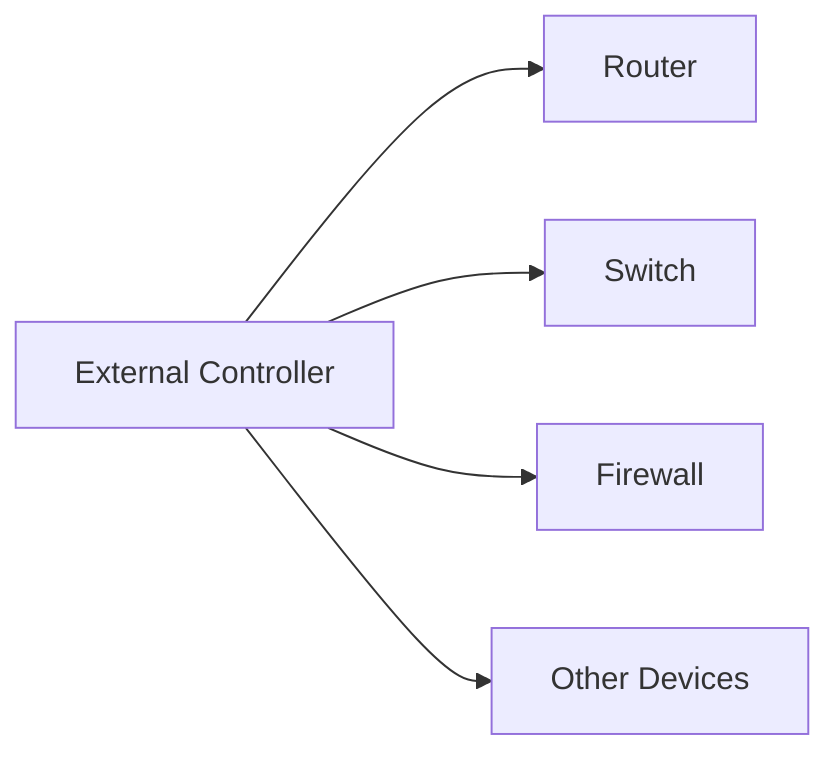

Instead of individually managing hundreds/thousands of devices, automation can manage them centrally.

---

# 10. Junos Software Architecture

Junos is designed as a **modular OS**.

- Composed of multiple independent processes.
    
- If one process fails, other processes can continue operating.
    
- Improves resiliency.
    

### Control / Forwarding separation


Traffic processing and routing/control functions are separated, improving stability and performance.

---

# 11. Juniper Device Types

Two broad categories:

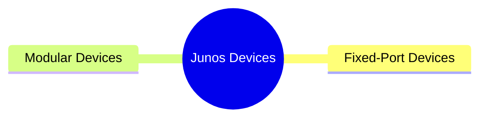

---

## 12. Fixed-Port Chassis

### Characteristics

- Network interfaces are **built directly into the chassis**.
    
- Best when the required port types/counts are already known.
    
- Common in:
    
    - Enterprise networks
        
    - Service-provider networks
        
    - Data centers
        

Example from module:

**MX204 Universal Router**

### Port example

The MX204 shown contains:

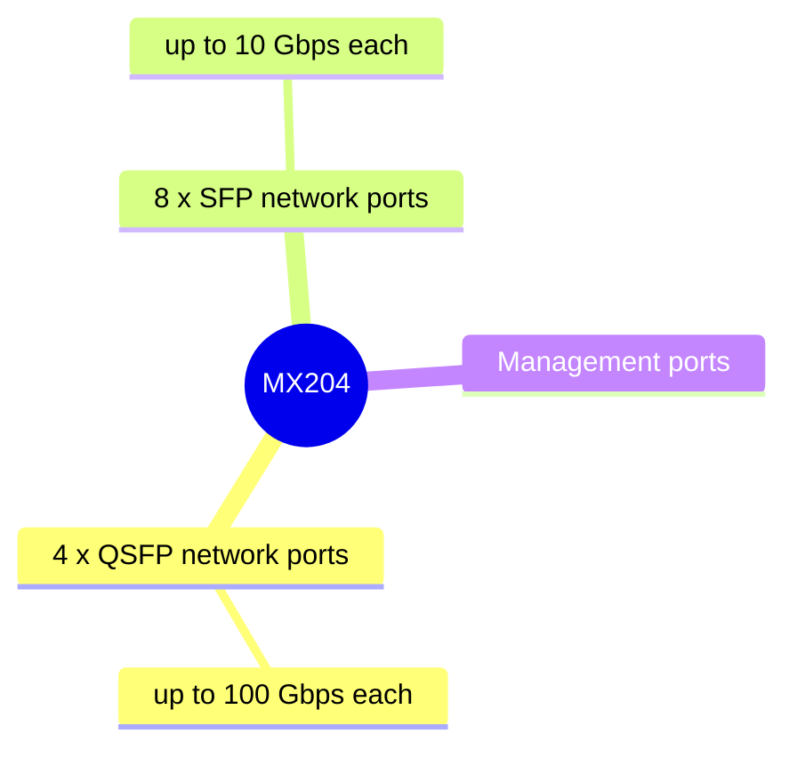

---

# 13. Modular Chassis

### Characteristics

- Contains multiple **empty slots**.
    
- Network interfaces are added using **line cards**.
    
- Allows hardware customization.
    
- Suitable for high-throughput and large-scale environments.
    

Example:

**MX480 Universal Router**

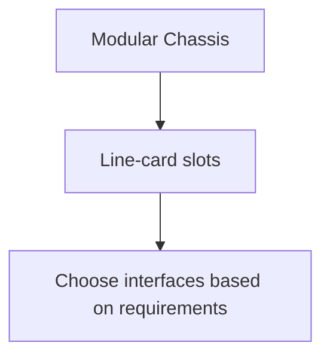

---

# 14. Line Cards

Each line-card slot has a number.

The slot numbering contributes to the interface naming scheme.

Line cards may provide:

- Network interfaces for transit traffic
    
- Additional features such as security services
    
- Slots that host smaller interface cards
    

### Modular advantage

You can choose the required line cards instead of being limited to permanently installed ports.

---

# 15. Modular Chassis Redundancy

A major advantage of modular platforms is **redundancy**.

Example:


- Spare Routing Engine (RE) can be installed.
    
- REs can be replaced/swapped to improve availability.
    
- Supports more resilient network operation.
    

---

# 16. Juniper Product Families

The module introduces several Juniper product ranges.

### Main ranges

|Product|General role|
|---|---|
|**MX**|High-performance routers|
|**PTX**|High-speed/core routing|
|**ACX**|Aggregation/access routing|
|**SRX**|Security/firewall platforms|

Other products mentioned include:

- EX/QFX switches
    
- Mist Wi-Fi
    
- Paragon Automation
    
- SSR/NFX SD-WAN
    
- Apstra
    
- Marvis
    

---

# 17. MX Routers

**MX** routers are high-performance, feature-rich Juniper routers.

Characteristics:

- Large routing/MAC scale
    
- Fast forwarding
    
- Many protocols can operate simultaneously
    
- Built-in security capabilities
    
- Common at network edges and other high-capacity roles
    

### Typical role

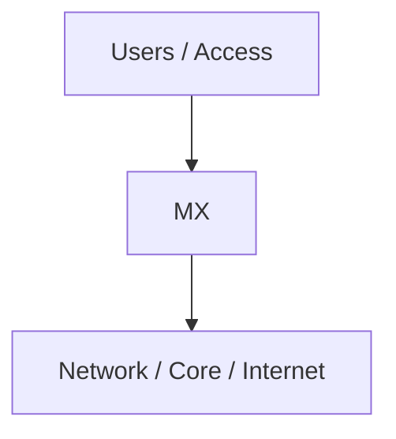

---

# 18. PTX Routers

**PTX** routers are designed primarily for high-performance network cores.

Characteristics:

- Popular in large network cores.
    
- Traditionally optimized for:
    
    - Speed
        
    - Very fast forwarding
        
    - Large-scale routing
        
- Modern PTX platforms provide extensive routing and packet-processing capabilities.
    

### Typical placement

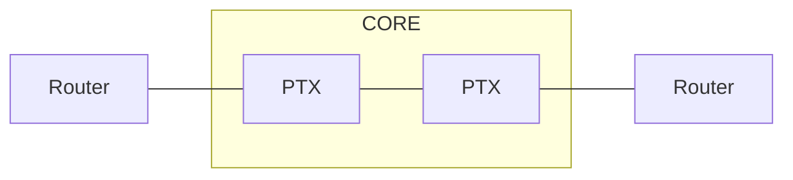

---

# 19. ACX Routers

**ACX** routers are commonly used for **aggregation**.

They aggregate many connections into fewer high-capacity links.

Example:

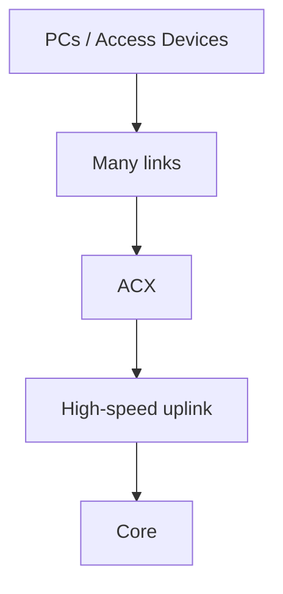

Common use cases:

- Campus aggregation
    
- Service-provider aggregation
    
- Network edge/aggregation
    

---

# 20. SRX Firewalls

**SRX** platforms provide hardware-based security services.

Capabilities include:

- Firewalling
    
- Advanced traffic filtering
    
- Application visibility/control
    
- Security services
    
- VPN/security functions
    

SRX platforms range from smaller devices to large service-gateway systems.

---

# 21. SRX + Advanced Threat Prevention

SRX can integrate with **Advanced Threat Prevention (ATP)** services.

Features mentioned:

- Anti-malware
    
- Traffic insights
    
- Threat profiling
    
- DNS security
    

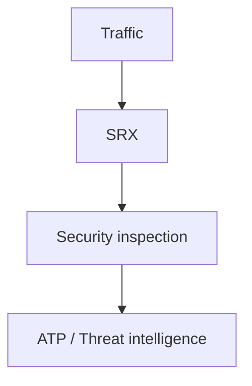

---

# 22. Virtual Junos OS

Junos is also available as a **virtual appliance**.

Useful environments:

- Cloud environments
    
- Virtual labs
    
- Software-based networking
    
- Testing/learning
    

Examples of cloud environments mentioned:

- AWS
    
- Azure
    

The module also introduces:

**vMX** → virtual MX router.

The latest virtual switching platform mentioned is **Junos vSwitch**.

---

# Quick Revision Cheat Sheet

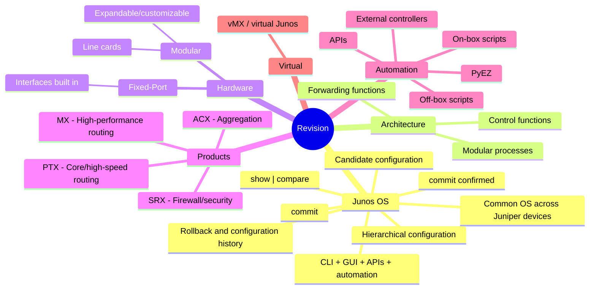

### High-Value Facts

- **CLI** → powerful/fast administration.
    
- **J-Web** → GUI-based management.
    
- **Candidate config** → changes before activation.
    
- **`show | compare`** → review pending changes.
    
- **`commit`** → activate candidate configuration.
    
- **`commit confirmed`** → protects against remote lockout.
    
- **Rollback** → return to earlier configuration.
    
- **Fixed-port** → interfaces built into chassis.
    
- **Modular** → line cards can be added/replaced.
    
- **MX** → powerful routing.
    
- **PTX** → high-speed/core routing.
    
- **ACX** → aggregation.
    
- **SRX** → firewall/security.
    
- **PyEZ** → Python automation for Junos.
    
- **On-box** → script runs on device.
    
- **Off-box** → script runs externally.
    
- **vMX** → virtual MX router.