# JNCIA-Junos — Routing Engine, Packet Forwarding Engine & Traffic Types

# 1. Junos Architecture — Big Picture

Junos separates device functions into two major planes:

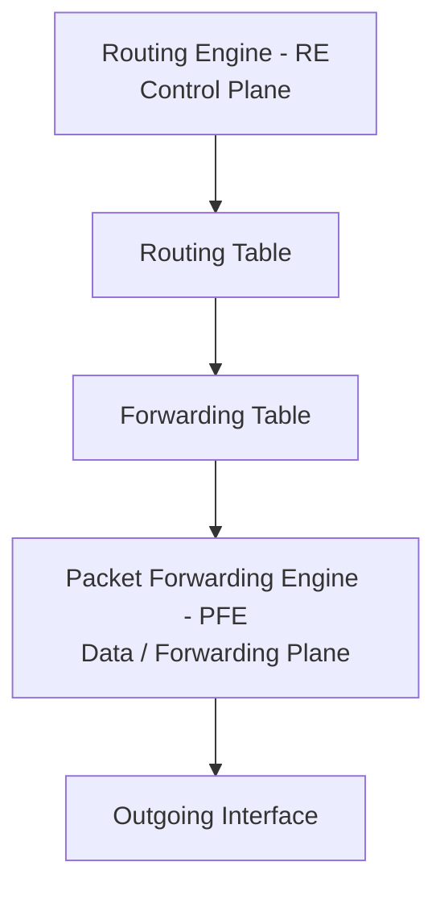

|Component|Main role|
|---|---|
|**Routing Engine (RE)**|Control plane, routing decisions, management|
|**Packet Forwarding Engine (PFE)**|Data plane, high-speed packet forwarding|

### Simple mental model

```text
RE = Brain
PFE = Muscle
```

---

# 2. Routing Engine (RE)

The Routing Engine is essentially a **general-purpose computer** inside the Junos device.

It contains:

- CPU
    
- Memory
    
- Junos OS
    
- System processes
    

Unlike specialized forwarding hardware, the RE uses a **general-purpose CPU** and performs many different tasks.

---

# 3. RE Responsibilities

The module divides RE responsibilities into system/management and routing/forwarding functions.

### System & management

The RE runs and maintains:

- Junos OS itself
    
- Junos processes
    
    - Routing
        
    - Chassis management
        
    - DHCP
        
    - Interfaces
        
    - Other system processes
        
- Chassis/system management
    
    - Fans
        
    - Power
        
    - Cooling
        
    - Line cards
        
- Management traffic
    
    - CLI
        
    - J-Web
        
    - External platforms
        
    - User-generated management traffic
        
- Responses to:
    
    - `ping`
        
    - `traceroute`
        

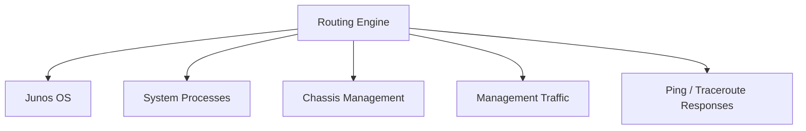

---

# 4. RE Routing Responsibilities

The RE also handles routing/control-plane functions:

- Runs routing protocols.
    
- Maintains routing tables.
    
- Selects active routes.
    
- Installs active routes into the forwarding table.
    
- Writes the forwarding table toward the forwarding hardware.
    

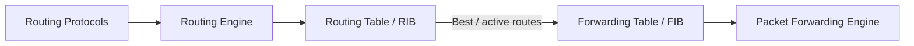

### Important

The RE **does not normally process transit traffic**.

Transit traffic is handled by the PFE.

---

# 5. Routing Table → Forwarding Table

The RE maintains the routing table containing routing information.

It:

1. Learns routes.
    
2. Maintains routes.
    
3. Chooses the active/best routes.
    
4. Installs active routes into the forwarding table.
    
5. Sends the forwarding information to the PFE.
    

```text
Routing Table
     ↓
Select active routes
     ↓
Forwarding Table
     ↓
PFE
     ↓
Packet forwarding
```

---

# 6. RIB vs FIB

### RIB — Routing Information Base

The routing table contains:

- Prefixes learned from different protocols.
    
- Protocol-specific information.
    
- Potentially many routes for the same destination.
    

### FIB — Forwarding Information Base

The forwarding table contains:

- Only the routes needed for forwarding.
    
- The selected/best forwarding information.
    
- Outgoing interface / forwarding information.
    

|RIB|FIB|
|---|---|
|Routing Information Base|Forwarding Information Base|
|More complete|Optimized for forwarding|
|Contains protocol information|Contains forwarding information|
|Can contain many routes|Contains selected/best routes|
|Maintained by RE|Used by PFE|

---

# 7. Route Selection vs Forwarding

The RE performs the decision-making:

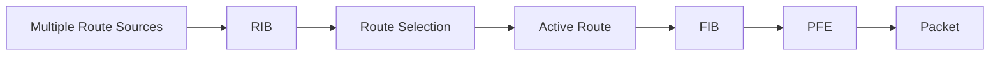

### Important JNCIA point

**Route preference is used to select between routes from different protocols.**

But **longest-prefix matching happens when forwarding traffic**.

```text
Routing decision:
    Which route becomes active?

Forwarding decision:
    Which FIB entry matches this destination?
```

---

# 8. Forwarding Table Contents

The forwarding table broadly needs information such as:

- Destination prefix
    
- Outgoing interface
    
- Next-hop forwarding information
    
- Other hardware-forwarding information
    

It does **not need to retain all protocol-specific information** contained in the RIB.

For example:

```text
RIB:
10.0.0.0/8 → BGP
10.0.0.0/8 → OSPF
10.0.0.0/8 → Static

        ↓ route selection

FIB:
10.0.0.0/8 → selected forwarding path
```

---

# 9. PFE — Packet Forwarding Engine

The PFE is the **data-plane engine** responsible for high-speed packet forwarding.

```text
                   CONTROL PLANE
                  ┌──────────────┐
                  │      RE      │
                  │ Routing      │
                  │ Engine       │
                  └──────┬───────┘
                         │
                    Forwarding
                      Table
                         │
                         ▼
                   DATA PLANE
                  ┌──────────────┐
Packet ──────────►│     PFE      │────────► Packet
                  │ Forwarding   │
                  │ Engine       │
                  └──────────────┘
```

---

# 10. PFE Hardware

On almost all Junos platforms, the PFE is implemented using **dedicated hardware**.

The PFE commonly uses:

> **ASIC — Application-Specific Integrated Circuit**

ASICs are designed for a relatively narrow set of tasks and can perform those tasks extremely efficiently.

### Key idea

```text
General CPU
→ Flexible, many tasks

ASIC
→ Specialized, extremely fast
```

---

# 11. PFE ASIC Examples

The module shows Juniper-developed forwarding chips such as:

- **Express Chip** — found on PTX routers
    
- **Trio Chip** — found on MX routers
    

Some devices may contain **multiple PFE ASICs**.

Each ASIC can have:

- Its own forwarding-table copy.
    
- Dedicated bandwidth/resources.
    

Some smaller branch-office devices can use a **software-based PFE**.

---

# 12. PFE Responsibilities

The PFE has a relatively small number of responsibilities but performs them extremely efficiently.

### Main tasks

1. Look up and forward incoming traffic.
    
2. Manipulate packet information.
    
3. Control services affecting traffic.
    
4. Report traffic/environmental information to the RE.
    
5. Send exception traffic to the RE.
    

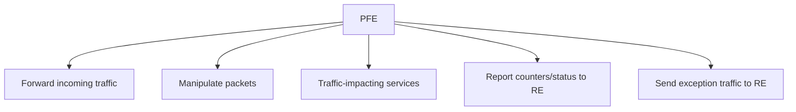

---

# 13. Packet Manipulation

The PFE can manipulate packet information such as:

- Ethernet headers
    
- VLAN tags
    
- TTL
    
- Hop Limit
    

For example:

```text
IPv4 → TTL
IPv6 → Hop Limit
```

A router forwarding a packet normally decrements TTL/Hop Limit.

---

# 14. Traffic-Control Services

The PFE can handle services that affect packet traffic, including:

- Rate limiting
    
- Policing
    
- Firewall filters
    
- Traffic prioritization
    

This allows many traffic operations to occur directly in the forwarding path rather than requiring the RE to process every packet.

---

# 15. Traffic Counters & Environmental Status

The PFE reports information to the RE, such as:

- Traffic counters
    
- Environmental status
    

The RE can therefore monitor the forwarding hardware without processing every transit packet itself.

---

# 16. Exception Traffic

Some packets cannot simply be forwarded using the normal FIB path.

The PFE sends such traffic toward the RE for additional processing.

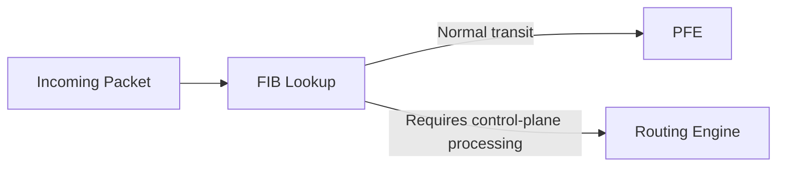

This is called **exception traffic**.

---

# 17. Control Plane vs Data Plane

### Control Plane

In Junos, the **control plane** refers conceptually to the Routing Engine.

Examples:

- OSPF processing
    
- Routing protocols
    
- SSH
    
- Management traffic
    
- Route calculation
    

### Data / Forwarding Plane

The **data plane** refers conceptually to the PFE.

Examples:

- Transit packet forwarding
    
- Packet lookup
    
- Packet modification
    
- Traffic filtering/policing
    

|Control Plane|Data Plane|
|---|---|
|RE|PFE|
|Routing decisions|Packet forwarding|
|Routing protocols|FIB lookup|
|Management|Transit traffic|
|General-purpose CPU|Specialized hardware|
|Control information|Actual packet forwarding|

---

# 18. Control Plane and Data Plane Separation

The RE and PFE are **separate infrastructure**, connected by an internal link.

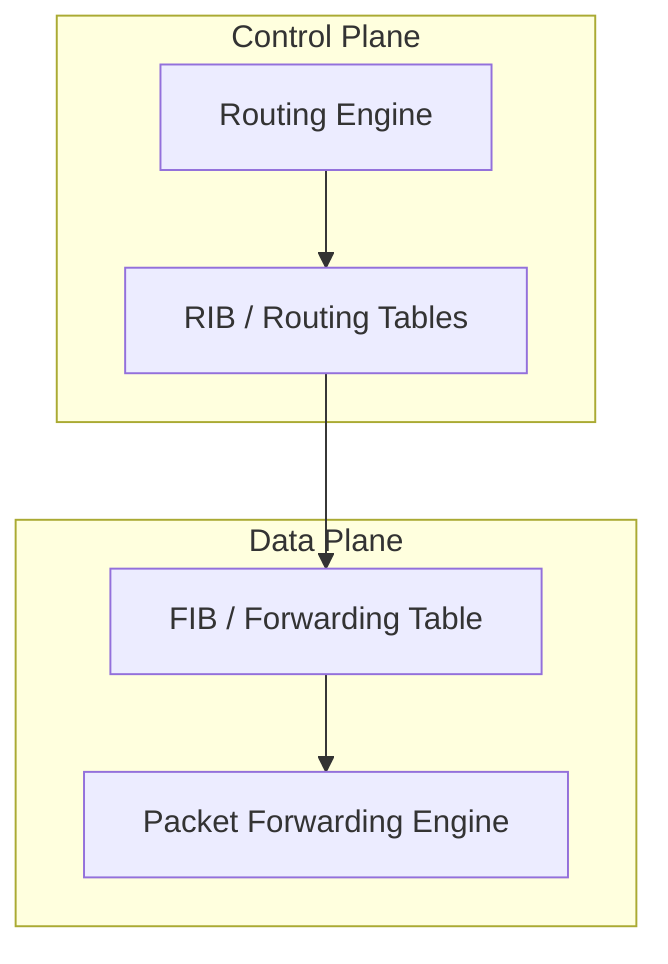

This separation is one of the fundamental design characteristics of Junos architecture.

---

# 19. Why Separate RE and PFE?

### 1. Forwarding can continue during RE problems

If the RE crashes, the PFE may be able to continue forwarding traffic using its local forwarding table.

```text
RE failure
   ↓
PFE still has forwarding information
   ↓
Transit forwarding may continue
```

### 2. Hardware can be optimized independently

The RE and PFE hardware can be designed for their respective jobs.

- RE → general-purpose processing
    
- PFE → high-speed packet processing
    

### 3. Hardware upgrades can be independent

The forwarding and control-plane hardware can potentially be upgraded independently.

### 4. Internal-link protection

Junos can provide filtering/rate-limiting protections on the internal RE↔PFE link to help protect the control plane from denial-of-service conditions.

---

# 20. Historical Context

The module highlights Juniper's **M40 router** as an early example of separating the control and forwarding planes.

This architecture became an important characteristic of modern professional networking devices.

```text
Old architecture:
CPU involved heavily in packet forwarding
        ↓
Limited forwarding performance

Separated architecture:
RE → decisions
PFE → forwarding
        ↓
High-speed specialized forwarding
```

---

# 21. Exact Meaning of PFE

The term **PFE** can be understood broadly and specifically.

### Broad meaning

The collection of hardware responsible for forwarding traffic, distinct from the Routing Engine.

### Specific meaning

A device may have individual **PFE ASICs**.

For example:

```text
Device
 ├── RE
 └── PFE
      ├── ASIC 1
      ├── ASIC 2
      └── ASIC 3
```

Therefore, saying a device has "multiple PFEs" may refer to multiple forwarding ASICs depending on the platform/context.

---

# 22. Line Card CPU

On modular devices, a **line card CPU** can perform certain processing.

The module describes the line-card CPU as critical infrastructure that:

- Sends counters/status to the RE.
    
- Installs the forwarding table into the PFE.
    

Example architecture:

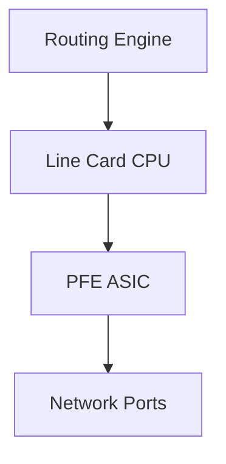

A line-card CPU is therefore different from the main Routing Engine.

---

# 23. Transit Traffic

**Transit traffic** is traffic that **passes through the networking device**.

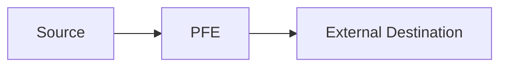

The packet enters through one network interface and exits through another.

### Key characteristic

Transit traffic is normally processed by the **forwarding plane/PFE**, not the RE.

---

# 24. Exception Traffic

Exception traffic requires **additional processing by the device itself**.

It may be sent toward the RE or, on some platforms, processed by a line-card CPU.

Examples from the module:

### Host-inbound traffic

Traffic destined **to the device itself**.

Examples:

- SSH
    
- Telnet
    
- Protocol messages
    
    - OSPF
        
    - BGP
        
- Ping
    
- ARP / Neighbor Discovery
    
- SNMP
    

### Host-outbound traffic

Traffic generated **by the device**, destined for an external destination.

Examples include packets generated by device processes.

---

# 25. Transit Packets with Exceptional Conditions

A packet can normally be transit traffic but require additional processing because of an exceptional condition.

Examples:

- **TTL exceeded**
    
- IPv4 Time-to-Live exceeded
    
- IPv6 Hop Limit exceeded
    
- IP options
    
- Router Alert
    
- Other ICMP-triggering conditions
    
- Destination Unreachable conditions
    

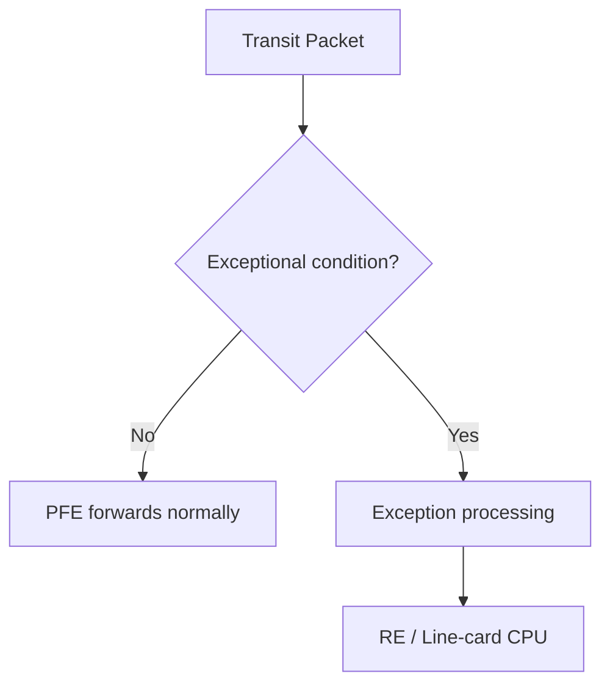

---

# 26. Host-Inbound vs Host-Outbound

|Type|Meaning|Examples|
|---|---|---|
|**Host-inbound**|Traffic destined to the Junos device|SSH, BGP, OSPF, Ping|
|**Host-outbound**|Traffic generated by device toward another destination|Device-generated packets|
|**Transit**|Traffic passing through the device|Routed packets|
|**Exception**|Traffic requiring extra processing|TTL exceeded, special IP options|

---

# 27. What Is NOT Exception Traffic?

The module explicitly identifies two categories that should **not** be classified as exception traffic.

### Normal transit traffic

```text
Ingress interface
      ↓
PFE
      ↓
Egress interface
```

It is processed entirely by the forwarding plane.

### Internal control packets between line-card CPU and RE

These may carry:

- Forwarding-table updates
    
- Statistics
    
- Logs
    
- Other infrastructure/control information
    

These are internal device communication and aren't normally classified as exception traffic.

---

# 28. Line-Card CPU Exception Processing

Some Junos platforms allow certain exception traffic to be processed by a **local line-card CPU**.

This reduces load on the central RE.

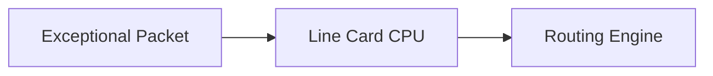

### Why useful?

It can reduce the amount of traffic that needs to reach the central control plane.

The module notes that this knowledge is especially useful for **advanced troubleshooting**.

---

# 29. TTL Example

Consider:

```text
Host A → Router → Router → Host B
```

Every router decrements IPv4 TTL / IPv6 Hop Limit.

If TTL reaches zero:

```text
Packet
  ↓
TTL expired
  ↓
Exception processing
  ↓
ICMP Time Exceeded
```

The packet can therefore transition from normal transit processing to exception processing.

---

# 30. Control-Plane Firewall

Control-plane protection can restrict what traffic is allowed to reach the Routing Engine.

Example policy concepts from the module:

- Deny protocol packets from unconfigured neighbors.
    
- Rate-limit traffic.
    
- Rate-limit potential DoS sources.
    
- Permit SSH only from trusted sources.
    

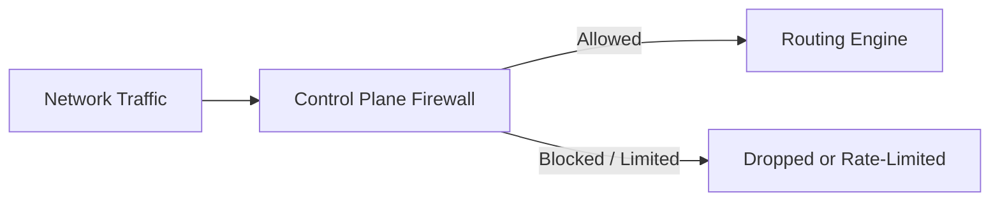

### Security purpose

The RE is a valuable control-plane resource. Excessive traffic directed toward it can consume CPU and affect routing/management functions.

---

# 31. Exception Traffic and Troubleshooting

Understanding exception traffic helps answer:

- Why did this packet reach the RE?
    
- Why is RE CPU increasing?
    
- Which traffic is being processed by a line-card CPU?
    
- Why is a packet being monitored on the RE-PFE internal link?
    
- Could control-plane filtering be blocking expected traffic?
    

The module specifically connects this concept to **advanced troubleshooting**.

---

# 32. Complete Packet Path

### Normal transit packet

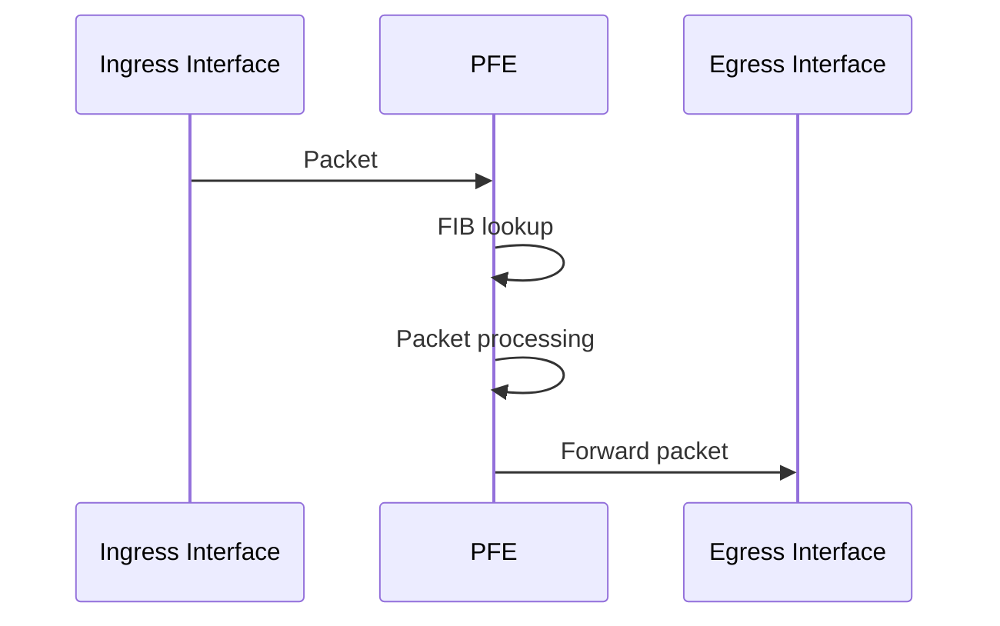

### Exception packet

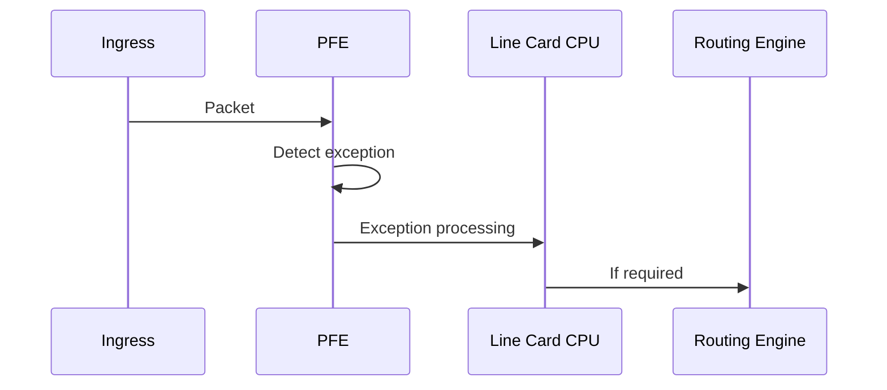

---

# 33. RE vs PFE — Final Comparison

|Function|RE|PFE|
|---|:-:|:-:|
|Run Junos OS|✅|❌|
|Routing protocols|✅|❌|
|Maintain RIB|✅|❌|
|Select active routes|✅|❌|
|Build forwarding information|✅|❌|
|High-speed transit forwarding|❌|✅|
|FIB lookup|❌*|✅|
|Packet manipulation|❌*|✅|
|Firewall/policing in forwarding path|❌*|✅|
|Management traffic|✅|❌|
|Ping response processing|✅|❌|
|Exception handling|Sometimes|✅|
|General-purpose CPU|✅|❌|
|ASIC-based|❌|✅|

`*` Conceptually, the RE provides the control information; the PFE performs the actual forwarding-plane operation.

---

# 34. Exam Traps

- **RE = control plane**
    
- **PFE = forwarding/data plane**
    
- RE is a **general-purpose computer**.
    
- PFE commonly uses **ASICs**.
    
- RE maintains the **RIB**.
    
- PFE uses the **FIB**.
    
- RE selects active routes.
    
- RE installs forwarding information into the forwarding plane.
    
- **Transit traffic does not normally go through the RE.**
    
- PFE can continue forwarding using its local forwarding table during certain RE failures.
    
- Exception traffic requires additional processing.
    
- Traffic destined to the device = **host-inbound**.
    
- Traffic generated by the device = **host-outbound**.
    
- TTL/Hop Limit expiration can generate exception processing.
    
- Control-plane firewall protects traffic reaching the RE.
    
- `RIB` contains more routing/protocol information.
    
- `FIB` contains information required for actual forwarding.
    
- PFE may have its own copy of the forwarding table.
    
- Some platforms have multiple PFE ASICs.
    
- Some smaller platforms may use a software-based PFE.
    

---

# 35. JNCIA Mental Model

```text
                    JUNOS DEVICE
                         │
             ┌───────────┴───────────┐
             │                       │
       CONTROL PLANE             DATA PLANE
             │                       │
             ▼                       ▼
            RE                      PFE
      Routing Engine       Packet Forwarding Engine
             │                       │
       General CPU              ASIC / Hardware
             │                       │
       ┌─────┴─────┐                 │
       │           │                 │
   Routing       Management          │
   protocols       CLI               │
       │                             │
       ▼                             ▼
      RIB ──────► FIB ───────────► Packet
                                  forwarding
```

### One-line revision

> **RE decides what should happen; PFE performs packet forwarding at high speed.**