# JNCIA-Junos — FreeBSD, Junos OS Daemons & Junos OS Evolved

## 1. FreeBSD and Junos OS

### Kernel vs Shell

An operating system can be viewed as two major conceptual layers:

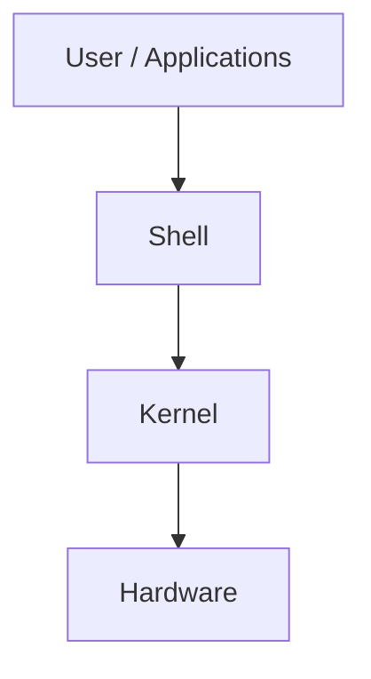

### Kernel

The **kernel** is the core software that powers the OS.

Responsibilities include:

- Device drivers
    
- Disk / memory / keyboard / USB management
    
- Memory allocation
    
- Process management
    

### Shell

The **shell** provides a way to interact with the kernel.

It can technically include graphical interfaces, but in Junos the important interface is the **command-line interface**.

---

# 2. Junos OS and FreeBSD

Junos OS is based on the **FreeBSD kernel**.

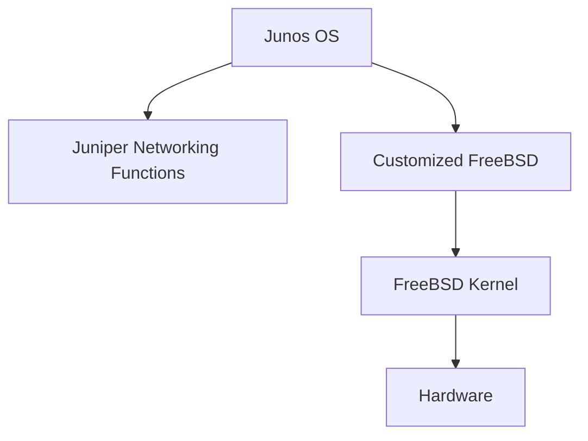

### Why use FreeBSD?

Instead of developing an entire OS kernel from scratch:

- FreeBSD provides a mature open-source Unix-like foundation.
    
- Juniper adds networking functionality on top.
    
- Juniper customizes FreeBSD for purpose-built networking performance.
    

### Key point

> **FreeBSD provides the underlying OS architecture; Junos provides Juniper's networking functionality.**

---

# 3. FreeBSD Shell Access

Junos provides access to a Juniper-customized FreeBSD shell.

The `root` user enters this shell automatically in the Unix environment.

Example:

```bash
pwd
cd /var/log
ls -la
```

The shell is useful for:

- Advanced troubleshooting
    
- Examining files/logs
    
- Advanced system investigation
    
- Some advanced PFE-related commands
    

### Operational Junos → FreeBSD shell

```bash
start shell
```

### Return to Junos CLI

```bash
cli
```


### Exam trap

`start shell` **does not** display the FreeBSD version.

It provides access to the underlying shell.

---

# 4. FreeBSD Version and Junos Upgrades

Each Junos OS version is based on a particular FreeBSD version.

Example versions shown in the module:

|FreeBSD|Example Junos era|
|---|---|
|FreeBSD 6|Early Junos|
|FreeBSD 10|2015-era Junos|
|FreeBSD 11|2017-era Junos|
|FreeBSD 12|2021-era Junos|

The exact mapping is not something the module expects you to memorize.

### Why it matters

During a Junos upgrade:

- The underlying FreeBSD version can change.
    
- Junos file naming conventions may change.
    
- Downgrading may not always be possible after moving between underlying FreeBSD generations.
    
- Some FreeBSD versions differ enough that very old → very new Junos transitions may not be directly supported.
    

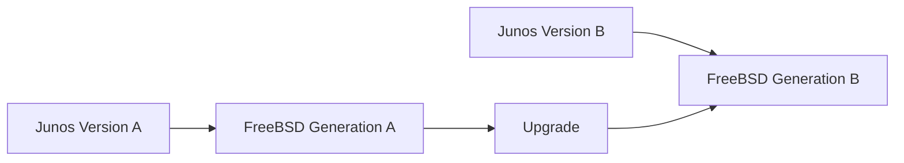

### Practical rule

> Before major Junos upgrades/downgrades, check the supported upgrade path rather than assuming arbitrary version jumps are possible.

---

# 5. Junos OS Daemons

A **daemon** is a background process that performs a particular function.

Junos is **not one giant application**.

Instead, functionality is divided into multiple independent processes/daemons.

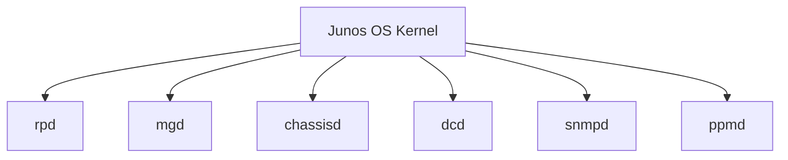

### Important properties

- Each daemon has its own protected memory space.
    
- A daemon failure should not automatically crash every other daemon.
    
- Daemons can generally be restarted independently.
    
- This provides **fault isolation**.
    

---

# 6. Modular vs Monolithic OS

### Junos — Modular

```text
Kernel
 ├── Routing daemon
 ├── Management daemon
 ├── Chassis daemon
 ├── Interface daemon
 ├── SNMP daemon
 └── Other daemons
```

Each function runs as a separate process.

### Traditional monolithic model

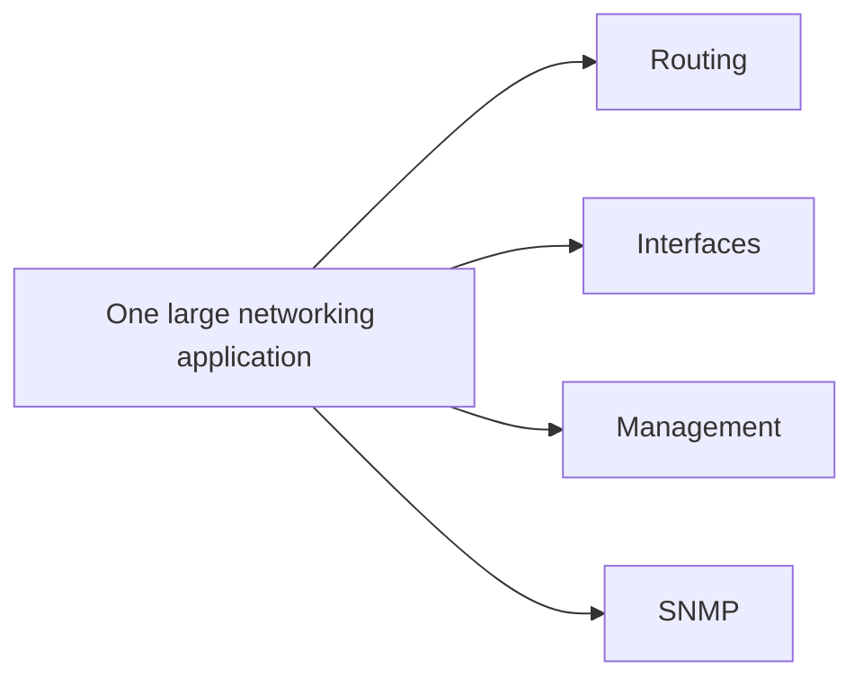

If a major component crashes in a tightly integrated monolithic architecture, it can potentially affect the entire system.

### Junos modular advantage

```text
Daemon failure
      ↓
Fault isolated
      ↓
Other daemons continue
      ↓
Failed daemon can be restarted
```

---

# 7. Daemon Naming

Many Junos daemons end with:

```text
d
```

Examples:

```text
rpd
mgd
chassisd
dcd
snmpd
ppmd
```

The suffix is a useful clue that you're looking at a daemon/process.

---

# 8. `rpd` — Routing Protocol Daemon

**`rpd` = Routing Protocol Daemon**

Responsibilities:

- Controls routing.
    
- Maintains routing tables.
    
- Determines active routes.
    
- Installs forwarding information into the RE/PFE forwarding table.
    
- Runs routing protocols.
    

Examples of protocols handled through `rpd` include:

- OSPF
    
- BGP
    
- IS-IS
    
- RIP
    
- Other routing protocols
    

Each routing protocol runs as a separate task within `rpd`.

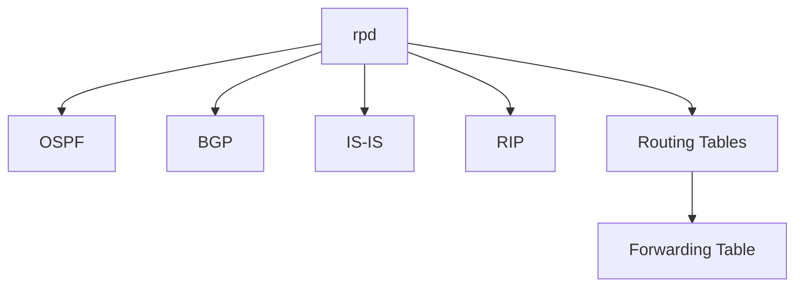

### Remember

> **`rpd` = routing brain/process**

---

# 9. `mgd` — Management Daemon

**`mgd` = Management Daemon**

Controls management functionality.

It provides the interface between:

- CLI
    
- Scripts
    
- External management platforms
    
- Underlying Junos architecture
    

It also:

- Processes configuration changes.
    
- Verifies configuration validity before commit.
    

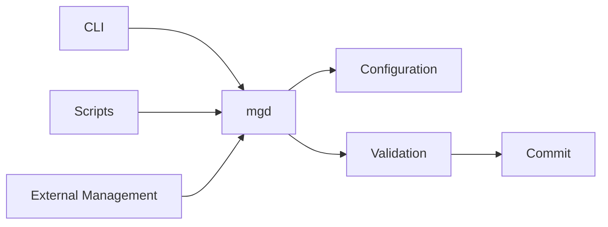

### Remember

> **`mgd` = management/configuration brain**

---

# 10. `dcd` — Device Control Daemon

**`dcd` = Device Control Daemon**

Responsibilities:

- Sends physical interface configuration to ports.
    
- Allows configuration of ports that do not yet exist in the current hardware state.
    

Conceptually:

```text
Configuration
     ↓
dcd
     ↓
Physical interfaces / ports
```

This is particularly relevant to modular hardware where interfaces can exist as configuration before hardware is present.

---

# 11. `chassisd` — Chassis Daemon

**`chassisd` = Chassis Daemon**

Controls and monitors chassis-related functionality.

Responsibilities include:

- Chassis alarms
    
- Electrical/power systems
    
- Fans
    
- Hardware health
    
- Hardware inventory database
    
- Coordination with other daemons for:
    
    - Alarms
        
    - Front-panel LEDs
        
    - Other chassis-related functions
        

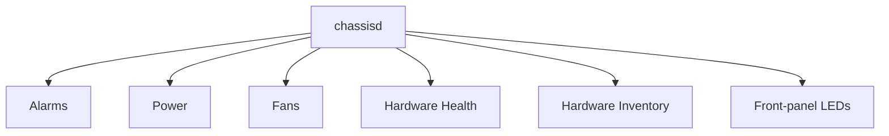

### Remember

> **`chassisd` = physical hardware/chassis management**

---

# 12. `snmpd` — SNMP Daemon

**`snmpd` = Simple Network Management Protocol Daemon**

It generates SNMP messages that can be sent to external monitoring systems.


Used for:

- Network monitoring
    
- Device statistics
    
- External management/monitoring platforms
    

---

# 13. `ppmd` — Periodic Packet Management Daemon

`ppmd` enables the line-card CPU to handle some tasks that would otherwise need to be performed by the Routing Engine.

The module gives examples involving:

- OSPF Hello processing
    
- LACP
    
- BFD
    

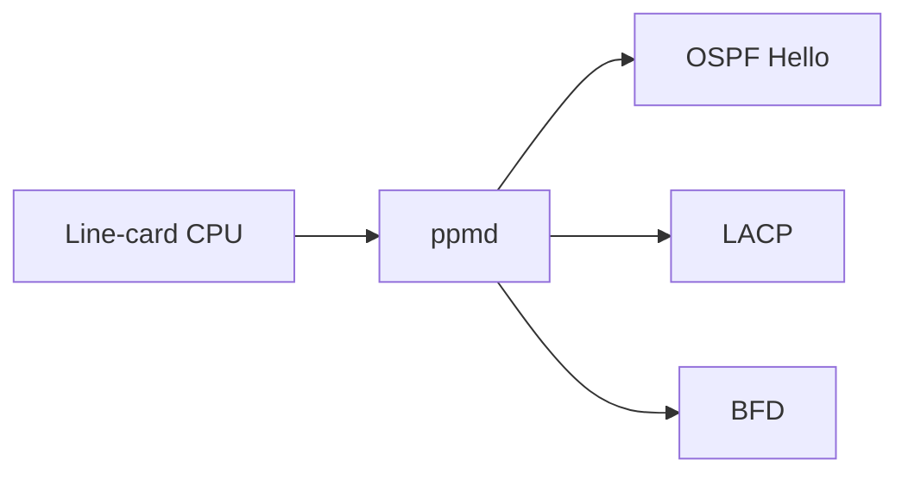

### Why useful?

It can reduce work sent to the central Routing Engine.

---

# 14. Important Daemons Cheat Sheet

|Daemon|Main function|
|---|---|
|**`rpd`**|Routing protocols / routing tables|
|**`mgd`**|Management / CLI / configuration / validation|
|**`chassisd`**|Chassis, alarms, power, fans, hardware|
|**`dcd`**|Physical interface/device configuration|
|**`snmpd`**|SNMP monitoring messages|
|**`ppmd`**|Periodic packet processing / offloads some RE work|

### Easy memory

```text
rpd     → Routing
mgd     → Management
chassisd → Chassis
dcd     → Devices/interfaces
snmpd   → SNMP
ppmd    → Periodic packet processing
```

---

# 15. Viewing Daemons in Logs

Knowing daemon names helps filter log output.

Example:

```bash
show log messages
```

You may see entries containing:

```text
rpd
mgd
chassisd
dcd
snmpd
ppmd
```

You can filter output by daemon name:

```bash
show log messages | match rpd
```

or:

```bash
show log messages | match mgd
```

This is particularly useful for troubleshooting.

---

# 16. Junos OS Evolved

**Junos OS Evolved** is an alternative version of Junos OS.

It maintains a similar user-facing experience while changing major parts of the underlying architecture.

### Current module characteristics

The module states that Junos OS Evolved runs on some:

- QFX devices
    
- PTX devices
    
- ACX devices
    

---

# 17. Junos OS vs Junos OS Evolved

### From the user's perspective

They look very similar:

- CLI syntax is largely the same.
    
- Interfaces are configured similarly.
    
- Protocols are configured similarly.
    
- Features are configured/verified through the CLI in a familiar way.
    

### Under the hood

They are **significantly different**.

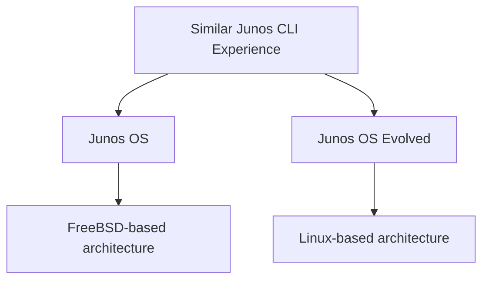

---

# 18. Key Junos OS Evolved Differences

The module highlights three major changes:

### 1. FreeBSD → Linux

Traditional Junos OS:

```text
FreeBSD kernel
```

Junos OS Evolved:

```text
Linux kernel
```

### 2. Hardware independence

Junos OS Evolved is **not tied to the underlying hardware** in the same way.

It can run on generic **whitebox** devices.

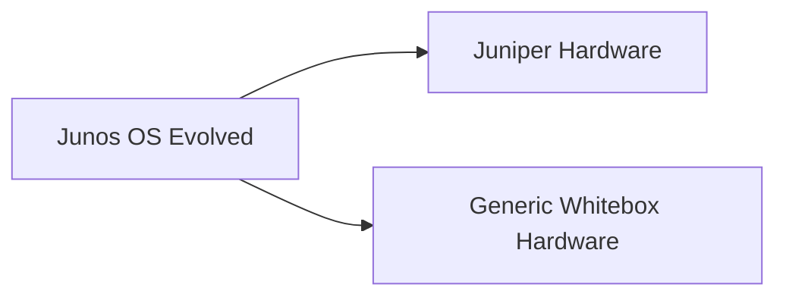

### 3. Third-party integration

Junos OS Evolved is designed to integrate more easily with **third-party applications**.

---

# 19. Junos OS Evolved Is More Than a New OS

The module describes Junos OS Evolved as a platform for **next-generation networking software**, rather than simply another traditional network OS.

It provides a network layer for a more modern software platform.

```text
Applications
     ↓
Junos OS Evolved
     ↓
Linux
     ↓
Hardware
```

---

# 20. Evolved Daemon Architecture

The daemon architecture is significantly different.

### Traditional Junos

Daemons remain closely connected with the Junos OS kernel.

```text
Junos daemon
      ↓
Junos kernel
```

### Junos OS Evolved

Daemons/processes behave more like **individual applications**.

They are less tightly coupled to the underlying kernel.

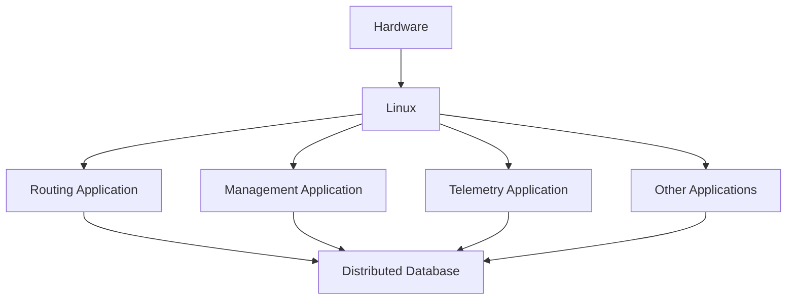

---

# 21. Daemons as Applications

In Junos OS Evolved:

- Functions are more like independent applications.
    
- Applications can be upgraded independently.
    
- Applications are less dependent on the underlying kernel.
    
- Applications can be restarted without necessarily losing their state.
    

This provides greater software modularity.

---

# 22. Distributed Database

Junos OS Evolved stores application state/data in a **distributed database**.

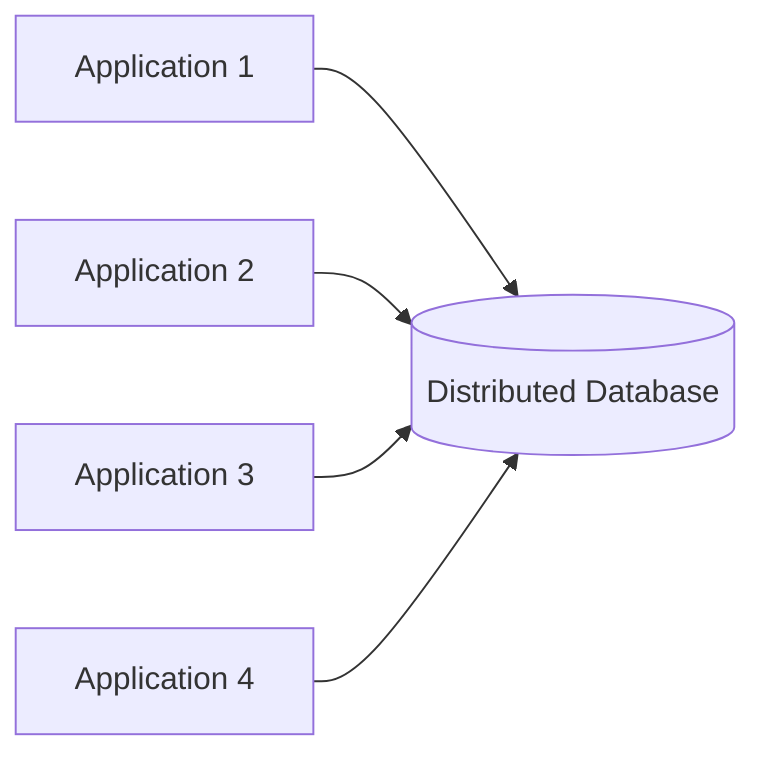

### Benefit

Applications can be restarted while their state remains available in the database.

```text
Application
    ↓
Restart
    ↓
Read state from distributed DB
    ↓
Continue operation
```

This is an important architectural difference from the traditional tightly coupled daemon model.

---

# 23. Traditional Junos vs Junos Evolved

|Feature|Junos OS|Junos OS Evolved|
|---|---|---|
|Base OS|FreeBSD|Linux|
|Architecture|Modular daemons|More application-oriented|
|Kernel coupling|More tightly integrated|More decoupled|
|Hardware dependency|Traditional purpose-built hardware|More hardware-independent|
|Whitebox support|Not the focus|Supported architecture|
|Third-party apps|More limited|Easier integration|
|Application upgrades|Traditional daemon model|More independent|
|State storage|Traditional Junos mechanisms|Distributed database|

---

# 24. Why Evolved Architecture Matters

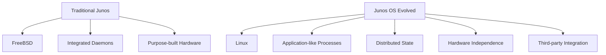

The architectural goal is greater:

- Modularity
    
- Hardware flexibility
    
- Application integration
    
- Independent software lifecycle
    
- Resilience
    

---

# 25. Check-Your-Understanding Answers

### Q1 — Traditional Junos daemons

**Correct:**

> Daemons run on top of the Junos OS kernel.

They do **not** run on a single shared memory space.

---

### Q2 — `chassisd`

Correct functions:

- Controls alarms, electrical supply and fans.
    
- Monitors hardware health.
    
- Maintains the hardware inventory database.
    

Not its primary role:

- Maintaining routing tables.
    

---

### Q3 — Junos Evolved daemon architecture

Correct characteristics:

- Daemons/processes are more like individual applications.
    
- They are less dependent on the underlying kernel.
    
- They can be upgraded independently.
    

---

### Q4 — Junos Evolved efficiency

Key differences:

- **FreeBSD → Linux**
    
- **Hardware-independent architecture**
    
- **Better third-party application integration**
    

---

# 26. Exam Traps

- **Junos OS is based on FreeBSD.**
    
- `start shell` → access the underlying FreeBSD shell.
    
- `cli` → return to Junos CLI.
    
- Kernel = core of OS.
    
- Shell = interface for interacting with kernel.
    
- Junos uses a **modular daemon architecture**.
    
- Daemons have separate protected memory spaces.
    
- One daemon failure does not necessarily crash all other daemons.
    
- `rpd` → routing.
    
- `mgd` → management/configuration.
    
- `chassisd` → chassis/hardware.
    
- `dcd` → physical device/interface configuration.
    
- `snmpd` → SNMP.
    
- `ppmd` → periodic packet processing/offload.
    
- Traditional Junos → **FreeBSD**.
    
- Junos OS Evolved → **Linux**.
    
- Junos Evolved processes behave more like **individual applications**.
    
- Junos Evolved supports stronger **hardware independence**.
    
- Junos Evolved is designed for easier **third-party application integration**.
    
- Evolved uses a **distributed database** for application state.
    
- Evolved applications can be restarted while retaining state from the database.
    

---

# 27. Final Mental Model

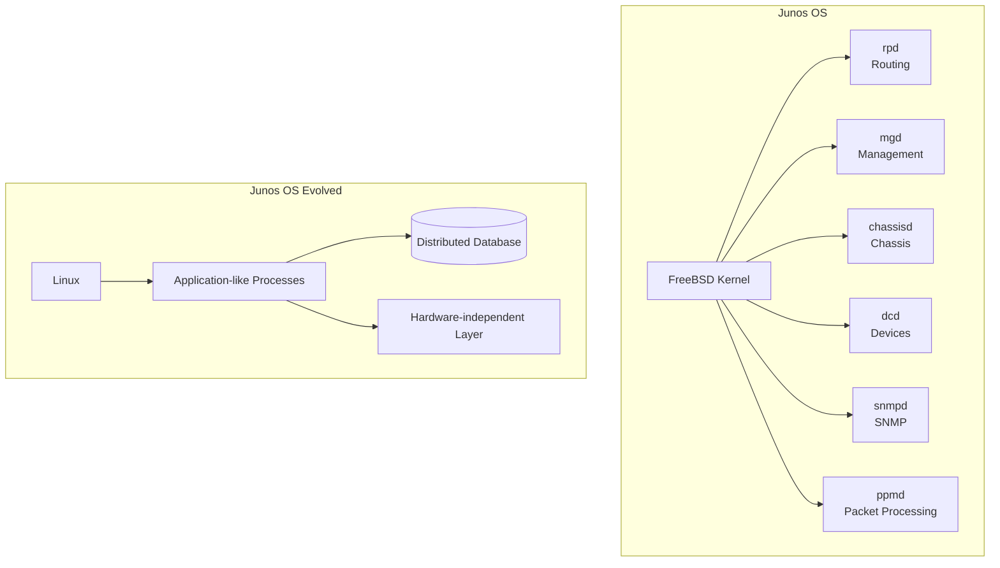

## One-line Revision

> **Traditional Junos = FreeBSD + modular daemons; Junos OS Evolved = Linux + more independent application-like processes + distributed state + greater hardware/third-party flexibility.**