# JNCIA-Junos — Logging, Troubleshooting & Monitoring

## 1. Syslog in Junos

**Syslog** is the industry-standard method for keeping logs on Unix/Linux-based devices.

Junos provides **two default syslog files**, and you can create additional custom log files.

### 3 Syslog building blocks

|Element|Meaning|
|---|---|
|**Facility**|Class/type of event being logged|
|**Severity level**|How important the event is|
|**Destination**|Where the log is sent|

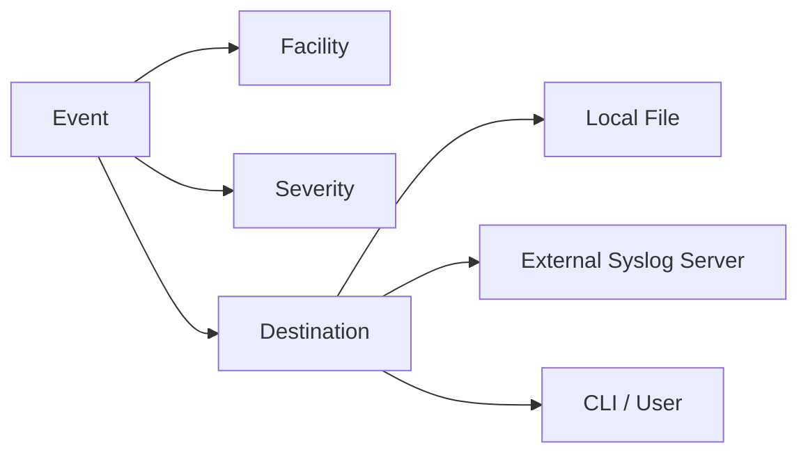

---

# 2. Syslog Facilities

A **facility** identifies the type/source of an event.

Common facilities shown in the module:

|Facility|Purpose|
|---|---|
|`daemon`|Daemon-related events|
|`kernel`|Kernel events|
|`authorization`|Authentication/authorization|
|`security`|Security events|
|`user`|User-related events|
|`firewall`|Packet-filter/firewall events|
|`conflict-log`|Conflict information|
|`change-log`|Configuration changes|
|`interactive-commands`|Commands entered by users|

You don't need to memorize every facility; understand that facilities let you selectively log specific event classes.

---

# 3. Syslog Severity Levels

Junos follows the standard **0–7 syslog severity levels**.

|Level|Name|Meaning|
|--:|---|---|
|**0**|`emergency`|Events causing the router to stop functioning|
|**1**|`alert`|Conditions requiring immediate correction|
|**2**|`critical`|Critical conditions, e.g. hard-disk errors|
|**3**|`error`|Conditions with serious consequences|
|**4**|`warning`|Conditions requiring monitoring|
|**5**|`notice`|Non-error events that might require special handling|
|**6**|`info`|Events/non-error conditions of interest|
|**7**|`any`|All severity levels|

### Critical rule

```text
Lower number = higher severity
```

If you configure:

```text
info
```

you receive:

```text
emergency
alert
critical
error
warning
notice
info
```

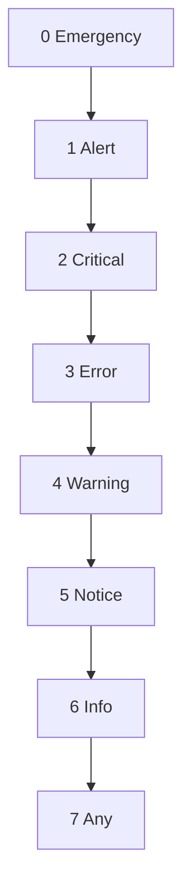

> For a selected severity, Junos logs that level **and all more severe levels above it**.

---

# 4. Reading Syslog Entries

Example structure:

```text
Sep 12 11:31:13 ROUTER_1 mgd[5355]:
UI_DBASE_LOGOUT_EVENT: User 'r.chen' exiting configuration mode
```

Break it down:

```text
Timestamp
   ↓
Hostname
   ↓
Daemon/process
   ↓
Event/message
```

### Troubleshooting approach

Don't try to understand every field immediately.

Look first for:

- Timestamp
    
- Hostname
    
- Daemon
    
- Event/message
    
- Interface/protocol name
    
- Error/warning keywords
    

---

# 5. Default Junos Log Files

View logs using:

```bash
show log <filename>
```

Two important default files:

### `messages`

General system events.

```bash
show log messages
```

Useful for:

- Errors
    
- Warnings
    
- Protocol events
    
- Interface events
    
- System events
    

### `interactive-commands`

Records CLI commands entered by users.

```bash
show log interactive-commands
```

Useful for:

- Auditing
    
- Troubleshooting configuration changes
    
- Identifying which user executed a command
    

---

# 6. Filtering Logs

Use the Junos pipe operator:

```bash
show log messages | match <pattern>
```

Examples:

```bash
show log messages | match error
show log messages | match warning
show log messages | match ge-
show log messages | match rpd
```

### Find commands entered by a user

```bash
show log interactive-commands | match user | last 6
```

The module demonstrates:

```bash
show log interactive-commands | match user | last 6
```

### `last`

Displays only the last N lines:

```bash
| last 6
```

Useful for quickly reducing large log output.

---

# 7. Log Rotation & Archives

When a log file becomes full:

1. Junos compresses the old file.
    
2. A new log file is created.
    
3. Archived logs use **`.gz`** compression.
    
4. Junos limits the number of archived files.
    

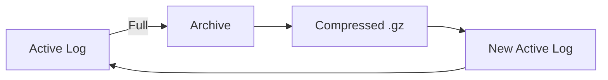

### Why?

Prevents logs from consuming the entire disk indefinitely.

### View available log files

```bash
show log ?
```

Then:

```bash
show log messages.1.gz
```

---

# 8. Default Syslog Configuration

Syslog is configured under:

```text
system {
    syslog {
        ...
    }
}
```

View it with:

```bash
show configuration system
```

Example concept:

```text
system {
    syslog {
        file interactive-commands {
            interactive-commands any;
        }

        file messages {
            any notice;
            authorization info;
        }
    }
}
```

---

# 9. Creating a Custom Log File

Example from the module:

```bash
set system syslog file DAEMON_EVENTS.txt daemon info
```

This logs:

```text
Facility = daemon
Severity = info
```

The file is stored under:

```text
/var/log/
```

---

# 10. Log Archive Configuration

You can control:

- Number of archived files
    
- Maximum size
    
- Whether logs are world-readable
    

Example:

```bash
set system syslog file DAEMON_EVENTS.txt archive files 3 size 1M world-readable
```

Meaning:

```text
files 3
→ Keep 3 archived files

size 1M
→ Rotate when file reaches approximately 1 MB

world-readable
→ Allow all users to read the file
```

Check pending configuration:

```bash
show | compare
```

Apply:

```bash
commit and-quit
```

---

# 11. Real-Time Log Monitoring

Instead of repeatedly running `show log`, monitor a log continuously:

```bash
monitor start messages
```

New entries appear as they are written.

Stop:

```bash
monitor stop
```

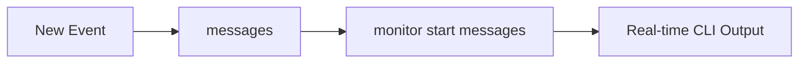

### Difference

```text
show log messages
→ Snapshot

monitor start messages
→ Live / real-time stream
```

---

# 12. Decoding Syslog Messages

Some Junos messages are technically complex.

Use:

```bash
help syslog <message-name>
```

Example:

```bash
help syslog RPD_OSPF_NBRDOWN
```

It can provide:

- Message name
    
- Description
    
- Type
    
- Severity
    
- Facility
    
- Recommended action
    

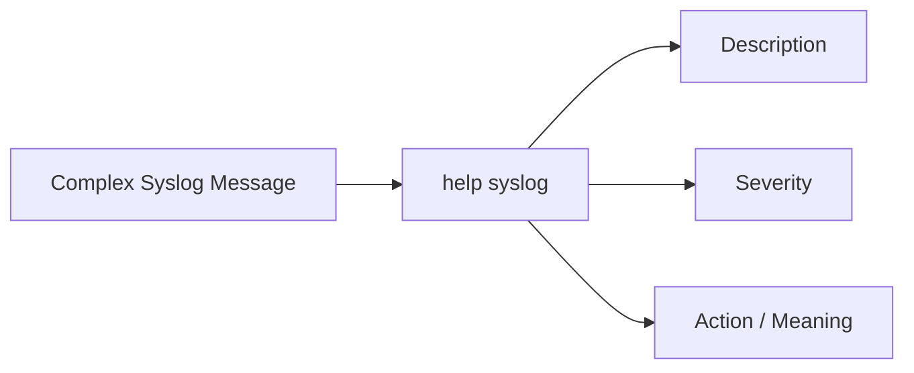

---

# 13. External Syslog Server

Logs can be sent to an external server.

Example:

```bash
set system syslog host 172.16.20.5 any notice
```

Advantages:

- Centralized logging
    
- Longer-term retention
    
- Easier correlation across devices
    
- Logs remain available even if the device is compromised/rebooted
    

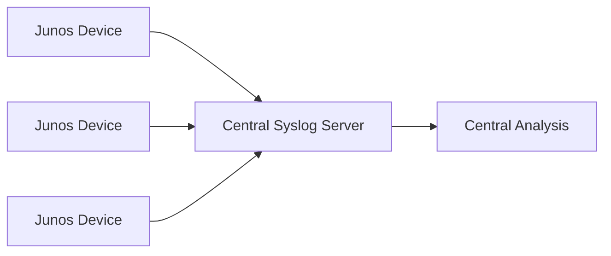

### Security advantage

An attacker who compromises the Junos device may be able to delete local evidence, but remote logs are harder to modify from the compromised device.

---

# 14. Sending Logs to the CLI

Syslog can also send events directly to users.

Example:

```bash
set system syslog user * any emergency
```

`*` means **all users**.

You can also specify an individual user.

---

# 15. Connectivity Troubleshooting Toolkit

Important commands:

```bash
show interfaces terse
show route
show ospf neighbors
ping <IP>
ping <IP> rapid count 100
traceroute <IP>
show arp
show ipv6 neighbors
ssh <user>@<IP>
```

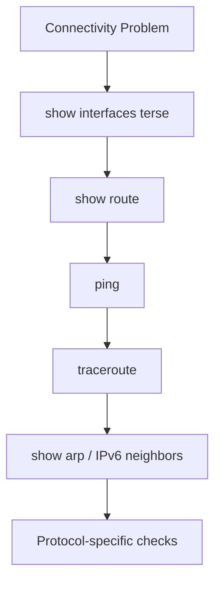

---

# 16. Advanced `ping`

### Rapid ping

```bash
ping 10.1.2.2 rapid
```

Sends the next ping immediately after the previous response.

Useful for quickly testing connectivity.

### Rapid + count

```bash
ping 10.1.2.2 rapid count 100
```

Sends 100 rapid pings.

Useful for detecting:

- Packet loss
    
- Intermittent connectivity
    
- Potential link problems
    

### Important

Some devices may rate-limit or deprioritize ICMP replies.

Therefore:

> Ping loss does **not automatically prove** that the network path is broken.

---

# 17. Testing MTU with `ping`

You can specify packet size and prevent fragmentation:

```bash
ping 10.1.2.2 size 1472 do-not-fragment count 1
```

### IPv4 calculation

```text
1472 bytes payload
+ 8 bytes ICMP header
+ 20 bytes IPv4 header
-----------------------
1500 bytes total
```

Therefore:

```text
1472 + 8 + 20 = 1500
```

If the packet is too large:

```bash
ping 10.1.2.2 size 1473 do-not-fragment count 1
```

may fail with:

```text
Message too long
```

### MTU test model

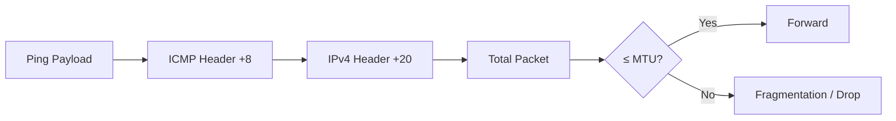

---

# 18. Traceroute Theory

Traceroute identifies the path toward a destination by manipulating **TTL/Hop Limit**.

Conceptually:

```text
TTL = 1 → First router responds
TTL = 2 → Second router responds
TTL = 3 → Third router responds
...
```

Each hop causes TTL/Hop Limit to increase by 1 for the next probe.

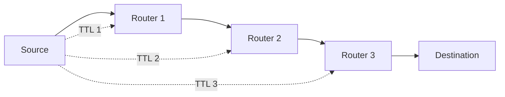

---

# 19. Traceroute Probe Types

The module notes:

- Three packets are normally sent for each TTL.
    
- Junos uses **UDP** on most vendors, including Junos.
    
- Windows commonly uses **ICMP Echo**.
    
- The next hop generates an **ICMP Time-to-Live Exceeded** response.
    
- Each round increases TTL/Hop Limit by 1.
    

---

# 20. Reading Traceroute

Example:

```text
traceroute to 10.5.6.6
 1  10.1.2.2
 2  * * *
 3  10.3.4.4
 4  10.4.5.5
 5  10.5.6.6
```

### `* * *`

Does **not necessarily mean the router is broken**.

It can mean:

- Router doesn't respond to traceroute probes.
    
- ICMP is filtered/rate-limited.
    
- Control-plane traffic is deprioritized.
    

### Slow hop

A slow hop does **not necessarily indicate a bottleneck**.

The router may prioritize forwarding traffic over generating traceroute responses.

---

# 21. Traceroute Path ≠ Guaranteed Forward Path

Traceroute shows the path observed from the source to destination.

The return traffic can follow a **different path**.

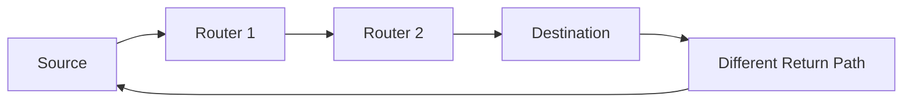

Therefore:

> Forward and return traffic are not necessarily symmetric.

---

# 22. ARP Verification

ARP is useful for verifying IPv4 Layer-2/Layer-3 neighbor mappings.

```bash
show arp
```

Example information:

```text
MAC Address
IP Address
Interface
Flags
```

### Specific interface

```bash
show arp interface xe-0/1/6.0
```

Useful for:

- Checking whether a LAN host is reachable at Layer 2.
    
- Confirming IP ↔ MAC mapping.
    
- Troubleshooting WAN/LAN connectivity.
    

---

# 23. ARP as a WAN Troubleshooting Tool

Even if you cannot ping the far end of a WAN connection, seeing the expected ARP entry can provide useful evidence that Layer 2 adjacency exists.

```text
ARP entry exists
        ↓
Layer-2 neighbor information exists
        ↓
Investigate higher layers if ping still fails
```

---

# 24. IPv6 Neighbor Discovery

IPv6 uses **Neighbor Discovery Protocol (NDP)** instead of ARP.

Use:

```bash
show ipv6 neighbors
```

This displays IPv6 neighbor information including:

- IPv6 address
    
- Link-layer/MAC address
    
- State
    
- Interface
    
- Expiration information
    

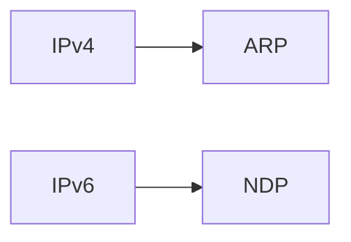

### Easy exam memory

```text
IPv4 → ARP
IPv6 → NDP
```

---

# 25. SSH from Junos

A Junos device can act as an **SSH client**.

Example:

```bash
ssh r.chen@10.1.2.2
```

This is useful when the device is directly connected to another device experiencing problems.


### Use case

```text
You can reach Router B from Router A
but cannot reach Router B from your workstation
```

SSH from Router A can help determine where connectivity breaks.

---

# 26. Live Interface Traffic Statistics

### All interfaces

```bash
monitor interface traffic
```

This continuously displays interface statistics.

Useful for quickly identifying:

- Interfaces that are up/down.
    
- Packet rates.
    
- Traffic activity.
    
- Potential problem interfaces.
    

### Difference

```text
show interfaces terse
→ Snapshot

monitor interface traffic
→ Live statistics
```

---

# 27. Detailed Live Interface Statistics

For one interface:

```bash
monitor interface xe-0/1/5
```

Provides live statistics such as:

- Input bytes
    
- Output bytes
    
- Input packets
    
- Output packets
    
- Input errors
    
- Input drops
    
- Framing errors
    
- Policed discards
    
- L3 incompletes
    
- L2 channel errors
    
- L2 mismatch timeouts
    
- Carrier transitions
    

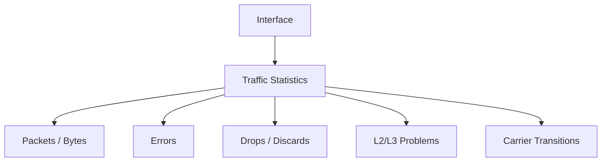

---

# 28. `monitor` Keyboard Controls

While using monitor commands, the CLI provides interactive controls.

Common controls:

```text
q / ESC → Quit
Space   → More output
c       → Clear
r       → Refresh / related display control
```

Follow the command's displayed keyboard shortcuts when using a specific monitor view.

---

# 29. Control-Plane Traffic Capture

Junos can show control-plane traffic entering/leaving an interface.

Basic command:

```bash
monitor traffic interface xe-0/1/5
```

This provides a summary of control-plane traffic.

Useful for troubleshooting protocols such as:

- OSPF
    
- BGP
    
- ARP-related traffic
    
- IPv6 Neighbor Discovery
    

---

# 30. `monitor traffic` Options

### Basic

```bash
monitor traffic interface xe-0/1/5
```

Shows summarized packets.

### `no-resolve`

```bash
monitor traffic interface xe-0/1/5 no-resolve
```

Prevents reverse DNS/name resolution.

Useful because it:

- Speeds up output.
    
- Keeps IP addresses visible.
    
- Avoids DNS-related delays.
    

### `detail`

```bash
monitor traffic interface xe-0/1/5 detail no-resolve
```

Displays more packet information.

### `extensive`

```bash
monitor traffic interface xe-0/1/5 extensive no-resolve
```

Provides even more detailed packet information.

### Write packet capture to file

```bash
monitor traffic interface xe-0/1/5 write-file <filename>
```

Useful when you want to save captured packets for later analysis.

---

# 31. `monitor traffic` Example

Output can show:

```text
Input IP
Source → Destination
Protocol
Length
```

Example concept:

```text
10.1.2.2 → 224.0.0.5
OSPF
Hello
```

This lets you directly verify whether expected protocol packets are appearing on an interface.

---

# 32. Truncated Packets

You may see messages such as:

```text
20 bytes missing!
16 bytes missing!
```

The module explains that this is **normal** in this context.

It can occur because the capture does not include the entire packet.

> Do not automatically interpret truncated capture messages as packet corruption.

---

# 33. `detail` / `extensive` Output

Example:

```bash
monitor traffic interface xe-0/1/5 detail no-resolve
```

Junos can interpret the packet for you.

You may see:

```text
Protocol: OSPF
Source
Destination
TTL
Router ID
Hello Interval
Dead Timer
Designated Router
Backup Designated Router
Neighbors
```

This can help troubleshoot protocol problems **without needing to inspect the remote configuration directly**.

---

# 34. Built-In Help — `help apropos`

If you remember only part of a command:

```bash
help apropos <keyword>
```

Example:

```bash
help apropos host-name
```

It searches for commands containing the keyword.

Works in:

- Operational mode
    
- Configuration mode
    

```text
help apropos
      ↓
Keyword search
      ↓
Related commands
```

---

# 35. Built-In Help — `help topic`

Use:

```bash
help topic <topic>
```

Example:

```bash
help topic ospf dead-interval
```

This provides documentation about the topic.

Example information may include:

- Meaning of the parameter.
    
- How it works.
    
- Defaults.
    
- Configuration behavior.
    

### Think:

```text
help apropos
→ Find commands

help topic
→ Learn the concept
```

---

# 36. Built-In Help — `help reference`

Use:

```bash
help reference <hierarchy>
```

Example:

```bash
help reference ospf area
```

Provides detailed **configuration syntax/reference**.

Can show:

- Syntax
    
- Configuration options
    
- Related statements
    
- Things to consider
    

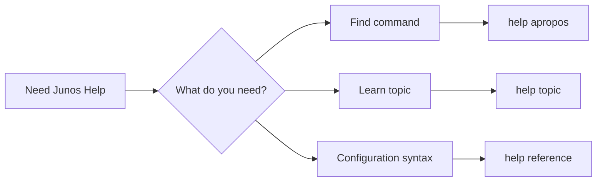

---

# 37. Advanced Troubleshooting Concepts

The module highlights several additional tools.

### Traceoptions

Provides highly detailed debugging information for a protocol or feature.

```text
Traceoptions
→ Detailed protocol/feature debugging
```

### SNMP

**Simple Network Management Protocol**

Used to send monitoring information/logs/statistics to external management systems.

### `show interfaces extensive`

Provides very detailed interface information.

```bash
show interfaces extensive
```

Useful for deep interface troubleshooting.

---

# 38. Troubleshooting Workflow

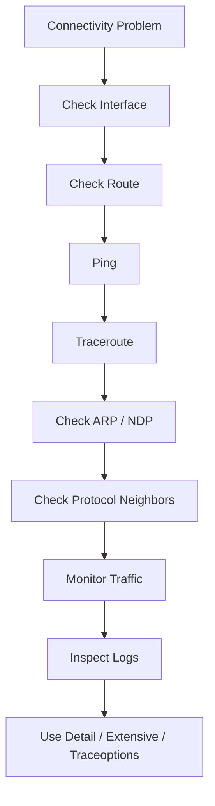

### Layered approach

```text
1. Interface
2. Routing
3. Reachability
4. Path
5. Neighbor resolution
6. Protocol traffic
7. Logs
8. Detailed packet/debug analysis
```

---

# 39. Command Cheat Sheet

## Logs

```bash
show log messages
show log interactive-commands
show log <filename>
show log ?
show log messages | match <pattern>
show log interactive-commands | match user | last 6
monitor start messages
monitor stop
help syslog <message>
```

## Syslog configuration

```bash
set system syslog file <filename> <facility> <severity>
set system syslog host <IP> <facility> <severity>
set system syslog user * <facility> <severity>
```

## Ping

```bash
ping <IP>
ping <IP> rapid
ping <IP> rapid count 100
ping <IP> size 1472 do-not-fragment count 1
```

## Path

```bash
traceroute <IP>
```

## IPv4 / IPv6 neighbors

```bash
show arp
show arp interface <interface>
show ipv6 neighbors
```

## Live traffic

```bash
monitor interface traffic
monitor interface <interface>
monitor traffic interface <interface>
monitor traffic interface <interface> no-resolve
monitor traffic interface <interface> detail no-resolve
monitor traffic interface <interface> extensive no-resolve
```

## Remote access

```bash
ssh <user>@<IP>
```

## Built-in help

```bash
help apropos <keyword>
help topic <topic>
help reference <hierarchy>
```

## Detailed interface

```bash
show interfaces extensive
```

---

# 40. JNCIA Exam Traps

- **Syslog severity 0 = most severe.**
    
- Lower severity number = higher priority.
    
- Selecting `info` also logs everything more severe than `info`.
    
- `messages` → general system events.
    
- `interactive-commands` → CLI commands entered by users.
    
- `| match` → filter output.
    
- `| last 6` → last six lines.
    
- Logs rotate and old files are compressed as `.gz`.
    
- `show log` = historical/snapshot.
    
- `monitor start` = real-time.
    
- `help syslog` = decode syslog message.
    
- Remote syslog provides centralized logging.
    
- `ping rapid count 100` = rapid repeated testing.
    
- `do-not-fragment` + packet size = useful MTU testing.
    
- IPv4 1500-byte packet test → `1472 + 8 ICMP + 20 IPv4 = 1500`.
    
- `* * *` in traceroute does **not automatically mean a broken hop**.
    
- A slow traceroute response does **not automatically mean a bottleneck**.
    
- Forward and return traffic can use different paths.
    
- IPv4 neighbor mapping → `show arp`.
    
- IPv6 neighbor mapping → `show ipv6 neighbors`.
    
- `monitor interface traffic` → live interface statistics.
    
- `monitor traffic` → live control-plane packet visibility.
    
- `no-resolve` → avoid name-resolution delays.
    
- `detail` / `extensive` → progressively more packet information.
    
- `help apropos` → find commands.
    
- `help topic` → learn a topic.
    
- `help reference` → configuration syntax/reference.
    
- `traceoptions` → detailed protocol/feature debugging.
    

---

# 41. Final Mental Model

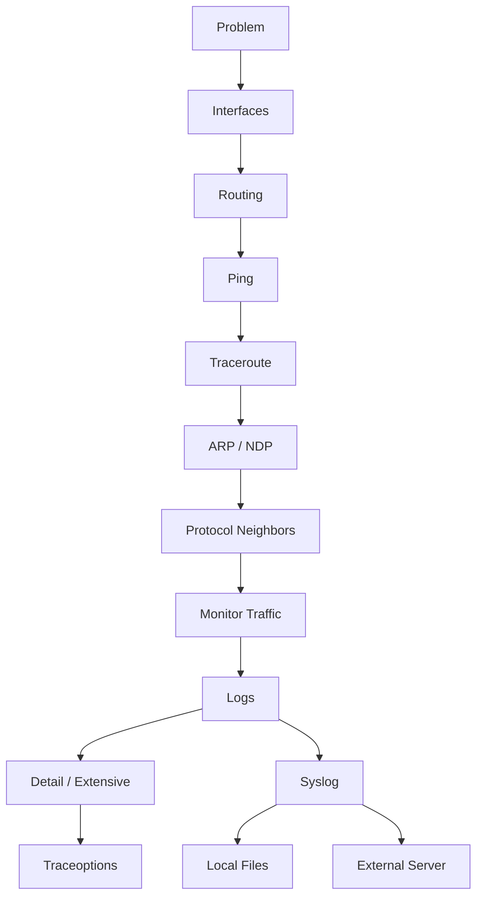

> **JNCIA troubleshooting = verify interfaces → routing → reachability → path → neighbor mappings → protocol traffic → logs → deep packet/debug information.**