# JNCIA-Junos — Stateful Security Policies & Stateless Firewall Filters

## 1. Stateful vs Stateless Traffic Filtering

Junos provides two major approaches:

|Type|Junos terminology|Tracks sessions?|
|---|---|---|
|**Stateful**|Security policies|✅ Yes|
|**Stateless**|Firewall filters|❌ No|

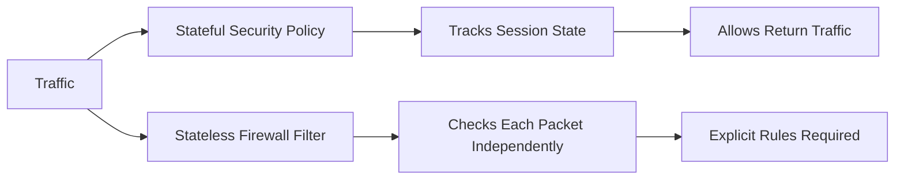

---

# 2. Stateful Security Policies

Stateful rules maintain information about **sessions** passing through the device.

### Example

A LAN host sends a request to the Internet:

```text
LAN → Internet
```

The firewall records the session.

When the Internet replies:

```text
Internet → LAN
```

the firewall recognizes that the packet belongs to an **existing session** and permits it according to the session state.

### Key advantage

You don't need to explicitly create a reverse-direction rule for every established connection.

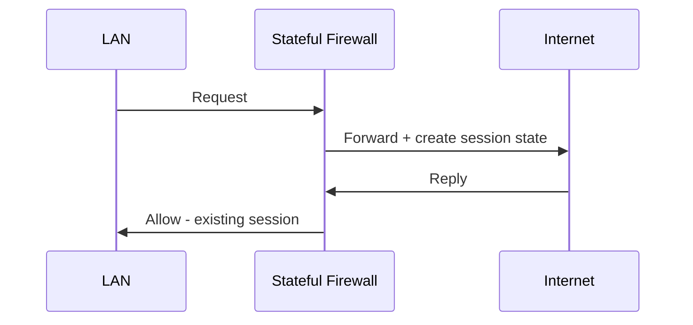

---

# 3. Why Stateless Filtering Can Be Difficult

Suppose requirements are:

1. Allow DNS and web traffic from LAN → Internet.
    
2. Block all other LAN → WAN traffic.
    
3. Block all WAN → LAN traffic.
    

With stateless filtering, if you simply block WAN → LAN traffic:

```text
LAN → Internet   ✅
Internet → LAN   ❌
```

The Internet's reply to the LAN request is also blocked.

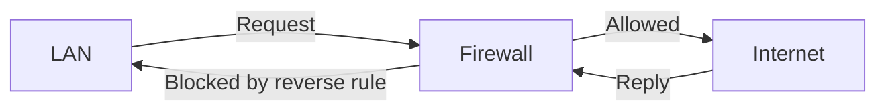

### Core problem

> Stateless filters don't know whether an incoming packet is a reply to an existing connection.

---

# 4. Stateful Traffic Rules

Stateful security policies:

- Track sessions.
    
- Allow traffic belonging to an existing session.
    
- Block unsolicited traffic that isn't part of an established session.
    
- Perform more advanced security checks.
    

These are commonly associated with:

- Hardware firewalls
    
- Virtual/software firewalls
    

Because state must be maintained and checked, each packet may require additional processing.

---

# 5. Stateless Traffic Rules

A stateless firewall filter evaluates **each packet independently**.

It does **not** ask:

> "Does this packet belong to an existing session?"

Instead, it evaluates the packet against configured match conditions.

```text
Packet
  ↓
Check filter terms
  ↓
Match?
  ↓
Action
```

### Important consequence

If you want traffic in the reverse direction, you generally need an explicit rule allowing it.

---

# 6. Stateless Filters — Common Uses

Stateless filters are particularly useful for:

- Blocking obvious unwanted traffic.
    
- Quickly dropping known malicious traffic.
    
- Filtering based on packet headers.
    
- Simple packet-level security controls.
    

Example:

```text
Block packets:
Source IP = 172.16.10.5
Destination = 172.16.10.0/24
Protocol = ICMP
```

The router can simply drop the packet without performing stateful session processing.

---

# 7. DoS Example

An attacker can send packets using a **fake/spoofed source IP**.

Example:

```text
Internet
   |
   | Source IP = 172.16.10.5
   ↓
Router
   |
   ↓
Corporate LAN
```

A stateless filter can block packets matching the suspicious source:

```text
Source IP = 172.16.10.5
        ↓
      discard
```

This is useful for quickly blocking obvious unwanted traffic.

---

# 8. Junos Terminology

Junos uses specific names:

|Generic concept|Junos|
|---|---|
|Stateful filtering|**Security policies**|
|Stateless filtering|**Firewall filters**|

### Configuration hierarchy

**Security policies:**

```text
security
```

**Stateless firewall filters:**

```text
firewall
```

> Other vendors may use terms such as **ACLs**, access-control lists, or access lists.

---

# 9. Firewall Filter Structure

A Junos firewall filter is essentially a sequence of **if/then statements**.

Conceptually:

```text
IF packet matches these conditions
THEN perform these actions
```

A filter contains **terms**.

```text
Filter
 ├── Term 1
 │    ├── from → match conditions
 │    └── then → actions
 ├── Term 2
 │    ├── from → match conditions
 │    └── then → actions
 └── Term 3
      ├── from → match conditions
      └── then → actions
```

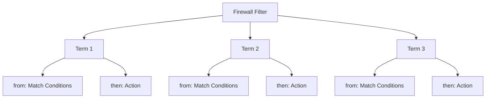

---

# 10. `from` — Match Conditions

The `from` section defines **what traffic should match**.

Firewall filters can match many packet-header fields.

### IPv4 / IPv6 examples

- Incoming interface
    
- Source IP
    
- Destination IP
    
- TTL / Hop Limit
    
- Transport protocol
    
- TCP/UDP port
    
- Next Header (IPv6)
    
- IP flags
    
- Class-of-service / traffic priority
    
- ICMP / ICMPv6 codes
    

### Ethernet examples

- Incoming interface
    
- Source MAC address
    
- Destination MAC address
    
- VLAN tag
    
- EtherType
    

---

# 11. Multiple Match Conditions

A single term can contain multiple match conditions.

You must understand the **logical relationship** between them.

### OR logic

Multiple values of the **same condition** can represent OR.

Example:

```text
Source IP = 172.16.10.22
OR
Source IP = 172.16.10.44
```

### AND logic

Different match conditions are combined logically.

Example:

```text
Source IP = 172.16.10.22
AND
Destination IP = 198.51.100.48
AND
TCP port = 443
```

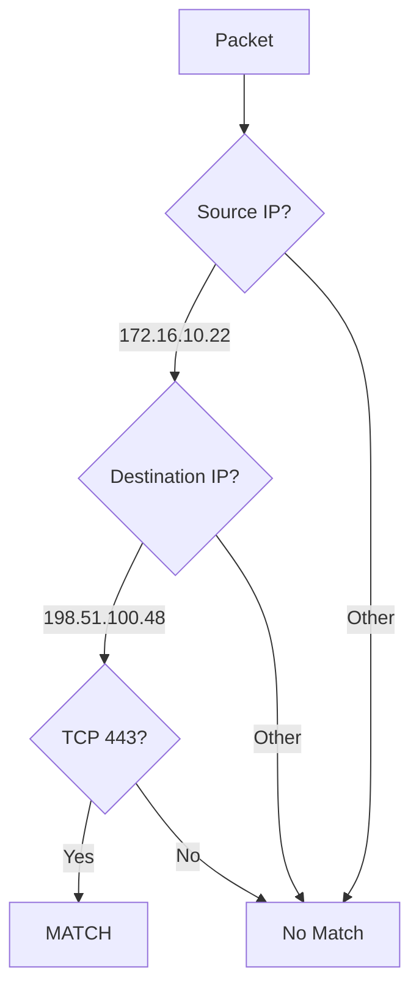

---

# 12. `then` — Actions

Once a packet matches a term, the `then` section specifies what Junos should do.

There are **two broad categories**:

1. **Terminating actions**
    
2. **Nonterminating actions**
    

---

# 13. Terminating Actions

A terminating action ends processing of the firewall filter for that packet.

### `accept`

```text
then accept
```

Allows the packet.

### `discard`

```text
then discard
```

Silently drops the packet.

### `reject`

```text
then reject
```

Drops the packet **and sends an ICMP Destination Unreachable message** to the source.

|Action|Result|
|---|---|
|`accept`|Allow|
|`discard`|Drop silently|
|`reject`|Drop + notify sender|

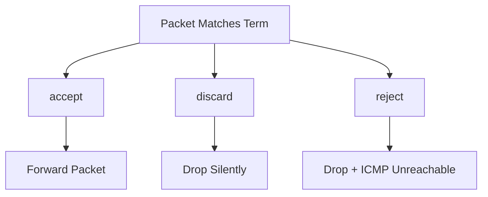

### Important

These actions operate on a **per-packet basis**.

---

# 14. Why `discard` Is Common

Operators often choose `discard` because:

- It simply drops unwanted traffic.
    
- It doesn't reveal as much information to the sender.
    
- An error response can potentially provide useful information to an attacker.
    

---

# 15. Nonterminating Actions

Nonterminating actions perform an additional operation but don't have to end filter processing.

Examples:

|Action|Purpose|
|---|---|
|`count`|Count matching packets|
|`log`|Temporary logging in RAM|
|`syslog`|Permanent logging to file/external server|
|`next-interface`|Override routing-table result|
|`policer`|Rate-limit traffic|
|`forwarding-class`|Place traffic into a specific priority queue|

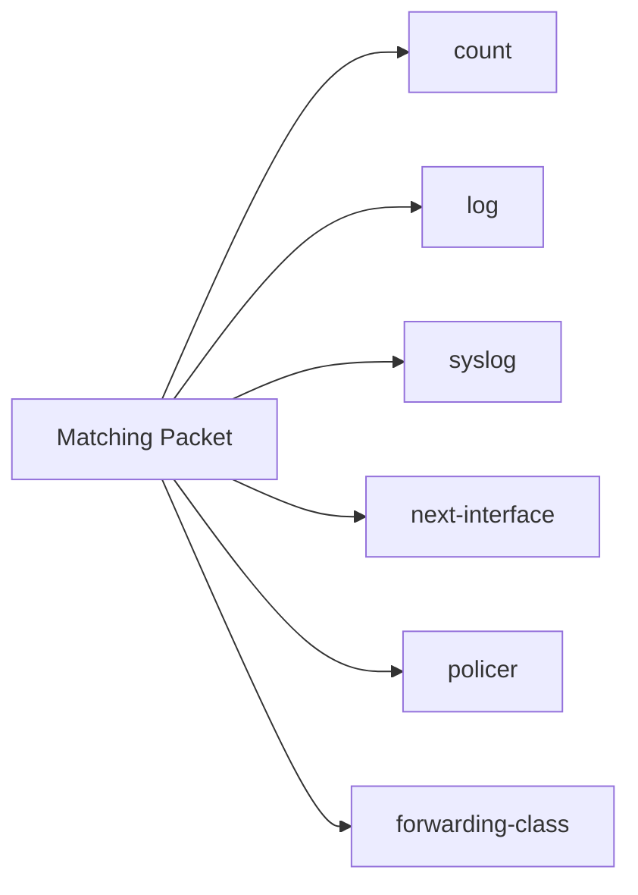

---

# 16. `count`

```text
then count <counter-name>
```

Counts matching packets.

Useful for:

- Measuring traffic.
    
- Troubleshooting.
    
- Determining whether a filter term is matching.
    

---

# 17. `log`

```text
then log
```

Keeps a **temporary log in RAM**.

Useful for short-term troubleshooting.

---

# 18. `syslog`

```text
then syslog
```

Writes information to:

- A log file
    
- External syslog server
    

Useful when you need persistent logging.

### Difference

```text
log
→ temporary / RAM

syslog
→ persistent logging / external server
```

---

# 19. `policer`

```text
then policer <policer-name>
```

Rate-limits matching traffic.

Example concept:

```text
Traffic
  ↓
Firewall Filter
  ↓
Policer
  ↓
Maximum allowed rate
```

Useful for controlling excessive traffic.

---

# 20. `forwarding-class`

Assigns matching traffic to a specific forwarding/priority queue.

Useful for **Class of Service (CoS)**.

```text
Matched packet
      ↓
forwarding-class
      ↓
Specific priority queue
```

---

# 21. `next-interface`

`then next-interface` can override what the routing table normally determines.

This allows traffic to be forwarded through a specified interface instead.

> This is a powerful action and should be used carefully because it overrides normal routing behavior.

---

# 22. `then next term`

A special nonterminating action:

```text
then next term
```

It tells Junos to continue processing the packet against the **next firewall-filter term**.

This is useful when you want to perform multiple actions.

Example concept:

```text
Term 1:
    match source IP
    then count + next term

Term 2:
    match protocol
    then log + next term

Term 3:
    final action
```

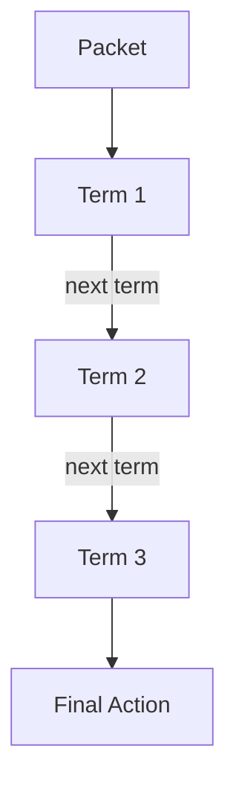

### Important

`next term` allows additional processing.

---

# 23. Term Processing Order

Firewall-filter terms are processed **from top to bottom**.

```text
Term 1
  ↓
Term 2
  ↓
Term 3
  ↓
Term 4
```

When a packet matches a **terminating action**, processing stops.

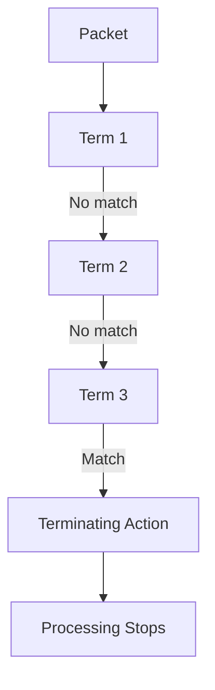

---

# 24. Multiple Actions in One Term

A term can perform multiple actions.

Example from the module:

```text
BLOCK_GAMING
    from:
        source IP = 172.16.10.22 or 172.16.10.44
        destination IP = 198.51.100.48
        destination TCP port = 666

    then:
        discard
        log
```

Conceptually:

```text
Match
 ↓
discard
 +
log
```

The terminating action ends further term processing, while the additional logging action records the event.

---

# 25. Example Filter Terms

### BLOCK_GAMING

```text
Source IP:
172.16.10.22 OR 172.16.10.44

Destination IP:
198.51.100.48

Destination TCP port:
666

Actions:
discard
log
```

### GUEST_COUNT_WEB

```text
Source:
Guest LAN 172.16.30.0/24

Destination TCP ports:
80 OR 443

Actions:
accept
count
```

### BLOCK_GUEST_PING

```text
Source:
Guest LAN 172.16.30.0/24

Protocol:
ICMP Echo Request / Echo Reply

Action:
discard
```

---

# 26. How a Packet Is Evaluated

Suppose:

```text
Source IP      = 172.16.10.22
Destination IP = 198.51.100.48
TCP destination = 666
```

Term 1:

```text
BLOCK_GAMING
```

matches.

Therefore:

```text
discard
log
```

Processing stops.

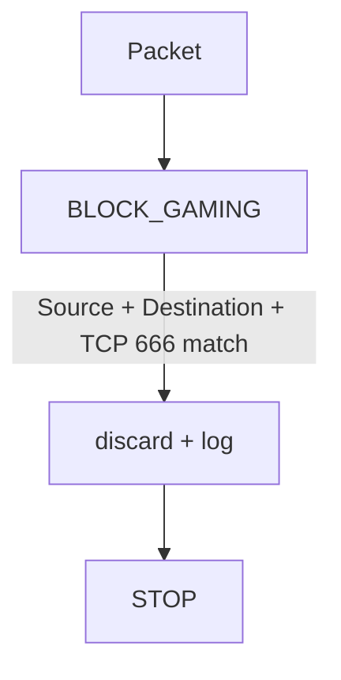

---

# 27. Another Packet

Suppose:

```text
Source IP       = 172.16.10.22
Destination IP  = 198.51.100.48
TCP destination = 443
```

It does **not** match `BLOCK_GAMING` because the port is different.

Junos proceeds to the next term.

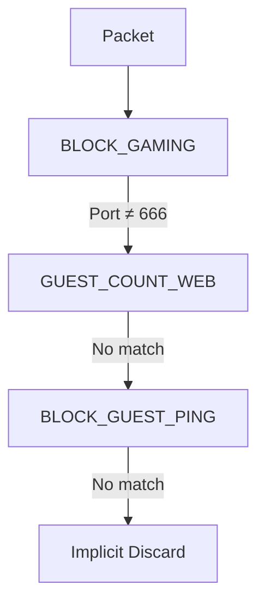

---

# 28. Implicit Discard

A critical Junos firewall-filter concept:

> If a packet does not match any configured term, it is **implicitly discarded**.

Conceptually, Junos behaves as though there is an invisible final term:

```text
implicit-term {
    from {
        everything;
    }
    then discard;
}
```

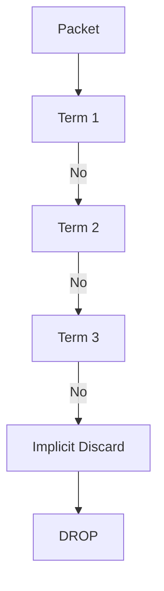

### Security implication

A filter containing only a few explicit allow/deny terms can accidentally block **everything else**.

---

# 29. Why the Example Filter Is Incomplete

Suppose the customer asks for:

- Block gaming traffic.
    
- Allow guest web traffic.
    
- Block guest ping.
    

You create those three terms.

But what about:

```text
Corporate LAN → Internet
Other guest traffic
DNS
SSH
NTP
Other legitimate traffic
```

If they don't match any term:

```text
→ implicit discard
```

Therefore, you must carefully decide what should happen to unmatched traffic.

---

# 30. Stateful vs Stateless — Final Comparison

|Feature|Stateful Security Policy|Stateless Firewall Filter|
|---|---|---|
|Tracks sessions|✅|❌|
|Evaluates packets independently|❌|✅|
|Automatic return-traffic awareness|✅|❌|
|Junos hierarchy|`security`|`firewall`|
|Fine-grained packet matching|Yes|Yes|
|Simple packet blocking|Yes|Excellent use case|
|Session-aware security|✅|❌|
|Common use|Security policies|ACL/filtering/QoS/logging|

---

# 31. Exam Cheat Sheet

```text
STATEFUL
→ Security policies
→ Tracks sessions
→ Understands established/return traffic

STATELESS
→ Firewall filters
→ Each packet independently
→ No session awareness

FILTER
→ term
→ from
→ then

from
→ Match conditions

then
→ Action

TERMINATING
→ accept
→ discard
→ reject

NONTERMINATING
→ count
→ log
→ syslog
→ next-interface
→ policer
→ forwarding-class
→ next term

PROCESSING
→ Top → Bottom
→ Terminating action → STOP
→ next term → Continue

NO MATCH
→ Implicit discard
```

# 32. High-Value Exam Traps

- **Security policy = stateful.**
    
- **Firewall filter = stateless.**
    
- Stateless filters don't know whether a packet belongs to an existing session.
    
- `from` = **match conditions**.
    
- `then` = **actions**.
    
- Multiple values of the same condition can form **OR** logic.
    
- Different match conditions generally combine as **AND** logic.
    
- Terms are processed **top-to-bottom**.
    
- `accept`, `discard`, and `reject` are **terminating actions**.
    
- `discard` = silently drop.
    
- `reject` = drop + ICMP Destination Unreachable.
    
- `count` = count matching packets.
    
- `log` = temporary logging in RAM.
    
- `syslog` = persistent/external logging.
    
- `policer` = rate-limit.
    
- `forwarding-class` = assign traffic to a priority queue.
    
- `next-interface` = override routing-table forwarding decision.
    
- `next term` = continue evaluating later terms.
    
- **No term match → implicit discard.**
    
- A firewall filter containing only specific rules can unintentionally block all other traffic.
    

# 33. Mental Model

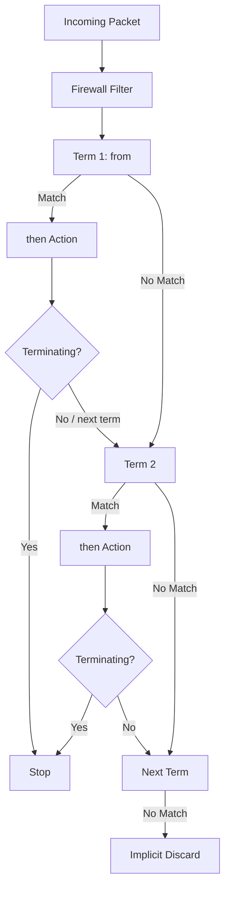

> **Core idea: `from` decides what matches → `then` decides what happens → terms run top-to-bottom → terminating actions stop processing → unmatched traffic hits implicit discard.**