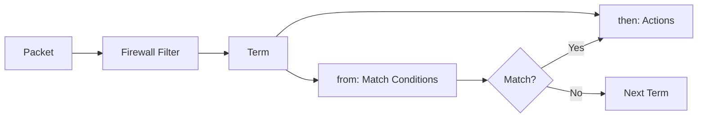
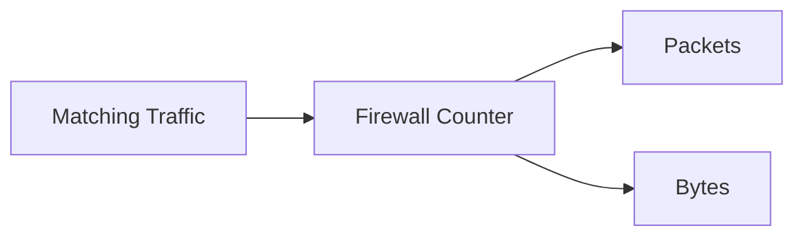
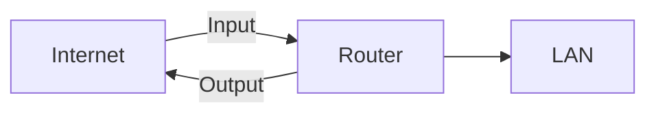
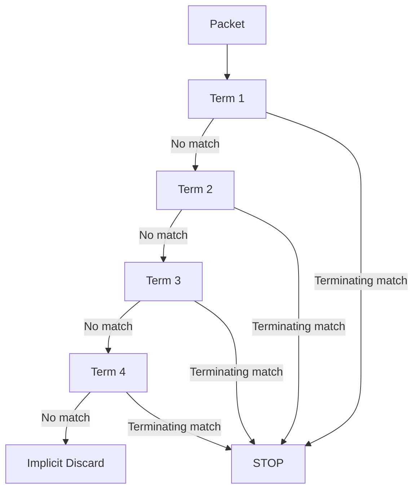
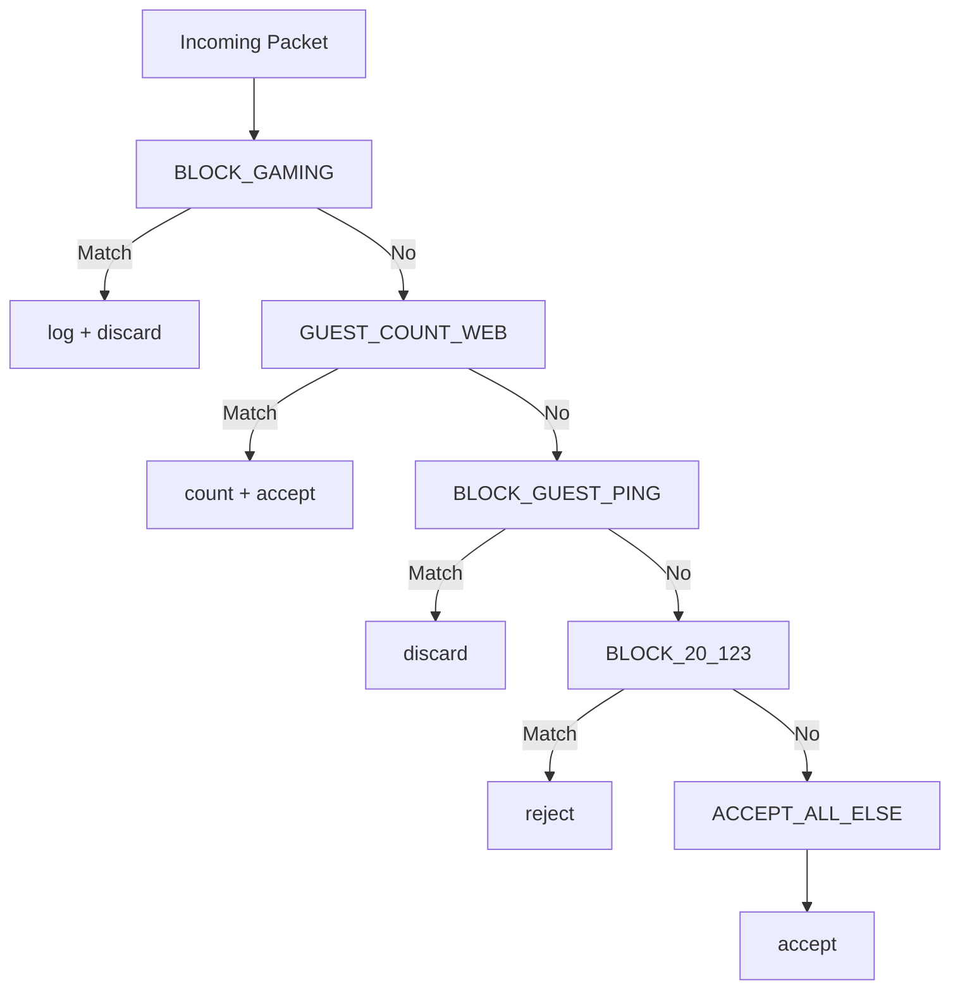

# JNCIA-Junos — Junos OS Firewall Filter Configuration

## 1. Firewall Filter Configuration

A Junos **stateless firewall filter** is configured under:

```text
firewall family inet filter <FILTER_NAME>
```

Structure:

```text
filter
 └── term
      ├── from   → Match conditions
      └── then   → Actions
```

Basic `set` syntax:

```bash
set firewall family inet filter FILTER_NAME term TERM_NAME from <condition>
set firewall family inet filter FILTER_NAME term TERM_NAME then <action>
```

Example:

```bash
set firewall family inet filter LAN_TO_WAN term BLOCK_GAMING from source-address 172.16.10.22/32
set firewall family inet filter LAN_TO_WAN term BLOCK_GAMING from source-address 172.16.10.44/32
set firewall family inet filter LAN_TO_WAN term BLOCK_GAMING from destination-address 198.51.100.48/32
set firewall family inet filter LAN_TO_WAN term BLOCK_GAMING from destination-port 666
set firewall family inet filter LAN_TO_WAN term BLOCK_GAMING then log
set firewall family inet filter LAN_TO_WAN term BLOCK_GAMING then discard
```

---

# 2. `from` + `then`



### `from`

Defines **which packets match**.

### `then`

Defines **what happens to matching packets**.

---

# 3. Creating Multiple Source Addresses

Multiple source addresses can be configured in the same term:

```bash
set firewall family inet filter LAN_TO_WAN term BLOCK_GAMING from source-address 172.16.10.22/32
set firewall family inet filter LAN_TO_WAN term BLOCK_GAMING from source-address 172.16.10.44/32
```

Conceptually:

```text
172.16.10.22 OR 172.16.10.44
```

---

# 4. Hierarchy vs `display set`

### Hierarchy view

```bash
show configuration firewall family inet filter LAN_TO_WAN
```

Easier to understand logically.

### Set view

```bash
show configuration firewall family inet filter LAN_TO_WAN | display set
```

Easier to copy, modify and understand individual commands.

### Relative set view

```bash
show configuration firewall family inet filter LAN_TO_WAN | display set relative
```

Shows commands relative to the current configuration hierarchy.

---

# 5. Saving Configuration

Check pending changes:

```bash
show | compare
```

Commit:

```bash
commit
```

Or:

```bash
commit and-quit
```

### Safer when applying a new filter

```bash
commit confirmed 2
```

This gives you a **2-minute rollback window** if you lose connectivity and don't confirm the commit.

```mermaid
flowchart LR
    C[Configure Filter] --> D[show | compare]
    D --> CC[commit confirmed 2]
    CC --> T[Test Traffic]
    T -->|Works| CM[commit]
    T -->|Problem| R[Automatic Rollback]
```

---

# 6. Predefined Application Ports

Junos provides well-known application shortcuts.

|Keyword|Port|
|---|--:|
|`ftp-data`|20|
|`ftp`|21|
|`ssh`|22|
|`telnet`|23|
|`domain`|53|
|`dhcp`|67|
|`http`|80|
|`https`|443|
|`ntp`|123|
|`bgp`|179|

Example:

```bash
set ... from destination-port http
```

instead of:

```bash
set ... from destination-port 80
```

---

# 7. Port Match Options

Three useful forms:

### Source port

```bash
from source-port <port>
```

### Destination port

```bash
from destination-port <port>
```

### Either source or destination

```bash
from port <port>
```

> `from port` checks the relevant TCP/UDP port field without requiring you to specify source vs destination.

### Protocol-specific filtering

Port matching can apply to TCP or UDP; explicitly specify the protocol when required:

```bash
from protocol tcp
```

or:

```bash
from protocol udp
```

---

# 8. Complete Example Filter

The module builds this filter:

```text
LAN_TO_WAN
├── BLOCK_GAMING
│   ├── Source: 172.16.10.22/32 OR 172.16.10.44/32
│   ├── Destination: 198.51.100.48/32
│   ├── Destination TCP port: 666
│   └── log + discard
│
├── GUEST_COUNT_WEB
│   ├── Source: 172.16.30.0/24
│   ├── TCP
│   ├── Destination port: HTTP/HTTPS
│   ├── count COUNTER_GUEST_WEB
│   └── accept
│
└── BLOCK_GUEST_PING
    ├── Source: 172.16.30.0/24
    ├── ICMP echo-request
    ├── ICMP echo-reply
    └── discard
```

---

# 9. Counter Configuration

A counter can be created as part of a filter term:

```bash
set firewall family inet filter LAN_TO_WAN term GUEST_COUNT_WEB then count COUNTER_GUEST_WEB
```

Verify:

```bash
show firewall counter COUNTER_GUEST_WEB filter LAN_TO_WAN
```

Example output provides:

```text
Name
Bytes
Packets
```

### Why counters matter

They tell you whether a filter term is actually matching traffic.



---

# 10. Applying a Firewall Filter

A filter must be applied to an interface before it affects traffic.

Syntax:

```bash
set interfaces <interface> unit <unit> family inet filter <input|output> <filter-name>
```

Example from the module:

```bash
set interfaces xe-0/1/6 unit 0 family inet filter output LAN_TO_WAN
```

Then:

```bash
commit confirmed 2
```

---

# 11. Input vs Output



### Input filter

Processes packets **entering the interface**.

```text
Internet → Interface → Router
              ↑
           input
```

### Output filter

Processes packets **leaving the interface**.

```text
Router → Interface → Internet
          ↑
       output
```

---

# 12. Where Should the Filter Be Applied?

General principle:

> Apply a filter as close to the traffic source as practical.

This allows unwanted traffic to be dropped earlier.

However, topology can make this difficult.

Example:

```text
                Internet
                   |
              xe-0/1/6/0
                   |
                ROUTER_1
              /    |     \
        Corporate Server  Guest
         LAN      LAN      LAN
```

Interfaces:

```text
xe-0/1/0.10 → Corporate LAN
xe-0/1/0.20 → Server LAN
xe-0/1/0.30 → Guest LAN
```

---

# 13. Three Filter Placement Options

The module presents **three valid approaches**.

### Option 1 — Apply outbound on WAN interface

```bash
set interfaces xe-0/1/6 unit 0 family inet filter output LAN_TO_WAN
```

**Advantages:**

- Easier administration.
    
- One filter can handle traffic from multiple LANs.
    

**Disadvantage:**

- Traffic is filtered later than necessary.
    

```text
LAN → Router → Filter → WAN
```

---

### Option 2 — Separate filter on each LAN

Create a unique filter for each LAN and apply it inbound.

```text
Corporate LAN ──┐
Server LAN ─────┼→ Router → WAN
Guest LAN ──────┘
```

**Advantages:**

- Traffic can be dropped earlier.
    
- More granular control.
    

**Disadvantage:**

- More configuration overhead.
    

---

### Option 3 — Same filter on multiple LAN interfaces

Apply the same filter to multiple interfaces.

**Advantages:**

- Less configuration than maintaining separate filters.
    
- Traffic can be filtered earlier.
    

**Disadvantage:**

- May consume more device/PFE resources because rules are effectively applied in multiple places.
    

---

# 14. Placement Comparison

|Approach|Administration|Filtering point|Configuration|
|---|---|---|---|
|WAN outbound|Easier|Later|Lower|
|Separate LAN filters|More work|Earlier|Higher|
|Same filter on multiple LANs|Balanced|Earlier|Moderate|

---

# 15. Verify Filter Traffic

Test from a permitted source:

```bash
ping 203.0.113.47 source 172.16.20.1
```

Expected:

```text
PING succeeds
```

Test from a blocked source:

```bash
ping 203.0.113.47 source 172.16.30.1
```

Expected:

```text
Operation not permitted
```

The module uses these tests to demonstrate that:

```text
Server LAN → Internet = allowed
Guest LAN → Internet = blocked
```

---

# 16. Verify Counters

After testing:

```bash
show firewall counter COUNTER_GUEST_WEB filter LAN_TO_WAN
```

Example:

```text
Filter: LAN_TO_WAN
Counters:
Name                  Bytes        Packets
COUNTER_GUEST_WEB     ...          ...
```

If the packet count increases, the corresponding term is matching traffic.

---

# 17. Adding a New Term

New terms are normally added to the **bottom** of the filter.

Example requirement:

> Block traffic from `172.16.20.123` to the Internet and return an ICMP Destination Unreachable message.

Create:

```bash
set firewall family inet filter LAN_TO_WAN term BLOCK_20_123 from source-address 172.16.20.123/32
set firewall family inet filter LAN_TO_WAN term BLOCK_20_123 then reject
```

Then:

```bash
commit and-quit
```

---

# 18. Important `reject` Detail

The module demonstrates:

```bash
then reject
```

If you don't specify:

```text
destination-address
```

the term can match traffic from that source toward **other destinations as well**.

Example:

```text
Source = 172.16.20.123/32
Destination = ANY
Action = reject
```

So the match conditions must be carefully designed.

---

# 19. `reject tcp-reset`

Junos can provide platform-dependent reject options.

A common option is:

```bash
then reject tcp-reset
```

For TCP traffic, this sends a TCP reset rather than relying on the default ICMP unreachable behavior.

> Exact reject behavior/options can vary by platform and protocol.

---

# 20. The `insert` Command

New terms are initially placed at the **bottom** of a firewall filter.

But term order matters.

Use:

```bash
insert
```

to place a term at a specific position.

Syntax:

```bash
insert firewall family inet filter <FILTER> term <TERM> before term <OTHER_TERM>
```

or:

```bash
insert firewall family inet filter <FILTER> term <TERM> after term <OTHER_TERM>
```

---

# 21. Example — Insert Before

```bash
insert firewall family inet filter LAN_TO_WAN term BLOCK_20_123 before term ACCEPT_ALL_ELSE
```

Result:

```text
BLOCK_GAMING
GUEST_COUNT_WEB
BLOCK_GUEST_PING
BLOCK_20_123
ACCEPT_ALL_ELSE
```

---

# 22. Example — Insert After

```bash
insert firewall family inet filter LAN_TO_WAN term BLOCK_20_123 after term BLOCK_GUEST_PING
```

Result:

```text
BLOCK_GAMING
GUEST_COUNT_WEB
BLOCK_GUEST_PING
BLOCK_20_123
ACCEPT_ALL_ELSE
```

### Why `insert` matters

Because firewall filters are evaluated:

```text
TOP → BOTTOM
```

A broad term placed too early can prevent later terms from ever being reached.

---

# 23. Term Ordering



### Exam rule

> **Specific rules should generally appear before broad rules.**

Example:

```text
BLOCK_SPECIFIC_HOST
        ↓
ACCEPT_OTHER_TRAFFIC
```

not:

```text
ACCEPT_ALL
        ↓
BLOCK_SPECIFIC_HOST   ← never reached
```

---

# 24. Explicit Allow-All Term

The module adds:

```bash
set firewall family inet filter LAN_TO_WAN term ACCEPT_ALL_ELSE then accept
```

This explicitly permits traffic that didn't match previous terms.

```text
Term 1 → block gaming
Term 2 → count guest web
Term 3 → block guest ping
Term 4 → block 172.16.20.123
Term 5 → ACCEPT_ALL_ELSE
```

### Important

Because of the implicit discard rule, adding an explicit:

```text
then accept
```

changes the behavior from:

```text
No match → DROP
```

to:

```text
No match → ACCEPT
```

---

# 25. Final Filter Logic



---

# 26. Configuration Workflow

```mermaid
flowchart TD
    A[Define Requirements] --> B[Create Filter]
    B --> C[Create Terms]
    C --> D[Configure from Conditions]
    D --> E[Configure then Actions]
    E --> F[Check show | compare]
    F --> G[Apply to Interface]
    G --> H[commit confirmed]
    H --> I[Test Traffic]
    I --> J[Check Counters]
    J --> K{Correct?}
    K -->|Yes| L[commit]
    K -->|No| M[Rollback / Modify]
    M --> F
```

---

# 27. Useful Verification Commands

### View complete filter

```bash
show configuration firewall family inet filter LAN_TO_WAN
```

### Set format

```bash
show configuration firewall family inet filter LAN_TO_WAN | display set
```

### Relative set format

```bash
show configuration firewall family inet filter LAN_TO_WAN | display set relative
```

### Compare candidate vs active

```bash
show | compare
```

### Verify counters

```bash
show firewall counter COUNTER_GUEST_WEB filter LAN_TO_WAN
```

### Test connectivity

```bash
ping <destination> source <source-IP>
```

---

# 28. Control-Plane Firewall Filters

The module briefly points toward filters applied to the **control plane**.

Purpose:

> Protect the device itself from unwanted management/protocol traffic.

Examples of traffic that can be controlled include:

- Management access
    
- Routing protocols
    
- Other traffic destined to the device
    

This is distinct from filtering transit traffic through the router.

---

# 29. Additional Firewall Filter Topics

The module identifies further topics for deeper study:

|Topic|Purpose|
|---|---|
|**Firewall filter logs**|Visibility into matching traffic|
|**Prefix lists**|Named lists of IP prefixes|
|**Policers**|Rate-limit traffic|
|**Control-plane filters**|Protect routing/management plane|
|**Additional match conditions**|More granular packet classification|

---

# 30. JNCIA Exam Cheat Sheet

```text
FILTER CONFIG
→ firewall family inet filter <name>

TERM
→ from = match
→ then = action

VIEW
→ show configuration ... 
→ | display set
→ | display set relative

SAVE / TEST
→ show | compare
→ commit confirmed 2
→ commit / commit and-quit

APPLY
→ interfaces ... family inet filter input/output <filter>

INPUT
→ packets entering interface

OUTPUT
→ packets leaving interface

COUNTERS
→ then count <name>
→ show firewall counter <name> filter <filter>

TERM ORDER
→ Top → Bottom
→ First terminating match stops processing

NEW TERM
→ Usually appears at bottom

MOVE TERM
→ insert ... before term ...
→ insert ... after term ...

DEFAULT
→ No match = implicit discard

ALLOW ALL
→ then accept
→ Must be placed after specific deny terms

PORT SHORTCUTS
→ ftp-data 20
→ ftp 21
→ ssh 22
→ telnet 23
→ domain 53
→ dhcp 67
→ http 80
→ ntp 123
→ bgp 179
→ https 443
```

# 31. High-Value Exam Traps

- **Creating a filter does not apply it** — it must be attached to an interface.
    
- `input` = entering the interface.
    
- `output` = leaving the interface.
    
- New terms normally go to the **bottom**.
    
- Use `insert` to control term order.
    
- Firewall filters process terms **top-to-bottom**.
    
- A terminating action stops further term processing.
    
- `count` is **nonterminating**.
    
- `log` is **nonterminating**.
    
- `accept`, `discard`, `reject` are **terminating**.
    
- If nothing matches, the default behavior is **implicit discard**.
    
- An explicit `ACCEPT_ALL_ELSE` term prevents the implicit discard from blocking unmatched traffic.
    
- A broad allow term must come **after** specific blocking terms.
    
- `show firewall counter` verifies whether a term is actually seeing traffic.
    
- `commit confirmed` is useful when testing filters remotely.
    
- Applying the same filter to multiple LAN interfaces can reduce configuration duplication but may consume more PFE resources.
    
- Applying the filter closer to the traffic source can drop unwanted packets earlier.
    

> **Core mental model: Build → Order → Attach → Commit safely → Test → Check counters → Fix order if needed.**