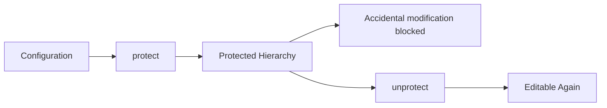
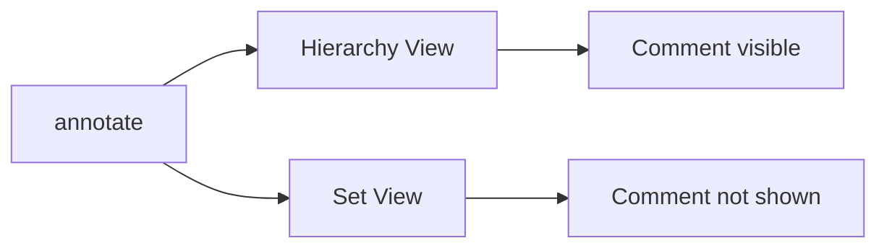
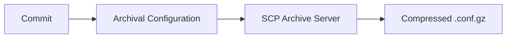
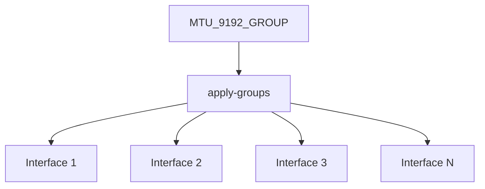
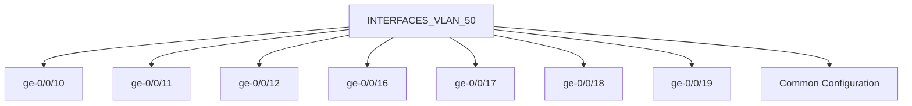
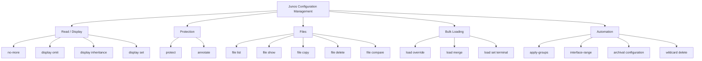

# JNCIA-Junos — Configuration Management & Automation

## 1. Configuration Output: `no-more`

Large Junos configurations can be difficult to read because the output may span hundreds/thousands of lines.

```bash
show configuration | no-more
```

Displays the entire configuration without requiring `Space` to move through pages.

Useful when:

- Saving/copying large output.
    
- Reviewing the complete configuration quickly.
    

---

# 2. Redacting Configuration with `apply-flags omit`

Junos can hide selected configuration hierarchies from normal `show configuration` output.

### Configure

```bash
set firewall family inet filter LAN_TO_WAN apply-flags omit
set routing-options apply-flags omit
set protocols ospf apply-flags omit
```

Then:

```bash
show configuration
```

The omitted hierarchy appears approximately as:

```text
/* OMITTED */
```

### Important

`apply-flags omit`:

- Hides configuration from normal hierarchical output.
    
- Does **not** delete the configuration.
    
- Is a hidden configuration statement.
    
- Cannot be completed using normal CLI completion.
    

---

# 3. Revealing Omitted Configuration

There are three useful approaches.

### View the complete hierarchy directly

```bash
show configuration routing-options
```

### Explicitly display omitted configuration

```bash
show configuration | display omit
```

### Use set format

```bash
show configuration | display set
```

The set-format output is **not redacted by `apply-flags omit`**.

```mermaid
flowchart TD
    C[Configuration with apply-flags omit] --> H[show configuration]
    H --> O[Hidden / OMITTED]
    
    C --> D[show configuration | display omit]
    D --> V[Omitted configuration visible]
    
    C --> S[show configuration | display set]
    S --> V2[Configuration visible]
```

### Exam trap

```text
show configuration
→ omitted

show configuration | display omit
→ reveals omitted

show configuration | display set
→ reveals omitted
```

---

# 4. Protecting Configuration Hierarchies

Junos can **lock/protect** a hierarchy against accidental modification.

Syntax:

```bash
protect <hierarchy>
```

Example:

```bash
protect protocols lldp
```

Now:

```bash
show configuration protocols lldp
```

shows the hierarchy as protected.

The configuration appears with protection annotations such as:

```text
## protect: protocols lldp
```

---

# 5. What `protect` Does

Protected configuration:

- Cannot accidentally be deleted/changed normally.
    
- Helps prevent accidental edits.
    
- Is especially useful for critical configuration.
    

Example:

```bash
delete protocols lldp
```

produces a warning because the hierarchy is protected.

---

# 6. Removing Protection

Use:

```bash
unprotect protocols lldp
```

Then normal modification/deletion is possible again.



### Important distinction

|Feature|Purpose|
|---|---|
|`protect`|Prevent accidental modification|
|`annotate`|Add documentation/comments|
|`apply-flags omit`|Hide configuration from normal display|

---

# 7. `annotate` — Add Configuration Comments

Use `annotate` to document a configuration hierarchy.

### Syntax

```bash
annotate <hierarchy> "comment"
```

Example:

```bash
annotate system "Do not make changes to this hierarchy"
```

Then navigate into the hierarchy:

```bash
edit system
annotate host-name "This is a good host name"
```

Commit:

```bash
top
commit and-quit
```

---

# 8. Annotation Output

Annotations appear in hierarchical configuration output as comments:

```text
system {
    /* Do not make changes to this hierarchy */
    host-name ROUTER_1;
}
```

### Important

Annotations:

- Are visible in **hierarchical view**.
    
- Are useful for documenting why/how configuration exists.
    
- Are **not shown in set view**.
    



---

# 9. Configuration Files on Junos

Configured users have a home directory.

Example:

```text
/var/home/r.chen
```

### List files

```bash
file list
```

### Display a file

```bash
file show FILENAME
```

### Delete a file

```bash
file delete FILENAME
```

Other useful filesystem locations include:

```text
/var/
/var/log/
/var/tmp/
```

---

# 10. Save CLI Output to a File

Use:

```bash
show interfaces terse | save CURRENT_INTERFACE_STATUS.txt
```

This saves command output to a text file in the user's home directory.

Example:

```bash
show interfaces terse | save CURRENT_INTERFACE_STATUS.txt
```

Then:

```bash
file list
```

You can use saved output for:

- Before/after comparisons.
    
- Troubleshooting.
    
- Maintaining lab configuration snapshots.
    
- Recording operational information.
    

---

# 11. Compare Configuration with a Local File

If a configuration is stored in a local text file:

```bash
show configuration | compare SATURDAY_CHANGES.txt
```

This compares the current configuration with the specified file.

Useful for:

```text
Current Configuration
        ↓
Compare
        ↓
Saved Configuration
        ↓
Identify differences
```

---

# 12. `file compare`

To compare **two local files**:

```bash
file compare files OSPF_START_CONFIG.txt SATURDAY_CHANGES.txt
```

Typical output uses:

```text
a = addition
c = change
d = deletion
```

The comparison also uses:

```text
< = first file
> = second file
```

Example conceptual output:

```text
< old configuration
> new configuration
```

---

# 13. SCP / FTP File Transfer

Junos supports transferring files using:

- **FTP**
    
- **SCP**
    

The module focuses on:

```text
file copy
```

### Remote → Local

```bash
file copy scp://user@172.16.40.10/lab/configs/BASE_CONFIG_AT_START.txt /var/tmp/
```

### Local → Remote

```bash
file copy /var/tmp/NEW_CONFIG.txt scp://lab@172.16.40.10/lab/configs/
```

General format:

```text
scp://user@host/path
```

Useful for:

- Configuration backups.
    
- Configuration exchange.
    
- Software/update files.
    
- Lab environments.
    

---

# 14. `load` Command

The `load` command is used to load large configurations into the **candidate configuration**.

Useful when:

- Configuration is already written as a file.
    
- You have many commands to enter.
    
- You need to paste a large hierarchical configuration.
    
- You want to bulk-load `set` commands.
    

```mermaid
flowchart TD
    F[Configuration File / Terminal Input] --> L[load]
    L --> C[Candidate Configuration]
    C --> V[show | compare]
    V --> COM[commit]
```

---

# 15. `load override`

```bash
load override FILENAME
```

Replaces the **existing candidate configuration** with the configuration from the file.

Conceptually:

```text
Existing Candidate
       ↓
    REPLACED
       ↓
File Configuration
```

### Important

`override` operates on the **candidate configuration**.

It does not immediately modify the active configuration.

---

# 16. `load override terminal`

```bash
load override terminal
```

Allows you to paste a complete hierarchical configuration directly into the terminal.

Workflow:

```text
load override terminal
        ↓
Paste hierarchy
        ↓
Ctrl-D
        ↓
load complete
```

### Use when

You have a **complete configuration** that should replace the current candidate configuration.

---

# 17. `load merge terminal`

```bash
load merge terminal
```

Adds/merges the supplied hierarchical configuration into the existing candidate configuration.

Unlike `override`:

```text
Existing candidate
       +
New configuration
       ↓
Merged candidate
```

It behaves similarly to entering the equivalent `set` commands.

---

# 18. `load merge terminal relative`

```bash
load merge terminal relative
```

Same concept as `load merge terminal`, but the pasted hierarchy is interpreted **relative to your current configuration hierarchy**.

Example:

```bash
edit system
load merge terminal relative
```

Useful when working deep inside the hierarchy.

---

# 19. `override` vs `merge`

|Command|Behavior|
|---|---|
|`load override`|Replace candidate configuration|
|`load merge`|Merge/add configuration|
|`load merge terminal`|Paste hierarchical config from top|
|`load merge terminal relative`|Paste hierarchical config relative to current hierarchy|

### Mental model

```text
override = REPLACE

merge = ADD / MODIFY / COMBINE
```

---

# 20. Example — `load merge terminal`

Suppose current configuration contains:

```text
host-name TEST_ROUTER;
```

Then:

```bash
load merge terminal
```

and paste:

```text
system {
    host-name EXPERIMENTAL;
}

interfaces {
    ge-0/0/0 {
        unit 0 {
            family inet {
                address 192.168.10.1/24;
            }
        }
    }
}
```

After loading:

- Existing `host-name` is replaced by the new value.
    
- The interface configuration is added.
    

Equivalent result could have been produced with individual `set` commands.

---

# 21. Loading from Files

### Replace candidate configuration

```bash
load override MY_START_CONFIG.txt
```

### Merge configuration

```bash
load merge ADDITIONAL_HIERARCHY_CONFIG.txt
```

This is much more practical than manually entering hundreds of commands.

---

# 22. `load set terminal`

For large numbers of `set` commands:

```bash
load set terminal
```

Then paste:

```text
set ...
set ...
set ...
set ...
```

Finish with:

```text
Ctrl-D
```

### Important

`load set terminal` isn't restricted to only `set` commands.

It can also process configuration operations such as:

- `delete`
    
- `deactivate`
    
- `rename`
    
- `insert`
    

and other configuration commands.

---

# 23. Why Normal Pasting Can Fail

Pasting thousands of `set` commands directly can be unreliable because:

1. Junos processes each command.
    
2. Your terminal sends new lines rapidly.
    
3. A new shell prompt takes time to appear.
    
4. Eventually the terminal can send input faster than Junos can process it.
    

Result:

```text
Terminal → too fast
             ↓
Junos → cannot keep up
             ↓
Paste may fail
```

### Better approach

```bash
load set terminal
```

---

# 24. Console Port Warning

Console ports are particularly slow.

The module notes:

- Console input may operate around **9600 baud**.
    
- Large configuration pastes can overwhelm the console.
    
- Some terminal programs provide **Paste Slowly / Slow Paste / line delay** features.
    

For large configurations, use an appropriate delay or preferably a faster management connection.

---

# 25. Configuration Safety with `load`

Always inspect the candidate configuration before committing:

```bash
show | compare
```

Recommended:

```text
load
 ↓
show | compare
 ↓
validate/test
 ↓
commit confirmed
 ↓
verify
 ↓
commit
```

---

# 26. Automatic Configuration Backups

Junos can automatically archive configurations to an external server.

### Transfer after every commit

```bash
set system archival configuration transfer-on-commit
```

### Transfer periodically

```bash
set system archival configuration transfer-interval <interval>
```

### Remote archive location

```bash
set system archival configuration archive-sites "scp://user@server/path" password <password>
```

The module demonstrates an SCP archive site.

---

# 27. Configuration Archive Filename

Archived configuration files are compressed and use a naming convention similar to:

```text
<router-name>_YYYYMMDD_HHMMSS_juniper.conf.gz
```

This provides:

- Router identification.
    
- Date/time.
    
- Compressed configuration storage.
    



---

# 28. `transfer-on-commit` vs `transfer-interval`

|Option|Trigger|
|---|---|
|`transfer-on-commit`|Archive after configuration commit|
|`transfer-interval`|Archive at regular intervals|

Both can be used for automated configuration backups.

---

# 29. Configuration Groups

Configuration groups allow you to define a configuration once and apply it to multiple places.

Example requirement:

> Set MTU 9192 on many interfaces.

Instead of:

```text
interface 1 → MTU 9192
interface 2 → MTU 9192
interface 3 → MTU 9192
...
```

create a group:

```bash
set groups MTU_9192_GROUP interfaces <x> mtu 9192
```

---

# 30. Applying a Configuration Group

Creating a group does **not** automatically apply it.

Apply it with:

```bash
set interfaces apply-groups MTU_9192_GROUP
```

Then:

```bash
commit
```

### Scope

A group affects the hierarchy where `apply-groups` is configured and the relevant descendants.



---

# 31. Verifying Inherited Configuration

Use:

```bash
show configuration interfaces xe-0/1/5 | display inheritance
```

The output shows:

- Locally configured statements.
    
- Configuration inherited from the group.
    
- Comments indicating the source group.
    

Example concept:

```text
## "9192" was inherited from group "MTU_9192_GROUP"
mtu 9192;
```

---

# 32. Hiding Inheritance Comments

Use:

```bash
show configuration interfaces xe-0/1/6 | display inheritance no-comments
```

This displays inherited configuration without the inheritance comments.

### Useful when

You want to see the resulting configuration without the explanatory inheritance annotations.

---

# 33. Inheritance with Set View

Normal set view:

```bash
show configuration interfaces xe-0/1/5 | display set
```

doesn't automatically show inherited configuration.

Use:

```bash
show configuration interfaces xe-0/1/5 | display set | display inheritance
```

This reveals inherited statements in set format.

```mermaid
flowchart LR
    C[Configuration] --> S[display set]
    S --> N[Locally configured only]

    C --> SI[display set | display inheritance]
    SI --> A[Local + inherited configuration]
```

---

# 34. Configuration Group Exceptions

Sometimes an interface should **not** inherit a group.

Use:

```bash
set interfaces xe-0/1/5 apply-groups-except MTU_9192_GROUP
```

That interface won't inherit the group's configuration.

```text
MTU group
    ↓
Interface A → inherits MTU 9192
Interface B → inherits MTU 9192
Interface C → EXCLUDED
```

---

# 35. `apply-groups` vs `apply-groups-except`

|Command|Purpose|
|---|---|
|`apply-groups GROUP`|Apply/inherit group|
|`apply-groups-except GROUP`|Exclude hierarchy from group|

Example:

```bash
set interfaces apply-groups MTU_9192_GROUP
```

Exception:

```bash
set interfaces xe-0/1/5 apply-groups-except MTU_9192_GROUP
```

---

# 36. Interface Ranges

On switches, many interfaces often require identical configuration.

Instead of configuring each individually, create an **interface range**.

Example:

```bash
edit interfaces interface-range INTERFACES_VLAN_50
```

Add members:

```bash
set member-range ge-0/0/10 to ge-0/0/12
```

or:

```bash
set member-range ge-0/0/16 to ge-0/0/19
```

Then configure the range:

```bash
set unit 0 family ethernet-switching vlan members FINANCE
```

---

# 37. Interface Range Structure



This is particularly useful on large switches.

---

# 38. Interface Range Matching

The module notes that `member` supports:

- Individual interfaces.
    
- Wildcards.
    
- Regular-expression-style matching.
    

Examples include patterns such as:

```text
ge-2/1/*
```

or patterns matching selected port ranges.

### Benefit

A large number of interfaces can be configured with one logical configuration block.

---

# 39. Verify Interface Range

Example:

```bash
show vlans FINANCE
```

The output shows the interfaces associated with the VLAN.

This makes interface-range configuration especially useful for large switch deployments.

---

# 40. `wildcard delete`

Junos provides a powerful bulk deletion method:

```bash
wildcard delete interfaces ge-0/1/*
```

Junos displays the objects it matched and asks for confirmation.

Example concept:

```text
matched: ge-0/1/0
matched: ge-0/1/1
matched: ge-0/1/2

Delete 3 objects? [yes,no]
```

---

# 41. Safety of `wildcard delete`

`wildcard delete` modifies the **candidate configuration**.

Therefore:

```text
wildcard delete
      ↓
Candidate changed
      ↓
show | compare
      ↓
Undo if necessary
      ↓
commit
```

It does not immediately modify the active configuration.

### Still use caution

A wildcard can match more interfaces than intended.

---

# 42. Configuration Management Overview



---

# 43. Practical Configuration Workflow

```mermaid
flowchart LR
    A[Plan Change] --> B[Annotate / Protect]
    B --> C[Create or Load Config]
    C --> D[show | compare]
    D --> E[commit confirmed]
    E --> F[Test]
    F --> G[Verify]
    G --> H[commit]
    H --> I[Archive]
```

---

# 44. JNCIA Command Cheat Sheet

### Configuration visibility

```bash
show configuration | no-more
show configuration | display omit
show configuration | display set
show configuration | display set | display inheritance
show configuration <hierarchy> | display inheritance
show configuration <hierarchy> | display inheritance no-comments
```

### Protection

```bash
protect <hierarchy>
unprotect <hierarchy>
```

### Annotation

```bash
annotate <hierarchy> "comment"
```

### Files

```bash
file list
file show <file>
file delete <file>
file copy <source> <destination>
file compare files <file1> <file2>
```

### Save output

```bash
show <command> | save <filename>
```

### Load

```bash
load override <file>
load override terminal

load merge <file>
load merge terminal
load merge terminal relative

load set terminal
```

### Configuration groups

```bash
set groups <GROUP> ...
set <hierarchy> apply-groups <GROUP>
set <hierarchy> apply-groups-except <GROUP>
```

### Archival

```bash
set system archival configuration transfer-on-commit
set system archival configuration transfer-interval <interval>
set system archival configuration archive-sites <site>
```

### Interface ranges

```bash
edit interfaces interface-range <RANGE>
set member <interface>
set member-range <start> to <end>
```

### Bulk deletion

```bash
wildcard delete <hierarchy> <pattern>
```

---

# 45. High-Value Exam Traps

|Concept|Remember|
|---|---|
|`apply-flags omit`|Hide hierarchy from normal hierarchical output|
|`display omit`|Show omitted configuration|
|`display set`|Omitted config is still visible|
|`protect`|Prevent accidental changes|
|`unprotect`|Remove protection|
|`annotate`|Add configuration comments|
|`annotate` visibility|Hierarchical view, not set view|
|`load override`|Replace candidate config|
|`load merge`|Merge into candidate|
|`load merge terminal`|Paste hierarchy from top|
|`load merge terminal relative`|Paste relative to current hierarchy|
|`load set terminal`|Bulk-paste set/config commands|
|`apply-groups`|Apply configuration group|
|`apply-groups-except`|Exclude hierarchy|
|`display inheritance`|Show inherited configuration|
|`interface-range`|Configure many switch ports together|
|`wildcard delete`|Delete multiple matching objects|
|`transfer-on-commit`|Archive after commit|
|`transfer-interval`|Archive periodically|

---

# 46. Core Mental Model

```text
PROTECT
→ Prevent accidental modification

ANNOTATE
→ Explain/document configuration

OMIT
→ Hide configuration from normal display

FILES
→ Store / compare / transfer configuration

LOAD
→ Bulk configuration

GROUPS
→ Configure once → apply many places

INTERFACE RANGE
→ Configure many switch ports together

WILDCARD DELETE
→ Remove many matching objects

ARCHIVAL
→ Automatically back up configurations
```

> **Main theme of 26.pdf:** Junos provides multiple ways to **protect yourself from configuration mistakes**, **manage large configurations efficiently**, and **automate repetitive configuration**.