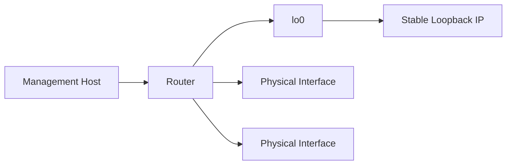
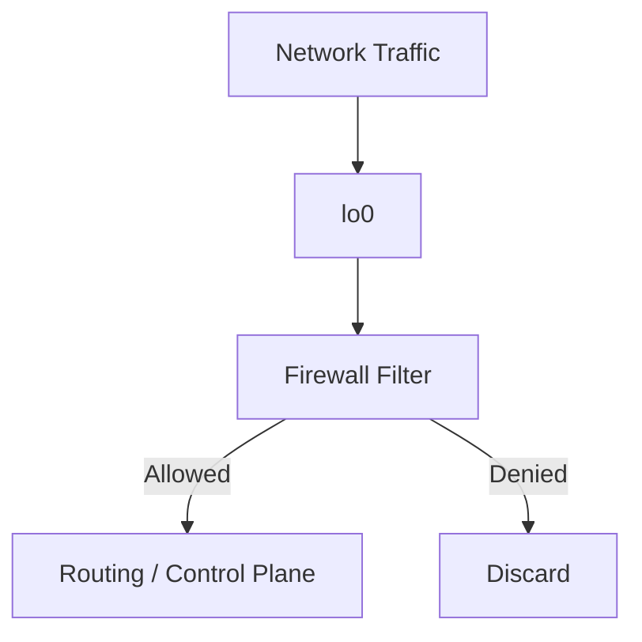
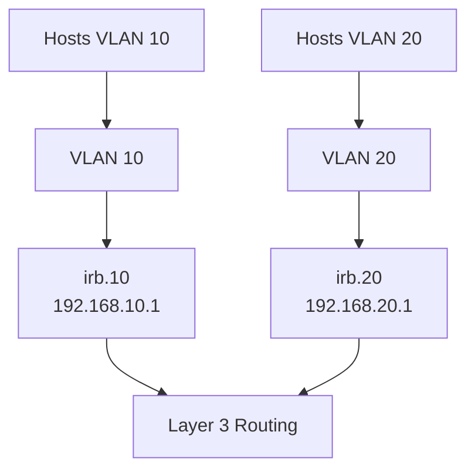
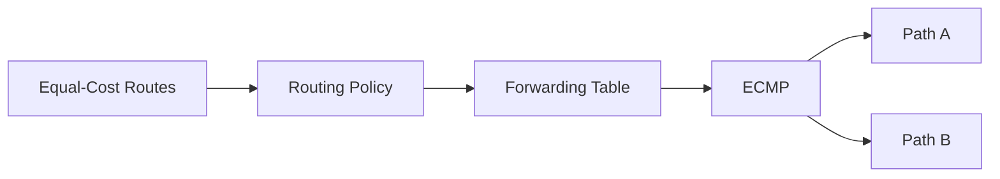
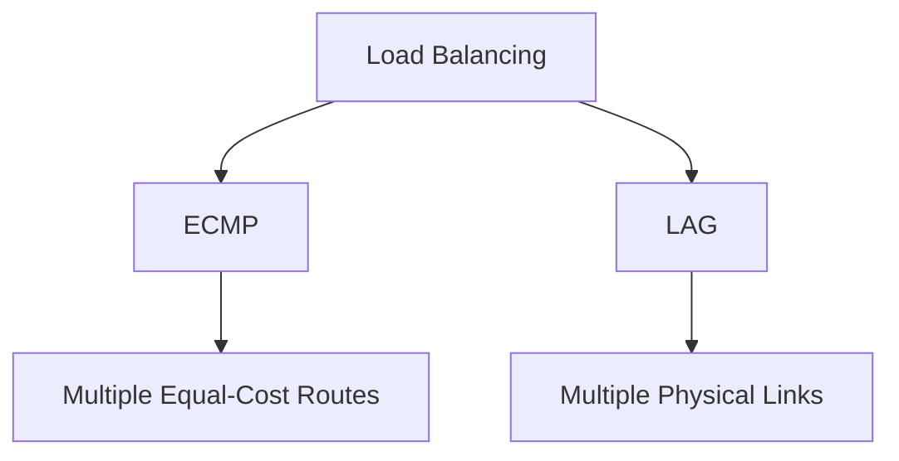

# JNCIA-Junos — IRB, Loopback, Primary/Preferred IP, Load Balancing & LAG

## 1. Loopback Interfaces

Loopback is a **logical, always-up interface** with an IP address reachable through the network.

### Why use loopback?

- Stable management address for SSH.
    
- Provides a consistent source IP regardless of outgoing interface.
    
- Commonly used as a routing-protocol Router ID.
    
- Can be advertised through routing protocols.
    



### Configure IPv4/IPv6

```bash
set interfaces lo0 unit 0 family inet address 192.168.1.1/32
set interfaces lo0 unit 0 family inet6 address 2001:db8:1::1/128
```

Enable OSPF/OSPFv3 advertisement:

```bash
set protocols ospf area 0 interface lo0.0
set protocols ospf3 area 0 interface lo0.0
```

> `lo0` supports multiple logical units; `unit 0` is the normal/default unit.

---

# 2. Verify Loopback

```bash
show route 192.168.1.1/32
```

Check the interface:

```bash
show interfaces terse lo0
```

Test reachability:

```bash
ping 192.168.1.1
```

A remote router can learn the loopback through OSPF and use it as a stable destination.

---

# 3. Loopback & Control-Plane Protection

A loopback can be used as the point where control-plane protection is applied.

A firewall filter on the loopback can restrict traffic destined for the routing/control plane.

Typical purposes:

- Permit only required routing-protocol traffic.
    
- Allow SSH only from trusted sources.
    
- Rate-limit unwanted traffic.
    
- Protect against certain DoS/DDoS traffic.
    



---

# 4. Router ID and Loopback

Many routing protocols use a **Router ID**.

Possible Router ID selection methods discussed:

1. Manually configured Router ID.
    
2. Lowest-numbered IPv4 loopback address.
    
3. Lowest-numbered IPv4 interface address if no loopback is configured.
    

### Important

Adding/changing a loopback address can cause a routing protocol's Router ID to change.

This may cause:

- Adjacency restart.
    
- Neighbor relationship changes.
    
- Route recalculation.
    

Always check the protocol documentation/lab behavior before changing Router ID-related addresses.

---

# 5. IRB — Integrated Routing and Bridging

**IRB (Integrated Routing and Bridging)** provides Layer 3 routing functionality for a Layer 2 VLAN.

It acts as the **default gateway for hosts inside the VLAN**.

```text
Host
  │
  │ Layer 2
  ▼
Switch
  │
  │ IRB
  ▼
Layer 3 Routing
```

### Key idea

> VLAN = Layer 2 broadcast domain  
> IRB = Layer 3 gateway for that VLAN

---

# 6. Why IRB Is Needed

Consider:

```text
VLAN 10 → 192.168.10.0/24
VLAN 20 → 192.168.20.0/24
```

Hosts need a Layer 3 gateway to communicate outside their subnet.

The IRB interfaces provide:

```text
VLAN 10 → irb.10 → 192.168.10.1
VLAN 20 → irb.20 → 192.168.20.1
```



---

# 7. IRB Interface Configuration

Example:

```bash
set interfaces irb unit 10 family inet address 172.16.10.1/24
set interfaces irb unit 20 family inet address 172.16.20.1/24
set interfaces irb unit 30 family inet address 172.16.30.1/24
```

IPv6 uses the same logical interface with `family inet6`.

---

# 8. Associate IRB with VLAN

Use the `l3-interface` statement under the VLAN:

```bash
set vlans Corporate l3-interface irb.10
set vlans Server l3-interface irb.20
set vlans Guest l3-interface irb.30
```

### Important distinction

Creating the IRB:

```bash
set interfaces irb unit 10 ...
```

does **not by itself associate it with a VLAN**.

You must connect it:

```bash
set vlans Corporate l3-interface irb.10
```

---

# 9. Verify IRB

### Interface status

```bash
show interfaces terse irb
```

Shows the logical IRB interfaces and their addresses.

### VLAN information

```bash
show vlans Corporate
```

The basic `show vlans` output may not show all IRB information.

Use:

```bash
show vlans Corporate detail
```

to see:

- VLAN state.
    
- VLAN ID.
    
- L3 interface.
    
- VLAN members.
    
- Tagged/untagged interfaces.
    

---

# 10. IRB Operational Requirement

An IRB can provide Layer 3 gateway functionality while the VLAN has an operationally usable Layer 2 path.

Conceptually:

```text
VLAN
 │
 ├── Physical switch ports
 │
 └── IRB gateway
```

If there is no usable Layer 2 connectivity, the gateway cannot provide useful connectivity to hosts.

---

# 11. Primary vs Preferred IP Addresses

A Junos interface can have **multiple IP addresses**.

Example:

```text
10.1.2.1/24
10.1.2.30/24
10.10.20.1/24
10.10.20.30/24
```

Junos needs to determine which address to use as the **source address** for generated traffic.

---

# 12. `preferred` IP Address

`preferred` determines the preferred source address for traffic destined to a device on the **same subnet**.

Configure:

```bash
set interfaces xe-0/1/5 unit 0 family inet address 10.1.2.30/24 preferred
```

Concept:

```text
Destination = same subnet
        ↓
Use preferred address
```

---

# 13. `primary` IP Address

`primary` determines the source address for traffic destined **outside the local subnet**.

Configure:

```bash
set interfaces xe-0/1/5 unit 0 family inet address 10.10.20.30/24 primary
```

Concept:

```text
Destination = different subnet
        ↓
Use primary address
```

### Critical distinction

|Address flag|Used for|
|---|---|
|`preferred`|Source for traffic to **same subnet**|
|`primary`|Source for traffic to **different subnet**|

These flags are independent.

---

# 14. Default Address Selection

Without manually configuring `primary`/`preferred`, Junos uses its default address-selection behavior.

The module notes that the **lowest-numbered address** wins by default for the relevant selection.

Example:

```text
10.1.2.1
10.1.2.30
```

The lower address can become the selected address unless explicitly overridden.

---

# 15. Verify Primary/Preferred Addresses

Useful command:

```bash
show interfaces xe-0/1/5.0 | find inet | except cache
```

Output identifies flags such as:

```text
Addresses, Flags: Is-Preferred Is-Primary
```

and:

```text
Addresses, Flags: Is-Preferred
```

or:

```text
Addresses, Flags: Is-Primary
```

---

# 16. Source Address Selection Example

Suppose:

```text
Interface:
10.1.2.1/24
10.1.2.30/24
10.10.20.1/24
10.10.20.30/24
```

After configuring:

```bash
set interfaces xe-0/1/5 unit 0 family inet address 10.1.2.30/24 preferred
set interfaces xe-0/1/5 unit 0 family inet address 10.10.20.30/24 primary
```

Then conceptually:

```text
Destination 10.1.2.x
       ↓
10.1.2.30 preferred

Destination 10.10.20.x
       ↓
10.10.20.30 primary
```

---

# 17. Explicit Source Address with Ping

You can override automatic source selection:

```bash
ping 10.1.2.2 source 172.16.10.1
```

Useful when testing:

- Specific interface/address reachability.
    
- Routing behavior.
    
- Return-path connectivity.
    
- Management/control-plane paths.
    

---

# 18. ECMP — Equal-Cost Multipath

When multiple routes to the **same prefix** are equally good, Junos normally selects one active path.

Example:

```text
          Router B
         /        \
Router A            Router D → LAN
         \        /
          Router C
```

If B and C provide equally good paths to the destination, Junos can use **ECMP**.

### Important routing rules

1. **Longest-prefix match first.**
    
2. Route preference is used to choose between routes from **different protocols** for the same prefix.
    
3. If multiple equally good paths remain within the same protocol, ECMP can allow multiple forwarding paths.
    

---

# 19. ECMP Load Balancing

Without ECMP:

```text
Path A ─────────────→ Destination
Path B ─────────────→ Destination
                 X
```

One path is selected.

With ECMP:

```text
              ┌── Path A ──→
Source ───────┤
              └── Path B ──→ Destination
```

Traffic can be distributed across equal-cost paths.

The module describes this as a **per-prefix** forwarding decision and notes that different forwarding implementations can distribute traffic based on flow information.

---

# 20. ECMP and Flows

ECMP does not necessarily mean every packet is independently sprayed across paths.

Forwarding can use a flow-based decision so packets from one flow stay on the same path.

This helps prevent:

```text
Packet 1 → Path A
Packet 2 → Path B
Packet 3 → Path A
```

which could cause packet reordering.

---

# 21. ECMP Configuration Concept

The module notes that ECMP configuration is done using a **routing policy applied to the forwarding table**.

Concept:



More detailed ECMP behavior and per-flow/per-packet terminology are covered later in the Junos Intermediate Routing material.

---

# 22. Link Aggregation Groups — LAG

A **Link Aggregation Group (LAG)** bundles multiple physical links into one logical interface.

Purpose:

- Increase aggregate bandwidth.
    
- Provide link redundancy.
    
- Allow multiple physical links to operate as one logical connection.
    

Example:

```text
Router A
   ║
   ║ 10G
   ║ 10G
   ║ 10G
   ║
Router B
```

becomes logically:

```text
Router A ═════ LAG ═════ Router B
```

---

# 23. LAG vs Increasing One Link

If a single link cannot provide enough bandwidth:

```text
Option 1:
Upgrade one physical link

Option 2:
Bundle multiple links → LAG
```

LAG is useful when:

- Higher-speed upgrade is expensive/unavailable.
    
- Multiple physical interfaces are available.
    
- Additional redundancy is desired.
    

---

# 24. Aggregated Ethernet Interface

Junos represents an aggregated Ethernet interface as:

```text
ae0
ae1
ae2
...
```

Before using `ae0`, enable aggregated Ethernet interfaces.

### Device count

Interfaces start from number `0`.

```bash
set chassis aggregated-devices ethernet device-count 1
```

creates:

```text
ae0
```

```bash
set chassis aggregated-devices ethernet device-count 2
```

creates:

```text
ae0
ae1
```

```bash
set chassis aggregated-devices ethernet device-count 3
```

creates:

```text
ae0
ae1
ae2
```

### Exam trap

If you need:

```text
ae0 + ae1 + ae2
```

use:

```bash
set chassis aggregated-devices ethernet device-count 3
```

---

# 25. Configure the `ae` Interface

Example:

```bash
set interfaces ae0 unit 0 family inet address 10.1.2.1/24
```

The aggregated interface is configured similarly to a normal logical interface.

---

# 26. Enable LACP

LACP = **Link Aggregation Control Protocol**.

It allows devices to negotiate/check the links participating in the bundle.

Configure:

```bash
set interfaces ae0 aggregated-ether-options lacp active
```

### Why LACP?

It helps ensure that links in the bundle are properly participating and operational.


---

# 27. Add Physical Interfaces to `ae0`

Example:

```bash
set interfaces ge-0/0/0 ether-options 802.3ad ae0
set interfaces ge-0/0/1 ether-options 802.3ad ae0
```

`802.3ad` identifies the Ethernet link-aggregation standard.

### Complete basic configuration

```bash
set chassis aggregated-devices ethernet device-count 1

set interfaces ae0 unit 0 family inet address 10.1.2.1/24

set interfaces ae0 aggregated-ether-options lacp active

set interfaces ge-0/0/0 ether-options 802.3ad ae0
set interfaces ge-0/0/1 ether-options 802.3ad ae0
```

---

# 28. LAG Configuration Flow

```mermaid
flowchart TD
    A[Enable Aggregated Ethernet] --> B[Create ae0]
    B --> C[Configure ae0]
    C --> D[Enable LACP]
    D --> E[Add Physical Links]
    E --> F[show | compare]
    F --> G[commit]
    G --> H[Verify ae0 + Members]
```

---

# 29. Verify LAG

Check the aggregated interface:

```bash
show interfaces terse | match ae0
```

Expected conceptual result:

```text
ge-0/0/0.0    up    up    aenet --> ae0.0
ge-0/0/1.0    up    up    aenet --> ae0.0
ae0           up    up
ae0.0         up    up    inet   10.1.2.1/24
```

Verify the bundle and member links using interface/status commands.

---

# 30. LAG Traffic Distribution

Traffic is generally distributed based on flows rather than sending every packet randomly across links.

Concept:

```text
                 ┌── Link 1
Flow A ──────────┤
                 └── Link 2

                 ┌── Link 1
Flow B ──────────┤
                 └── Link 2
```

A particular flow normally remains associated with one member link.

Advanced devices can use more information when calculating flow distribution.

---

# 31. LAG vs ECMP

|Feature|ECMP|LAG|
|---|---|---|
|Works with|Multiple equal-cost routes|Multiple physical links|
|Layer|Routing/forwarding|Link/interface|
|Logical result|Multiple next-hop paths|One aggregated interface|
|Main purpose|Path load balancing|Link bandwidth + redundancy|
|Example|Router A → B/C → D|Router A ↔ Router B via 2+ links|



---

# 32. Important Routing Decision Rules

For JNCIA:

```text
1. Longest Prefix Match
        ↓
2. Route Preference
        ↓
3. Same-protocol equal-cost paths
        ↓
4. ECMP can provide multiple forwarding paths
```

### Key trap

Route preference is **not** the first decision.

A more-specific prefix wins before route preference is considered.

---

# 33. Primary / Preferred Mental Model

```text
Multiple IP addresses
        │
        ├── Same subnet destination
        │       ↓
        │   preferred
        │
        └── Different subnet destination
                ↓
              primary
```

---

# 34. IRB Mental Model

```text
Physical Switch Ports
        ↓
      VLAN
        ↓
    irb.<VLAN-ID>
        ↓
 Layer 3 Gateway
        ↓
 Other Networks
```

Example:

```text
VLAN 10
192.168.10.0/24
       ↓
irb.10
192.168.10.1
       ↓
Routing
```

---

# 35. JNCIA Cheat Sheet

### Loopback

```bash
set interfaces lo0 unit 0 family inet address 192.168.1.1/32
set protocols ospf area 0 interface lo0.0
```

### IRB

```bash
set interfaces irb unit 10 family inet address 172.16.10.1/24
set vlans Corporate l3-interface irb.10
```

Verify:

```bash
show interfaces terse irb
show vlans Corporate detail
```

### Primary / Preferred

```bash
set interfaces xe-0/1/5 unit 0 family inet address 10.1.2.30/24 preferred
set interfaces xe-0/1/5 unit 0 family inet address 10.10.20.30/24 primary
```

### LAG

```bash
set chassis aggregated-devices ethernet device-count 1

set interfaces ae0 unit 0 family inet address 10.1.2.1/24

set interfaces ae0 aggregated-ether-options lacp active

set interfaces ge-0/0/0 ether-options 802.3ad ae0
set interfaces ge-0/0/1 ether-options 802.3ad ae0
```

Verify:

```bash
show interfaces terse | match ae0
```

---

# 36. High-Value Exam Traps

|Question|Answer|
|---|---|
|Stable management interface?|`lo0`|
|IPv4 loopback address?|`lo0.0 family inet`|
|IPv6 loopback?|`lo0.0 family inet6`|
|VLAN Layer-3 gateway?|IRB|
|Attach IRB to VLAN?|`l3-interface irb.X`|
|Reveal IRB logical units?|`show interfaces terse irb`|
|Detailed VLAN + IRB?|`show vlans <name> detail`|
|Same-subnet source selection?|`preferred`|
|Different-subnet source selection?|`primary`|
|Explicit ping source?|`ping <destination> source <IP>`|
|Multiple equal-cost routes?|ECMP|
|Multiple physical links as one logical link?|LAG|
|Aggregated interface name?|`ae0`, `ae1`, ...|
|Enable ae0?|`device-count 1`|
|Enable LACP?|`aggregated-ether-options lacp active`|
|Add physical link to ae?|`ether-options 802.3ad ae0`|
|More-specific route wins before preference?|**Yes**|
|LAG traffic distribution?|Typically flow-based|
|LAG protocol?|LACP / IEEE 802.3ad|

## Core Mental Model

```text
lo0
→ Stable identity / management / Router ID

irb.X
→ Layer-3 gateway for VLAN X

preferred
→ Same-subnet source

primary
→ Different-subnet source

ECMP
→ Multiple equal-cost ROUTES

LAG / aeX
→ Multiple physical LINKS → one logical interface
```