# JNCIA-Junos — XML APIs & Junos Automation

## 1. API — Application Programming Interface

An **API** is an interface that allows software to interact with another software process.

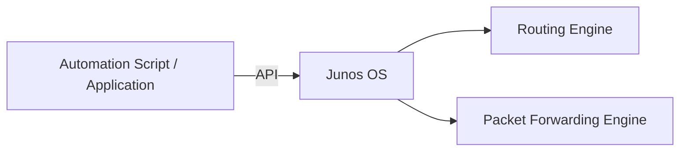

### Key idea

Instead of a human typing CLI commands, software can communicate with Junos through an API.

Examples shown in the module:

- Python
    
- Perl
    
- Ansible
    
- Salt Stack
    
- Puppet
    
- Chef
    
- Juniper automation tools
    
- Mist AI
    
- NETCONF
    
- REST API
    

---

# 2. Why APIs Are Important

Traditional CLI interaction is designed primarily for humans:

```text
Human → CLI → Junos
```

Automation needs something:

```text
Program → Structured API → Junos
```

The output must be:

- Predictable
    
- Structured
    
- Machine-readable
    
- Consistent
    

### Problem with CLI scraping

A script parsing:

```bash
show interfaces
```

has to interpret human-oriented text.

Changes in formatting can break the script.

A structured API avoids this problem.

---

# 3. Requirements for API Communication

To manage Junos through an API, two major things are required:

### 1. Connection protocol

Examples:

- SSH
    
- HTTPS
    
- Other supported management protocols
    

### 2. Structured language

A format that software can reliably understand.

The module introduces **XML** for this purpose.

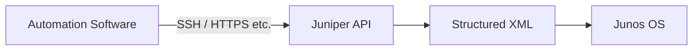

---

# 4. XML — Extensible Markup Language

**XML** is a way of structuring data for:

- Transmission
    
- Storage
    

XML represents information using **tags**.

Example:

```xml
<system-information>
    <hardware-model>mx204</hardware-model>
    <os-name>junos</os-name>
    <os-version>22.4R1.10</os-version>
    <serial-number>ABCD1234</serial-number>
    <host-name>ROUTER_1</host-name>
</system-information>
```

---

# 5. XML Structure

XML data is:

- Hierarchical
    
- Structured
    
- Predictable
    
- Machine-readable
    
- Human-readable
    

Basic structure:

```xml
<tag>
    data
</tag>
```

Opening:

```xml
<hostname>
```

Closing:

```xml
</hostname>
```

### Important

XML tags use **angle brackets**:

```text
<tag> ... </tag>
```

---

# 6. XML Hierarchy

XML naturally represents parent/child relationships.

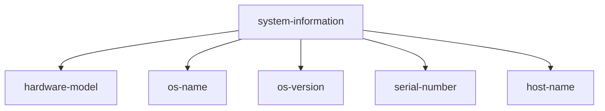

This makes XML suitable for configuration and operational data.

---

# 7. Junos CLI and XML

One important feature of Junos:

> The Junos CLI uses the same underlying XML APIs.

Conceptually:

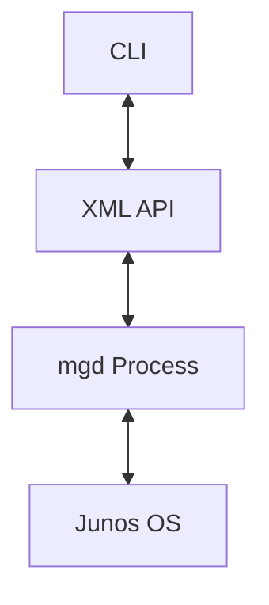

The CLI does not directly manipulate Junos internals.

Instead:

```text
CLI
 ↓
XML API
 ↓
mgd
 ↓
Junos OS
```

---

# 8. `mgd` — Management Daemon

The **`mgd` process** is the Junos management daemon.

The module illustrates the architecture as:

```text
CLI
  ↕
XML API
  ↕
mgd process
  ↕
Junos OS
```

This is a major reason Junos is well suited for automation.

### Key concept

> Automation isn't something bolted onto Junos afterward — automation is built into the architecture.

---

# 9. CLI Command → XML

Consider:

```bash
show system information
```

The user sees readable CLI output.

Internally, Junos can represent the result in XML.

The module demonstrates:

```bash
show system information | display xml
```

This produces structured XML output.

Example:

```xml
<system-information>
    <hardware-model>mx204</hardware-model>
    <os-name>junos</os-name>
    <os-version>22.4R1.10</os-version>
    <serial-number>...</serial-number>
    <host-name>ROUTER_1</host-name>
</system-information>
```

---

# 10. `display xml`

General syntax:

```bash
show <command> | display xml
```

Example:

```bash
show system information | display xml
```

This is extremely useful for understanding how Junos represents CLI data for automation.

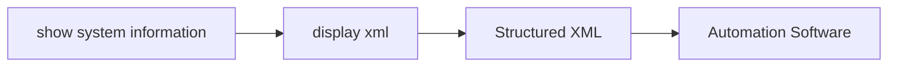

---

# 11. RPC — Remote Procedure Call

The XML output includes an **RPC-related structure**.

RPC means:

> **Remote Procedure Call**

It is a structured mechanism for requesting an operation from another process/system.

Conceptually:

```text
Automation Client
      ↓
   RPC Request
      ↓
    Junos
      ↓
   RPC Reply
```

The module demonstrates the relationship between CLI commands and XML/RPC communication.

---

# 12. `rpc-reply`

When Junos returns XML information in response to an RPC request, the response is typically wrapped in an:

```xml
<rpc-reply>
    ...
</rpc-reply>
```

Example conceptual structure:

```xml
<rpc-reply>
    <system-information>
        ...
    </system-information>
</rpc-reply>
```

This makes the response suitable for software to parse.

---

# 13. CLI vs Automation

### Human workflow

```text
Human
  ↓
CLI command
  ↓
Readable output
```

### Automation workflow

```text
Script
  ↓
API / RPC
  ↓
Structured XML
  ↓
Program parses data
```

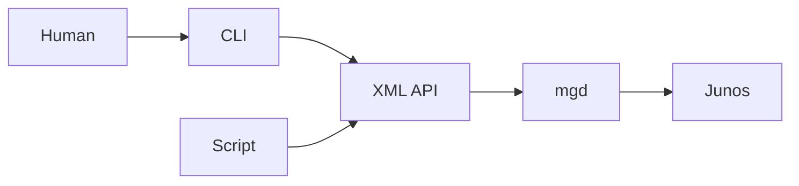

---

# 14. Why Structured Output Matters

Suppose a script needs to extract:

```text
hostname
OS version
hardware model
```

Parsing normal CLI text requires assumptions about:

- Spaces
    
- Line positions
    
- Formatting
    
- Labels
    
- Output changes
    

XML provides explicit elements:

```xml
<host-name>ROUTER_1</host-name>
<os-version>22.4R1.10</os-version>
<hardware-model>mx204</hardware-model>
```

The program can directly locate the required element.

---

# 15. Junos Automation Ecosystem

The module emphasizes that Junos provides **many ways to automate**.

The diagram on page 8 shows multiple automation layers/tools, including:

### Juniper tools

- Juniper automation tools
    
- Juniper APIs
    

### Third-party automation

- Ansible
    
- Salt
    
- Puppet
    
- Chef
    

### Programming/scripting

- Python
    
- Perl
    
- Ruby
    
- PyEZ
    

### Protocol/API options

- NETCONF
    
- REST API
    
- RESTCONF
    
- XML API
    

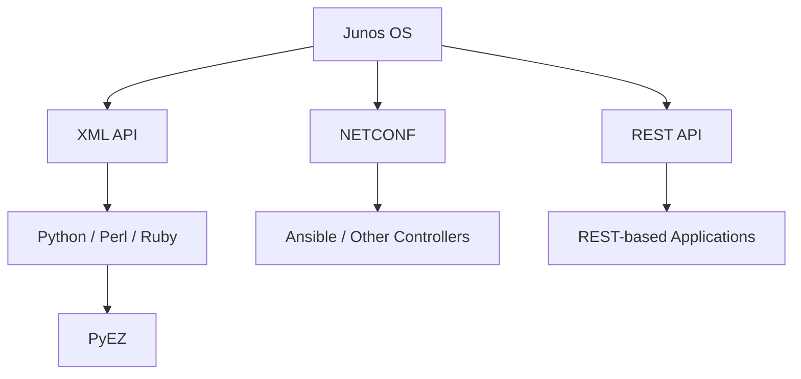

---

# 16. PyEZ

**PyEZ** is a Python library from Juniper Networks.

Purpose:

> Make Junos automation easier from Python.

Instead of manually implementing low-level communication, PyEZ provides higher-level Python functionality.

The module describes PyEZ as a Juniper Networks Python library that reduces the amount of code needed.

### Concept

```text
Python Program
      ↓
     PyEZ
      ↓
Junos API / NETCONF
      ↓
   Junos OS
```

---

# 17. NETCONF

**NETCONF** is a network management protocol.

The module describes it as a protocol that uses:

- RPCs
    
- XML
    

to interact with Junos.

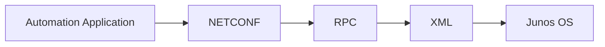

### Key point

NETCONF is particularly associated with **machine-to-machine configuration and operational management**.

---

# 18. REST API

A REST API allows software to manage a device using **HTTP requests**.

Conceptually:

```text
Application
    ↓
HTTP/HTTPS
    ↓
REST API
    ↓
Junos
```

Common HTTP methods include:

```text
GET     → retrieve
POST    → create/action
PUT     → replace/update
PATCH   → partial update
DELETE  → remove
```

> These HTTP-method semantics are useful additional knowledge; the module only introduces REST API at a high level.

---

# 19. XML API vs REST API vs NETCONF

|Technology|Main concept|
|---|---|
|XML API|Structured Junos API|
|NETCONF|Network management protocol using RPC/XML|
|REST API|HTTP-based API|
|PyEZ|Python automation library|
|Ansible|Automation/configuration-management framework|

These are **different interfaces/tools**, but they can ultimately interact with the Junos management architecture.

---

# 20. On-Box vs Off-Box Automation

Automation can run:

### On-box

Directly on the Junos device.

Examples:

```text
Python scripts
Junos automation scripts
```

### Off-box

From an external management system.

Examples:

```text
Ansible server
Python workstation
Network management platform
Mist
Automation controller
```

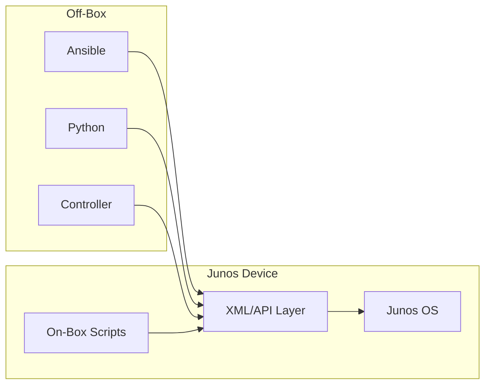

---

# 21. Automation Does Not Require One Specific Tool

A major takeaway from the module:

> Junos supports multiple automation methods, so you can choose the mechanism appropriate for your environment.

Examples:

```text
Simple scripting
→ Python

Large-scale configuration management
→ Ansible

Juniper Python automation
→ PyEZ

Network management protocol
→ NETCONF

HTTP-based integration
→ REST API
```

---

# 22. Automation Architecture

The page 8 diagram provides the overall conceptual stack:

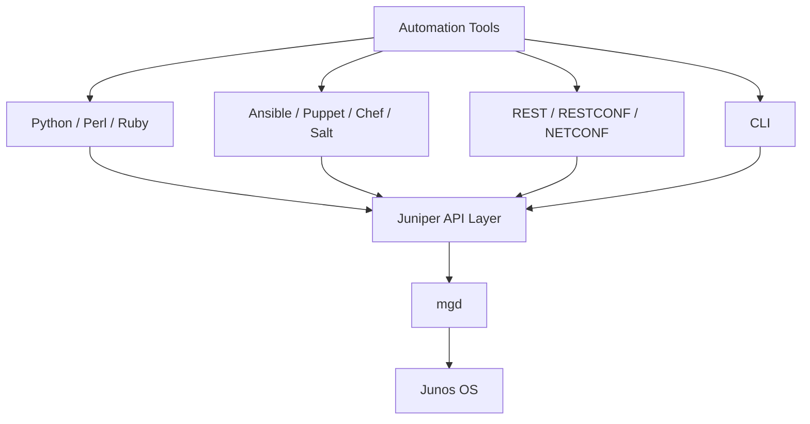

The exact tools available can depend on the Junos platform/version, but the key concept is the common management architecture.

---

# 23. XML vs HTML

A common exam trap:

### HTML

Primarily used to structure/present web content.

### XML

Used to structure data for:

- Transmission
    
- Storage
    

XML data is hierarchical and machine-readable.

```text
XML ≠ HTML
```

---

# 24. XML Key Properties

Remember:

```text
XML
├── Structured data
├── Hierarchical
├── Machine-readable
├── Human-readable
├── Uses tags
└── Useful for transmission/storage
```

Example:

```xml
<interface>
    <name>ge-0/0/0</name>
    <status>up</status>
</interface>
```

---

# 25. Important CLI Commands

### Generate XML from CLI

```bash
show system information | display xml
```

### Normal CLI

```bash
show system information
```

The first is particularly useful for learning how Junos exposes data to automation.

---

# 26. JNCIA Exam Cheat Sheet

```text
API
→ Application Programming Interface
→ Software-to-software interaction

XML
→ Structured data
→ Transmission + storage
→ Hierarchical
→ Uses <angle-bracket> tags

JUNOS CLI
→ Uses XML API underneath

ARCHITECTURE
CLI
 ↓
XML API
 ↓
mgd
 ↓
Junos OS

RPC
→ Remote Procedure Call

RPC RESPONSE
→ rpc-reply

CLI → XML
show system information | display xml

NETCONF
→ Network management protocol
→ RPC + XML

PyEZ
→ Juniper Python library

REST API
→ HTTP-based device interaction

AUTOMATION
→ On-box or off-box

TOOLS
→ Python
→ Perl
→ Ruby
→ Ansible
→ Salt
→ Puppet
→ Chef
→ PyEZ
→ NETCONF
→ REST API
→ Juniper automation tools
```

---

# 27. High-Value Exam Traps

- **API** enables software to interact with another software process.
    
- XML is for **structured data**, not primarily webpage styling.
    
- XML uses **hierarchical tags**.
    
- Junos CLI communicates through the **XML API**.
    
- `mgd` is the Junos **management daemon/process**.
    
- `show ... | display xml` exposes structured XML representation.
    
- **RPC** = Remote Procedure Call.
    
- **NETCONF** uses RPC/XML for network management.
    
- **PyEZ** = Python library for Junos automation.
    
- Automation can be **on-box or off-box**.
    
- Junos supports multiple automation mechanisms rather than requiring one tool.
    
- Raw CLI scraping is less reliable than structured API output.
    
- XML's predictable hierarchy makes it easier for programs to parse.
    

# 28. Quick Mental Model

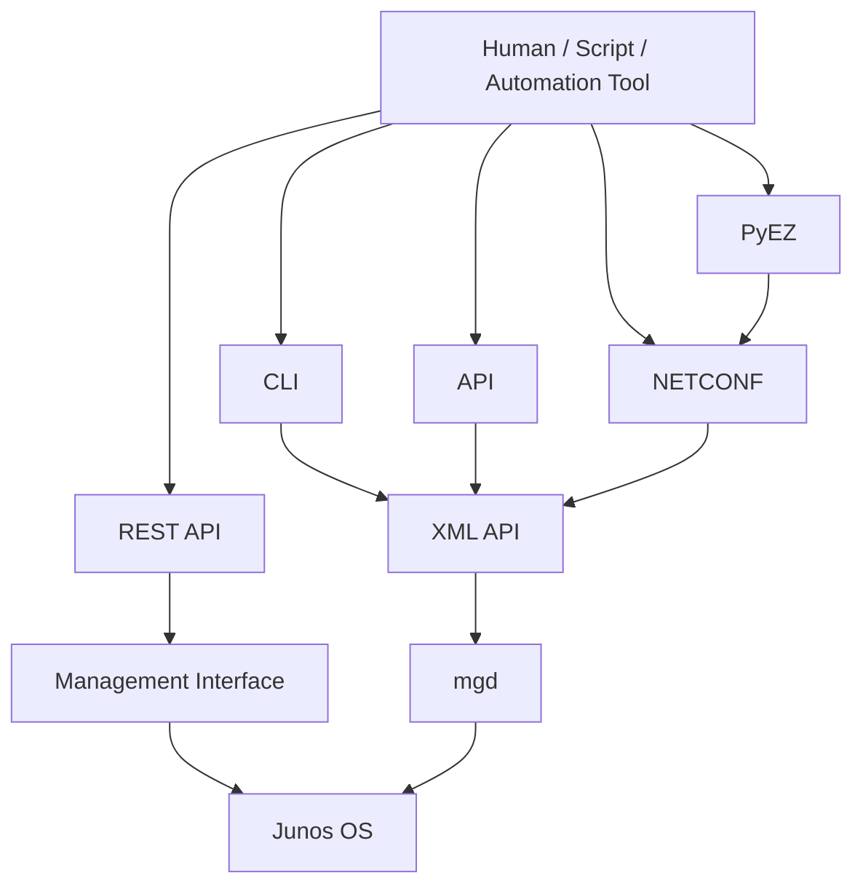

> **Core idea:** Junos was architected with automation in mind. The CLI and automation mechanisms interact with the Junos management architecture through structured APIs, with **XML/RPC and `mgd`** forming the key concepts introduced in this module.