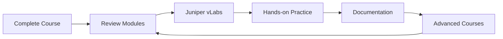
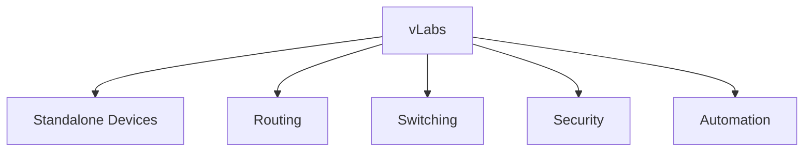
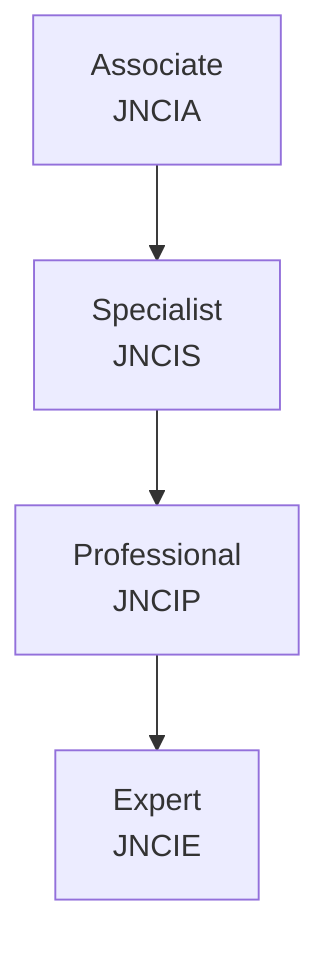
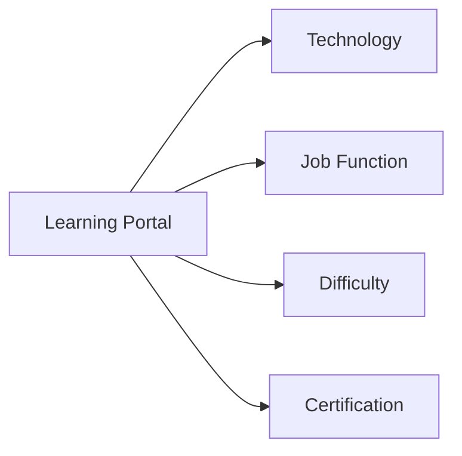
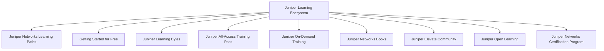

# JNCIA-Junos — Where Do You Go From Here?

## 1. Continue Learning

Completing the Junos course is the **start of continued learning**, not the end.

Recommended approach:

- Review previous modules regularly.
    
- Revisit modules that were skipped.
    
- Continue hands-on practice with Junos.
    
- Build your own labs and troubleshoot different scenarios.
    
- Keep learning through documentation and additional courses.
    



---

# 2. Additional Junos Modules

The course recommends additional modules for deeper knowledge:

- **Routing — A Deeper Dive**
    
- **Junos OS Firewall Filters — A Deeper Dive**
    
- **Logging, Troubleshooting, and Monitoring — A Deeper Dive**
    
- **Junos OS Device Administration — A Deeper Dive**
    
- **Junos OS Routing Policy**
    
- **Upgrading Junos OS**
    
- **J-Web**
    

These extend the foundational JNCIA-Junos knowledge into practical administration and troubleshooting.

---

# 3. Juniper vLabs

**Juniper vLabs** provides browser-based virtual Juniper environments for hands-on practice.

The module highlights:

- Free hands-on access.
    
- Prebuilt topologies.
    
- Preconfigured devices.
    
- On-demand lab environments.
    
- Ability to experiment without owning physical Juniper hardware.
    



---

# 4. vLabs Topology Categories

The module shows several topology categories.

### Standalone

Useful for quickly testing individual commands.

Examples include:

- vMX
    
- vSRX
    
- cSRX
    

### Routing

Provides larger topologies for practicing:

- OSPF
    
- IS-IS
    
- BGP
    
- Routing policies
    
- MPLS-related concepts
    

### Switching

Provides practice environments involving:

- VLANs
    
- Switching
    
- EVPN
    
- RSTP
    
- Aggregation
    

### Security

Provides environments for:

- Zones
    
- Policies
    
- IPsec VPN
    
- NAT
    
- Security configurations
    

### Automation

Provides environments for:

- JET
    
- Junos automation
    
- PyEZ
    
- Programmability
    

---

# 5. vLabs Is a Safe Sandbox

One major benefit:

> You can experiment without worrying about damaging production infrastructure.

You can:

- Delete configuration.
    
- Add configuration.
    
- Break configurations intentionally.
    
- Rebuild configurations.
    
- Troubleshoot failures.
    
- Test unfamiliar commands.
    

```text
Real Network
→ Risk of outage

vLabs
→ Safe experimentation
→ Break → Fix → Learn
```

---

# 6. Create Your Own Labs

The module recommends using vLabs to reproduce exercises from the course.

### Suggested workflow

```text
1. Revisit a course module
        ↓
2. Find commands you want to practice
        ↓
3. Launch suitable vLab topology
        ↓
4. Enter/test the commands
        ↓
5. Change the topology/configuration
        ↓
6. Troubleshoot the results
```

This mirrors how network engineers develop practical skills.

---

# 7. JNCIA-Junos Certification

The module introduces **JNCIA-Junos**:

> Juniper Networks Certified Internet Associate

It is the Associate-level certification for Junos networking knowledge.

The course is part of the recommended training path toward the certification.

### Module-described exam format

The PDF describes the exam as:

- **90-minute exam**
    
- **65 multiple-choice questions**
    

> Certification requirements and exam formats can change, so verify current details with Juniper before registering.

---

# 8. Juniper Certification Track

The module presents four certification levels:



### Associate — JNCIA

Focus:

- Entry-level Junos knowledge.
    
- Basic configurations.
    
- Fundamental networking concepts.
    

### Specialist — JNCIS

Focus:

- Configuration and verification.
    
- Common protocols.
    
- More advanced technology-specific knowledge.
    

### Professional — JNCIP

Focus:

- Difficult protocols.
    
- More complicated networking concepts.
    
- Advanced configuration/troubleshooting.
    

### Expert — JNCIE

Focus:

- Hands-on practical expertise.
    
- Complex real-world scenarios.
    
- Advanced troubleshooting and implementation.
    

---

# 9. Juniper Certification Categories

The module shows certification tracks across multiple technology areas:

|Track|Associate|Specialist|Professional|Expert|
|---|---|---|---|---|
|Automation & DevOps|JNCIA-DevOps|JNCIS-DevOps|—|—|
|Cloud|JNCIA-Cloud|JNCIS-Cloud|JNCIP-Cloud|JNCIE-Cloud|
|Data Center|JNCIA-DC|JNCIS-DC|JNCIP-DC|JNCIE-DC|
|Design|JNCDA|JNCDS-DC / JNCDS-SEC / JNCDS-SP|—|—|
|Enterprise Routing & Switching|JNCIA-Junos|JNCIS-ENT|JNCIP-ENT|JNCIE-ENT|
|Mist AI|JNCIA-MistAI|JNCIS-MistAI|—|—|
|Security|JNCIA-SEC|JNCIS-SEC|JNCIP-SEC|JNCIE-SEC|
|Service Provider Routing & Switching|JNCIA-Junos|JNCIS-SP|JNCIP-SP|JNCIE-SP|

> The PDF itself notes that certification information can change over time.

---

# 10. Recommended Next Courses

## Junos Intermediate Routing

Covers deeper routing topics such as:

- OSPF
    
- IS-IS
    
- BGP
    
- Load balancing
    
- High availability
    
- More advanced routing concepts
    

Recommended toward:

- JNCIS-ENT
    
- JNCIS-SP
    

---

## Junos Enterprise Switching

Covers:

- Spanning Tree
    
- Voice VLANs
    
- Port security
    
- Virtual Chassis
    
- Enterprise switching technologies
    

Recommended toward:

- JNCIS-ENT
    

---

# 11. Other Learning Paths

The module also introduces:

### Introduction to Juniper Mist AI

Focuses on:

- Mist Cloud
    
- Marvis
    
- Wi-Fi management
    
- Wired network management
    

### Juniper Cloud Fundamentals

Introduces:

- Linux
    
- Virtualization
    
- Containers
    
- Kubernetes
    
- Cloud concepts
    

### Introduction to Junos Platform Automation and DevOps

Introduces:

- Python
    
- XML
    
- Automation
    
- DevOps concepts
    

Recommended toward:

- JNCIA-DevOps
    

---

# 12. Juniper Learning Portal

The Juniper Learning Portal provides access to a large catalog of courses.

The module highlights:

- **150+ options** at the time of publication.
    
- Filtering by technology.
    
- Filtering by job function.
    
- Filtering by difficulty.
    
- Certification-oriented training.
    



---

# 13. Free Training Resources

The module recommends **Getting Started With...** training.

Available areas include:

- Networking
    
- Cloud
    
- Wi-Fi
    

These provide additional video-based learning resources.

---

# 14. Juniper Documentation

Juniper's documentation is an important resource for continuing study.

Useful documentation includes:

- Product documentation
    
- Configuration guides
    
- Feature documentation
    
- Protocol guides
    
- Troubleshooting information
    
- Release-specific information
    

Example:

```text
Junos OS
   ↓
Official Documentation
   ↓
Feature / Protocol Guide
   ↓
Configuration
   ↓
Verification
   ↓
Troubleshooting
```

### Practical rule

When working with Junos, prefer documentation corresponding to the **exact Junos release and platform** you're using.

---

# 15. Certification Voucher

The module describes a certification-voucher process:

1. Visit the Juniper Certification Voucher webpage.
    
2. Take the assessment associated with the course.
    
3. Earn the voucher.
    
4. The module states that you then have **30 days** to take and pass the live certification exam.
    

> Treat the 30-day rule as **module-specific historical information** and verify the current voucher terms before relying on it.

---

# 16. Additional Training & Resources

The final page presents the broader Juniper learning ecosystem:



---

# 17. JNCIA-Junos — What to Do After the Course

```text
JNCIA-Junos Fundamentals
        ↓
Practice in vLabs
        ↓
Review + Rebuild Labs
        ↓
Official Documentation
        ↓
JNCIA-Junos Certification
        ↓
Choose Specialization
        ↓
JNCIS / Advanced Training
```

### Practical specialization paths

```text
Routing
→ Intermediate Routing
→ JNCIS-ENT / JNCIS-SP

Switching
→ Enterprise Switching
→ JNCIS-ENT

Security
→ Junos Security
→ JNCIS-SEC

Automation
→ Python / XML / NETCONF / PyEZ
→ JNCIA-DevOps

Cloud
→ Cloud Fundamentals
→ JNCIA-Cloud

Mist
→ Mist AI
→ JNCIA-MistAI
```

---

# 18. Final JNCIA Mental Model

```text
LEARN
→ Understand Junos concepts

CONFIGURE
→ Build configurations

VERIFY
→ show / monitor / test

TROUBLESHOOT
→ Break things in vLabs → fix them

AUTOMATE
→ Python / PyEZ / NETCONF / APIs

DOCUMENT
→ Use Juniper documentation

CERTIFY
→ JNCIA-Junos

SPECIALIZE
→ Routing / Switching / Security /
  Cloud / Mist / Automation
```

## High-Value Takeaways

- **vLabs** = safe environment for hands-on Junos practice.
    
- Use labs to **break, rebuild, and troubleshoot** configurations.
    
- Continue reviewing earlier modules; networking skills require repeated practice.
    
- **JNCIA** = Associate level.
    
- **JNCIS** = Specialist.
    
- **JNCIP** = Professional.
    
- **JNCIE** = Expert.
    
- Juniper has separate tracks for **Enterprise, Service Provider, Security, Cloud, Data Center, Automation, Mist, and Design**.
    
- Official Juniper documentation is essential for exact syntax and release-specific behavior.
    
- After JNCIA, deepen skills through **routing, switching, security, automation, cloud, or Mist** depending on your target path.