# Junos OS — Understanding the Network, SSH & Operational Mode

## 1. Customer Network Topology

Example network:

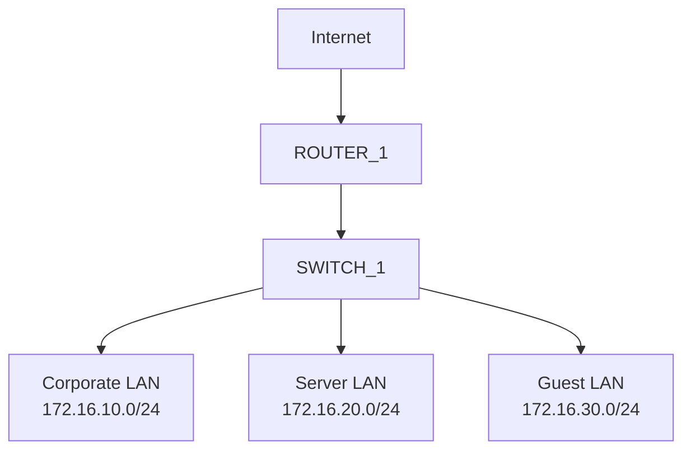

- Router connects the network to the Internet.
    
- Switch connects the three LANs.
    
- A separate link/interface exists between the router and switch for each LAN in the initial design.
    
- The course later improves this design by using **one link capable of carrying all three subnets**.
    

> The topology and design scenario are introduced on pages 2–7.

### WAN vs LAN

- **LAN** → local network.
    
- **WAN** → wide-area network; commonly connects a site to external networks/Internet.
    

---

# 2. SSH Remote Access

SSH provides secure remote access to the Junos CLI.

```bash
ssh username@IP_ADDRESS
```

Example:

```bash
ssh employee@172.16.10.1
```

### Information required

```text
1. Protocol → SSH
2. Username
3. Password
4. Device IP address
```

### SSH vs Telnet

|Feature|SSH|Telnet|
|---|---|---|
|Encryption|✅ Yes|❌ No|
|Security|Secure|Insecure|
|Default port|TCP 22|TCP 23|
|Production use|Recommended|Avoid|

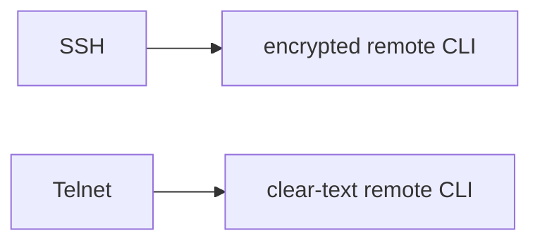

SSH is the preferred method for remote Junos management.

---

## 3. SSH Host-Key Warning

During the first SSH connection, you may see:

```text
The authenticity of host ... can't be established.
Are you sure you want to continue connecting?
```

This occurs because the client does not yet have a trusted host key.

**Verify that the device/IP is really the intended device before accepting the key.**

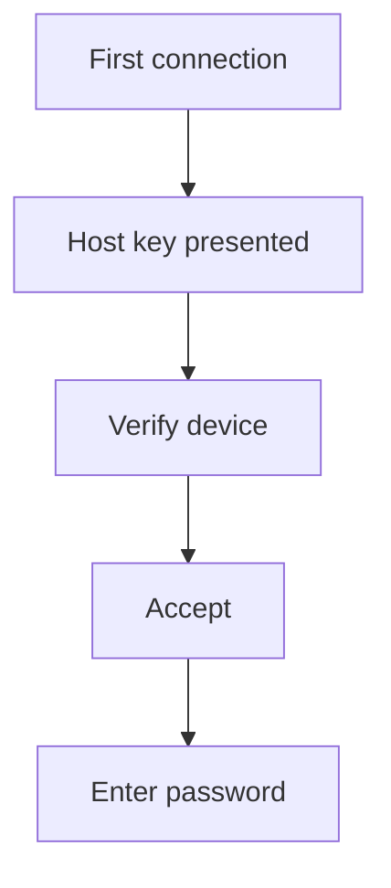

---

# 4. Junos CLI Modes

Junos has two primary CLI modes:

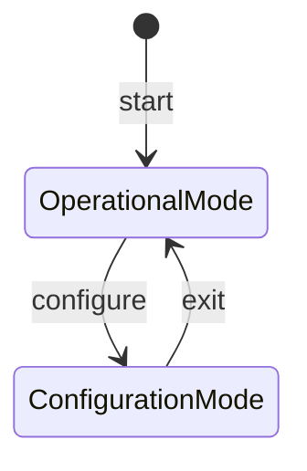

### Operational Mode

Prompt ends with:

```text
>
```

Example:

```text
employee@R1>
```

Used for:

- Verification
    
- Troubleshooting
    
- Monitoring
    
- Administrative tasks
    

### Configuration Mode

Enter with:

```bash
configure
```

Prompt changes to:

```text
[edit]
employee@R1#
```

Return:

```bash
exit
```

> `>` = Operational mode, `#` = Configuration mode.

---

# 5. Operational Mode

Operational mode is mainly used to **view, verify, troubleshoot, and administer** the device.

### Common tasks

- Check interfaces
    
- Check system status
    
- Read configuration
    
- Check routing
    
- Check protocol state
    
- Troubleshoot traffic
    
- Reboot/shutdown
    
- Clear counters
    
- Monitor real-time information
    

---

# 6. Four Important Operational Commands

Remember:

```text
show
monitor
clear
request
```

|Command|Purpose|
|---|---|
|`show`|Display information|
|`monitor`|Display continuously updated information|
|`clear`|Clear/reset statistics or state|
|`request`|Perform administrative actions|

Examples:

```bash
show interfaces
monitor interface traffic
clear interfaces statistics all
request system reboot
```

---

# 7. `show` vs `monitor`

### `show`

Provides a **static snapshot**.

```bash
show interfaces
show system uptime
show system information
```

### `monitor`

Provides **real-time/continuously refreshed information**.

```bash
monitor interface traffic
```

### Easy memory

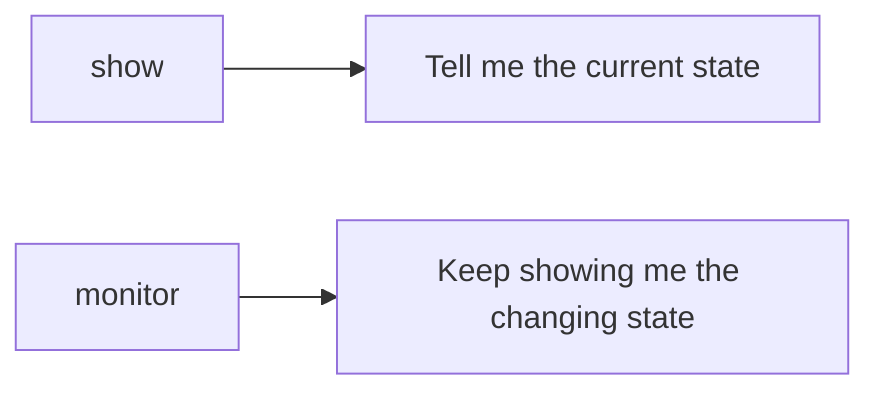

> The distinction is emphasized on pages 26–28.

---

# 8. Useful `show` Commands

### Interfaces

```bash
show interfaces
```

Specific interface:

```bash
show interfaces ge-0/0/1
```

### Routing

```bash
show route
```

### OSPF

```bash
show ospf
```

### Spanning Tree

```bash
show spanning-tree
```

### Configuration

```bash
show configuration
```

### Chassis hardware

```bash
show chassis hardware
```

---

# 9. `clear` Commands

Used primarily during troubleshooting/administration.

Example:

```bash
clear interfaces statistics all
```

Useful for resetting interface counters so you can observe **new traffic/errors** from a clean baseline.

---

# 10. `request` Commands

Used for administrative operations.

Example:

```bash
request system reboot
```

Other `request` commands can perform actions such as:

- Software-related operations
    
- Device reboot
    
- Switching between routing engines on supported platforms
    

---

# 11. `show system uptime`

Displays system uptime and time-related information.

```bash
show system uptime
```

Useful for determining:

- How long the device has been running
    
- Boot time
    
- Current system time
    
- Protocol startup information
    

---

# 12. `show system information`

Displays important device/software information.

```bash
show system information
```

Example information:

```text
Model: MX204
Junos: 22.4R1.10
Hostname: R1
```

Useful for quickly identifying:

```text
Device model
Junos version
Hostname
```

> Pages 36–37 demonstrate `show system uptime` and `show system information`.

---

# 13. Junos Version Format

Example:

```text
22.4R1.10
```

Breakdown:

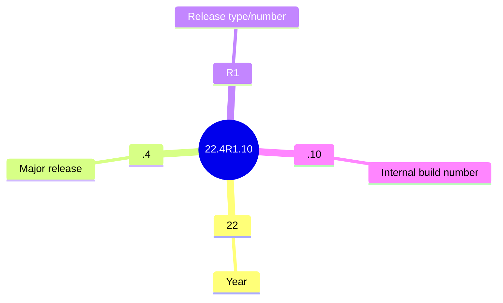

### Release Types

|Type|Meaning|
|---|---|
|`R1`|Feature release|
|`R2/R3...`|Maintenance release|
|`S1/S2...`|Service release|

### Feature Release

Introduces:

- New features
    
- New protocols
    
- Bug fixes from previous releases
    

### Maintenance Release

Generally contains:

- Bug fixes
    
- Standard maintenance updates
    

### Service Release

Released between maintenance releases for:

- Critical errors
    
- Specific customers/use cases
    

> Versioning and release types are covered on pages 38–39.

---

# 14. LLDP — Link Layer Discovery Protocol

**LLDP** discovers directly connected network devices.

It allows devices to advertise information about themselves to neighboring devices.

Typical information can include:

- Hostname/system name
    
- Port information
    
- MAC address
    
- PoE capabilities
    
- Other device information
    


### Main command

```bash
show lldp neighbors
```

Displays connected devices that are also running LLDP.

Example use:

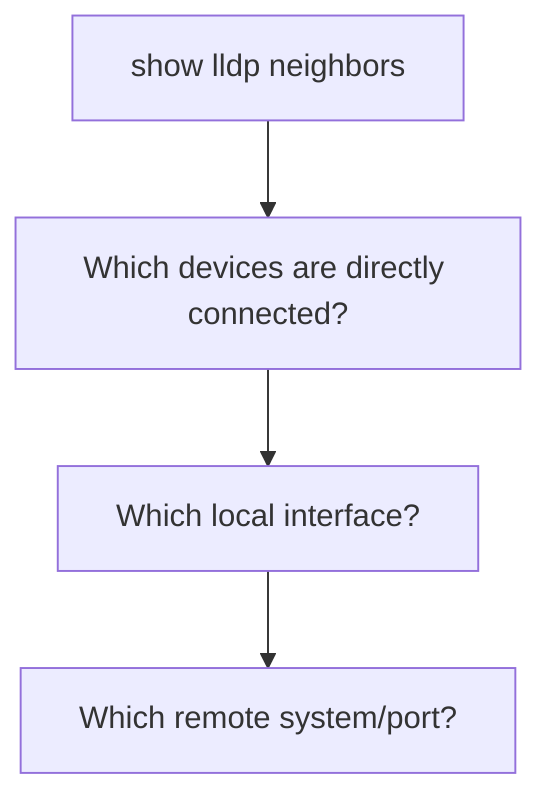

> LLDP functionality and `show lldp neighbors` are covered on pages 44–49.

---

# 15. Why LLDP Is Useful

Useful for:

- Discovering physical topology
    
- Identifying unknown neighbors
    
- Troubleshooting incorrect cabling
    
- Mapping switch/router connections
    
- Verifying expected topology
    

### Important distinction

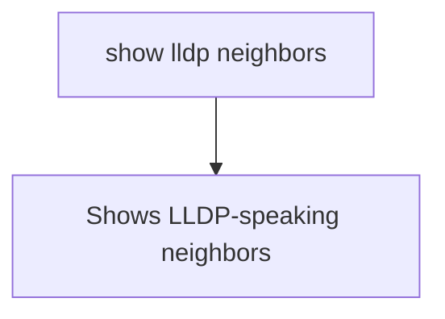

It does **not necessarily show every physically connected device** if LLDP is disabled/not supported.

---

# 16. CLI Command History

Use the keyboard:

```text
↑
```

to retrieve previous commands.

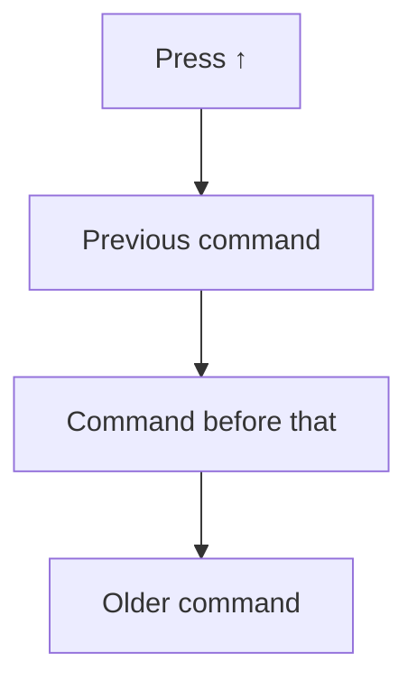

Useful when repeatedly running related commands.

---

# 17. CLI Help

Use:

```text
?
```

to display available commands/options at the current point.

Example:

```bash
show system ?
```

Junos displays available completions such as:

```text
information
uptime
alarms
...
```

### Very important

```text
? → Help / available options
```

This is one of the easiest ways to learn the Junos CLI without memorizing every command.

---

# 18. Auto-Completion

Use:

```text
Tab
```

or:

```text
Space
```

to complete commands.

Example:

```text
show sys
```

then:

```text
Tab
```

→

```text
show system
```

### `Tab`

Useful for automatically completing commands and configured objects.

### `Space`

Can also perform command completion and move through possible completions.

> Auto-completion behavior is demonstrated on pages 55–56.

---

# 19. Ambiguous Commands

If the abbreviation matches multiple possibilities:

```bash
show system a
```

Junos can indicate that the command is ambiguous and show the available options.

Example:

```text
show system a
```

could match:

```text
alarms
audit
```

Then provide more characters:

```bash
show system al
```

---

# 20. Paging Through Long Output

When output is longer than the screen:

```text
---(more)---
```

appears.

Useful keys:

```text
Space → next screen
Enter → next line
q     → quit/exit paging
```

This is especially useful for commands such as:

```bash
show configuration
show interfaces
show system
```

---

# 21. Junos CLI Hierarchy

Commands follow a predictable hierarchy.

Example:

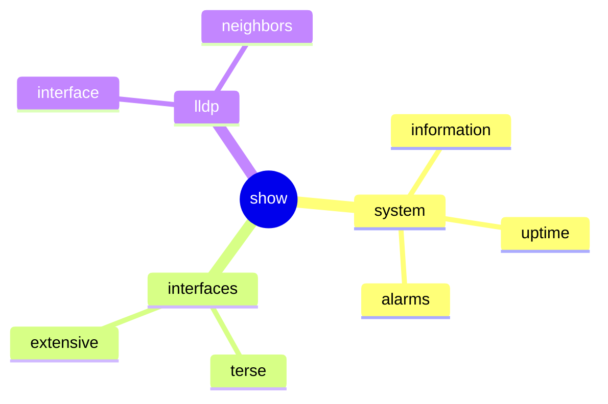

This means you can often **predict commands** by understanding the hierarchy.

---

# 22. Interface Output Levels

Example:

```bash
show interfaces terse
```

Provides concise interface information.

```bash
show interfaces extensive
```

Provides much more detailed interface information.

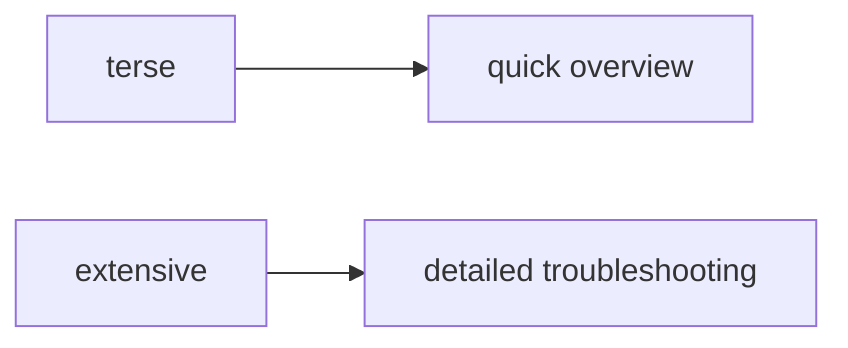

---

# 23. Practical Troubleshooting Flow

When connecting to an unfamiliar Junos device:

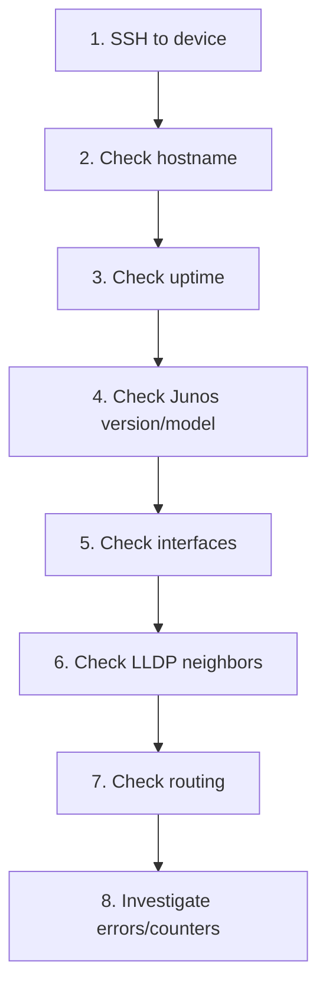

Useful commands:

```bash
show system information
show system uptime
show interfaces terse
show lldp neighbors
show route
show configuration
```

---

# 24. Lab Topology

The lab uses:

```text
Virtual Student Desktop
        |
      Network
        |
    ROUTER_1
```

Management address shown in the lab:

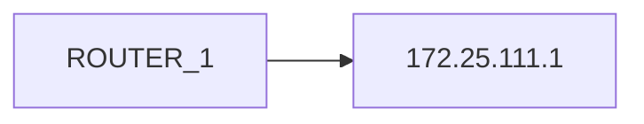

The logical network contains:

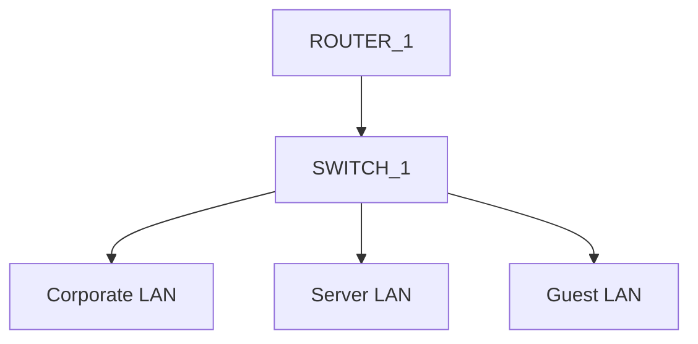

The lab's logical topology also demonstrates IPv4 and IPv6 addressing on the interfaces.

---

# Quick Junos Cheat Sheet

```text
┌──────────────────────────────────────────┐
│ JUNOS CLI                                │
├──────────────────────────────────────────┤
│ >     Operational Mode                   │
│ #     Configuration Mode                 │
│                                          │
│ configure        → enter config mode     │
│ exit             → leave config mode     │
│ ?                → CLI help              │
│ Tab / Space      → auto-complete         │
│ ↑                → command history       │
│                                          │
│ show             → display information   │
│ monitor          → real-time information │
│ clear            → clear/reset state     │
│ request          → admin operations      │
└──────────────────────────────────────────┘
```

### Must-Know Commands

```bash
ssh user@IP

show system information
show system uptime

show interfaces
show interfaces terse
show interfaces extensive

show route
show ospf
show spanning-tree

show lldp neighbors

show configuration

monitor interface traffic

clear interfaces statistics all

request system reboot
```

### Memory Rules

```text
SSH       → Secure remote CLI → TCP/22
Telnet    → Unencrypted       → TCP/23

>         → Operational mode
#         → Configuration mode

show      → Snapshot
monitor   → Real-time

?         → Help
Tab       → Auto-complete
↑         → History

LLDP      → Discover neighbors

/24       → 256 addresses → 254 traditionally usable
```