# JNCIA-Junos — Routing: A Deeper Dive

## 1. Module Objectives

This module extends basic routing into:

- Backup static routes
    
- Advanced static-route features
    
- Remote next-hops / recursive resolution
    
- Routing instances
    
- OSPF areas
    
- IS-IS levels
    
- External networks
    
- Exterior Gateway Protocols
    
- BGP fundamentals
    


---

# 2. Backup Static Routes

A **backup static route** is a less-preferred static route that becomes active when the primary route becomes unavailable.

Typical use:

```text
Primary WAN
    ↓
Internet

Backup WAN
    ↓
Internet
```

The backup route is commonly used for **WAN redundancy**.

### Important

- Primary route → lower preference.
    
- Backup route → numerically higher preference.
    
- Higher preference number = less preferred.
    
- Backup activates when the primary route's next-hop/interface becomes unavailable.
    

---

# 3. Existing Default Static Routes

The module's example starts with:

```bash
show configuration routing-options | display set
```

IPv4:

```bash
set routing-options static route 0.0.0.0/0 next-hop 10.1.254.254
```

IPv6:

```bash
set routing-options rib inet6.0 static route ::/0 next-hop 2001:db8:1:254::254
```

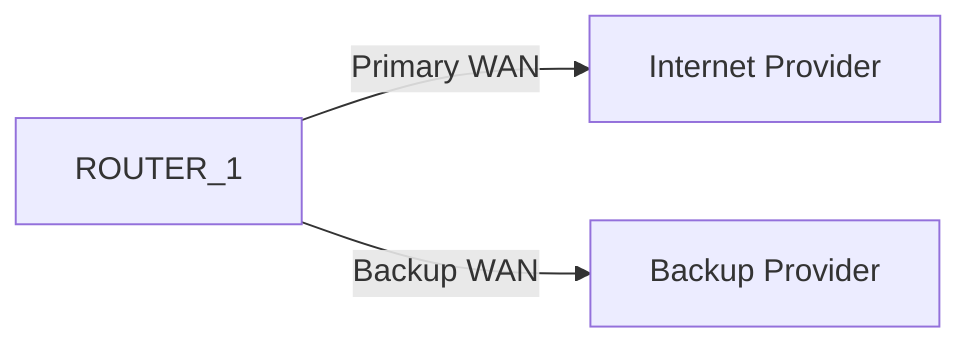

---

# 4. Backup Static Route — IPv4

Primary:

```bash
set routing-options static route 0/0 next-hop 10.1.254.254
```

Backup:

```bash
set routing-options static route 0/0 \
qualified-next-hop 10.10.254.254 preference 7
```

### Key difference

|Primary|Backup|
|---|---|
|`next-hop`|`qualified-next-hop`|
|Default static preference = 5|Explicit preference|
|Preferred|Less preferred|

---

# 5. Why `qualified-next-hop`?

A static route can contain multiple possible next-hops.

```text
0.0.0.0/0
 ├── next-hop 10.1.254.254
 └── qualified-next-hop 10.10.254.254
                         preference 7
```

Junos selects the better route based on route preference.

---

# 6. Choosing Backup Preference

Default static route preference:

```text
Static = 5
```

OSPF:

```text
OSPF = 10
```

The module recommends choosing a backup preference such as:

```text
6–9
```

when you want the backup static route to remain preferred over OSPF.

### Exam rule

```text
Lower preference number
        ↓
More preferred
```

---

# 7. Backup Static Route — IPv6

IPv6 uses the `inet6.0` routing table:

```bash
set routing-options rib inet6.0 static route ::/0 \
next-hop 2001:db8:1:254::254
```

Backup:

```bash
set routing-options rib inet6.0 static route ::/0 \
qualified-next-hop 2001:db8:10:254::254 preference 7
```

### Pattern

```text
IPv4
routing-options static route

IPv6
routing-options rib inet6.0 static route
```

---

# 8. Hierarchical Configuration

IPv4:

```bash
show configuration routing-options static
```

Conceptually:

```text
route 0.0.0.0/0 {
    next-hop 10.1.254.254;
    qualified-next-hop 10.10.254.254 {
        preference 7;
    }
}
```

IPv6:

```bash
show configuration routing-options rib inet6.0 static
```

Each prefix forms its own sub-hierarchy.

---

# 9. Verify Backup Routes

```bash
show route 0/0 exact
```

Example:

```text
0.0.0.0/0 *[Static/5]
    > to 10.1.254.254 via xe-0/1/6.0

[Static/7]
    > to 10.10.254.254 via xe-0/1/7.0
```

Interpretation:

```text
Static/5 → Active
Static/7 → Backup
```

`*` indicates the active route.

---

# 10. Backup Failover

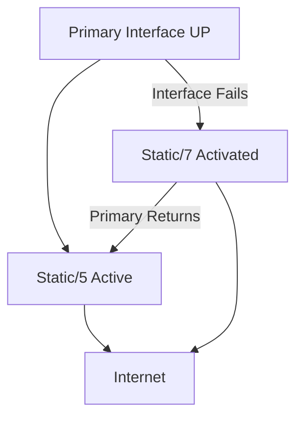

When the primary interface returns:

```text
Backup → Primary
```

automatically.

### Limitation

Backup static routing primarily detects **local next-hop/interface failure**.

A downstream failure may leave the primary interface up while end-to-end connectivity is broken.

For more sophisticated failure detection, dynamic routing or monitoring mechanisms may be appropriate.

---

# 11. Routing Table vs FIB

Both primary and backup routes can appear in the routing table.

Only the selected route is normally used for forwarding.

```text
Routing Table
├── Static/5  ← Active
└── Static/7  ← Backup

        ↓

FIB / Forwarding Table
└── Primary path
```

Advanced mechanisms can preinstall backup paths into the FIB to reduce failover downtime.

---

# 12. Remote Next-Hop Static Routes

By default, a static route's next-hop must be **directly reachable**.

Example problem:

```text
Router A
   |
Router B
   |
Router C
```

If Router A wants:

```text
next-hop = Router C's IP
```

but Router C's IP is not directly connected, the route normally will not be installed.

---

# 13. `resolve`

Use:

```bash
set routing-options static route 172.16.254.0/24 \
next-hop 172.16.40.99 resolve
```

`resolve` tells Junos:

> Perform a recursive lookup to determine how to reach this remote next-hop.

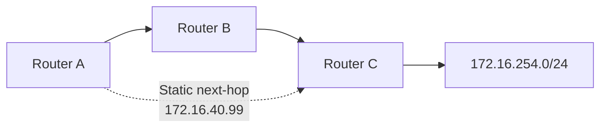

Junos performs:

```text
Lookup destination
      ↓
Find route to remote next-hop
      ↓
Find actual forwarding next-hop
      ↓
Install static route
```

---

# 14. Recursive Lookup

Example:

```text
Configured:
172.16.254.0/24
    next-hop 172.16.40.99
    resolve
```

Junos determines:

```text
172.16.40.99
      ↓
10.1.2.2
      ↓
xe-0/1/5.0
```

So the routing table shows:

```text
172.16.254.0/24
    > to 10.1.2.2 via xe-0/1/5.0
```

---

# 15. OSPF Metric During Recursive Resolution

The example shows:

```text
metric 20
```

This represents the OSPF metric used to reach the intermediate router.

Important:

> This metric is inherited during recursive resolution but is **not used for route selection by the static routing protocol**.

---

# 16. Why Use Remote Next-Hops?

Useful when:

- The next-hop is not directly connected.
    
- Multiple paths exist to the remote next-hop.
    
- You want Junos to dynamically determine the best path to that next-hop.
    

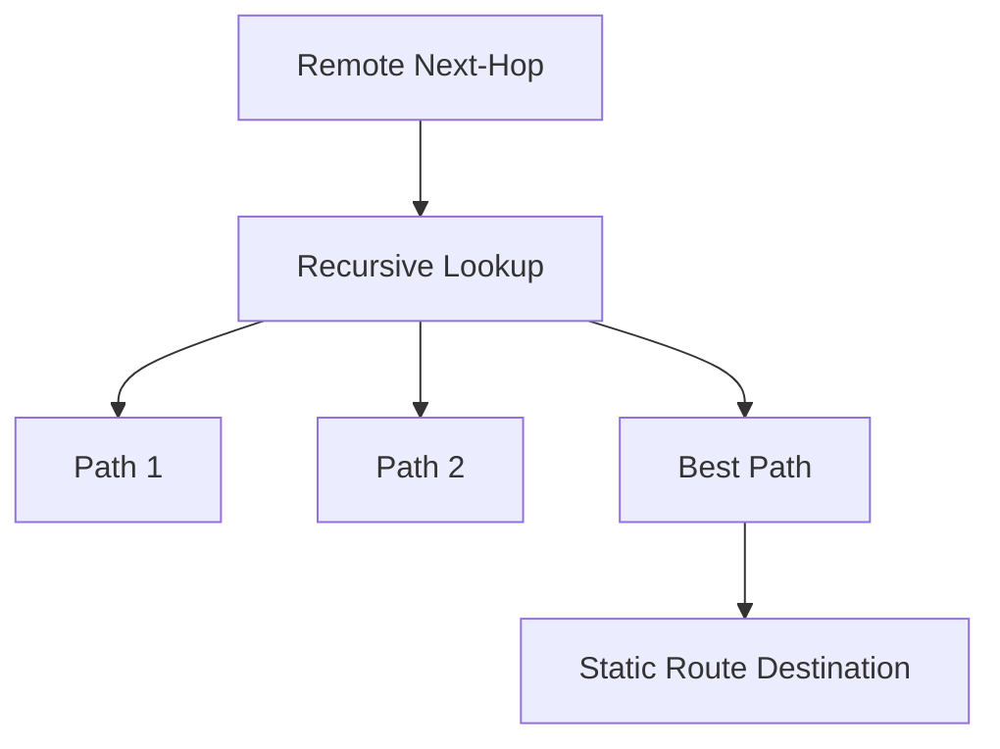

### Mental model

> `resolve` adds a small amount of dynamic behavior to an otherwise static route.

---

# 17. `no-readvertise`

A static route can be prevented from being readvertised by routing policy:

```bash
set routing-options static route 192.168.200.0/24 \
next-hop 172.16.10.5 no-readvertise
```

Purpose:

```text
Static route
    ↓
Routing policy
    ↓
Normally could be advertised
```

With:

```text
no-readvertise
```

the route is excluded from such readvertisement processing.

This becomes particularly useful when working with **Junos routing policy**.

---

# 18. Static Route Advanced Options — Cheat Sheet

|Feature|Keyword|Purpose|
|---|---|---|
|Normal next-hop|`next-hop`|Standard static route|
|Backup next-hop|`qualified-next-hop`|Additional path with preference|
|Recursive next-hop|`resolve`|Allows remote next-hop|
|Prevent readvertisement|`no-readvertise`|Stops routing-policy readvertisement|

---

# 19. Junos Routing Virtualization

Junos can divide one physical device into multiple logical/virtual networking environments.

The module presents three levels:

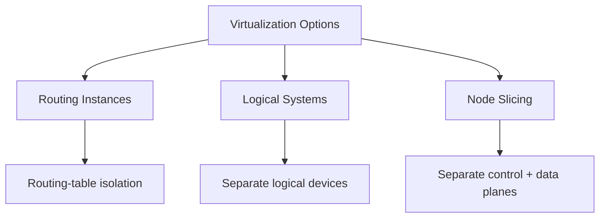

---

# 20. Routing Instances

A **routing instance** creates separate routing tables within the same Junos device.

Example:

```text
Default
inet.0

Customer-A
CUSTOMER_A.inet.0

Customer-B
CUSTOMER_B.inet.0
```

Traffic arriving through interfaces assigned to an instance is looked up in that instance's routing table.

---

# 21. Routing Instance — Key Benefits

### Isolation

Interfaces in the instance use its routing tables.

### Overlapping IP space

Different customers can use identical addresses.

```text
Customer A → 10.0.0.0/24
Customer B → 10.0.0.0/24
```

No conflict because the routing tables are isolated.

### Common uses

- Service providers
    
- Data centers
    
- Multi-tenant environments
    
- Test/production separation
    

---

# 22. Routing Instance Configuration

Create a virtual router:

```bash
set routing-instances TEST_INSTANCE instance-type virtual-router
```

Add interfaces:

```bash
set routing-instances TEST_INSTANCE interface ge-0/0/2.0
set routing-instances TEST_INSTANCE interface ge-0/0/3.30
```

### Important

The IP configuration remains under:

```text
interfaces
```

You only associate the logical interface with the routing instance.

---

# 23. Routing Instance Protocols

Static route:

```bash
set routing-instances TEST_INSTANCE \
routing-options static route 0/0 next-hop 172.16.20.5
```

OSPF:

```bash
set routing-instances TEST_INSTANCE \
protocols ospf area 0 interface ge-0/0/2.0
```

```bash
set routing-instances TEST_INSTANCE \
protocols ospf area 0 interface ge-0/0/3.30
```

The instance keeps its:

- OSPF neighbors
    
- LSAs
    
- Routes
    

logically separate from other OSPF configurations.

---

# 24. Routing Instance Hierarchy

```bash
show configuration routing-instances
```

Concept:

```text
TEST_INSTANCE {
    instance-type virtual-router;

    routing-options {
        static {
            route 0.0.0.0/0 {
                next-hop 172.16.20.5;
            }
        }
    }

    protocols {
        ospf {
            area 0.0.0.0 {
                interface ge-0/0/2.0;
                interface ge-0/0/3.30;
            }
        }
    }
}
```

---

# 25. Routing Tables of an Instance

After commit, Junos creates routing tables according to configured address families.

Default:

```text
inet.0
inet6.0
```

Instance:

```text
TEST_INSTANCE.inet.0
TEST_INSTANCE.inet6.0
```

Verify:

```bash
show route table TEST_INSTANCE.inet.0
```

---

# 26. Example Instance Routing Table

```text
TEST_INSTANCE.inet.0

0.0.0.0/0       [Static/5]
172.16.20.0/24  [Direct/0]
172.16.20.1/32  [Local/0]
172.16.30.0/24  [Direct/0]
172.16.30.1/32  [Local/0]
224.0.0.5/32    [OSPF/10]
```

The table works like the normal routing table; the major difference is its **isolated context**.

---

# 27. Verify Interfaces Inside an Instance

```bash
show interfaces terse routing-instance TEST_INSTANCE
```

Only interfaces assigned to that routing instance are shown.

---

# 28. Test Connectivity Inside an Instance

```bash
ping 172.16.20.5 routing-instance TEST_INSTANCE
```

Other commands can also provide an instance-specific context.

### Mental model

```text
Command
   ↓
routing-instance TEST_INSTANCE
   ↓
TEST_INSTANCE.inet.0
   ↓
Instance-specific interface/path
```

---

# 29. Routing Instance vs Logical System

## Routing Instance

Primarily provides:

- Separate routing tables.
    
- Interface/routing isolation.
    
- Multi-tenant routing.
    

## Logical System

Provides deeper separation:

- More granular user access.
    
- Separate routing-process instances.
    
- More independent logical-device behavior.
    

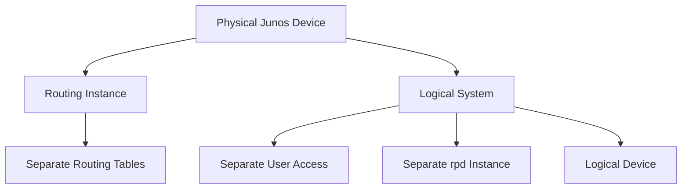

---

# 30. Logical Systems

Logical systems are similar to routing instances but provide stronger separation.

### User separation

Users can be restricted to one logical system.

```text
User-A → Logical System A
User-B → Logical System B
```

They cannot configure other logical systems or the underlying device.

### Process separation

Each logical system gets its own instance of:

```text
rpd
```

If routing functionality in one logical system fails, other logical systems are isolated from that failure.

---

# 31. Logical Systems — Lab Use

A single physical router can represent many logical routers.

Example:

```text
Physical ROUTER_A
 ├── Logical Router 1
 ├── Logical Router 2
 ├── Logical Router 3
 ├── Logical Router 4
 ├── ...
 └── Logical Router 8
```

This is useful for:

- Training labs
    
- Service-provider environments
    
- Resource-efficient testing
    

---

# 32. Node Slicing

**Node slicing** is the most complete virtualization option discussed.

Available on supported **MX Series** platforms.

A physical MX can be divided into multiple partitions called:

> **GNF — Guest Network Function**

Each GNF has its own:

- Control plane
    
- Data plane
    
- Portion of Routing Engine resources
    
- Portion of Packet Forwarding Engine resources
    

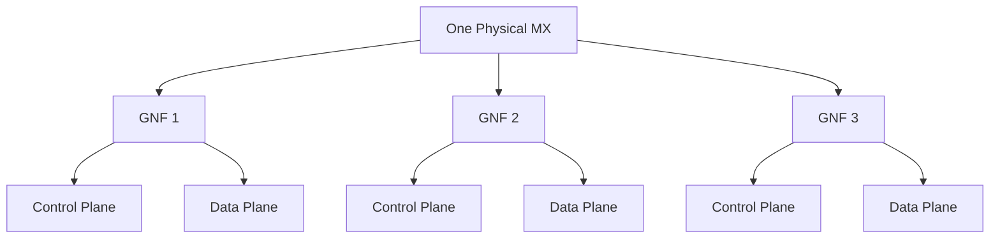

Each GNF can run its own Junos version and be upgraded independently.

---

# 33. Virtualization Comparison

|Feature|Routing Instance|Logical System|Node Slicing|
|---|---|---|---|
|Separate routing tables|✓|✓|✓|
|Overlapping IP space|✓|✓|✓|
|Separate users|Limited|✓|Strong isolation|
|Separate `rpd`|No|✓|✓|
|Separate control plane|No|More isolated|✓|
|Separate data plane|No|No|✓|
|Hardware partitioning|No|No|✓|
|Complexity|Lowest|Medium|Highest|

---

# 34. OSPF Areas — Why?

Large OSPF networks create large:

```text
Link-State Database
```

Every router within an OSPF area needs the topology of that area.

Large topology means:

- More memory.
    
- More processing.
    
- More SPF calculation work.
    

Areas divide the topology.

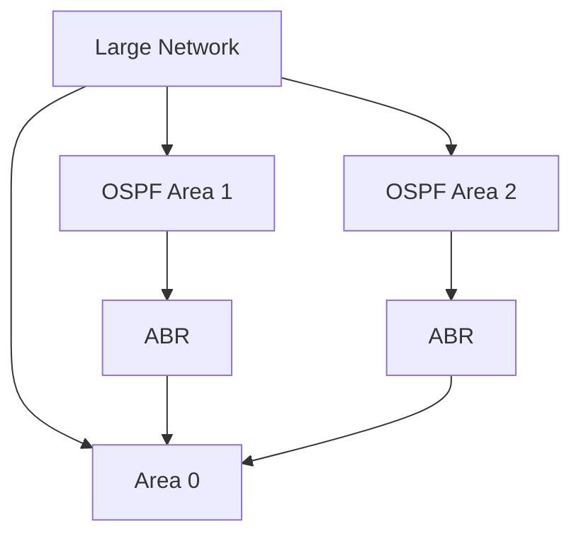

---

# 35. OSPF Area Border Router — ABR

An **ABR** connects different OSPF areas.

Example:

```text
Area 1
   |
  ABR
   |
Area 0
```

An ABR:

- Has interfaces in multiple areas.
    
- Learns topology of connected areas.
    
- Advertises prefixes between areas.
    
- Abstracts away detailed topology.
    

### Important concept

Other areas can learn prefixes without needing the complete topology of the remote area.

---

# 36. OSPF Backbone Area 0

OSPF always has:

```text
Area 0
```

Area 0 is the **backbone**.

Non-zero areas attach to Area 0.

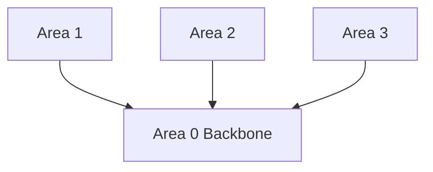

### Rule

```text
Area 1 ── Area 0 ── Area 2
```

rather than:

```text
Area 1 ── Area 2
```

Inter-area traffic is designed to traverse the backbone.

> The module notes that direct physical connections between non-zero areas do not replace the backbone for normal inter-area connectivity.

---

# 37. IS-IS Levels

IS-IS uses **levels** rather than OSPF areas.

Equivalent conceptual structure:

```text
OSPF                IS-IS
----------------------------
Area 0              Level 2
Area 1              Level 1
Area 2              Level 1
```

### IS-IS

- **Level 2** = backbone.
    
- Multiple **Level 1** domains can attach to Level 2.
    
- Level 1/Level 2 routers connect the domains.
    

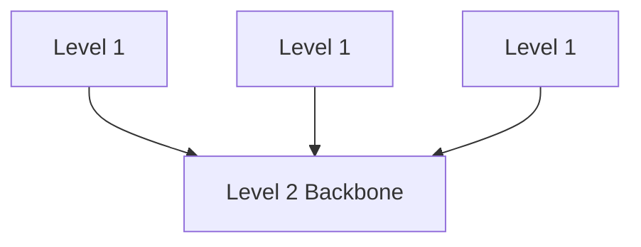

---

# 38. OSPF Areas vs IS-IS Levels

|OSPF|IS-IS|
|---|---|
|Area|Level|
|Area 0|Level 2 backbone|
|ABR|Level 1/Level 2 boundary concept|
|Hierarchical topology|Hierarchical topology|
|Limits LSDB scope|Limits topology scope|

---

# 39. External Networks

The Internet consists of many independent networks:

- Enterprises
    
- ISPs
    
- Transit providers
    
- Content providers
    
- Other organizations
    

Each organization operates its own network.


Each network needs to learn prefixes from other networks.

---

# 40. Why External Routing Is Different

Different organizations have different routing requirements.

Examples:

- Learn only selected customer prefixes.
    
- Learn all Internet prefixes.
    
- Advertise selected prefixes.
    
- Advertise all public prefixes.
    
- Never advertise private/internal prefixes.
    
- Prefer one external connection over another.
    

This requires **policy-driven external routing**.

---

# 41. Enterprise → ISP Example

An enterprise connected to one ISP generally does not need the complete Internet routing table.

Instead:

```text
Enterprise
    ↑
Default route
    ↑
ISP
```

The enterprise can use:

```text
0.0.0.0/0
```

toward the ISP.

The ISP may advertise a much larger routing table internally.

---

# 42. ISP → Internet Example

An ISP may have:

- Multiple customers.
    
- Multiple transit providers.
    
- Direct connections to other ISPs.
    
- Content-provider connections.
    

Therefore, it may need to:

- Learn many/all Internet prefixes.
    
- Select paths on a prefix-by-prefix basis.
    
- Apply routing policy.
    
- Avoid advertising private/internal prefixes.
    

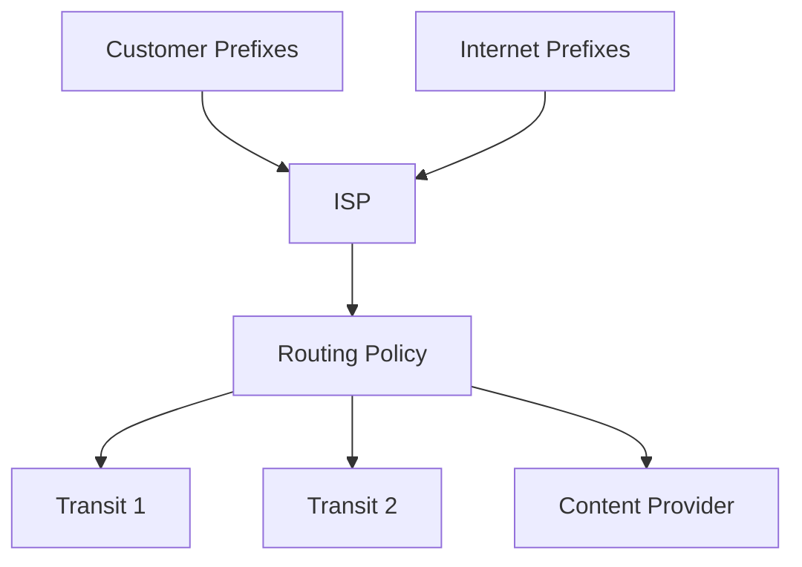

---

# 43. Why Not Use an IGP Between Organizations?

An IGP is designed primarily for **internal routing**.

Using one across the Internet would create major problems.

### 1. Full topology

You don't want to learn the topology of the entire Internet.

### 2. Filtering

External networks need detailed control over which prefixes are advertised.

### 3. Scale

The Internet contains extremely large numbers of prefixes.

### 4. Convergence behavior

IGPs react quickly to topology changes.

Global Internet changes happen constantly, so such behavior would be expensive at Internet scale.

### 5. Administrative boundaries

Different organizations need independent control over their routing policies.

---

# 44. EGP — Exterior Gateway Protocol

Between separate organizations, use an:

> **EGP — Exterior Gateway Protocol**

Concept:

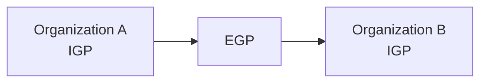

IGP:

```text
Inside organization
```

EGP:

```text
Between organizations
```

---

# 45. BGP — The EGP Used Today

The module identifies:

> **BGP — Border Gateway Protocol**

as the exterior routing protocol used across the global Internet.

Each organization is identified by an:

> **ASN — Autonomous System Number**

Example:

```text
AS 64588
AS 64522
AS 64577
```

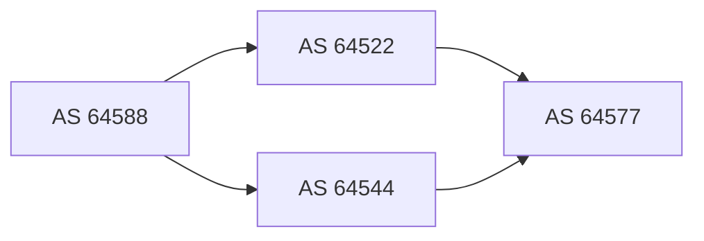

---

# 46. BGP Path Selection — Simplified View

The module introduces BGP's basic idea as:

```text
Shortest AS path
```

Instead of counting router hops like RIP:

```text
RIP:
Router → Router → Router
```

BGP considers:

```text
AS → AS → AS
```

Example:

```text
AS64588 → AS64522 → AS64577
```

= 2 AS hops.

---

# 47. BGP Is Much More Powerful

BGP supports many route attributes.

The module specifically mentions:

- AS-path-related selection.
    
- **Local Preference**
    
- Additional attributes for selecting between routes.
    

### Important added clarification

For real-world Junos BGP, don't reduce the complete best-path algorithm to AS-path length alone. BGP has a defined sequence of attributes and tie-breakers; **Local Preference**, for example, can influence path selection before AS-path length.

---

# 48. BGP Reacts to Failures

BGP dynamically recalculates available paths when external connectivity changes.

Example:

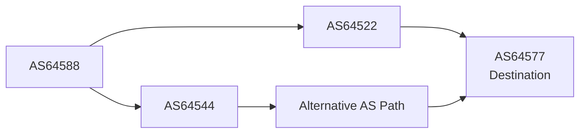

If:

```text
AS64588 → AS64522
```

fails, BGP can select an alternative available AS path.

---

# 49. BGP Example from the Module

For AS64588 reaching the Juniper web-server network hosted by AS64577:

Normal path:

```text
AS64588
   ↓
AS64522
   ↓
AS64577
```

This is two AS hops.

The module emphasizes that BGP's basic AS-path calculation does **not** consider:

- Physical link speed.
    
- Number of internal router hops within an AS.
    
- Internal topology details.
    

This abstraction is essential for Internet-scale routing.

---

# 50. Routing Protocol Comparison

|Feature|Static|IGP|EGP/BGP|
|---|---|---|---|
|Manual configuration|✓|No|No|
|Internal routing|Possible|✓|Possible|
|External routing|Limited|Not ideal|✓|
|Automatic path discovery|✗|✓|✓|
|Internet-scale|✗|✗|✓|
|Policy control|Limited|Limited/varies|Extensive|
|Example|Static route|OSPF / IS-IS|BGP|

---

# 51. Important Routing Mental Model

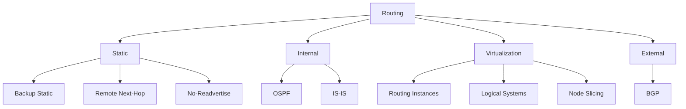

---

# 52. JNCIA High-Value Cheat Sheet

### Backup Static

```bash
set routing-options static route 0/0 \
next-hop 10.1.254.254

set routing-options static route 0/0 \
qualified-next-hop 10.10.254.254 preference 7
```

```text
Static/5 → Primary
Static/7 → Backup
```

---

### IPv6 Backup

```bash
set routing-options rib inet6.0 static route ::/0 \
next-hop 2001:db8:1:254::254

set routing-options rib inet6.0 static route ::/0 \
qualified-next-hop 2001:db8:10:254::254 preference 7
```

---

### Verify

```bash
show route 0/0 exact
show route ::/0 exact
```

---

### Remote Next-Hop

```bash
set routing-options static route 172.16.254.0/24 \
next-hop 172.16.40.99 resolve
```

```text
resolve
→ Recursive lookup
→ Find path to remote next-hop
→ Use resulting forwarding next-hop
```

---

### No Readvertisement

```bash
set routing-options static route 192.168.200.0/24 \
next-hop 172.16.10.5 no-readvertise
```

---

### Routing Instance

```bash
set routing-instances TEST_INSTANCE \
instance-type virtual-router

set routing-instances TEST_INSTANCE \
interface ge-0/0/2.0

set routing-instances TEST_INSTANCE \
routing-options static route 0/0 next-hop 172.16.20.5

set routing-instances TEST_INSTANCE \
protocols ospf area 0 interface ge-0/0/2.0
```

Verify:

```bash
show route table TEST_INSTANCE.inet.0

show interfaces terse routing-instance TEST_INSTANCE

ping 172.16.20.5 routing-instance TEST_INSTANCE
```

---

# 53. Exam Traps

|Concept|Remember|
|---|---|
|Higher route preference number|**Less preferred**|
|Backup static route|`qualified-next-hop`|
|Backup static activation|Primary next-hop/interface unavailable|
|Backup static = dynamic routing replacement?|**No**|
|Remote static next-hop|`resolve`|
|`resolve`|Recursive lookup|
|Recursive lookup metric|Not used by static protocol selection|
|Prevent static readvertisement|`no-readvertise`|
|Routing instance|Separate routing tables|
|Instance IPv4 table|`<instance>.inet.0`|
|Instance IPv6 table|`<instance>.inet6.0`|
|Overlapping customer IPs|Routing instances isolate tables|
|Logical system|More granular user/process isolation|
|Separate `rpd`|Logical systems|
|Node slicing|Most complete virtualization|
|Node-slicing partition|GNF|
|OSPF backbone|Area 0|
|OSPF boundary router|ABR|
|IS-IS backbone|Level 2|
|IS-IS internal domain|Level 1|
|External routing|EGP|
|Internet EGP|BGP|
|BGP organization identifier|ASN|
|BGP simplified path metric|AS-path length|
|BGP policy capability|Extensive|

---

# 54. Final Mental Model

```text
STATIC ROUTING
│
├── Backup
│   └── qualified-next-hop + preference
│
├── Remote Next-Hop
│   └── resolve → recursive lookup
│
└── Routing Policy
    └── no-readvertise
        │
        ▼
VIRTUALIZATION
│
├── Routing Instance
│   └── Separate routing tables
│
├── Logical System
│   └── Separate users + rpd
│
└── Node Slicing
    └── Separate control/data planes
        │
        ▼
INTERNAL ROUTING
│
├── OSPF
│   └── Areas → Area 0 backbone
│
└── IS-IS
    └── Levels → Level 2 backbone
        │
        ▼
EXTERNAL ROUTING
│
└── BGP
    ├── ASN
    ├── AS path
    ├── Route attributes
    └── Internet-scale policy
```

## What to Learn Next

The module points toward **Junos Intermediate Routing**, covering deeper topics including:

- Multiple OSPF areas
    
- LSA types
    
- LAN interfaces
    
- IS-IS
    
- Internal vs external BGP
    
- BGP neighbors
    
- BGP route attributes
    
- Route aggregation
    
- Hidden routes
    
- Load balancing
    
- Protocol-independent routing