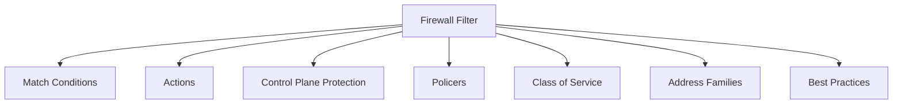
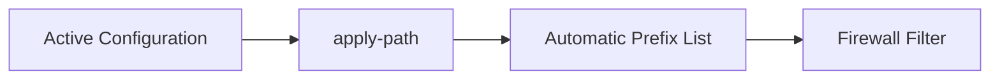
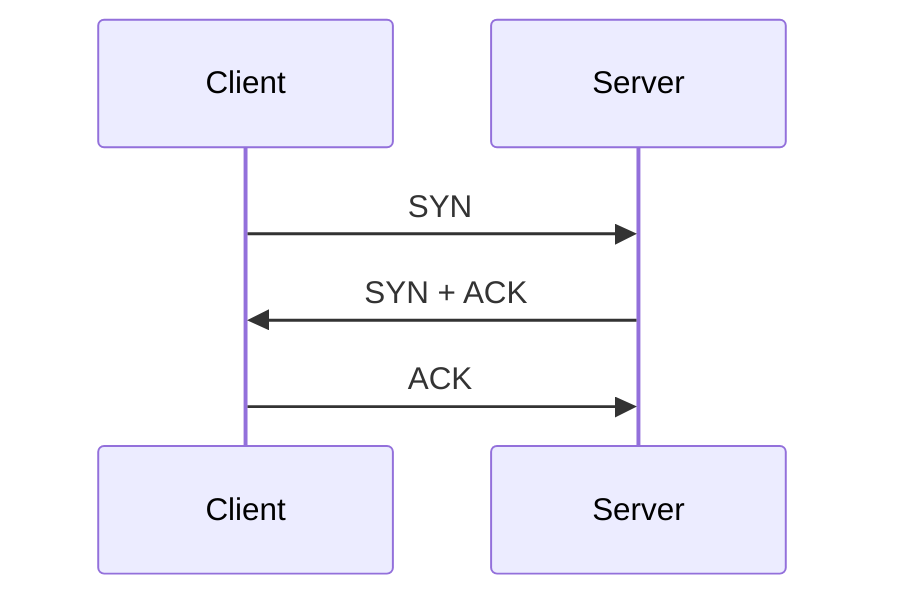
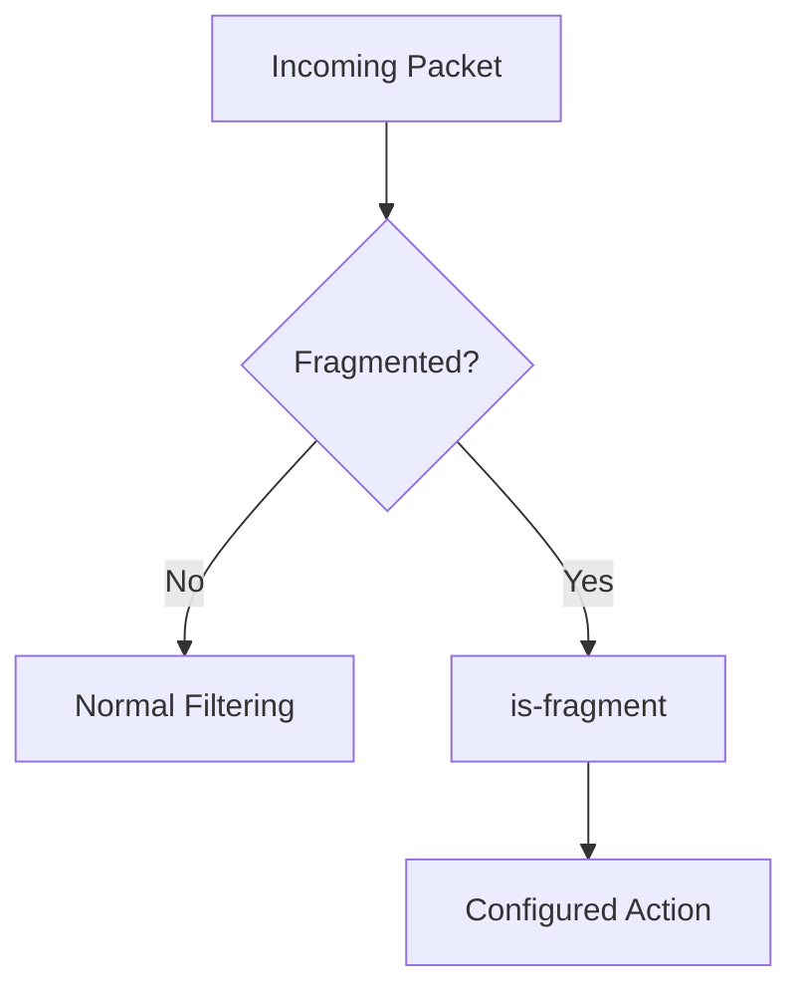
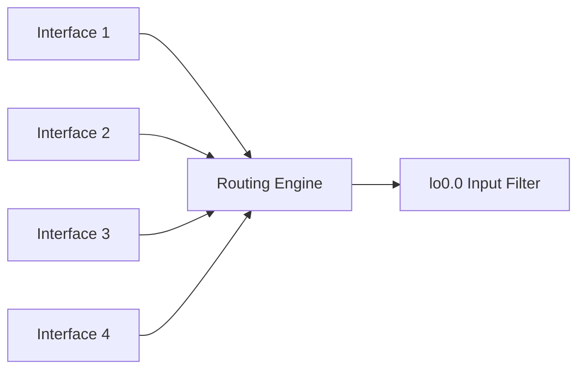
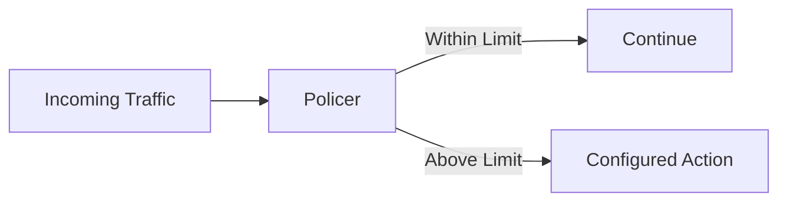
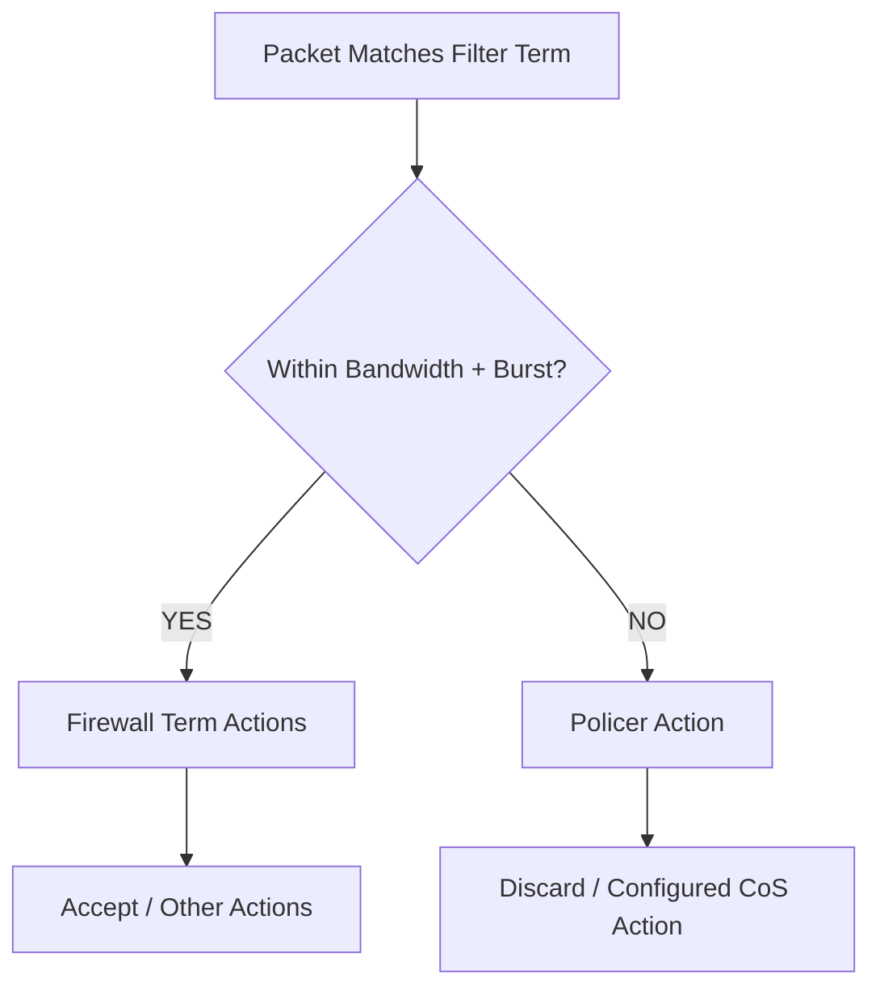
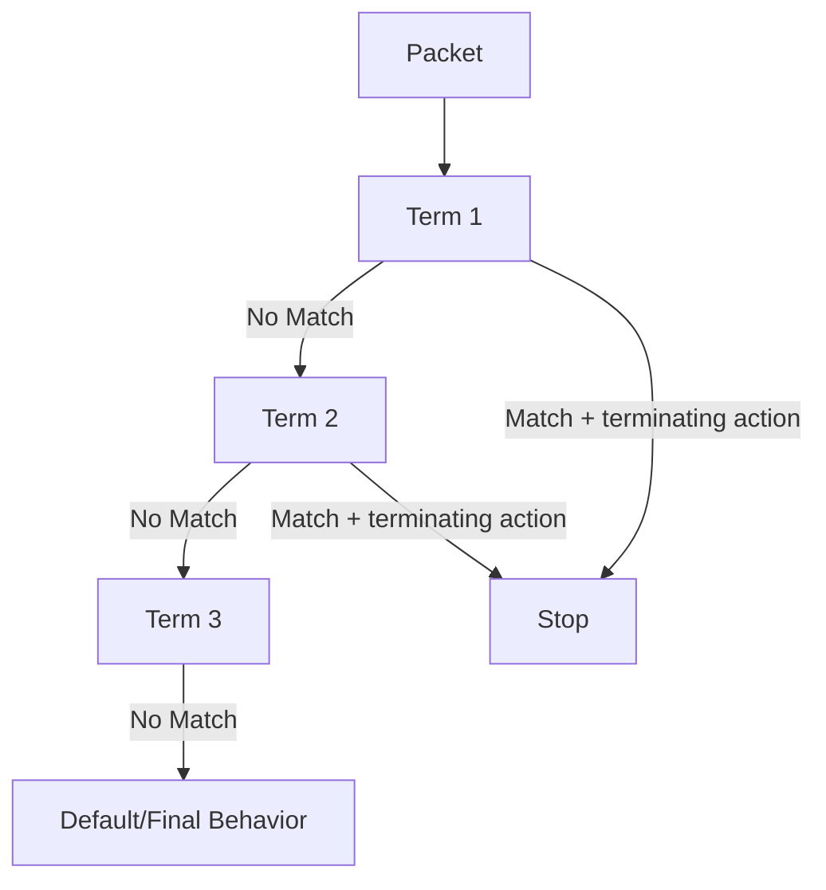
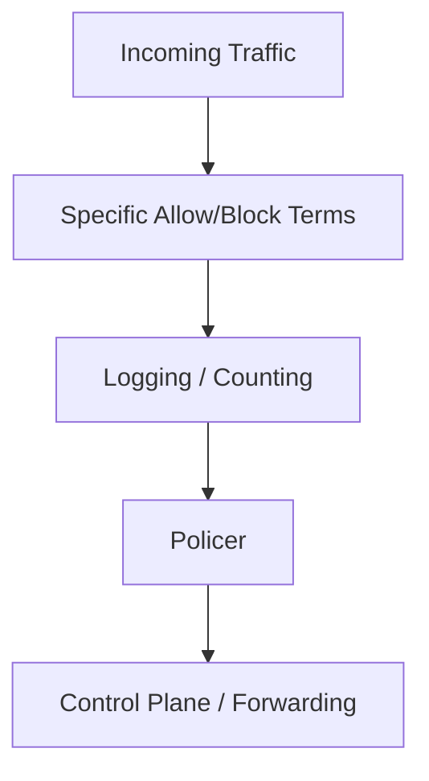
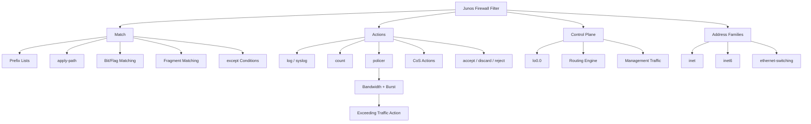

# Junos OS Firewall Filters — A Deeper Dive

## 1. Module Objectives

- Advanced firewall-filter **match conditions**
    
- Advanced firewall-filter **actions**
    
- **Control-plane protection**
    
- **Policers** for traffic rate limiting
    
- Firewall-filter **caveats and best practices**
    
- Filters for `inet`, `inet6`, and `ethernet-switching` families
    
- Multiple filters on an interface
    



---

# 2. Prefix Lists

A prefix list provides a **named collection of IP prefixes** that can be reused inside firewall-filter terms.

Advantages:

- Easier to read than repeatedly writing addresses.
    
- Easier to maintain.
    
- Useful when many addresses belong to the same logical group.
    

Concept:

```text
Prefix List
   ↓
Source/Destination Match
   ↓
Firewall Term
   ↓
Action
```

Example structure:

```text
policy-options {
    prefix-list TRUSTED-HOSTS {
        172.16.10.11/32;
        172.16.10.12/32;
    }
}
```

Then reference it from a filter term.

---

# 3. Automatic Prefix Lists — `apply-path`

Junos can automatically populate a prefix list from values already present elsewhere in the configuration.

Keyword:

```text
apply-path
```

This avoids manually maintaining addresses.



Useful examples:

- All configured interface subnets.
    
- All explicitly configured BGP neighbors.
    
- Static-route prefixes.
    
- Any other IP/subnet represented in the configuration hierarchy.
    

The `*` wildcard can represent any value while walking the configuration hierarchy.

---

# 4. Why `apply-path` Is Useful

Instead of:

```text
Manually maintain 20 IP addresses
        ↓
Update prefix list whenever configuration changes
```

Use:

```text
Configuration
      ↓
apply-path
      ↓
Automatically updated prefix list
```

### Security benefit

For example, a control-plane filter can automatically allow BGP traffic only from **currently configured BGP neighbors**.

---

# 5. Bit-Field Match Conditions

Firewall filters can match:

1. Addresses
    
2. Numbers/ranges
    
3. Specific **bits/flags** in packet headers
    

Example:

```text
tcp-flags
```

TCP flags include:

```text
SYN
ACK
FIN
RST
PSH
URG
```

Example:

```text
tcp-flags "syn"
```

or:

```text
tcp-flags "syn no-ack"
```

The latter identifies packets with:

```text
SYN = set
ACK = not set
```

This can identify TCP connection attempts.

---

# 6. TCP SYN Filtering

Concept:



A filter matching:

```text
SYN + no ACK
```

can identify the initial connection request.

Potential use:

- WAN ingress filtering
    
- Visibility
    
- Restricting unwanted inbound connection attempts
    

---

# 7. `ip-options`

Junos can also match IP-header options using:

```text
ip-options
```

This is a specialist match condition useful when dealing with unusual/specific IP-header behavior.

The module also demonstrates that some match conditions can operate on raw bit values represented in hexadecimal.

---

# 8. Fragmented Traffic

Fragmented packets can be difficult to filter using normal transport-layer conditions.

Why?

```text
First fragment
├── IP header
└── TCP/UDP header

Later fragment
├── IP header
└── Fragment payload
   └── No normal TCP/UDP header
```

Therefore, a rule such as:

```text
destination-port 443
```

may not identify later fragments.

Use:

```text
is-fragment
```

to match fragmented packets.

---

# 9. Why Block Fragments?

Some networks intentionally block fragmented traffic.

Reasons include:

- Performance/security considerations.
    
- Simplifying filtering.
    
- Avoiding problematic fragment handling.
    
- Historical DoS techniques involving large numbers of out-of-order/missing fragments.
    



---

# 10. Inverse Match Conditions — `-except`

Many Junos match conditions have an inverse form ending in:

```text
-except
```

Example:

```text
protocol-except
```

Meaning:

> Match everything except the specified protocol.

Example:

```text
protocol-except udp
```

matches:

```text
TCP
ICMP
Other protocols
```

but **not UDP**.

Other examples:

```text
destination-port-except
icmp-code-except
ip-options-except
```

---

# 11. `except` for Visibility

An `-except` term is useful for logging/counting traffic without necessarily deciding its fate.

Example logic:

```text
Term 1
  ↓
Log all non-UDP traffic
  ↓
next term
  ↓
Later terms decide accept/discard
```

This is useful temporarily for troubleshooting, but excessive logging can consume resources.

---

# 12. IP `except`

For IP addresses/prefix lists, `except` is placed after the address/prefix-list match.

Concept:

```text
Match:
172.16.10.0/24 except 172.16.10.50/32
```

Meaning:

```text
Match entire subnet
        except
one host
```

Useful for:

```text
Block subnet
      ↓
Allow one exception
```

---

# 13. Firewall Filter Actions

Common actions include:

```text
then accept
then discard
then reject
then log
then count
then next term
then syslog
then policer
```

Actions can be broadly divided into:

### Terminating

Stops processing.

```text
accept
discard
reject
```

### Non-terminating

Performs an action and can continue processing.

```text
log
count
next term
```

---

# 14. `then log`

`then log` records information about matching traffic.

Important behavior:

- It has an implicit `accept`.
    
- It is a non-terminating action in the relevant filter-processing context described by the module.
    
- Traffic information is stored temporarily in line-card/PFE-related memory.
    
- View with:
    

```bash
show firewall log
```

---

# 15. Firewall Log

Typical information includes:

```text
Time
Interface
Protocol
Source
Destination
Ports
```

Detailed output:

```bash
show firewall log detail
```

The `detail` option provides additional packet/header information such as TCP/UDP details and ICMP message types.

---

# 16. `log` vs `syslog`

Two logging approaches are discussed:

```text
then log
   ↓
Firewall/PFE traffic logging

then syslog
   ↓
Routing Engine / system logging
```

The `Filter` field in firewall logs can indicate:

```text
pfe
```

for transit traffic processed by the PFE.

Control-plane logging can identify the firewall filter responsible for processing the traffic.

---

# 17. Syslog Traffic Logging — Caution

Logging every packet can be expensive.

```text
Millions of packets
      ↓
Millions of log events
      ↓
RE CPU usage
      +
Disk writes
      +
Log-file growth
```

Potential consequences:

- Routing Engine CPU consumption.
    
- Disk writes.
    
- Log files filling quickly.
    
- Useful security/operational events being overwritten by noise.
    

Therefore:

> Log selectively rather than blindly logging every packet.

---

# 18. Control Plane Protection

A router has two major traffic categories:

```text
Transit Traffic
    ↓
PFE
    ↓
Forwarded

Control-Plane Traffic
    ↓
Routing Engine
    ↓
Processed by Junos
```

Protecting the Routing Engine is important because management and routing protocols terminate there.

---

# 19. Control Plane Firewall Filter

Instead of applying a control-plane filter to every physical/logical interface, Junos provides a centralized method.

Apply the filter as an **input filter to `lo0.0`** in the default routing instance.



The filter protects traffic destined for the Routing Engine regardless of which network interface the traffic entered through.

---

# 20. Control Plane Filter — Important Detail

`lo0.0` does **not** need to have an IP address for this control-plane protection technique.

The firewall filter itself provides the protection.

Also, the mechanism protects the control plane even when the device has dual Routing Engines.

---

# 21. Control Plane Filter Example

Example policy:

```text
Source 172.16.10.11
        ↓
      SSH
        ↓
     ACCEPT

OSPF
 ↓
ACCEPT

PING
 ↓
ACCEPT

Everything else
 ↓
LOG + DISCARD
```

The example contains four terms:

1. Allow SSH from `172.16.10.11/32`
    
2. Allow OSPF
    
3. Allow ICMP/ping
    
4. Log + discard everything else
    

---

# 22. Safe Control-Plane Filter Deployment

During initial deployment:

```text
Final term
    ↓
log + accept
```

Observe what is being denied.

Then add missing legitimate protocols.

Finally:

```text
Final term
    ↓
log + discard
```

This prevents accidentally breaking required management/routing traffic.

---

# 23. What Should a Control-Plane Filter Allow?

Allow protocols actually required by your device/network, such as:

- SSH
    
- OSPF
    
- BGP
    
- ICMP
    
- NTP
    
- SNMP
    
- BFD
    
- RADIUS
    
- TACACS+
    

Use valid neighboring/management source addresses wherever possible.

---

# 24. `apply-path` + Control Plane

A powerful combination:

```text
Configured BGP neighbors
        ↓
apply-path
        ↓
Automatic prefix-list
        ↓
BGP source filter
        ↓
Only configured neighbors allowed
```

This avoids manually updating the control-plane firewall filter whenever a BGP neighbor changes.

---

# 25. Routing-Instance Control Plane Filters

Control-plane protection has an important routing-instance consideration.

If multiple routing instances have their own loopback interfaces:

```text
Default RI → lo0.0
RI-A       → lo0.x
RI-B       → lo0.y
```

the appropriate control-plane protection must be applied to each relevant loopback.

---

# 26. Management Interface Caveat

On router/firewall platforms:

```text
lo0.0 filter
      ↓
Can also protect fxp0 traffic
```

However, on most EX/QFX switches:

```text
lo0.0 filter
      ≠
me0 protection
```

A separate filter may need to be applied to:

```text
me0
```

This is an important platform-specific caveat.

---

# 27. Class of Service — CoS

Firewall filters can interact with **Class of Service (CoS)**.

CoS does not create additional bandwidth.

Instead:

```text
Congestion
    ↓
Prioritize important traffic
    ↓
Important traffic gets serviced first
```

It can:

- Prioritize traffic.
    
- Rate-limit traffic.
    
- Assign traffic to forwarding classes.
    
- Control packet treatment during congestion.
    

---

# 28. Forwarding Classes

Junos interfaces normally have multiple queues.

The module describes four default queues/classes on many platforms.

Important default classes include:

```text
best-effort
network-control
```

### `best-effort`

Most ordinary traffic.

### `network-control`

Important protocol/control-plane traffic.

It receives higher priority than normal best-effort traffic.

This default behavior helps routing/control traffic continue during congestion.

---

# 29. View Forwarding Classes

```bash
show class-of-service forwarding-class
```

CoS configuration hierarchy:

```text
class-of-service
```

Can be used to customize:

- Forwarding classes
    
- Queues
    
- Priorities
    
- Traffic treatment
    

---

# 30. Traffic Priority Settings

Firewall-filter actions can interact with CoS attributes.

Examples:

```text
then dscp <value>
then loss-priority <value>
```

These modify traffic's QoS-related treatment.

The module's goal here is mainly to recognize these actions when reading Junos configurations.

---

# 31. Policers

A **policer** rate-limits traffic.



A policer can be:

- Referenced by a firewall-filter term.
    
- Applied directly to an interface.
    
- Applied to all traffic.
    
- Applied only to traffic matching specific conditions.
    

---

# 32. Policer Rate

The limit can be configured as:

```text
Absolute bandwidth
```

Example:

```text
20 Mbps
```

or as a:

```text
Percentage of interface bandwidth
```

Traffic above the configured limit can be:

```text
discarded
```

or processed according to other supported CoS behavior.

---

# 33. Policer Burst Size

A policer also has a:

```text
burst-size-limit
```

Important:

```text
Bandwidth limit → bits/sec
Burst size      → bytes
```

Example:

```text
burst-size-limit 1500
```

means:

```text
1500 bytes
= 12,000 bits
```

---

# 34. Why Burst Exists

Without a burst allowance, short traffic spikes could be unnecessarily discarded.

Conceptually:

```text
Normal traffic
████████

Short burst
████████████████
       ↑
   Burst allowance
```

The policer controls sustained traffic while allowing a configured amount of temporary burst.

---

# 35. Policer Configuration

Conceptual structure:

```text
firewall {
    policer LIMIT-20M {
        if-exceeding {
            bandwidth-limit 20m;
            burst-size-limit 1500;
        }
        then discard;
    }
}
```

Then reference it:

```text
firewall {
    family inet {
        filter LIMIT-ICMP {
            term AGGRESSIVE {
                from {
                    protocol icmp;
                }
                then policer LIMIT-20M;
            }
        }
    }
}
```

The module's example applies the filter inbound on the interface facing the traffic source.

---

# 36. Policer Processing Logic



Important:

> The firewall term's action applies to traffic within the policer's limit; traffic exceeding the policer invokes the policer's configured action.

---

# 37. Testing a Policer

Before configuring:

```text
Measure normal behavior
```

Example:

```text
ROUTER_2 → ping → ROUTER_1
```

Verify that packets currently arrive normally.

After configuration:

```text
Repeat same test
```

Compare results.

This establishes a **before/after baseline**.

---

# 38. Term-Specific vs Filter-Specific Policers

A policer can be associated with:

### Term-specific

Only traffic matching one term is policed.

```text
Term A → Policier
Term B → Normal
```

### Filter-level/application scope

A broader policing configuration can affect traffic processed by the relevant filter.

Choose the scope based on what traffic needs to be limited.

---

# 39. Control Plane + Policer

Policers are particularly useful for protecting the control plane from traffic floods.

Example:

```text
Internet
   ↓
Ping flood
   ↓
Control-plane filter
   ↓
Policer
   ↓
Rate limited
```

Potential targets:

- ICMP/ping
    
- Traceroute-related traffic
    
- Other traffic that could consume control-plane resources
    

---

# 40. Explicitly Define Implicit Behavior

Junos provides implicit actions to simplify configuration.

Example:

```text
then log
```

may have an implicit:

```text
then accept
```

Similarly:

```text
then count
```

can have an implicit accept behavior.

Best practice:

> Explicitly configure important behavior when clarity matters.

Example:

```text
then log;
then accept;
```

rather than relying only on the implicit accept.

---

# 41. Explicit Final Discard

Firewall filters have an implicit final behavior equivalent to:

```text
discard all
```

If your intention is:

> Deny everything not explicitly permitted.

make it explicit:

```text
term DENY-REST {
    then {
        log;
        discard;
    }
}
```

Benefits:

- Clear security intent.
    
- Easier troubleshooting.
    
- Easier for other engineers to understand.
    

---

# 42. Term Order Matters

Firewall filters process terms sequentially.



Therefore:

> Put specific/high-priority terms before broad terms.

Bad:

```text
allow all
    ↓
block malicious subnet
```

The broad rule may prevent the later rule from being reached.

---

# 43. Match Conditions — Important Caveat

When multiple conditions exist inside the **same `from` block**, they are generally combined as:

```text
AND
```

Conceptually:

```text
source-address = A
AND
destination-port = 443
AND
protocol = tcp
```

The packet must satisfy all applicable conditions.

---

# 44. Multiple Values Within One Match

Multiple values for a single match condition can represent alternatives.

Conceptually:

```text
protocol {
    tcp;
    udp;
}
```

means:

```text
TCP OR UDP
```

Combined with another condition:

```text
TCP/UDP
   AND
destination-port 443
```

Understanding **AND between different match fields** vs **OR among alternatives in the same field** is essential when building filters.

---

# 45. Firewall Filters for Other Address Families

Firewall filters are not limited to IPv4.

Junos supports different filter families, including:

```text
family inet
family inet6
family ethernet-switching
```

Each family has match conditions appropriate to that traffic type.

---

# 46. `family ethernet-switching`

Used for Layer-2 Ethernet switching traffic.

Concept:

```text
Ethernet frame
   ↓
MAC/VLAN-related matching
   ↓
ethernet-switching firewall filter
```

This differs from:

```text
family inet
```

which operates on IPv4 traffic.

---

# 47. `family inet6`

Used for IPv6 traffic.

```text
IPv6 packet
   ↓
family inet6
   ↓
IPv6-specific match conditions
   ↓
Action
```

Do not blindly copy every IPv4 match condition into an IPv6 filter; supported match fields differ.

---

# 48. Multiple Firewall Filters

Junos can apply multiple firewall filters to an interface.

This allows filtering at different logical stages/purposes.

Conceptually:

```text
Incoming packet
      ↓
Filter 1
      ↓
Filter 2
      ↓
Forwarding
```

The exact supported combinations and processing order depend on interface/filter family and platform.

---

# 49. Important Security Design Pattern



Design filters around:

1. What should match?
    
2. What should happen?
    
3. Should processing continue?
    
4. Should traffic be logged?
    
5. Should traffic be rate-limited?
    
6. What happens to everything else?
    

---

# 50. Practical Control-Plane Template

```text
CONTROL-PLANE
│
├── Allow trusted management
│   └── SSH from approved source
│
├── Allow routing protocols
│   ├── OSPF
│   ├── BGP
│   └── BFD if used
│
├── Allow required monitoring
│   ├── SNMP
│   └── NTP
│
├── Rate-limit noisy protocols
│   ├── ICMP
│   └── Traceroute
│
└── Log + discard everything else
```

---

# 51. Key Commands

### Firewall filters

```bash
show configuration firewall
show firewall
show firewall filter <filter-name>
```

### Firewall logs

```bash
show firewall log
show firewall log detail
```

### CoS

```bash
show class-of-service forwarding-class
```

### Configuration verification

```bash
show configuration firewall
show configuration interfaces
show configuration policy-options
```

---

# 52. JNCIA Exam Cheat Sheet

|Concept|Remember|
|---|---|
|Automatic prefix list|`apply-path`|
|Inverse protocol match|`protocol-except`|
|IP exception|`except`|
|Fragment matching|`is-fragment`|
|TCP flags|`tcp-flags`|
|IP header options|`ip-options`|
|Firewall logging|`then log`|
|View firewall log|`show firewall log`|
|Detailed log|`show firewall log detail`|
|Control-plane filter|Apply input filter to `lo0.0`|
|Routing Engine protection|Control-plane firewall filter|
|Router/firewall `fxp0`|`lo0.0` filter also applies|
|EX/QFX management|May need separate `me0` filter|
|Automatic BGP-neighbor list|`apply-path`|
|CoS|Prioritizes/rate-limits traffic|
|Default important queue|`network-control`|
|Normal traffic queue|`best-effort`|
|View forwarding classes|`show class-of-service forwarding-class`|
|Rate limiting|Policer|
|Policer rate|bits/sec|
|Burst size|bytes|
|Burst keyword|`burst-size-limit`|
|Policer action|`then policer <name>`|
|Final implicit behavior|Discard|
|Best practice|Explicit final discard|
|Term order|Specific → broad|
|IPv4 filter family|`family inet`|
|IPv6 filter family|`family inet6`|
|L2 filter family|`family ethernet-switching`|

---

# 53. Final Mental Model



## Must Remember

```text
apply-path       → Dynamic prefix lists
is-fragment      → Match fragmented packets
-except          → Match everything except specified value
tcp-flags        → Match TCP header flags

then log         → Log matching traffic
show firewall log → View firewall logs

lo0.0 input      → Control-plane protection
                 → Protects traffic destined for RE

Policer          → Rate-limit traffic
bandwidth-limit  → bits/sec
burst-size-limit → bytes

CoS              → Prioritize traffic; does NOT create bandwidth

Specific terms   → Before broad terms
Explicit discard → Clear security intent

inet             → IPv4
inet6            → IPv6
ethernet-switching → Layer 2
```