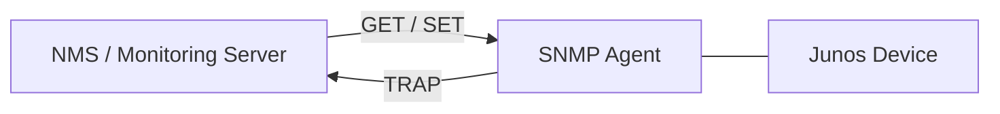
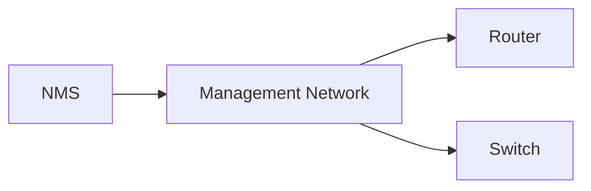
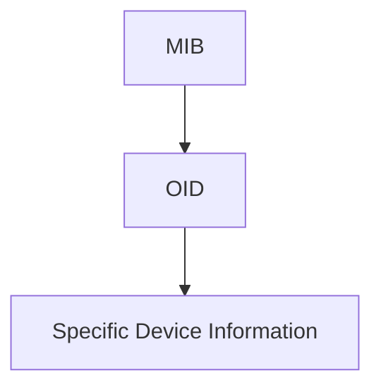
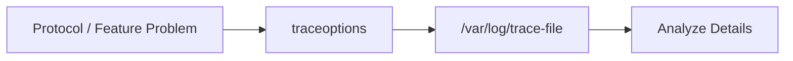
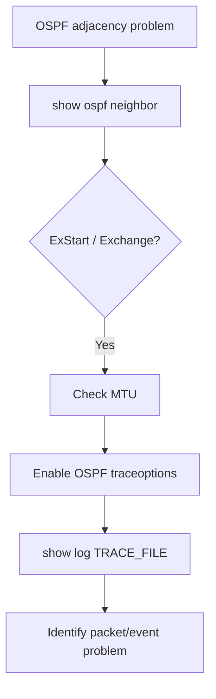
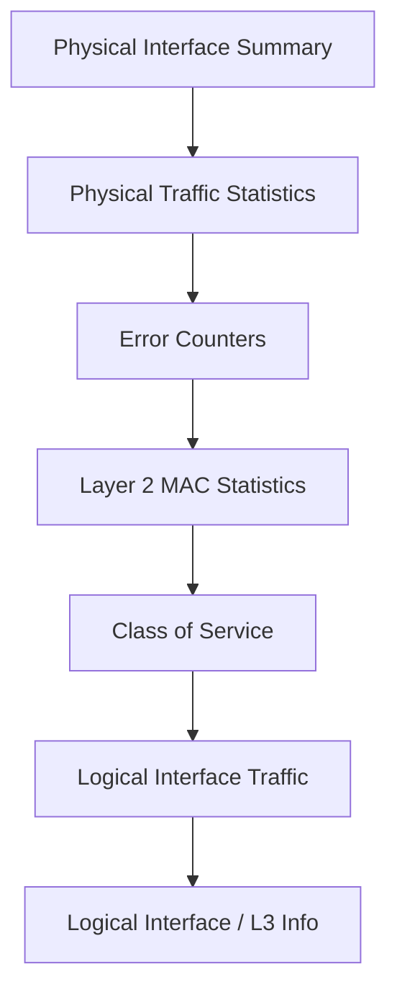
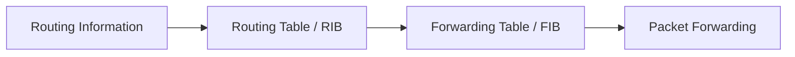
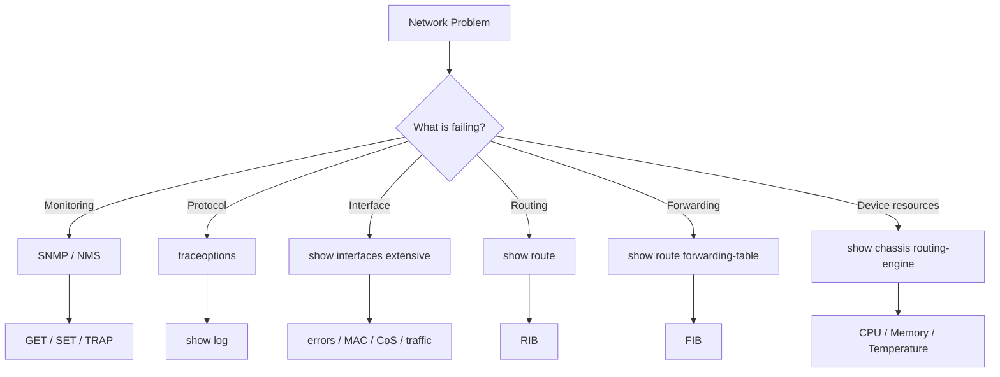

# Junos OS — Logging, Troubleshooting & Monitoring: Deeper Dive

> **Source:** Juniper Networks — _Logging, Troubleshooting, and Monitoring: A Deeper Dive_ (2024)

---

## 1. SNMP — Simple Network Management Protocol

**SNMP** allows monitoring systems to collect device **status, statistics, events, logs**, etc.

- **Agent** → SNMP software/process running on the Junos device.
    
- **NMS** → Network Management System / monitoring server.
    



### SNMP Versions

|Version|Security|Key Point|
|---|---|---|
|SNMPv1|❌ Weak|Community string in plaintext|
|SNMPv2c|❌ Weak|More efficient than v1; community string|
|SNMPv3|✅ Stronger|Authentication, encryption, integrity, access control|

SNMPv1/v2c use plaintext **community strings**; SNMPv3 provides stronger security features including encrypted credentials, permission levels, tamper protection and eavesdropping protection.

---

## 2. SNMP Communication

### GET — Polling

NMS requests information from the agent.

```text
NMS ── GET ──> Agent
NMS <─ Data ── Agent
```

Polling may occur periodically, commonly from **15 seconds to 5 minutes** depending on monitoring requirements.

### SET

NMS can write configuration to the device **if permitted**.

```text
NMS ── SET ──> Agent
```

⚠️ Especially risky with SNMPv1/v2c because community strings are plaintext.

### TRAP

Device sends an **unsolicited notification** to NMS.

Example:

```text
Interface goes DOWN
       ↓
SNMP Agent
       ↓ TRAP
      NMS
```

Useful because the NMS does not need to wait for the next polling cycle.

---

# 3. SNMPv2c Configuration

SNMP uses the top-level:

```text
snmp
```

### Administrative Information

Useful information can be configured:

```text
description
location
contact
```

This information can be read by the NMS and helps during emergencies.

### Allow SNMP Polling

Configured under:

```text
snmp {
    community <COMMUNITY> {
        authorization read-only;
        clients <NETWORK>;
    }
}
```

Example concept:

```bash
set snmp community MY_COMMUNITY authorization read-only
set snmp community MY_COMMUNITY clients 172.16.20.0/24
```

- `community` = SNMPv2c shared secret/community string
    
- `authorization read-only` = monitoring only
    
- `clients` = permitted NMS hosts/subnets
    

SNMPv2c communities are stored and transmitted in plaintext.

### Trap Configuration

```text
snmp {
    trap-group <GROUP> {
        version v2;
        categories <categories>;
        targets <NMS-IP>;
    }
}
```

Common trap categories:

```text
authentication
chassis
configuration
link
routing
services
```

**Trap-group name ≠ community string**; it is simply the name of the target group.

### Verify Configuration

```bash
show | compare
```

Hierarchy view makes `community` and `trap-group` relationships easier to understand.

---

# 4. SNMP Management Network

A dedicated **out-of-band (OOB) management network** is useful for SNMP.



### Why?

- Layer-2-only/transit devices may not be reachable through the normal routed network.
    
- Management interfaces provide direct management connectivity.
    
- Management traffic remains available even if the transit network fails.
    
- SNMP traps can still reach the NMS during network problems.
    

---

# 5. SNMP MIB + OID

### MIB

**MIB = Management Information Base**

A database describing monitorable objects using **OIDs (Object Identifiers)**.

Example:

```text
1.3.6.1.2.1.2.2.1.7
```

represents interface administrative status (`ifAdminStatus`).



### Useful command

```bash
show snmp mib get <OID>
```

Example:

```bash
show snmp mib get 1.3.6.1.2.1.2.2.1.7
```

---

# 6. SNMP Index Numbers

Junos assigns an **SNMP index** to device elements.

Check interface index:

```bash
show interfaces <interface> | match snmp
```

Example concept:

```text
xe-0/1/5     → index 539
xe-0/1/5.0   → index 536
```

Physical and logical interfaces have different indexes.

### OID + Index

```text
Object ID + Interface Index
        ↓
Specific object on specific interface
```

Useful command:

```bash
show snmp mib walk <OID>
```

The NMS combines different OIDs—interface name, description, speed, status, etc.—to build a complete monitoring picture.

### Finding OIDs

Juniper's **MIB Explorer** contains available Junos MIB/OID information.

```text
https://apps.juniper.net/mib-explorer/
```

---

# 7. Logging vs Traceoptions

Normal syslog logging does **not** provide every internal action.

Excessive detailed logging can:

- Increase CPU/processing load
    
- Fill logs rapidly
    
- Remove older useful logs
    
- Increase disk writes
    
- Reduce disk lifespan
    

Therefore, highly detailed logging should normally be enabled **only when troubleshooting and only for as long as necessary**.

---

# 8. Traceoptions

**Traceoptions = very detailed protocol/feature troubleshooting logs.**

Unlike normal syslog configuration, traceoptions are normally configured **under the feature/protocol being troubleshot**.

Examples:

```text
protocols ospf {
    traceoptions { ... }
}

protocols lldp {
    traceoptions { ... }
}

snmp {
    traceoptions { ... }
}
```



---

# 9. Traceoptions Configuration

### Step 1 — Create Trace File

```bash
set protocols ospf traceoptions file OSPF_TRACE.txt
```

Trace files are stored under:

```text
/var/log
```

You can specify:

- Number of files
    
- Maximum file size
    
- `K`, `M`, `G` size units
    

When a file reaches its limit, Junos rotates it:

```text
OSPF_TRACE.txt
OSPF_TRACE.txt.0
OSPF_TRACE.txt.1
...
```

Old files are removed when the configured limit is reached.

### Step 2 — Select Trace Flags

```bash
set protocols ospf traceoptions flag error
set protocols ospf traceoptions flag event
```

Useful starting flags:

```text
error
event
general
packets
```

Avoid blindly using:

```text
all
```

because it can create huge logs and increase Routing Engine load.

### Multiple Flags + Detail

```bash
set protocols ospf traceoptions flag event detail
set protocols ospf traceoptions flag error detail
```

`detail` provides more information but increases:

- CPU usage
    
- Log size
    
- Processing requirements
    

---

# 10. Reading Trace Logs

```bash
show log OSPF_TRACE.txt
```

Example troubleshooting scenario:

```text
OSPF Neighbor
     ↓
ExStart / Exchange
     ↓
Traceoptions
     ↓
MTU mismatch detected
```

OSPF requires compatible MTUs for neighbor formation. An OSPF neighbor stuck in **ExStart/Exchange** can indicate an MTU mismatch.

### Troubleshooting Pattern



---

# 11. `show interfaces extensive`

Most detailed interface inspection command:

```bash
show interfaces extensive xe-0/1/5
```

Equivalent:

```bash
show interfaces xe-0/1/5 extensive
```

It provides:

- Interface status
    
- Traffic statistics
    
- Error counters
    
- Layer-2 MAC statistics
    
- CoS information
    
- Logical-interface statistics
    
- IP/L3 information
    
- MTU information
    

### Output Structure



---

# 12. Physical Traffic Statistics

Shows:

```text
Input / Output bytes
Input / Output packets
bps
pps
```

- `bps` = bits/bytes per second as displayed by the command
    
- `pps` = packets per second
    

Useful for determining whether traffic is actually flowing.

Clear counters:

```bash
clear interfaces statistics xe-0/1/5
```

Clearing counters gives a clean baseline for troubleshooting.

---

# 13. Interface Error Counters

Errors are divided into:

```text
Input errors
Output errors
```

### Important Counters

|Counter|Meaning|
|---|---|
|Drops|Packets dropped because of link/interface saturation|
|Framing errors|Corrupted frames; can indicate cable/hardware problems|
|Carrier transitions|Number of interface up/down transitions|
|MTU errors|Packets/frames exceeding interface MTU|

A rapidly increasing error counter is a strong troubleshooting signal.

### Quick Error Search

```bash
show interfaces extensive xe-0/1/5 | match error
```

Useful because it extracts lines containing `error` instead of manually scanning the entire output.

---

# 14. Layer-2 MAC Statistics

Provides Ethernet-level statistics:

```text
Unicast
Broadcast
Multicast
```

### Traffic Types

```text
Unicast   → 1 → 1
Broadcast → 1 → All
Multicast → 1 → Selected receivers
```

A rapidly increasing broadcast count may indicate a **broadcast storm** or LAN loop/problem.

---

# 15. CoS — Class of Service

**CoS/QoS** categorizes traffic and gives different traffic classes different forwarding priorities/bandwidth treatment.

The module shows four default queues; two highlighted examples are:

```text
best-effort      → 95%
network-control  → 5%
```

`network-control` generally carries protocol/control traffic.

---

# 16. Logical Interface Statistics

Useful especially when one physical interface contains multiple logical units.

Shows traffic per logical unit.

Also includes:

```text
Local statistics
```

which represent traffic destined to the router itself, such as:

```text
Ping
SSH
```

Final section contains logical-interface information similar to normal `show interfaces`, including L3/IP and MTU information.

---

# 17. Routing Table vs Forwarding Table



Normally, routing verification focuses on the **routing table**.

For advanced problems:

```text
Prefix exists in RIB
        ↓
But not in FIB
        ↓
Forwarding problem
```

Possible causes include advanced forwarding customization or, very rarely, software issues preventing installation.

---

# 18. View Forwarding Table

```bash
show route forwarding-table
```

Specific destination:

```bash
show route forwarding-table destination <prefix>
```

Cleaner output:

```bash
show route forwarding-table table default
```

Important columns:

```text
Destination
Next hop
Netif
Type
```

### Next-Hop Types

|Type|Meaning|
|---|---|
|`bcst`|Broadcast|
|`ucst`|Unicast|
|`rslv`|Next-hop requires resolution via ARP/NDP|

`rslv` commonly means the next-hop must be resolved using IPv4 ARP or IPv6 NDP.

Use:

```bash
show route forwarding-table extensive
```

to see full words instead of abbreviations such as `ucst`.

---

# 19. Navigating Long Output

When Junos displays:

```text
---(more)---
```

press:

```text
h
```

to display available navigation/help options.

Useful capabilities include:

- Search text
    
- Jump to keywords
    
- Jump to top
    
- Jump to bottom
    

### Mental Rule

> Don't try to understand every line. Find the section relevant to the problem.

---

# 20. CPU, Memory & Temperature

```bash
show chassis routing-engine
```

Useful for checking:

```text
CPU utilization
Memory utilization
Temperature
```

High memory usage may result from:

- Too many protocols
    
- Excessive routing updates
    
- Software problems
    

High CPU/resource exhaustion can cause unusual behavior in Routing-Engine-powered functions. Excessive temperature can cause Junos to automatically shut down hardware components.

---

# 21. Root Password Recovery

If the root password is lost:

```text
Console connection
      ↓
Reboot device
      ↓
Interrupt boot process
      ↓
Recover/change root password
```

Exact procedure varies by platform.

Juniper documentation:

```text
Juniper Documentation → "Recover a Root Password"
```

---

# 22. `refresh` — Repeated Commands

Run a command repeatedly:

```bash
show route 172.16.40.0/24 exact | refresh 10
```

or:

```bash
show ospf neighbor | refresh 10
```

`10` = execute every **10 seconds**.

Useful for monitoring changing states such as:

```text
OSPF → Full
Route → appears
Interface → changes state
```

---

# 23. OSPF MTU Troubleshooting Example

Cause in the module:

```text
ROUTER_1
  ↓
Configuration group applied high MTU
  ↓
All interfaces get high MTU

ROUTER_2
  ↓
Different MTU
```

Result:

```text
OSPF adjacency
      ↓
ExStart / Exchange
      ↓
MTU mismatch
      ↓
Adjacency fails
```

Fix either:

```text
Remove custom MTU from ROUTER_1
```

or:

```text
Configure equivalent MTU on ROUTER_2
```

depending on the intended design.

---

# 24. `show system users`

Shows currently logged-in users/sessions, including:

- CLI
    
- J-Web
    
- NETCONF
    

```bash
show system users
```

Terminate a user's session:

```bash
request system logout user <username>
```

Useful during maintenance or when identifying unexpected administrative activity.

---

# 25. Useful Pipe Options

### Append output to a file

```bash
<command> | append <filename>
```

Adds command output to an existing local file.

### Show last X lines

```bash
<command> | last <X>
```

Example:

```bash
show log messages | last 20
```

Useful for quickly viewing recent log entries.

### Disable pagination

```bash
<command> | no-more
```

Displays the entire output without `---(more)---`.

---

# JNCIA Quick Cheat Sheet

|Task|Command / Concept|
|---|---|
|SNMP config|`set snmp ...`|
|SNMP GET|`show snmp mib get <OID>`|
|SNMP walk|`show snmp mib walk <OID>`|
|Interface SNMP index|`show interfaces ... \| match snmp`|
|Traceoptions|`protocols <protocol> traceoptions`|
|View trace log|`show log <file>`|
|Detailed interface|`show interfaces extensive <int>`|
|Clear interface counters|`clear interfaces statistics <int>`|
|Find interface errors|`show interfaces extensive <int> \| match error`|
|Forwarding table|`show route forwarding-table`|
|CPU/memory/temp|`show chassis routing-engine`|
|Repeat command|`\| refresh <seconds>`|
|Logged-in users|`show system users`|
|Logout user|`request system logout user <user>`|
|Append output|`\| append <file>`|
|Last N lines|`\| last N`|
|Disable pagination|`\| no-more`|

---

## 🔥 Exam Traps / Must Remember

- **SNMP Agent** = device-side SNMP process; **NMS** = monitoring server.
    
- **GET** = NMS requests data.
    
- **SET** = NMS writes configuration.
    
- **TRAP** = device sends unsolicited notification.
    
- **SNMPv2c** = community string + plaintext.
    
- **SNMPv3** = stronger authentication/security/encryption.
    
- **MIB** = database of manageable objects.
    
- **OID** = identifies a specific object.
    
- **SNMP index** = identifies a specific device element/interface.
    
- **traceoptions** = very detailed protocol/feature-level logging.
    
- Avoid `traceoptions flag all` unless truly necessary.
    
- Trace logs live under `/var/log`.
    
- OSPF **ExStart/Exchange + MTU mismatch** → check MTU.
    
- `show interfaces extensive` = deep interface troubleshooting.
    
- **Drops ≠ framing errors ≠ carrier transitions ≠ MTU errors**.
    
- Rapidly increasing broadcast traffic can indicate a **broadcast storm**.
    
- RIB/routing table and FIB/forwarding table are separate.
    
- Prefix in RIB but absent from FIB → investigate forwarding installation.
    
- `rslv` = next-hop requires ARP/NDP resolution.
    
- `| refresh 10` = repeat command every 10 seconds.
    
- `| no-more` = disable pagination.
    
- `h` at `---(more)---` = output navigation help.
    

### Added Practical Knowledge



**Troubleshooting principle:** start with the least intrusive visibility needed, then increase detail—especially with traceoptions—only when normal operational commands cannot explain the problem.