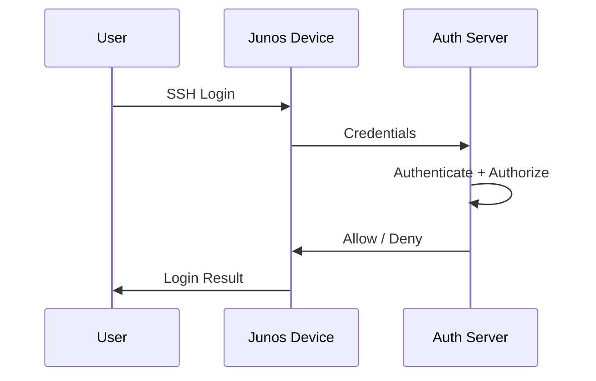
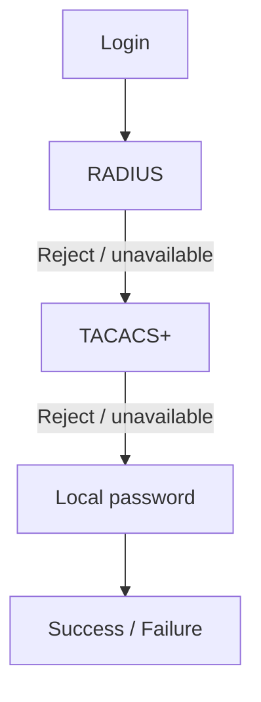
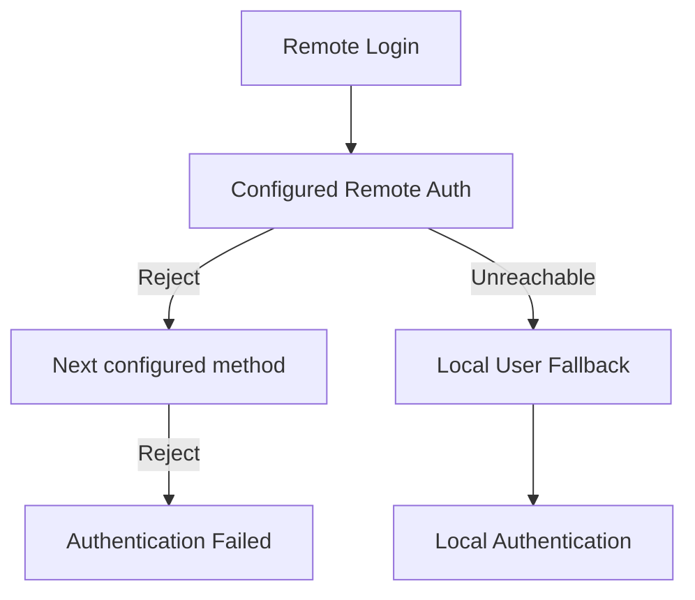
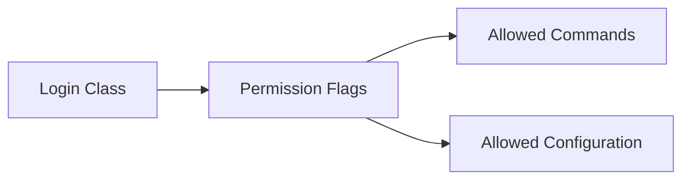
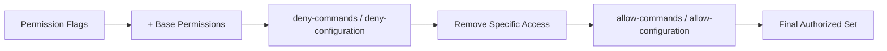
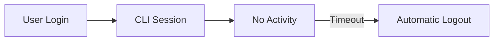
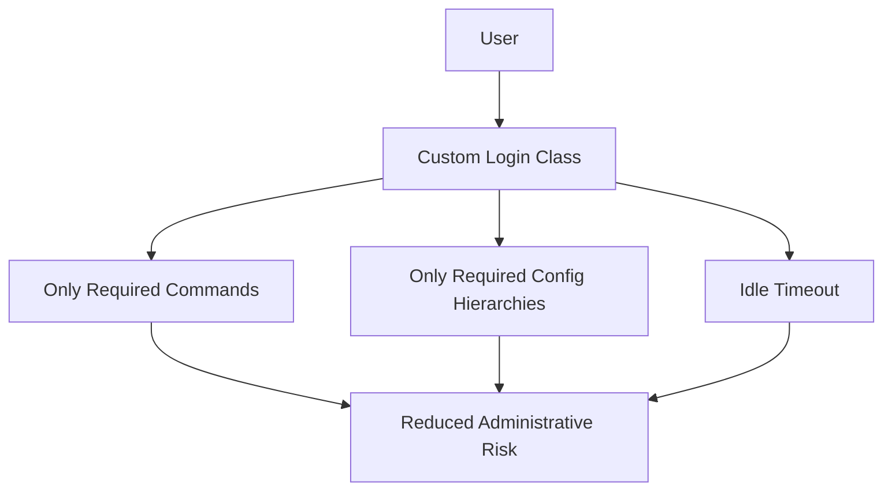

# Junos OS Device Administration — Deeper Dive

## 1. Remote Authentication

Local accounts become difficult to manage at scale. **Remote authentication servers** centralize user credentials and permissions; Junos sends login details to the server, receives the decision, then allows/denies access.



---

## 2. AAA

**AAA = Authentication + Authorization + Accounting**.

|Component|Purpose|
|---|---|
|**Authentication**|Verify username/password|
|**Authorization**|Determine what device/commands user can access|
|**Accounting**|Record/log user commands and activity|

```text
Authentication → Who are you?
Authorization  → What can you do?
Accounting     → What did you do?
```

---

## 3. RADIUS vs TACACS+

Both can provide:

- Authentication
    
- Authorization
    
- Command authorization
    
- Accounting
    

But they differ in **transport, security mechanisms, and authorization behavior**.

|Protocol|Junos keyword|
|---|---|
|RADIUS|`radius-server`|
|TACACS+|`tacplus-server`|

### Configuration

```bash
set system radius-server <SERVER-IP> secret <SECRET>
```

```bash
set system tacplus-server <SERVER-IP> secret <SECRET>
```

Both are configured under:

```text
system
```

The secret is entered in plaintext but stored as a hash in the configuration.

---

# 4. Authentication Order

Junos can use:

1. Local authentication
    
2. RADIUS
    
3. TACACS+
    

Authentication methods are attempted **in configured order until authentication succeeds**.

### Configure Order

```bash
set system authentication-order [ radius tacplus password ]
```

Meaning:



`password` = local Junos authentication.

---

## 5. Important Authentication Fallback

### Remote server rejects credentials

If:

```text
RADIUS → Reject
TACACS+ → Reject
```

and local `password` is **not configured in authentication-order**, local credentials are **not checked**.

### Remote servers unreachable

If configured remote servers are **unreachable**, Junos checks the local user database as a **last-resort fallback**, even when `password` isn't explicitly listed.



### Exam Trap

> **Rejected ≠ unreachable**

- **Reject** → credentials were actively denied → continue according to configured order.
    
- **Unreachable** → authentication server cannot respond → local fallback can occur.
    

---

# 6. Junos Login Classes

Permissions are **not normally assigned directly to users**.

```text
User
  ↓
Login Class
  ↓
Permissions
```

A class acts as a reusable container for permissions and commands.

### Default Classes

```text
super-user
operator
read-only
unauthorized
```

A class controls:

- Operational-mode commands
    
- Configuration-mode access
    
- Configuration hierarchy visibility
    
- Specific command permissions
    

---

# 7. Custom Login Classes

Custom classes provide granular control over:

- Permission flags
    
- Individual commands
    
- Configuration hierarchies
    
- CLI idle timeout
    

Configured under:

```text
system login class
```

---

# 8. Permission Flags

There are **40+ permission flags**; memorizing every flag is unnecessary.

### Important Flags

|Flag|Purpose|
|---|---|
|`all`|All operational/configuration commands|
|`clear`|`clear` commands|
|`configure`|Enter configuration mode + commit|
|`network`|`ping`, `ssh`, `telnet`, `traceroute`|
|`view`|View system/routing/protocol information|



---

# 9. Researching Permission Flags

For exact commands belonging to a permission flag, use Juniper's **User Access Privileges** documentation.

Do **not** assume a flag name means operational commands.

Example:

```text
routing → routing/protocol configuration
firewall → firewall/policy configuration
```

The `routing` flag does **not automatically mean all OSPF operational commands**.

---

# 10. Custom Class — Basic Configuration

Example:

```bash
set system login class FIRST_LINE permissions [ clear network view ]
```

This gives a user useful visibility and network troubleshooting capabilities without broad administrative permissions.

---

# 11. Allow / Deny Specific Commands

### Allow

```bash
set system login class FIRST_LINE allow-commands "configure private"
```

### Deny

```bash
set system login class FIRST_LINE deny-commands "(file).*"
```

Multiple commands:

```text
"command1|command2"
```

Commands are enclosed in brackets when specified by the Junos syntax.

### Important

```text
allow-commands > deny-commands
```

If the same command is present in both:

> **allow-commands overrides deny-commands.**

---

# 12. Configuration Hierarchy Restrictions

You can restrict which configuration hierarchies a class can modify.

### Allow

```bash
set system login class FIRST_LINE allow-configuration "(interfaces)|(firewall)"
```

### Deny

```bash
set system login class FIRST_LINE deny-configuration "(groups)"
```

Again:

```text
allow-configuration overrides deny-configuration
```

---

# 13. Permission Processing Logic

Think of permissions as building an authorization list:



Order:

```text
Permissions
    ↓
deny-commands / deny-configuration
    ↓
allow-commands / allow-configuration
    ↓
Authorized / Denied
```

Specific commands/hierarchies can also be supplied by **RADIUS/TACACS+**.

---

# 14. Practical Custom-Class Example

A restricted user might be able to:

```bash
show interfaces terse
show route
ping
traceroute
```

but not:

```bash
request system reboot
```

Junos can even reject unauthorized syntax while the user is typing it.

---

# 15. Force `configure private`

A custom class can allow:

```bash
configure private
```

while preventing ordinary:

```bash
configure
```

This forces the user into **private configuration mode**.

```text
User
 ↓
configure       ❌
 ↓
configure private   ✅
```

---

# 16. Restrict Configuration Visibility

If a user is allowed to view only:

```text
interfaces
firewall
```

then:

```bash
show configuration
```

will omit unauthorized hierarchies such as:

```text
system
```

The user sees only the configuration areas permitted by the class.

---

# 17. Specific Permission Flags

Some flags correspond primarily to **specific configuration hierarchies**.

Examples:

```text
routing
 ├── routing-options
 └── protocol configuration

firewall
 ├── firewall
 └── policy-options
```

Important:

> Permission flags do not automatically unlock `show configuration`; that command itself must also be permitted.

---

# 18. Idle Timeout

By default, a CLI session can remain active indefinitely.

Custom classes can use:

```bash
set system login class FIRST_LINE idle-timeout 5
```

`5` = minutes of inactivity before automatic logout.



### Important

Default classes cannot be modified:

```text
super-user
operator
read-only
unauthorized
```

To apply an idle timeout to privileged users, create a **custom class** with equivalent permissions and add `idle-timeout`.

---

# JNCIA Cheat Sheet

|Topic|Key Point|
|---|---|
|AAA|Authentication, Authorization, Accounting|
|RADIUS|`radius-server`|
|TACACS+|`tacplus-server`|
|Auth order|`set system authentication-order [...]`|
|Local auth keyword|`password`|
|Remote Reject|Continue configured authentication order|
|Remote Unreachable|Local user can be last-resort fallback|
|User permissions|Assigned through login classes|
|Default classes|`super-user`, `operator`, `read-only`, `unauthorized`|
|Custom class|`system login class`|
|All permissions|`permissions all`|
|Network tools|`permissions network`|
|Enter config|`permissions configure`|
|View information|`permissions view`|
|Allow commands|`allow-commands`|
|Deny commands|`deny-commands`|
|Allow hierarchy|`allow-configuration`|
|Deny hierarchy|`deny-configuration`|
|Conflict|`allow-*` overrides `deny-*`|
|Idle timeout|`idle-timeout <minutes>`|

---

## 🔥 Exam Traps

```text
AAA
├── Authentication → identity verification
├── Authorization  → permissions
└── Accounting     → activity/command logging
```

```text
Remote AUTH rejects
→ follow authentication-order

Remote AUTH unreachable
→ local authentication can be fallback
```

```text
User → Login Class → Permissions
```

```text
Permission flags
    ↓
deny-*
    ↓
allow-*
    ↓
Final authorization
```

- `RADIUS` and `TACACS+` both support AAA, but operate differently.
    
- `password` in `authentication-order` means **local authentication**.
    
- `allow-commands` overrides `deny-commands`.
    
- `allow-configuration` overrides `deny-configuration`.
    
- `configure private` can be explicitly allowed while normal `configure` is denied.
    
- Permission flags may control **configuration hierarchy access**, not necessarily operational commands.
    
- `show configuration` itself requires permission.
    
- Default login classes cannot be modified; use a custom class for custom `idle-timeout`.
    
- Keep at least one local administrative account for recovery when remote authentication becomes unavailable.
    

### Added Practical Knowledge

**Least-privilege model:**



Use **custom login classes + command restrictions + hierarchy restrictions + idle timeout** when different administrators need different levels of Junos access.