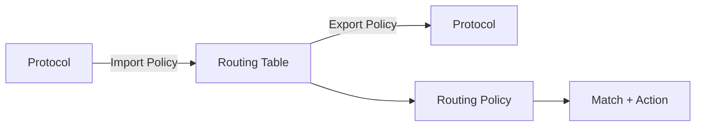
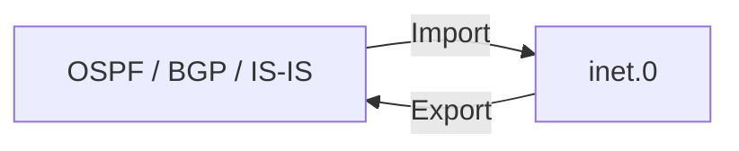
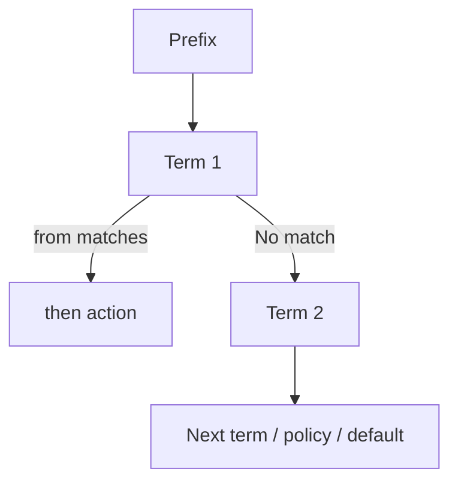
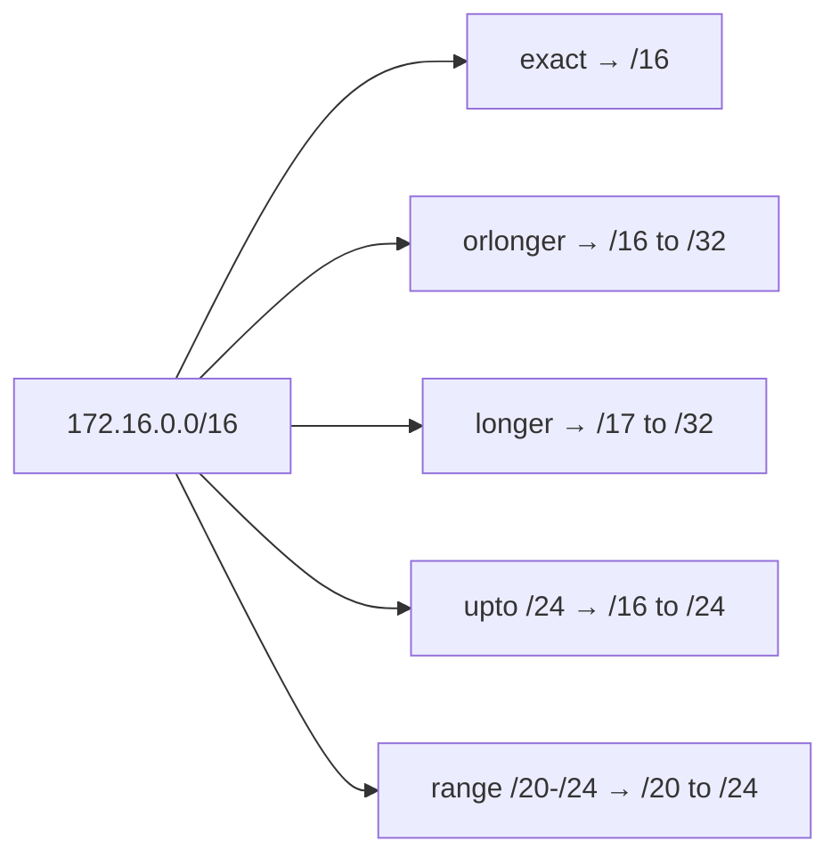
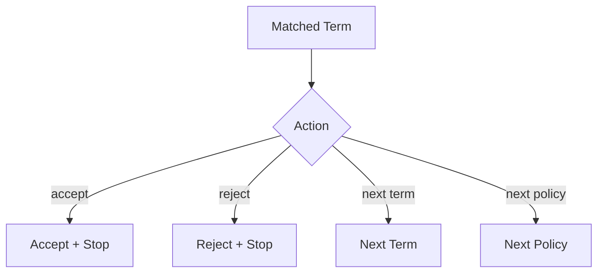
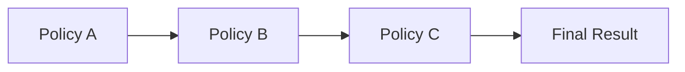
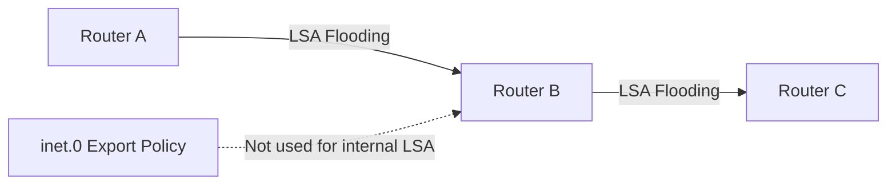
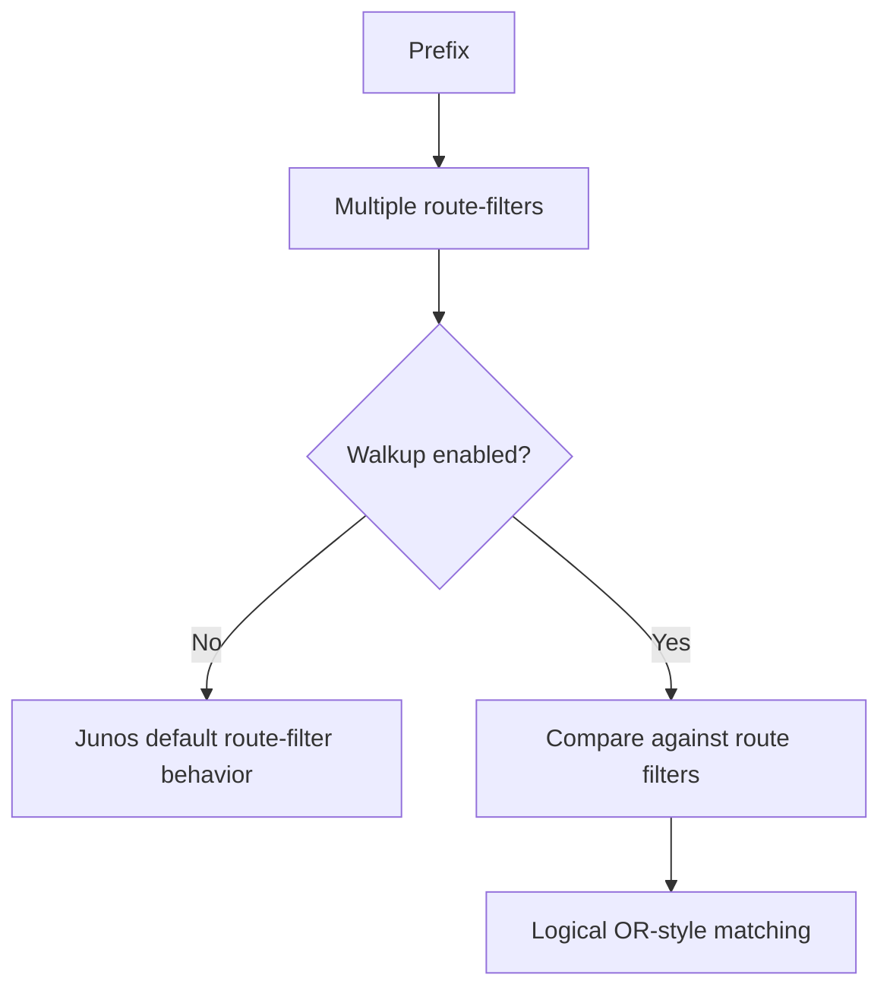

# Junos OS — Routing Policy

## 1. Routing Policy

Routing policies control:

- Which prefixes are **imported into the routing table**
    
- Which prefixes are **exported from the routing table**
    
- Which prefixes are **advertised between routing protocols**
    
- Route attributes such as metric, preference, tags, and communities
    



### Mental Model

```text
Import → Protocol → Routing Table
Export → Routing Table → Protocol
```

Only **active prefixes** are normally exported.

---

# 2. Import vs Export

|Policy|Direction|Purpose|
|---|---|---|
|**Import**|Protocol → RIB|Select prefixes learned by a protocol|
|**Export**|RIB → Protocol|Select prefixes advertised by a protocol|



A routing policy does nothing until it is **attached to a protocol**.

---

# 3. Default OSPF Export Behavior

OSPF does **not export routes from the routing table by default**.

Therefore:

```text
Static route → Routing Table → OSPF
                         ❌
```

A static default route will not automatically be advertised into OSPF.

OSPF's internal prefixes are handled through **LSAs**, not by exporting them from `inet.0`.

---

# 4. Routing Policy Structure

Policies are configured under:

```text
policy-options
    policy-statement
        <policy-name>
            term <term-name>
                from
                then
```

Concept:

```text
FROM = IF
THEN = ACTION
```



Unlike firewall filters, routing policies do **not require an address-family declaration**.

---

# 5. Basic Policy Syntax

```bash
set policy-options policy-statement EXPORT-STATIC \
term STATIC-DEFAULT \
from protocol static

set policy-options policy-statement EXPORT-STATIC \
term STATIC-DEFAULT \
from route-filter 0.0.0.0/0 exact

set policy-options policy-statement EXPORT-STATIC \
term STATIC-DEFAULT \
then accept
```

Apply to OSPF:

```bash
set protocols ospf export EXPORT-STATIC
```

IPv6:

```bash
set policy-options policy-statement EXPORT-STATIC-V6 \
term STATIC-DEFAULT \
from protocol static

set policy-options policy-statement EXPORT-STATIC-V6 \
term STATIC-DEFAULT \
from route-filter ::/0 exact

set policy-options policy-statement EXPORT-STATIC-V6 \
term STATIC-DEFAULT \
then accept

set protocols ospf3 export EXPORT-STATIC-V6
```

The PDF demonstrates the same concept for IPv4 and IPv6; IPv6 uses `::/0` and `ospf3`.

---

# 6. Match Conditions — `from`

Routing policies can match many route attributes. Important ones:

|Match|Purpose|
|---|---|
|`protocol`|Match route source|
|`neighbor`|Match routes learned from specific neighbor|
|`tag`|Match route tag|
|`community`|Match BGP community|
|`rib`|Match routing table|
|`interface`|Match routes associated with interface|
|`route-filter`|Match specific prefixes|
|`prefix-list`|Match prefixes from named list|

Example:

```bash
from protocol static
```

means:

```text
Match routes learned through static routing.
```

The PDF specifically highlights `direct`, `static`, `ospf`, `bgp`, and `isis` as protocol matches.

---

# 7. `route-filter`

Used when you want to match a prefix directly.

```bash
from route-filter 172.16.0.0/16 exact
```

### `exact`

Matches **only that exact prefix**.

```text
172.16.0.0/16    ✅
172.16.10.0/24   ❌
172.17.0.0/16    ❌
```

---

# 8. `route-filter` Advanced Options

```text
exact
orlonger
longer
upto
prefix-length-range
```

### Comparison

|Option|Matches|
|---|---|
|`exact`|Only specified prefix|
|`orlonger`|Prefix + all more-specific prefixes|
|`longer`|Only more-specific prefixes|
|`upto /24`|Prefix through `/24`|
|`prefix-length-range /20-/24`|Only specified prefix-length range|

---

## `orlonger`

```bash
from route-filter 172.16.0.0/16 orlonger
```

Matches:

```text
172.16.0.0/16
172.16.x.x/20
172.16.x.x/24
172.16.x.x/32
```

Does not match:

```text
172.17.0.0/16
```

---

## `longer`

```bash
from route-filter 172.16.0.0/16 longer
```

Matches only prefixes **more specific than `/16`**.

```text
/16  ❌
/17  ✅
/24  ✅
/32  ✅
```

### Key

```text
longer   = excludes original prefix
orlonger = includes original prefix
```

---

## `upto`

```bash
from route-filter 172.16.0.0/16 upto /24
```

Matches:

```text
/16 → /24
```

Does not match:

```text
/25
/26
...
```

Useful when limiting accepted advertisements to a maximum prefix length.

---

## `prefix-length-range`

```bash
from route-filter 172.16.0.0/16 prefix-length-range /20-/24
```

Matches:

```text
/20
/21
/22
/23
/24
```

Does **not** match the original `/16`.



---

# 9. Multiple Match Conditions

Similar conditions generally represent **OR** alternatives.

Different match-condition types combine as **AND**.

Conceptually:

```text
from {
    protocol static;
    route-filter 0.0.0.0/0 exact;
}
```

means:

```text
protocol = static
        AND
prefix = 0.0.0.0/0
```

But multiple route filters of the same type have special behavior; see **route-filter walkup** below.

---

# 10. Prefix Manipulation Actions

`then` can modify route attributes.

Important actions:

```text
metric
preference
tag
community
```

Examples:

```bash
then metric 100
```

```bash
then preference 50
```

```bash
then tag 100
```

```bash
then community <community-name>
```

These actions modify the route; they do **not inherently mean accept/reject**. The protocol's default policy still determines what happens next.

---

# 11. Flow-Control Actions

### `accept`

```bash
then accept
```

- Accept route
    
- Propagate route
    
- Stop processing terms
    

### `reject`

```bash
then reject
```

- Reject route
    
- Do not propagate
    
- Stop processing
    

### `next term`

```bash
then next term
```

Continue with the next term.

### `next policy`

```bash
then next policy
```

Skip remaining terms and continue with the next policy in a policy chain.



If `next term` or `next policy` is configured, `accept`/`reject` actions in the same term are ignored.

---

# 12. Term Order Matters

Routing policy terms are processed sequentially.

```text
Term 1
  ↓
Term 2
  ↓
Term 3
  ↓
Default Policy
```

Therefore:

> Put **specific matches before broad matches**.

Example:

```text
Term 1 → specific subnet
Term 2 → larger network
Term 3 → everything else
```

A broad `orlonger` term placed first can prevent later terms from being reached.

---

# 13. OSPF Static Default Route Example

Goal:

```text
ROUTER_1
    |
 Static 0/0
    |
    ↓
Routing Policy
    |
    ↓
OSPF
    |
    ↓
ROUTER_2
```

Configuration:

```bash
set policy-options policy-statement EXPORT-DEFAULT \
term DEFAULT \
from protocol static

set policy-options policy-statement EXPORT-DEFAULT \
term DEFAULT \
from route-filter 0.0.0.0/0 exact

set policy-options policy-statement EXPORT-DEFAULT \
term DEFAULT then accept

set protocols ospf export EXPORT-DEFAULT
```

Verify:

```bash
show route 0.0.0.0/0
show route protocol ospf
```

The PDF's lab verifies that ROUTER_2 subsequently learns the default route through OSPF.

---

# 14. IPv6 Routing Policy

Same concept:

```text
IPv4 default → 0.0.0.0/0
IPv6 default → ::/0
```

Apply IPv6 policy to:

```bash
protocols ospf3
```

---

# 15. Policy Chaining

Large policies can be split into smaller reusable policies.



Useful for:

- Reusability
    
- Smaller policies
    
- Easier maintenance
    
- Separating different policy logic
    

Policies can be listed individually or as a bracketed list.

```bash
set protocols ospf export [ POLICY-A POLICY-B POLICY-C ]
```

`then next policy` moves processing to the next policy in the chain.

---

# 16. Prefix Lists

Reusable prefix collections:

```bash
set policy-options prefix-list MY-PREFIXES 10.0.0.0/8
set policy-options prefix-list MY-PREFIXES 172.16.0.0/12
set policy-options prefix-list MY-PREFIXES 192.168.0.0/16
```

Useful when the same prefixes are referenced by multiple policies.

### `prefix-list`

```bash
from prefix-list MY-PREFIXES
```

Matches **exactly** against prefixes in the list.

### `prefix-list-filter`

```bash
from prefix-list-filter MY-PREFIXES orlonger
```

Allows:

```text
exact
longer
orlonger
```

---

# 17. Routing Policy vs Firewall Filter

|Firewall Filter|Routing Policy|
|---|---|
|Filters packets|Filters routes|
|`from` = packet match|`from` = route match|
|`then` = packet action|`then` = route action|
|Terms processed sequentially|Terms processed sequentially|
|Implicit final discard|Protocol-specific default policy|
|Address families required|No address family in policy statement|

The PDF repeatedly uses firewall filters as the conceptual model for routing-policy syntax.

---

# 18. Implicit Final Behavior

Routing policies **do not have one universal implicit final action**.

The behavior depends on the protocol's **default policy**.

For OSPF:

```text
No matching term
      ↓
OSPF default policy
      ↓
Reject
```

Therefore, a policy that only changes a metric but doesn't use `then accept` may still result in the route **not being exported by OSPF**.

### Exam Trap

```text
Firewall filter → implicit discard
Routing policy → protocol-specific default policy
```

---

# 19. OSPF Import/Export Limitation

Within a single OSPF area:

- Internal OSPF prefixes are distributed through LSAs.
    
- You cannot use normal import/export policy to filter those internal prefixes.
    
- To prevent an internal prefix from being advertised, prevent the originating router from advertising it.
    



The PDF notes that multi-area OSPF and external LSAs introduce additional behavior.

---

# 20. Default Policies of Other Protocols

|Protocol|Import|Export|
|---|---|---|
|**OSPF**|Imports OSPF prefixes|Exports nothing by default|
|**RIP**|Imports RIP prefixes|Rejects by default|
|**IS-IS**|Imports IS-IS prefixes|Exports nothing|
|**BGP**|Accepts BGP prefixes by default*|Re-advertises BGP routes under BGP rules|

*The PDF notes that newer configuration can change BGP's default import behavior.

### Important

Do not memorize these as universal routing-policy behavior; **default policies are protocol-specific**.

---

# 21. Route-Filter Walkup

This is an advanced JNCIA/Junos concept.

Suppose one term contains:

```text
route-filter 10.0.0.0/8 orlonger
route-filter 10.0.0.0/16 prefix-length-range /22-/24
```

Junos has a special default behavior when route filters have **different prefix lengths**.

It can select the **longest matching route-filter first**, rather than simply treating every route-filter as a straightforward OR.

This can produce surprising results.

### Enable walkup

Global:

```bash
set policy-options defaults route-filter walkup
```

Per-policy:

```text
policy-statement POLICY {
    defaults route-filter walkup;
    ...
}
```

The global setting affects all policies; the per-policy form affects only that policy.



---

# 22. Mixed Prefix-Length Trap

Example:

```text
10.0.0.0/16 prefix-length-range /22-/24
10.0.0.0/8  orlonger
```

The `/16` filter is more specific than `/8`.

Without understanding **walkup**, some prefixes inside `10.0.0.0/8` may unexpectedly fail to match the term because Junos first evaluates the longest matching route-filter's conditions.

### Remember

```text
Multiple route-filters
        ↓
Different prefix lengths
        ↓
Potential longest-match behavior
        ↓
Use route-filter walkup when required
```

---

# 23. Configuration Verification

Useful commands:

```bash
show configuration policy-options
```

```bash
show configuration policy-options policy-statement <POLICY>
```

Compare candidate changes:

```bash
show | compare
```

Check routes:

```bash
show route
show route protocol ospf
show route 0.0.0.0/0
```

Check IPv6:

```bash
show route table inet6.0
show route ::/0
```

After creating a policy:

```text
Create policy
    ↓
Verify configuration
    ↓
Attach to protocol
    ↓
Commit
    ↓
Verify routing result
```

---

# JNCIA Routing Policy Cheat Sheet

```text
Routing Policy
├── policy-options
│   └── policy-statement
│       └── term
│           ├── from = IF / MATCH
│           └── then = ACTION
│
├── Import
│   └── Protocol → RIB
│
└── Export
    └── RIB → Protocol
```

### Match

```text
from protocol
from neighbor
from tag
from community
from rib
from interface
from route-filter
from prefix-list
from prefix-list-filter
```

### Route Filter

```text
exact       → only prefix
orlonger    → prefix + more-specific
longer      → more-specific only
upto /24    → prefix through /24
range /20-/24 → /20–/24
```

### Actions

```text
then metric <n>
then preference <n>
then tag <n>
then community <name>

then accept
then reject
then next term
then next policy
```

### Important Concepts

```text
Import → Protocol → RIB
Export → RIB → Protocol

OSPF default export → reject
Static → OSPF → requires export policy

Policy creation ≠ policy activation
Attach policy to protocol

Term order matters
Specific → Broad

Routing policy final behavior
→ Protocol-specific default policy

Prefix list
→ Reusable exact prefix set

prefix-list-filter
→ Allows exact / longer / orlonger

route-filter walkup
→ Handles multiple route-filters with special matching behavior
```

### 🔥 Must Remember

```text
FROM = IF
THEN = ACTION

accept/reject = terminating
next term = continue current policy
next policy = continue policy chain

OSPF internal prefixes
→ LSA flooding
→ cannot normally filter them using import/export policy

0.0.0.0/0 → IPv4 default
::/0       → IPv6 default

OSPFv2 → protocols ospf
OSPFv3 → protocols ospf3
```