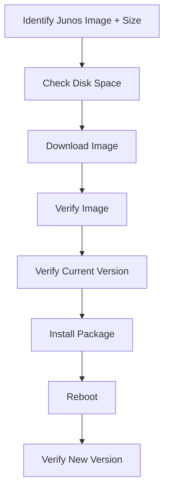
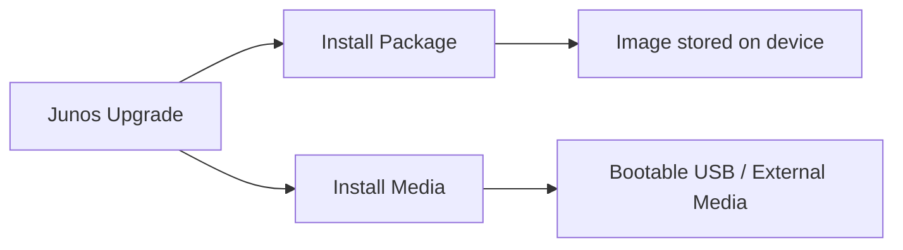
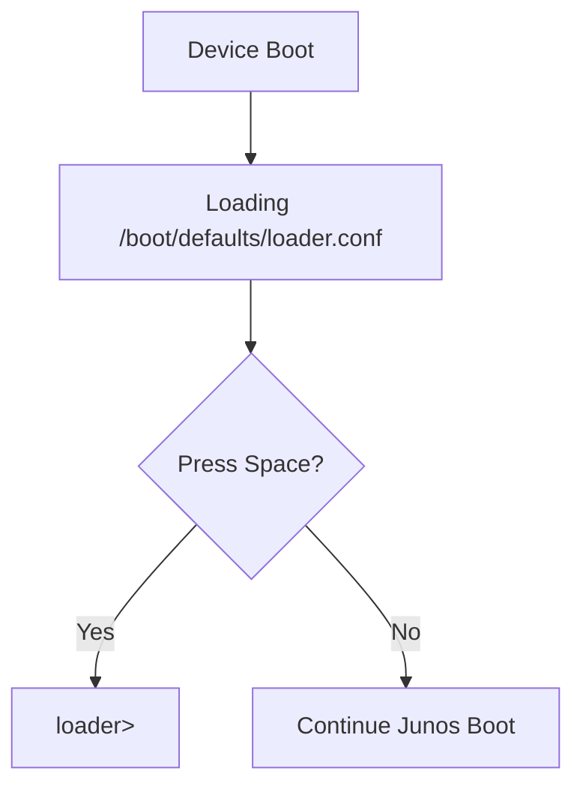
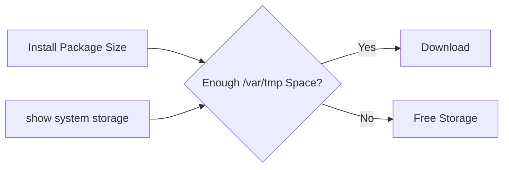
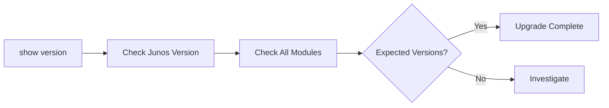
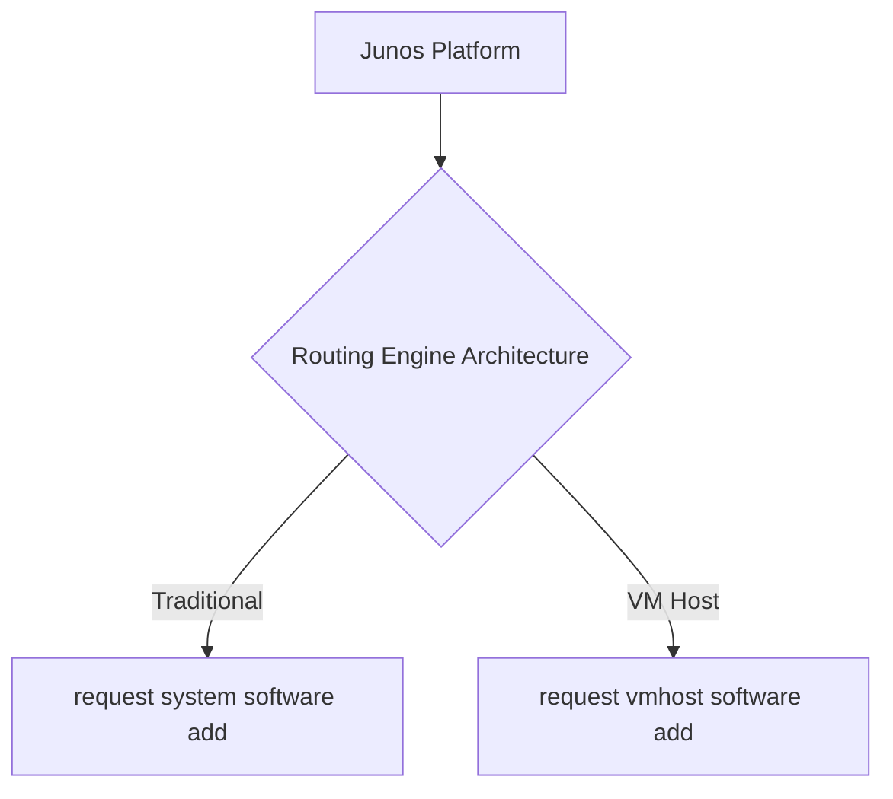
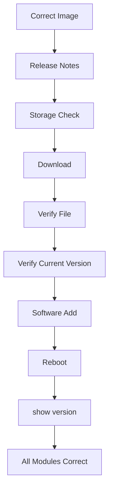

# Junos OS — Upgrading Junos OS

## 1. Why Upgrade Junos?

Common reasons:

- **New features** → required functionality may exist only in newer releases.
    
- **Bug fixes** → move to a release containing a fix.
    
- **Security fixes** → keep Junos patched against known vulnerabilities.
    

> **Best practice:** Test the upgrade in a **lab environment** that closely resembles production before upgrading production devices.

---

## 2. Upgrade Workflow



### 4 Main Steps

1. Identify image + image size
    
2. Ensure sufficient storage
    
3. Download Junos image
    
4. Install/upgrade with Junos commands
    

---

# 3. Finding the Correct Junos Image

Go to:

```text
Juniper → Support → Downloads → All Products
```

Search for the **device model**, then select the required Junos release.

### Before downloading

Always check:

- Release version
    
- Device/model compatibility
    
- Install Package vs Install Media
    
- File size
    
- Documentation
    
- Release Notes
    

**Read the release notes before installation** because compatibility issues may exist with the current configuration.

---

# 4. Install Package vs Install Media

|Method|Image location|Use|
|---|---|---|
|**Install Package**|Device/local storage|Normal upgrade|
|**Install Media**|Bootable external media such as USB|Devices with limited connectivity / USB installation|



---

# 5. Install Image Naming

Example:

```text
jinstall-ex-4300-21.4R3-S4.18-signed.tgz
```

|Part|Meaning|
|---|---|
|`jinstall-ex`|EX Series installation package|
|`4300`|Device model|
|`21.4R3-S4.18`|Junos software version|
|`signed`|Juniper digital signature|
|`.tgz`|Compressed Linux/FreeBSD image|

Other names may contain:

```text
arm / x86 / x32
Limited
```

for CPU architecture or distribution details.

---

# 6. Image Naming Keywords

### `64-Bit`

Indicates CPU architecture.

### `Limited`

- Intended for countries with restrictions on data-plane encryption.
    
- Does not include high-encryption capabilities.
    
- Otherwise provides the same features as the standard image.
    

### `Net`

```text
VMHost Net 64-Bit
```

- Emergency image.
    
- Used from the **loader prompt**.
    
- Cannot be used from normal Junos operational mode or FreeBSD shell.
    

### `USB`

Indicates an image designed for installation from USB media.

```text
Limited VMHost USB Installer
VMHost USB Installer
```

---

# 7. Loader Prompt

Used for emergency recovery situations such as:

- Junos corruption
    
- Forgotten root password
    

During boot:

```text
Hit [Enter] to boot immediately,
or space bar for command prompt
```

Press:

```text
Space
```

Prompt:

```text
loader>
```



---

# 8. Download Methods

After accepting the license terms, an Install Package can be obtained in two ways:

### Method 1 — Download to Local Host

```text
Juniper → Local PC → Junos Device / USB
```

Transfer using:

```bash
scp <image> <user>@<device>:/var/tmp/
```

### Method 2 — Download Directly to Device

Copy the Juniper download URL and use:

```bash
file copy <SOURCE> <DESTINATION>
```

The generated download URL is valid for **15 minutes** and the device requires:

- Internet connectivity
    
- DNS resolution
    

---

# 9. Storage Check

Before downloading:

```bash
show system storage
```

Important columns:

```text
Avail       → Available space
Mounted On  → Filesystem mount location
```

Recommended image location:

```text
/var/tmp/
```



### Example

```text
Package size = 247.80 MB
/var/tmp available = 717 MB
```

→ Enough space for the package.

---

# 10. Freeing Storage

### Preview cleanup

```bash
request system storage cleanup dry-run
```

Shows files that would be deleted.

Review the list carefully before proceeding.

### Perform cleanup

```bash
request system storage cleanup
```

Confirm:

```text
yes
```

Then **check storage again**.

---

# 11. Download Junos Image

Recommended destination:

```text
/var/tmp/
```

Syntax:

```bash
file copy [SOURCE] [DESTINATION]
```

Example:

```bash
file copy <download-URL> /var/tmp/
```

`file copy` can transfer using:

```text
HTTPS
SCP
FTP
```

Successful transfer reaches:

```text
100%
```

---

# 12. Verify Download

```bash
file list /var/tmp/
```

Verify the `.tgz` image appears.

Example:

```text
/var/tmp/jinstall-ex-4300-21.4R3-S4.18-signed.tgz
```

---

# 13. Initial Version Verification

Use:

```bash
show version
```

`show version` provides detailed versions for the different Junos modules.

Compare the versions **before and after** the upgrade.

```text
Before:
18.4R2-S5.4

After:
21.4R3-S4.18
```

### `show system information`

Provides a shorter version-related output.

### `show version`

Provides detailed module versions.

---

# 14. Install the Junos Package

Syntax:

```bash
request system software add [file-path]
```

Example:

```bash
request system software add \
/var/tmp/jinstall-ex-4300-21.4R3-S4.18-signed.tgz
```

After installation, Junos indicates that a **reboot is required**.

---

# 15. Reboot

```bash
request system reboot
```

Purpose:

```text
Install new software → Reboot → Boot new Junos version
```

During reboot:

- SSH session disconnects.
    
- Console connection shows boot output.
    
- Boot output contains the new Junos version.
    
- Console eventually returns to the login prompt.
    

---

# 16. Post-Upgrade Verification

```bash
show version
```

Verify:

- Expected Junos version
    
- **Every Junos module** is running the expected version.
    



---

# 17. `request system software add` Options

Discover available options:

```bash
request system software add ?
```

The exact options vary by device. Common options include:

```text
no-copy
no-validate
reboot
```

---

## `no-copy`

Normally Junos keeps a copy of the installation package in:

```text
/var/sw/pkg/
```

Use:

```bash
request system software add <package> no-copy
```

to avoid keeping that copy.

---

## `no-validate`

Normally Junos performs configuration compatibility validation against the new software.

```bash
... no-validate
```

Useful when certain releases cannot perform direct configuration validation between the old and new versions.

> **Exam idea:** `no-validate` bypasses compatibility validation; don't use it casually.

---

## `reboot`

```bash
request system software add <package> reboot
```

Automatically reboots after installation.

Multiple options can be combined:

```bash
request system software add <package> no-copy no-validate reboot
```

---

# 18. VM Host Routing Engines

Some Junos platforms use a **VM Host architecture**:

```text
Linux-based Host
      │
      └── Junos OS VM
```

The Junos OS runs as a virtual machine over a Linux-based host.

Advantages include:

- Increased control-plane scalability
    
- Increased performance
    
- Virtualization capabilities
    

Only supported **Junos OS VMs** can run; third-party VMs are not supported.

### VM Host Upgrade

Normal:

```bash
request system software add /var/tmp/<package>
```

VM Host:

```bash
request vmhost software add /var/tmp/<package>
```

The key difference:

```text
system → vmhost
```



---

# 19. Advanced Upgrade Options

### Dual Routing Engines

```text
re0 / re1
```

On supported dual-RE devices, one RE can be upgraded at a time to reduce downtime.

### `unlink`

Deletes the installation package after upgrade.

Similar effect to:

```text
no-copy
```

### `force-host`

For VM Host architecture:

```text
force-host
```

Ensures the **host OS** is upgraded along with Junos OS.

### Software Rollback

```bash
request system software rollback
```

Allows reverting to the previously installed Junos package if problems occur.

---

# 20. Complete Upgrade Cheat Sheet

```text
1. Select correct Junos image
        ↓
2. Read release notes
        ↓
3. Check storage
   show system storage
        ↓
4. Free space if needed
   request system storage cleanup dry-run
   request system storage cleanup
        ↓
5. Download
   file copy <source> /var/tmp/
        ↓
6. Verify
   file list /var/tmp/
        ↓
7. Check current version
   show version
        ↓
8. Install
   request system software add /var/tmp/<package>
        ↓
9. Reboot
   request system reboot
        ↓
10. Verify
    show version
```

## 🔥 JNCIA Exam Traps

|Concept|Remember|
|---|---|
|Recommended image location|`/var/tmp/`|
|Storage command|`show system storage`|
|Preview cleanup|`request system storage cleanup dry-run`|
|Cleanup|`request system storage cleanup`|
|Copy image|`file copy`|
|Verify image|`file list /var/tmp/`|
|Detailed version check|`show version`|
|Install|`request system software add`|
|Reboot|`request system reboot`|
|Avoid package copy|`no-copy`|
|Skip compatibility validation|`no-validate`|
|Auto reboot|`reboot`|
|VM Host install|`request vmhost software add`|
|Emergency CLI|`loader>`|
|Emergency image keyword|`Net`|
|USB image keyword|`USB`|
|Previous image recovery|`request system software rollback`|
|Dual REs|`re0`, `re1`|
|VM Host host upgrade|`force-host`|

### Mental Model



**Core rule:**  
`Download → Verify → Install → Reboot → Verify`