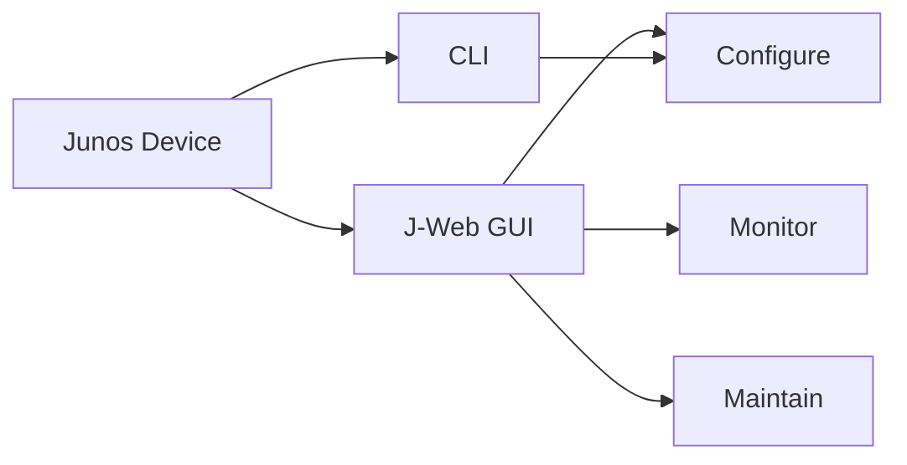
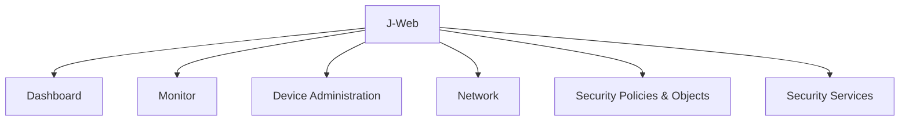
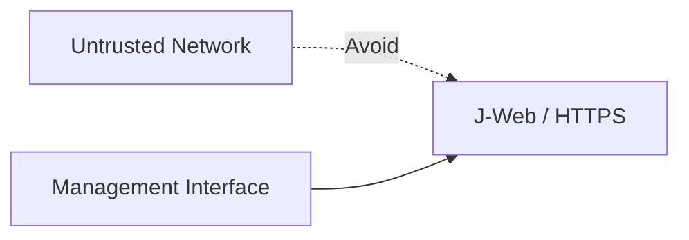
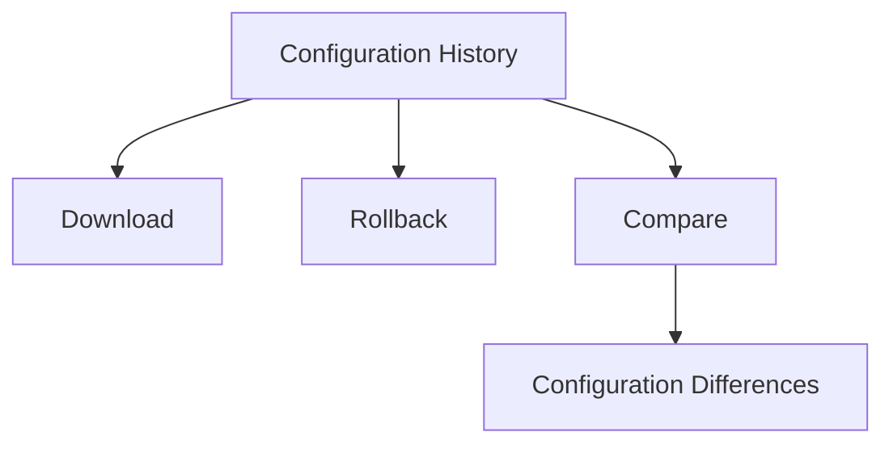
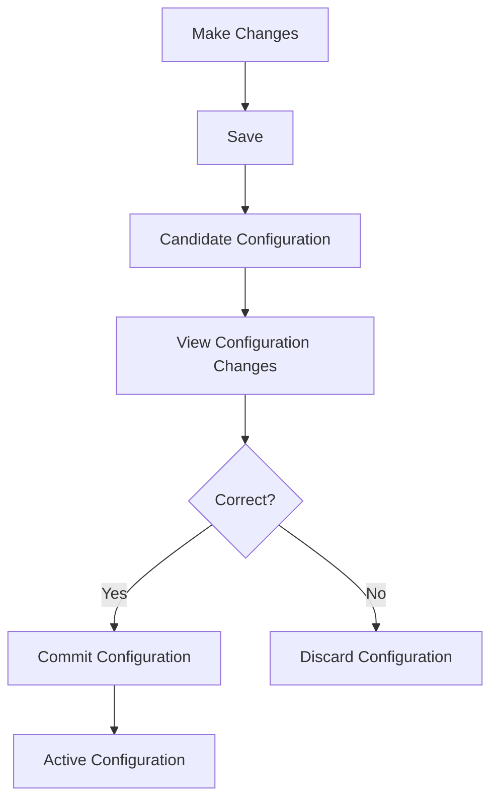
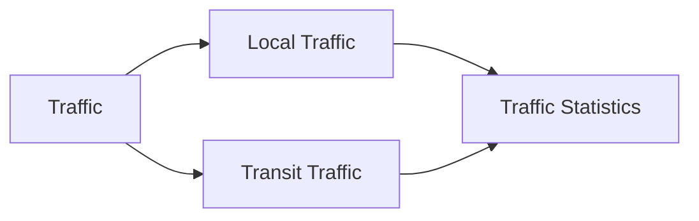

# JNCIA-Junos — J-Web Graphical User Interface

## 1. J-Web Overview

**J-Web** = web-based GUI for configuring, monitoring, and maintaining Junos devices. It is an alternative/helper to the CLI, **not a replacement for CLI**.

Commonly useful on **SRX firewalls**, especially for managing complex firewall policies.



---

# 2. J-Web Main Tabs

|Tab|Purpose|
|---|---|
|**Dashboard**|Custom monitoring widgets|
|**Monitor**|Interface status, traffic, logs, security monitoring|
|**Device Administration**|System settings, users, files, software, configuration, tools|
|**Network**|Interfaces, VLANs, routing, firewall filters, VPN, NAT, CoS|
|**Security Policies and Objects**|SRX security policies + address/application objects|
|**Security Services**|Advanced security services such as antivirus, web/content filtering, antispam|



---

# 3. Dashboard & Widgets

Dashboard provides a customizable view of device health.

### Widgets

- **System Identification**
    
    - Serial number
        
    - Hostname
        
    - Software version
        
- **Resource Utilization**
    
    - Routing Engine
        
    - Packet Forwarding Engine
        
    - Disk
        
- **Interface drops**
    
    - Helps identify problematic interfaces/cables
        

Widgets can be **dragged and dropped**, and multiple dashboard tabs can be created.

---

# 4. Device Administration → Basic Settings

Four major sections:

```text
System Identity
Time
Management and Loopback Address
System Services
```

---

## System Identity

Configure:

- Root password
    
- Hostname
    
- DNS servers
    

DNS server is added using the **+** button.

### Important

J-Web changes first go into the **candidate configuration**.

```text
J-Web change
     ↓
Save
     ↓
Candidate configuration
     ↓
Commit
     ↓
Active configuration
```

Saving ≠ committing.

If you leave a page without saving, J-Web warns that the changes will be discarded.

---

# 5. Time Configuration

J-Web supports three time sources:

|Source|Function|
|---|---|
|**NTP Servers**|Synchronize with NTP|
|**Manual**|Manually configure date/time|
|**Computer**|Synchronize from local computer|

### NTP

Multiple NTP servers can be configured for redundancy.

---

# 6. Management & Loopback Address

Configure:

- Management IP address
    
- Subnet mask
    
- Loopback address
    
- Default gateway
    

⚠️ **Changing the management IP can disconnect your J-Web session.**

After committing the new address, reconnect using the new management IP.

---

# 7. System Services

Used to enable/disable management services such as:

- Telnet
    
- SSH
    
- HTTPS
    
- NETCONF
    

Services can be:

- Globally enabled
    
- Restricted to specific interfaces
    

HTTPS requires an **HTTPS certificate** and can use a custom port instead of TCP/443.

### Security Best Practice

Restrict J-Web/HTTPS to the **management interface** where possible.

Management services expose the device to potential attacks.



---

# 8. User Management

J-Web allows creating/editing users.

Required:

```text
Username
Password
Role/Class
```

Optional:

```text
UID
Full Name
```

If UID is not specified, Junos creates one automatically. The J-Web **Role** corresponds to the Junos **login class**.

---

# 9. File Management

Junos uses a Unix-like filesystem.

Useful cleanup location:

```text
/var/tmp/
```

Old files can be deleted to free disk space, especially before software upgrades.

### Cleanup

J-Web provides:

- Individual file deletion
    
- **Clean Up Files** → generates removable old/unused files
    

Many cleanup candidates are logs under:

```text
/var/log/
```

⚠️ Back up logs first if they may be needed for troubleshooting/forensics.

---

# 10. Software Management

J-Web can upgrade Junos:

```text
Device Administration
 → Software Management
 → Upload Package
```

Workflow:


Common options:

|J-Web|CLI equivalent|
|---|---|
|**Reboot If Required**|`reboot`|
|**Do not save backup**|`no-copy`|

### Important limitation

If configuration compatibility requires:

```text
no-validate
```

you must switch to the **CLI** for the upgrade.

---

# 11. Configuration Management

Junos stores previous configuration versions; the module states that **49 previous configuration files** are retained.

J-Web **History** provides:

- Commit date/time
    
- User
    
- Commit comments
    
- Log message
    
- Download
    
- Rollback
    

### Compare

Select two configurations → **Compare**

Displays differences between them.



---

# 12. J-Web Troubleshooting Tools

Under **Device Administration → Tools**:

- Ping
    
- Traceroute
    
- Packet Capture
    
- CLI Terminal
    
- CLI Viewer
    
- CLI Editor
    

Some advanced troubleshooting functions are unavailable directly in GUI, so J-Web provides access to the CLI.

### CLI Viewer / Editor

J-Web can display/edit configuration in **hierarchy mode**.

Interesting exam point:

> Hierarchy-mode configuration editing through this interface is available in J-Web; this particular editing feature is not available on the CLI.

---

# 13. Ping Host

J-Web Ping supports options similar to CLI:

- Count
    
- Don't Fragment
    
- Packet Size
    
- Source Address
    

Useful for testing connectivity to a remote IP.

```text
Ping Host
 ├── Remote Host
 └── Advanced Options
      ├── Count
      ├── Don't Fragment
      ├── Packet Size
      └── Source Address
```

---

# 14. Reboot

J-Web allows:

- Immediate reboot
    
- Scheduled reboot
    

Scheduled reboot is useful for performing maintenance outside working hours.

---

# 15. Network Tab

Main network functions include:

### Connectivity

- Interfaces
    
- VLANs
    

### Firewall Filters

- Configure filters
    
- Apply filters to interfaces
    

### Routing

- Static routing
    
- Dynamic routing
    
- Other routing features
    

---

# 16. Configure IPv4 Interface

Example:

```text
ge-0/0/5.0
```

Navigation:

```text
Network
 → Connectivity
 → Interfaces
 → Select interface
 → Create
 → Logical Interface
```

### Logical Interface Options

|Option|Meaning|
|---|---|
|Logical unit|Unit number, e.g. `0`|
|Description|Optional interface description|
|VLAN ID|Used for tagged interface; unavailable in this example|
|Zone|SRX security zone|
|Protocol/Family|`inet`, `inet6`, `ethernet-switching`|

---

# 17. IPv4 Address Configuration

Select:

```text
IPv4 Address/DHCP
```

Then choose:

```text
DHCP
```

or

```text
IPv4 Address
```

For manual configuration:

```text
IPv4 Address
 → +
 → Enter IP + subnet mask
 → OK
```

The change is saved to the **candidate configuration**.

---

# 18. Commit Workflow in J-Web



### Commit menu

|J-Web option|CLI equivalent|
|---|---|
|**Commit configuration**|`commit` / `commit and-quit`|
|**View configuration changes**|`show \| compare`|
|**Commit configuration with auto-rollback**|`commit confirmed`|
|**Discard configuration**|`rollback`|

### Configuration comparison

J-Web displays the changes in **hierarchy mode**, equivalent to:

```bash
show | compare
```

---

# 19. Monitor → Interfaces

Navigation:

```text
Monitor
 → Network
 → Interfaces
```

The interface list shows:

- Interface status
    
- IP information
    
- Security zone
    
- Host inbound traffic
    

Status indicators:

```text
🟢 Up
🔴 Down
```

---

# 20. Interface Details

Select interface → **View Details**

Physical interface information includes:

- Link type
    
- MTU
    
- Link mode
    
- Speed
    

Example:

```text
Link type : Ethernet
MTU       : 1514
Link mode : Full-duplex
Speed     : 1000 Mbps
```

The document explains **1514 bytes** as:

```text
1500-byte Layer 3 MTU
+
14-byte Ethernet header
=
1514 bytes
```

---

# 21. Physical vs Logical Interface Monitoring

For traffic monitoring, examine the **logical interface** because most user traffic passes through logical interfaces.

Example:

```text
ge-0/0/0     ← Physical
ge-0/0/0.0   ← Logical
```

### Traffic categories

|Type|Meaning|
|---|---|
|**Local traffic**|Traffic destined to the interface|
|**Transit traffic**|Traffic passing through the interface|
|**Traffic statistics**|Local + transit|

Statistics include:

- Input/output
    
- Bytes
    
- Packets
    
- Bytes per second (bps)
    
- Packets per second (pps)
    



---

# 22. Feature Explorer

Use Juniper **Feature Explorer** to determine whether a device/software release supports a feature such as J-Web.

[Juniper Feature Explorer](https://apps.juniper.net/feature-explore/?utm_source=chatgpt.com)

You can:

- Search by keyword
    
- Explore Junos features
    
- Explore Juniper products
    
- Compare products
    
- Compare software releases
    

---

# 23. Checking J-Web Support

Workflow:

```text
Feature Explorer
      ↓
Search "J-Web graphical user interface"
      ↓
Open matching feature
      ↓
Search device model
      ↓
Check supported releases
```

The feature page lists supported devices and the software release in which the feature became supported.

### MX204 Example

The document's Feature Explorer example shows that **MX204 is not listed as supporting J-Web**. It also notes that J-Web is supported on many EX/QFX switches, SRX firewalls, and a small number of MX routers.

---

# 🔥 JNCIA J-Web Cheat Sheet

|Topic|Key Point|
|---|---|
|J-Web|Web GUI for Junos|
|CLI vs J-Web|J-Web complements; does not replace CLI|
|Dashboard|Customizable monitoring widgets|
|System Identity|Hostname, root password, DNS|
|Time|NTP / Manual / Computer|
|Management|Management + loopback addressing|
|System Services|SSH, Telnet, HTTPS, NETCONF|
|HTTPS|Can be restricted to specific interfaces|
|Users|Username + password + role/class|
|Files|Delete old files / cleanup|
|Software|Upload and install Junos packages|
|`no-copy`|Don't save backup package|
|`no-validate`|CLI-only when required|
|Config History|Download / Rollback / Compare|
|Tools|Ping / Traceroute / Packet Capture / CLI|
|Ping|Count, DF, packet size, source address|
|Reboot|Immediate or scheduled|
|Network|Interfaces, VLANs, routing, filters|
|Interface family|`inet`, `inet6`, `ethernet-switching`|
|Save|Saves changes to candidate configuration|
|Commit|Makes candidate changes active|
|View changes|Equivalent to `show \| compare`|
|Auto-rollback|Equivalent to `commit confirmed`|
|Discard|Equivalent to `rollback`|
|Physical monitoring|Link/MTU/speed/duplex|
|Logical monitoring|Better for user traffic|
|Local traffic|Destined to interface|
|Transit traffic|Passing through interface|
|Feature Explorer|Check device/feature support|

### ⭐ Exam Mental Model

```text
J-Web
│
├── Configure
│   ├── Device Administration
│   └── Network
│
├── Monitor
│   ├── Dashboard
│   └── Monitor
│
├── Maintain
│   ├── Files
│   ├── Software
│   ├── Configuration History
│   └── Reboot
│
└── Verify Support
    └── Feature Explorer
```