# IPv6 Fundamentals & Subnetting

## 1. IPv6 Basics

- IPv6 uses **128-bit addresses**.
    
- Written in **hexadecimal** to make addresses shorter and easier to read.
    
- IPv4 = **32-bit**
    
- MAC = **48-bit**
    
- IPv6 = **128-bit**
    

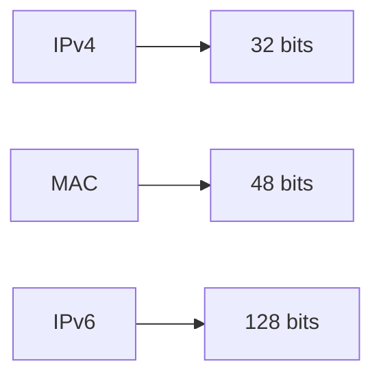

- IPv6 was introduced largely because the world exhausted the available public IPv4 address space.
    
- IPv6 provides an extremely large address space: `2^128` possible addresses.
    

---

# 2. Binary

Computers fundamentally work with **binary (0s and 1s)**.

### 8-bit binary

```text
128 64 32 16 8 4 2 1
```

Example:

```text
10000001
```

= `128 + 1`

= **129**

### Important

```text
11111111 = 255
00000000 = 0
```

An 8-bit value can represent:

```text
0–255
```

---

# 3. Common Address Sizes

|Type|Size|
|---|--:|
|IPv4|32 bits|
|MAC|48 bits|
|IPv6|128 bits|

More bits → exponentially more possible values.

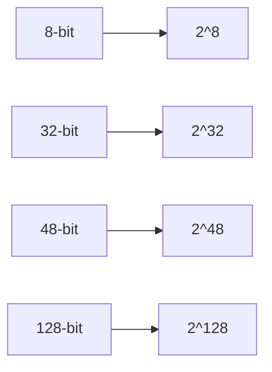

---

# 4. Hexadecimal

Hexadecimal uses **16 symbols**:

```text
0 1 2 3 4 5 6 7 8 9 A B C D E F
```

Mapping:

```text
Decimal → Hex

0  → 0
1  → 1
...
9  → 9
10 → A
11 → B
12 → C
13 → D
14 → E
15 → F
```

### Important relationship

```text
4 binary bits = 1 hexadecimal digit
```

Therefore:

```text
8 binary bits = 2 hexadecimal digits
```

Example:

```text
10111011
```

Split:

```text
1011 1011
  B    B
```

= `BB`

---

# 5. Why IPv6 Uses Hex

An IPv6 address contains **128 bits**.

Writing all 128 bits in binary would be difficult:

```text
0000000000000000...
```

Hexadecimal compresses the representation.

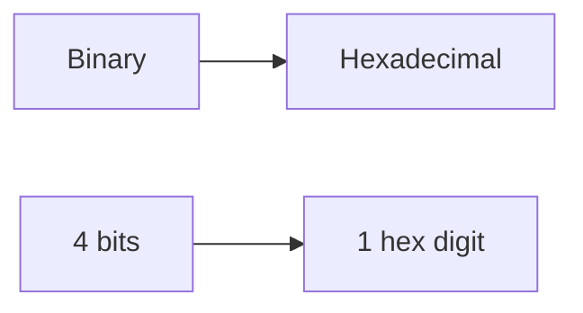

This makes IPv6 addresses significantly easier to read and manage.

---

# 6. IPv6 Address Format

A full IPv6 address contains:

- **32 hexadecimal digits**
    
- **8 groups (hextets)**
    
- Each hextet = **4 hex digits**
    
- Hextets separated by `:`
    

Example:

```text
2001:0db8:0000:0010:0000:0000:0000:0001
```

Structure:

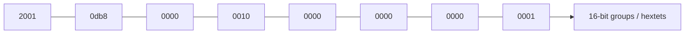

### Remember

```text
8 hextets × 16 bits = 128 bits
```

IPv6 hexadecimal digits are normally written in **lowercase**.

---

# 7. IPv6 Address Compression

IPv6 provides two main ways to shorten addresses.

## Rule 1 — Remove Leading Zeros

Leading zeros within a hextet can be removed.

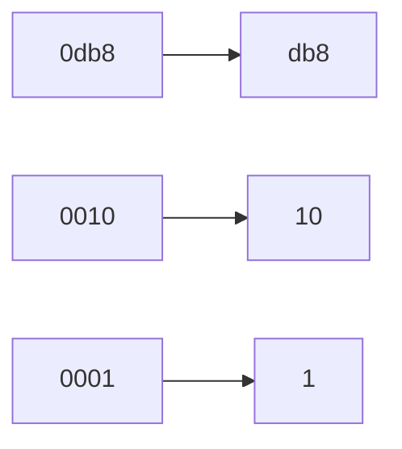

Example:

```text
2001:0db8:0000:0010:0000:0000:0000:0001
```

becomes:

```text
2001:db8:0:10:0:0:0:1
```

### Important

Only **leading zeros** are removed.

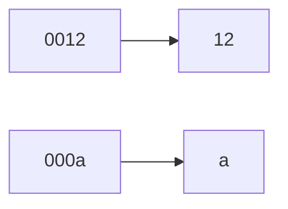

But:

```text
1200 ≠ 12
```

---

# 8. Double-Colon `::` Compression

A consecutive sequence of all-zero hextets can be replaced with:

```text
::
```

Example:

```text
2001:db8:0:0:0:0:0:1
```

becomes:

```text
2001:db8::1
```

### Critical Rule

`::` can be used **only once** in an IPv6 address.

❌ Invalid:

```text
2001::10::1
```

✅ Valid:

```text
2001:db8::1
```

### Best practice

When multiple zero sequences exist, compress the **longest consecutive sequence of zero hextets**.

---

# 9. Expanding `::`

To expand a compressed address:

1. Count existing hextets.
    
2. Determine how many hextets are missing.
    
3. Replace `::` with the required number of `0000` hextets.
    
4. Restore leading zeros if writing the full form.
    

Example:

```text
2001:db8::1
```

Full form:

```text
2001:0db8:0000:0000:0000:0000:0000:0001
```

---

# 10. IPv6 Subnetting

IPv6 subnetting is simpler than IPv4 for normal LAN addressing.

IPv6 supports **128 possible prefix lengths**, from:

```text
/0 → /128
```

For this course, the important prefixes are:

```text
/64
/128
```

---

# 11. `/64` — Standard IPv6 LAN

A `/64` is commonly used for IPv6 LANs.

```text
/64
```

means:

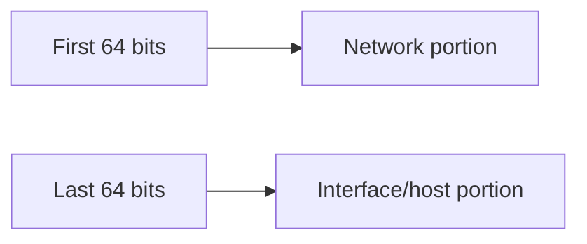

Conceptually:

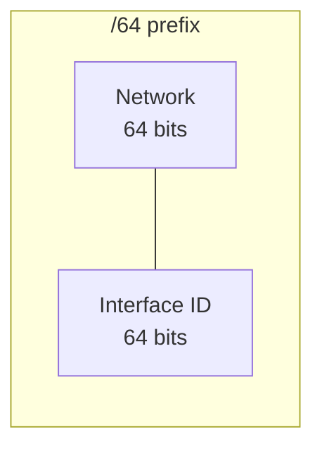

The network portion identifies the subnet, while the interface portion identifies an interface within that subnet.

---

# 12. `/128` — Single Host

A `/128` identifies one specific IPv6 address.

```text
/128
```

means:

```text
All 128 bits are fixed.
```

So there is effectively **one address** in the prefix.

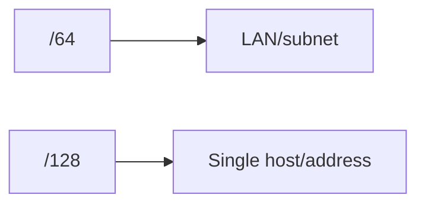

---

# 13. IPv6 Subnetting vs IPv4

### IPv4

Subnet masks can vary depending on the required network size:

```text
/24
/25
/26
/27
...
```

### IPv6

For normal LANs, `/64` is the common standard.

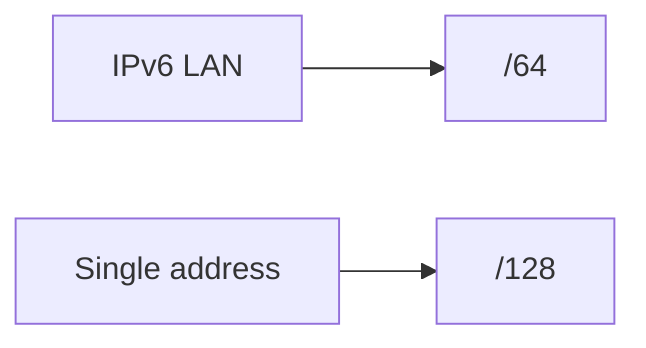

This avoids the need to calculate arbitrary host-sized subnet masks for typical IPv6 LAN deployments.

---

# 14. IPv6 Link-Local Addresses

IPv6 interfaces automatically generate a **link-local address**.

Link-local addresses:

```text
FE80::/10
```

The address shown in the course begins with:

```text
fe80
```

### Purpose

Used for communication on the **local link**.

Common uses:

- Neighbor/device discovery
    
- Communication between directly connected devices
    
- Routing-protocol messages
    

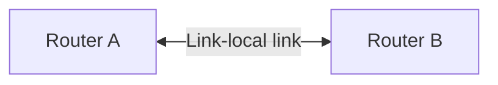

---

# 15. Link-Local Scope

A link-local address is **not routable across the network**.

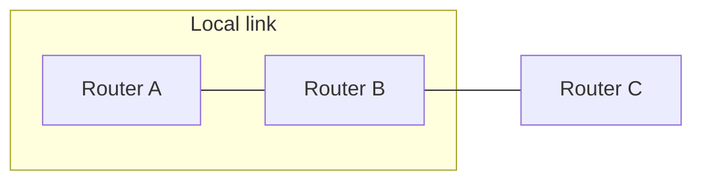

If Router A tries to reach Router B's link-local address, communication is possible because they share the same link.

But Router C cannot use that link-local address as if it were globally reachable.

### Key rule

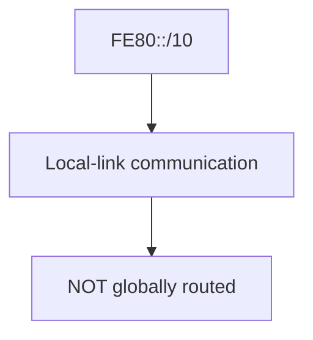

---

# 16. IPv6 Link-Local Address Generation

IPv6 interfaces automatically generate link-local addresses, so an interface can have IPv6 connectivity on its local link even without a globally routable IPv6 address.

Example:

```text
fe80::5207:fff:fe08:7314
```

The exact interface identifier depends on the device/interface addressing mechanism.

---

# 17. IPv6 Address Types — Quick View

|Type|Prefix / Format|Purpose|
|---|---|---|
|Global/other unicast|Depends on allocation|Routable IPv6 communication|
|Link-local|`fe80::/10`|Local-link communication|
|`/64`|Prefix length|Typical LAN subnet|
|`/128`|Prefix length|Single IPv6 address|

---

# 18. IPv6 Interface Example

A Junos interface can display an IPv6 address and its link-local address.

Conceptually:

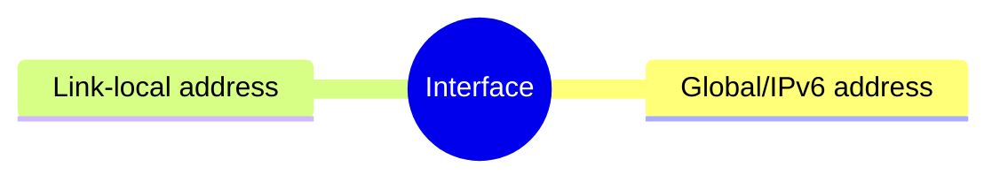

Example from the course:

```text
Destination: fe80::/64
Local: fe80::5200:fff:fe08:6
```

When troubleshooting Junos IPv6 interfaces, check both the configured IPv6 address and the automatically generated link-local address.

---

# 19. IPv4 Address Exhaustion → IPv6

IPv4 provides:

```text
2^32 ≈ 4.29 billion
```

possible addresses.

Because of address exhaustion and Internet growth, IPv6 provides:

```text
2^128
```

possible addresses.

The course uses IPv4 exhaustion as the motivation for understanding IPv6.

---

# 20. IPv6 Cheat Sheet

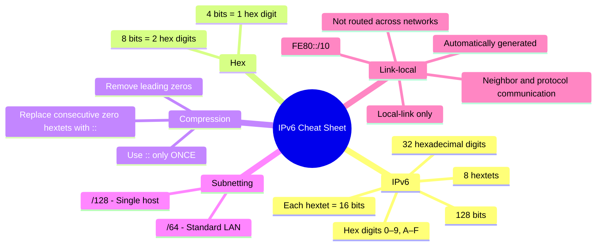

## Must Remember

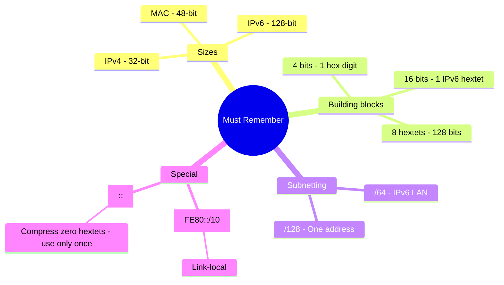