# Junos Network Interfaces — Interface Naming, Logical Units & `show interfaces terse`

## 1. Network Interface

A **network interface** processes incoming and outgoing network traffic.

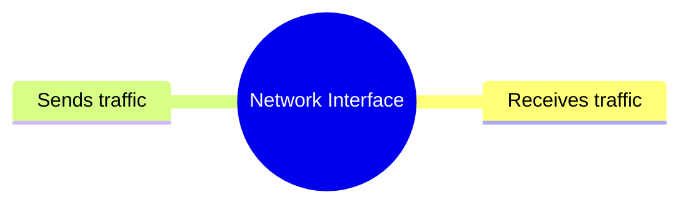

On Junos, interfaces are represented using a **standard naming convention** across Juniper devices.

---

# 2. Junos Interface Naming Convention

Typical interface names:

```text
ge-0/0/0
xe-1/1/2
et-2/0/1
```

General structure:

```text
<type>-<FPC>/<PIC>/<port>
```

Example:

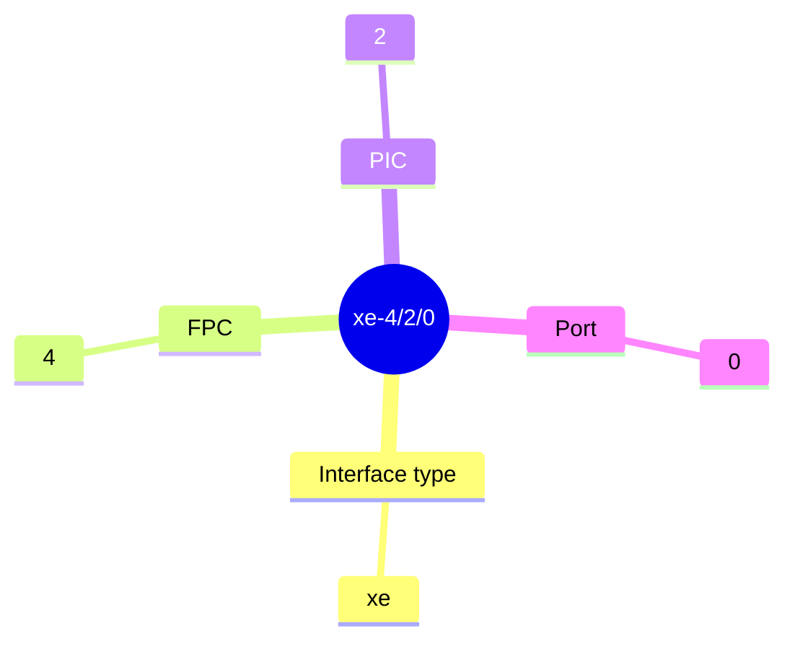

---

# 3. Interface Types

|Prefix|Meaning|Typical Speed|
|---|---|--:|
|`fe-`|Fast Ethernet|100 Mbps|
|`ge-`|Gigabit Ethernet|1 Gbps|
|`xe-`|10-Gigabit Ethernet|10 Gbps|
|`et-`|High-speed Ethernet|40 Gbps+|

> **Memory:** `ge` = Gigabit, `xe` = 10G, `et` = high-speed Ethernet.

---

# 4. FPC, PIC & Port

## FPC — Flexible PIC Concentrator

Represents the **line-card/FPC location** in the chassis.

## PIC — Physical Interface Card

Represents a **specific section of an FPC/line card**.

## Port

Identifies the **physical port itself**.

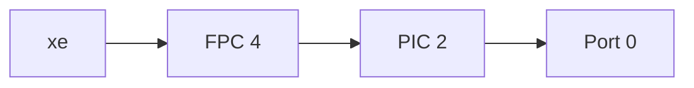

### Important

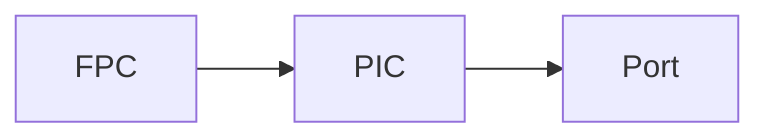

The numbering identifies **where the physical interface exists** on the chassis.

---

# 5. Smaller Juniper Devices

The same naming convention is used even on devices that don't have traditional removable line cards.

Example:

```text
xe-0/1/0
xe-0/1/1
```

The interface naming remains consistent, making it easier to work across different Juniper platforms.

### Why consistency matters

- Easier administration
    
- Easier troubleshooting
    
- Easier automation
    
- Scripts don't need completely different naming schemes for every device
    

---

# 6. Physical vs Logical Interface

This is one of the **most important Junos concepts**.

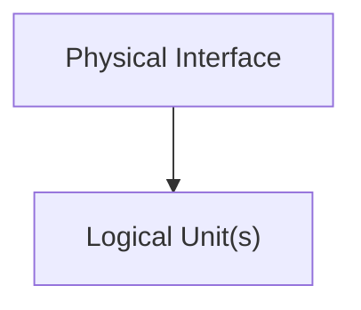

Example:

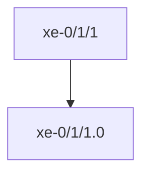

### Physical Interface

Handles physical properties such as:

- Speed
    
- Duplex
    
- Physical MTU
    
- Physical connectivity
    

### Logical Interface / Unit

Handles network-level configuration such as:

- IPv4 address
    
- IPv6 address
    
- VLAN tagging
    
- Layer 3 MTU
    

---

# 7. Logical Unit

Junos requires every physical interface to have **at least one logical interface/unit**.

Example:


`.0` is the **logical unit number**.

Other vendors may call this a:

```text
Subinterface
```

Junos generally calls it a **logical interface** or **unit**.

---

# 8. Multiple Logical Units

A single physical interface can contain **multiple logical units**.

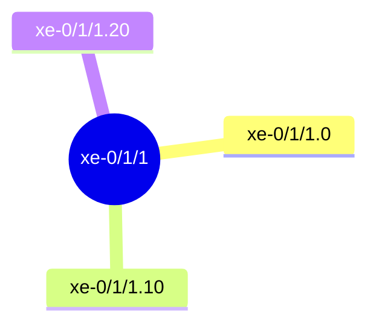

This is useful when one physical link needs to carry multiple logical networks, commonly with VLAN tagging.

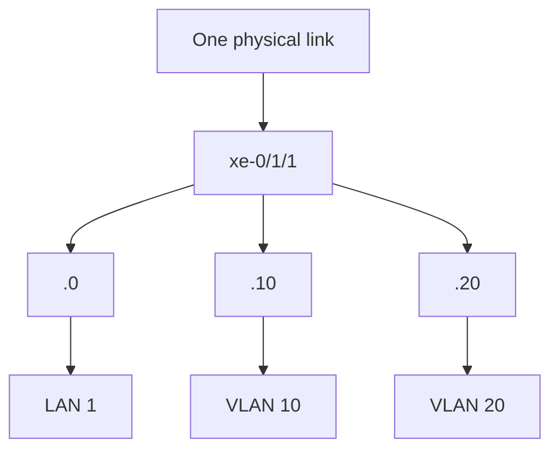

This concept becomes important when configuring **trunk ports/VLANs**.

---

# 9. Interface Properties — Where They Belong

|Property|Physical / Logical|
|---|---|
|Speed|Physical|
|Duplex|Physical|
|Physical MTU|Physical|
|IPv4 address|Logical|
|IPv6 address|Logical|
|VLAN tags|Logical|
|Layer 3 MTU|Logical|

### Easy rule

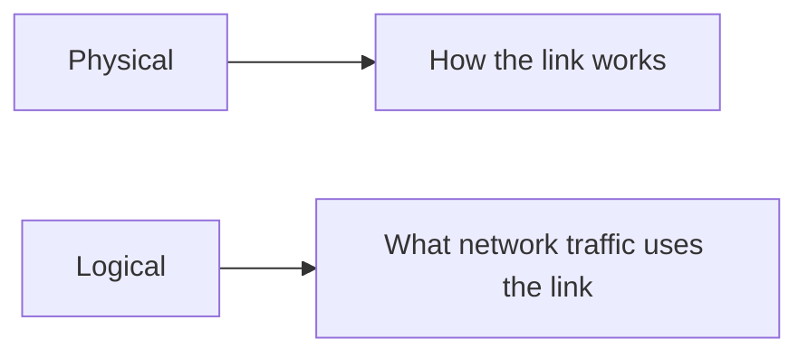

---

# 10. MTU

**MTU (Maximum Transmission Unit)** = largest packet/frame size that an interface can transmit without fragmentation at that layer.

### Layer 3 MTU

Default commonly:

```text
1500 bytes
```

Layer 3 MTU does **not include the Ethernet header**.

### Layer 2 MTU

Example default:

```text
1514 bytes
```

The Layer 2 value includes the Ethernet header.

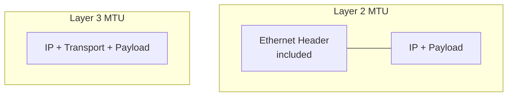

> The course specifically contrasts **1500-byte Layer 3 MTU** with **1514-byte Layer 2 MTU** for the default Ethernet example.

---

# 11. `show interfaces terse`

One of the most useful Junos commands for quickly checking interfaces:

```bash
show interfaces terse
```

It provides a **compact overview** of:

- Interface name
    
- Admin status
    
- Link status
    
- Protocol
    
- Local addresses
    
- Logical units
    

Example:

```text
Interface       Admin Link Proto Local
xe-0/1/1        up    up
xe-0/1/1.0      up    up   inet  172.16.10.1/24
```

---

# 12. `Admin` vs `Link`

`show interfaces terse` displays:

```text
Admin   Link
```

### Admin

Indicates whether the interface has been **administratively enabled**.

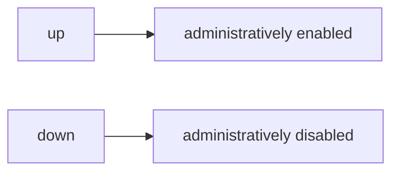

### Link

Indicates whether the physical link is actually active.

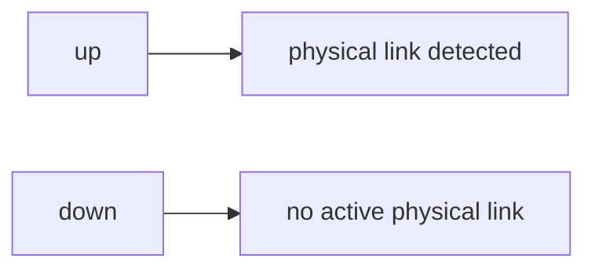

### Important combinations

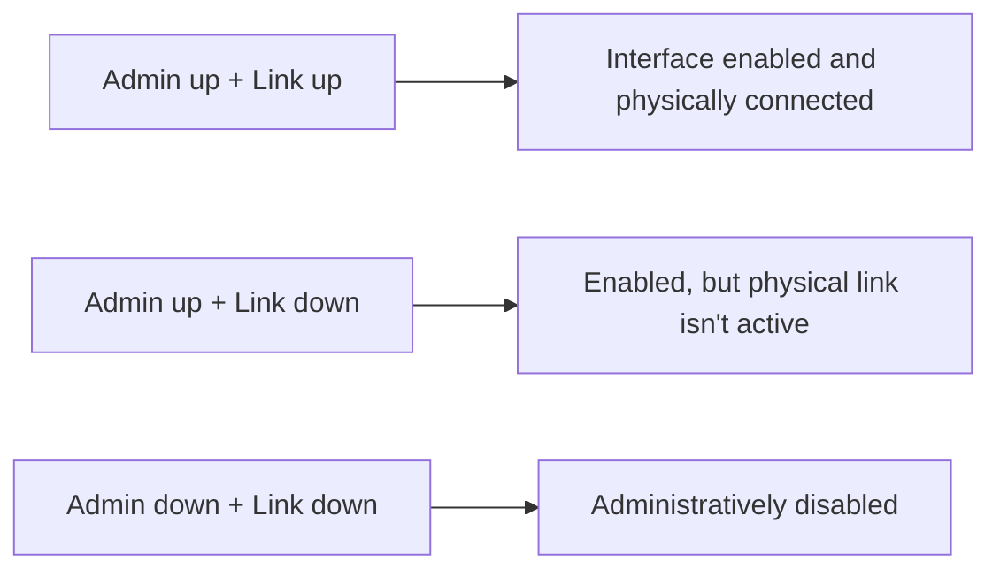

---

# 13. Protocol Column

Example:

```text
Proto
inet
inet6
```

### `inet`

Junos term for **IPv4**.

### `inet6`

Junos term for **IPv6**.

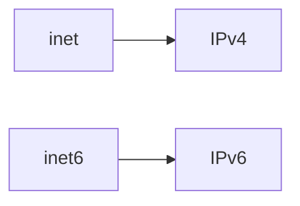

Example:

```text
xe-0/1/1.0
    inet   172.16.10.1/24
    inet6  2001:db8:0:10::1/64
```

---

# 14. `Local` Column

The `Local` column shows locally configured addresses.

Example:

```text
Local
172.16.10.1/24
2001:db8:0:10::1/64
fe80::...
```

For IPv6, an automatically generated **link-local address** may also appear.

---

# 15. `Remote` Column

The `Remote` column is used only for **specific interface types/configurations**.

Do not assume it will always contain an address.

For normal Layer 3 Ethernet interfaces, focus primarily on:

```text
Admin
Link
Proto
Local
```

---

# 16. `terse`, `brief`, `detail`, `extensive`

Junos commands can often provide different levels of output.

```bash
show interfaces terse
show interfaces brief
show interfaces
show interfaces detail
show interfaces extensive
```

### Information increases approximately like:

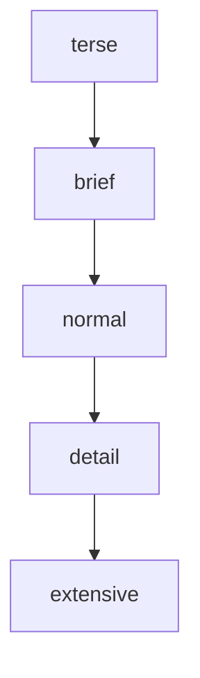

### `terse`

Quick overview.

```bash
show interfaces terse
```

Best for:

- Interface state
    
- IP addresses
    
- Quick troubleshooting
    

### `extensive`

Very detailed information.

```bash
show interfaces extensive
```

Best for:

- Deep troubleshooting
    
- Errors
    
- Counters
    
- Hardware/interface details
    

> The module emphasizes `terse` for quick verification and `extensive` when detailed statistics are required.

---

# 17. Checking a Specific Interface

Instead of displaying every interface:

```bash
show interfaces terse xe-0/1/1
```

This focuses the output on the selected interface.

Useful when troubleshooting a particular port.

---

# 18. Wildcards

Junos supports `*` as a wildcard.

Example:

```bash
show interfaces terse xe-0/1/*
```

This displays interfaces whose names match:

```text
xe-0/1/
```

Example result:

```text
xe-0/1/0
xe-0/1/1
xe-0/1/2
xe-0/1/3
```

### Memory

```text
* → match anything
```

Very useful when you want to inspect a **group of interfaces** without displaying the entire device.

---

# 19. Viewing All Interfaces

```bash
show interfaces terse
```

If you don't specify an interface, Junos displays **all interfaces**, including internal and logical interfaces.

Output can therefore be long.

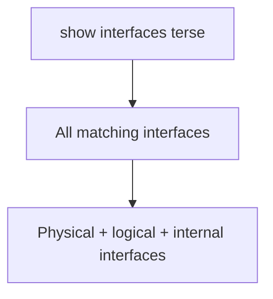

---

# 20. Interface Descriptions

You can add descriptions to physical and logical interfaces.

View them with:

```bash
show interfaces descriptions
```

Example:

```text
Interface    Admin Link Description
xe-0/1/1     up    up   Corporate LAN
xe-0/1/2     up    up   Server LAN
xe-0/1/3     up    up   Guest LAN
```

### Best practice

Descriptions should be:

- Short
    
- Meaningful
    
- Consistent
    

Example:

```text
Corporate-LAN
Server-LAN
Guest-LAN
WAN-to-ISP
```

They are extremely useful when troubleshooting a device you did not originally configure.

---

# 21. Example — Customer LAN

From the module topology:

```text
Corporate LAN
IPv4: 172.16.10.1/24
IPv6: 2001:db8:0:10::1/64

Server LAN
IPv4: 172.16.20.1/24
IPv6: 2001:db8:0:20::1/64

Guest LAN
IPv4: 172.16.30.1/24
IPv6: 2001:db8:0:30::1/64
```

Corresponding interfaces:

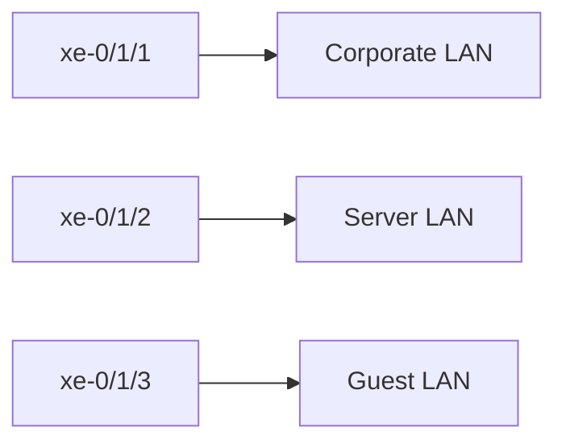

---

# 22. Troubleshooting with `show interfaces terse`

### Basic workflow

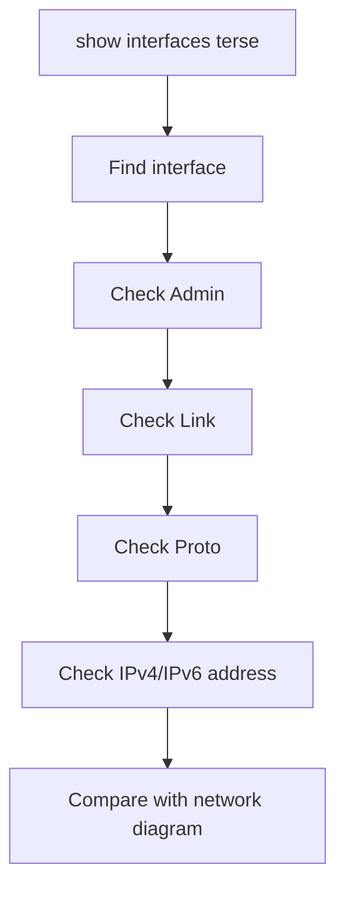

Example:

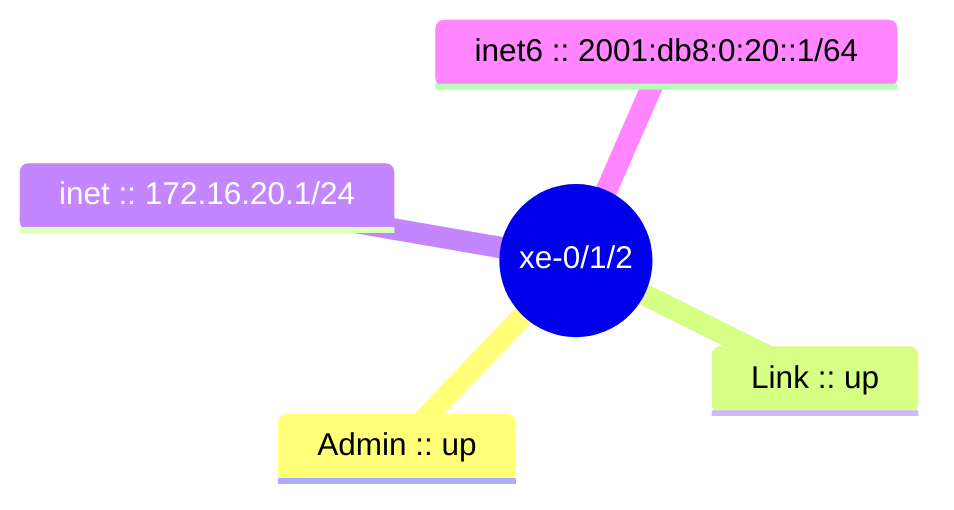

If the expected address is different, investigate the configuration.

---

# 23. Important Lab Errors

The module demonstrates checking interfaces against the expected topology.

### Server LAN

Expected:

```text
172.16.20.1/24
2001:db8:0:20::1/64
```

A typo such as:

```text
172.16.200.1/24
```

means the IPv4 configuration is incorrect even if the interface is operational.

### Guest LAN

Expected:

```text
172.16.30.1/24
2001:db8:0:30::1/64
```

The module demonstrates an interface where the IPv4 address is wrong and the IPv6 address is missing except for the automatically generated link-local address.

**Key troubleshooting lesson:** `up/up` does not guarantee that the IP configuration is correct.

---

# 24. `up/up` ≠ Correct Configuration

This is an important troubleshooting concept.

```text
Admin up
Link up
```

only tells you:

```text
Interface enabled
+
Physical link operational
```

It does **not** prove:

- Correct IPv4 address
    
- Correct IPv6 address
    
- Correct subnet
    
- Correct VLAN
    
- Correct routing
    
- Correct application connectivity
    

Always compare the interface configuration with the expected topology.

---

# 25. Key Junos Interface Structure

```mermaid
mindmap
  root((Physical Interface))
    Physical properties
      Speed
      Duplex
      Physical MTU
    Logical Unit
      IPv4
      IPv6
      VLAN tags
      Layer 3 MTU
```

---

# Quick Cheat Sheet

```mermaid
mindmap
  root((Interface naming))
    Breakdown of ge-0/0/0
      Interface type
      FPC
      PIC
      Port
    Speeds
      fe :: 100 Mbps
      ge :: 1 Gbps
      xe :: 10 Gbps
      et :: 40 Gbps+
    Cards
      FPC :: Flexible PIC Concentrator
      PIC :: Physical Interface Card
```

```mermaid
flowchart TD
    P[xe-0/1/1] --> U[xe-0/1/1.0]
    PH[Physical] --> PHM[Speed, Duplex, Physical MTU]
    LG[Logical] --> LGM[IP, VLAN tags, L3 MTU]
    OP[One physical interface] --> ML[Multiple logical units] --> UNITS[.0 .10 .20 ...]
```

```mermaid
flowchart LR
    A[show interfaces terse] --> A1[Quick interface/IP/status overview]
    B[show interfaces brief] --> B1[More information]
    C[show interfaces detail] --> C1[Detailed information]
    D[show interfaces extensive] --> D1[Very detailed troubleshooting]
    E[show interfaces descriptions] --> E1[Interface purpose/description]
    F[show interfaces terse xe-0/1/1] --> F1[Specific interface]
    G[show interfaces terse xe-0/1/*] --> G1[Matching interfaces]
```

```mermaid
flowchart LR
    A1[Admin up + Link up] --> M1[Enabled + physical link working]
    A2[Admin up + Link down] --> M2[Enabled + physical link unavailable]
    A3[Admin down + Link down] --> M3[Administratively disabled]
    I[inet] --> V4[IPv4]
    I6[inet6] --> V6[IPv6]
```

### ⭐ Must Remember

- **Junos interface format:** `<type>-<FPC>/<PIC>/<port>`
    
- **FPC/PIC/Port** identify physical location.
    
- **Every physical interface has at least one logical unit.**
    
- `.0` is commonly the first logical unit.
    
- **One physical interface can have multiple logical units.**
    
- Physical interface → **speed, duplex, physical MTU**.
    
- Logical interface → **IP addresses, VLAN tags, Layer 3 MTU**.
    
- `show interfaces terse` → **fastest command for basic interface verification**.
    
- `Admin` → administrative state.
    
- `Link` → physical link state.
    
- `inet` → IPv4; `inet6` → IPv6.
    
- `up/up` only proves operational state, **not configuration correctness**.
    
- `*` → wildcard for matching interface names.
    
- `show interfaces descriptions` → quickly understand an interface's purpose.