# Junos — `show interfaces` Output & CLI Pipe Filtering

## 1. `show interfaces` vs `show interfaces terse`

### `show interfaces terse`

Quick overview:

```bash
show interfaces terse
```

Shows:

- Interface name
    
- Admin/link status
    
- Protocol
    
- IP addresses
    
- Logical units
    

### `show interfaces`

Detailed interface information:

```bash
show interfaces xe-0/1/2
```

Output is divided mainly into:

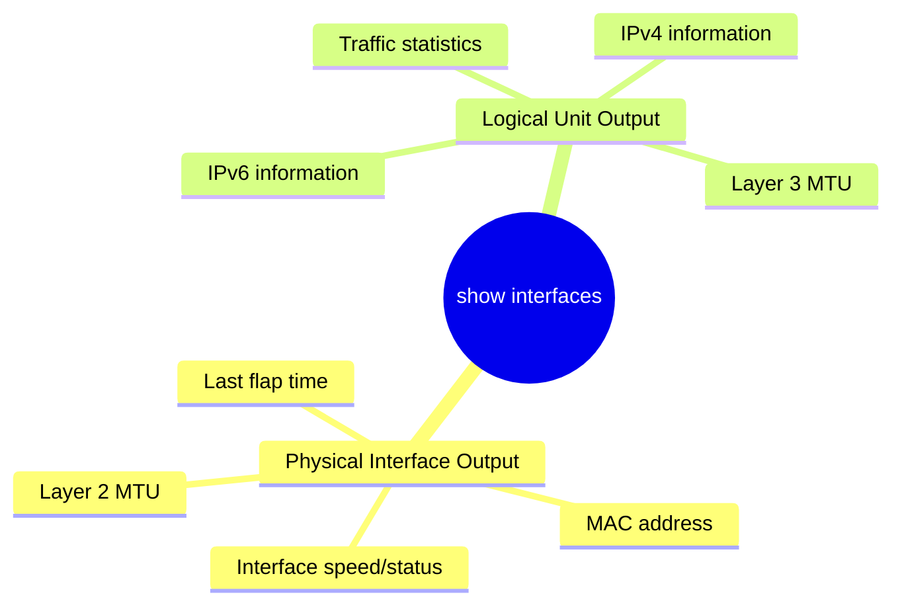

---

# 2. Physical Interface Output

Example:

```bash
show interfaces xe-0/1/2
```

Important fields:

```text
Physical interface: xe-0/1/2, Enabled, Physical link is Up
Description: Server LAN
Link-level type: Ethernet
MTU: 1514
Speed: 10Gbps
Current address: 38:4f:49:80:f4:09
Hardware address: 38:4f:49:80:f4:09
Last flapped: ...
Input rate: ...
Output rate: ...
```

### Important fields

|Field|Meaning|
|---|---|
|`Enabled`|Administratively enabled|
|`Physical link is Up`|Physical link operational|
|`MTU: 1514`|Layer 2 MTU|
|`Speed: 10Gbps`|Interface speed|
|`Current address`|MAC address|
|`Last flapped`|Last time link went down/up|
|`Input rate`|Incoming traffic|
|`Output rate`|Outgoing traffic|

---

# 3. `Last flapped`

```text
Last flapped: 2023-09-21 11:45:05 UTC
```

**Flapped** = interface went down/up.

Useful for detecting recently unstable interfaces.

```bash
show interfaces xe-0/1/2
```

Look for:

```text
Last flapped
```

---

# 4. Logical Interface Output

Example:

```text
Logical interface xe-0/1/2.0
```

Contains Layer 3 information.

Important fields:

```text
Protocol inet, MTU: 1500
Addresses, Flags: Is-Preferred Is-Primary
    Destination: 172.16.20.0/24
    Local: 172.16.200.1
    Broadcast: 172.16.200.255

Protocol inet6, MTU: 1500
Addresses, Flags: Is-Preferred Is-Primary
    Destination: 2001:db8:0:20::/64
    Local: 2001:db8:0:20::1

    Destination: fe80::/64
    Local: fe80::...
```

### Remember

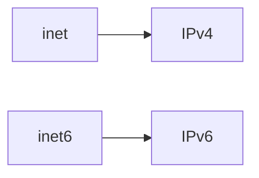

Logical interface information includes **Layer 3 MTU, IP addresses and traffic statistics**.

---

# 5. Layer 2 vs Layer 3 MTU

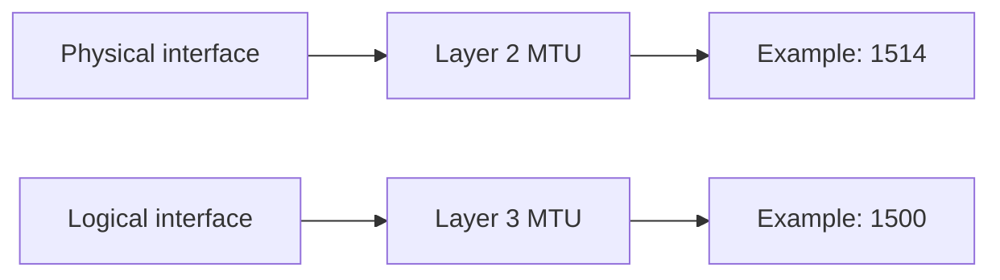

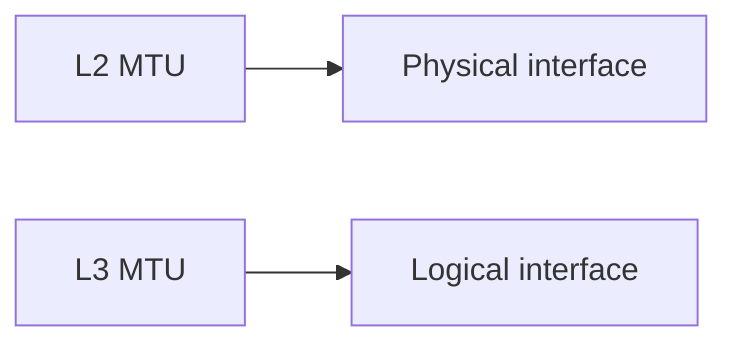

---

# 6. `show interfaces extensive`

```bash
show interfaces extensive
```

Provides extremely detailed information including:

- Interface status
    
- Traffic statistics
    
- Traffic priority information
    
- Error counters
    
- IP settings
    
- Packet/byte counters
    
- Protocol details
    
- Additional interface statistics
    

Use it for **deep troubleshooting**, not quick checks.

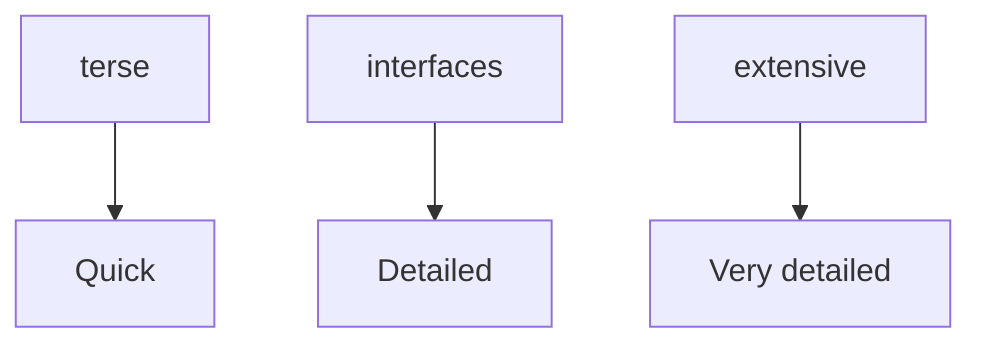

---

# 7. CLI Pipe `|`

Junos allows command output to be filtered using:

```text
|
```

Syntax:

```bash
show <command> | <filter>
```

Press:

```text
Shift + Backslash
```

to type `|` on keyboards where applicable.

---

# 8. `match`

Displays only lines containing specified text.

```bash
show interfaces terse xe-0/1/* | match down
```

Example use:

```text
Find interfaces that are down
```

### Syntax

```bash
<command> | match <text>
```

Example:

```bash
show interfaces xe-0/1/* | match physical
```

Useful for extracting only relevant lines from long output.

---

# 9. `match` with Multiple Strings

Use:

```bash
match "string1|string2"
```

The `|` **inside the quotes acts as OR**.

Example:

```bash
show interfaces xe-0/1/* | match "physical|flapped"
```

Meaning:

```text
physical OR flapped
```

Useful for finding interfaces that are either:

- Physical
    
- Recently flapped
    

The search is **not case-sensitive** in the demonstrated `match` usage.

---

# 10. `except`

`except` performs the opposite of `match`.

```bash
show interfaces terse xe-0/1/1 | except fe80
```

Meaning:

```text
Show everything
EXCEPT lines containing "fe80"
```

Useful for removing unwanted information.

### Example

Remove IPv6 link-local addresses:

```bash
show interfaces terse xe-0/1/1 | except fe80
```

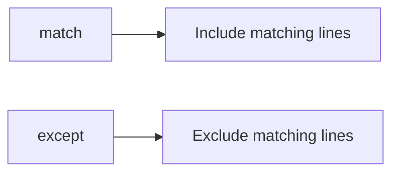

---

# 11. Chaining Pipes

Multiple pipe filters can be chained.

```bash
show interfaces xe-0/1/* | match physical | except down
```

This works like an **AND operation**:

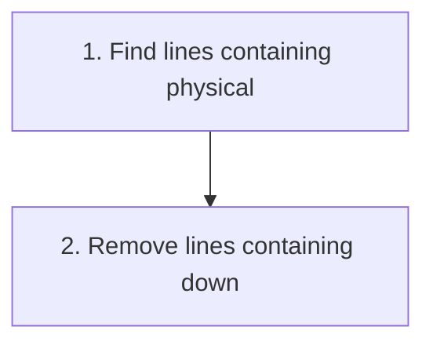

Result:


### Pattern

```bash
command | filter1 | filter2 | filter3
```

You can chain multiple pipes to create precise searches.

---

# 12. `count`

Counts the number of lines produced.

```bash
show interfaces xe-0/1/* | match physical | count
```

Example:

```text
Count: 8 lines
```

Useful for quickly determining how many interfaces match a condition.

### Example

```bash
show interfaces xe-0/1/* | match physical | count
```

→ Number of matching physical interfaces.

---

# 13. `find`

Starts displaying output from the **first occurrence** of specified text.

```bash
show interfaces xe-0/1/2 | find logical
```

Output begins at:

```text
Logical interface ...
```

Useful when you don't want to scroll through the beginning of a very long command output.

### Important

```text
find → Start output at first matching occurrence
```

The search is **not case-sensitive** in the demonstrated usage.

---

# 14. CLI Pipe Cheat Sheet

|Filter|Function|
|---|---|
|`match`|Show lines containing text|
|`except`|Remove lines containing text|
|`find`|Start output at first occurrence|
|`count`|Count output lines|
|`save`|Save output to file|
|`append`|Append output to file|
|`tee`|Write output to standard output and file|
|`no-more`|Disable `--more--` pagination|
|`last`|Display only the end of output|

---

# 15. Practical Filtering Examples

### Find down interfaces

```bash
show interfaces terse xe-0/1/* | match down
```

### Find physical interface information

```bash
show interfaces xe-0/1/* | match physical
```

### Find physical + flap information

```bash
show interfaces xe-0/1/* | match "physical|flapped"
```

### Exclude link-local IPv6

```bash
show interfaces terse xe-0/1/1 | except fe80
```

### Find interfaces that are physical AND not down

```bash
show interfaces xe-0/1/* | match physical | except down
```

### Count matching interfaces

```bash
show interfaces xe-0/1/* | match physical | count
```

### Jump directly to logical interface information

```bash
show interfaces xe-0/1/2 | find logical
```

---

# 16. `?` — Discover Pipe Options

You can use `?` to see available options:

```bash
show interfaces terse | ?
```

Typical filtering options include:

```text
count
except
find
match
```

This is useful when you forget the exact pipe command.

---

# 17. Interface Verification Workflow

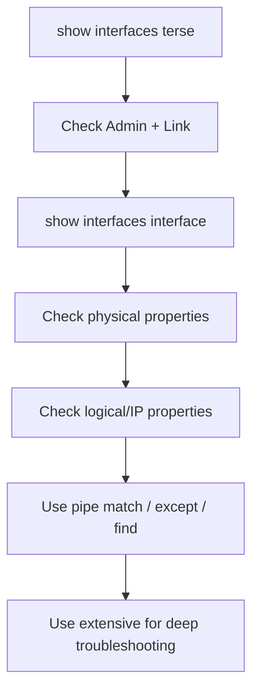

---

# 18. Lab Topology

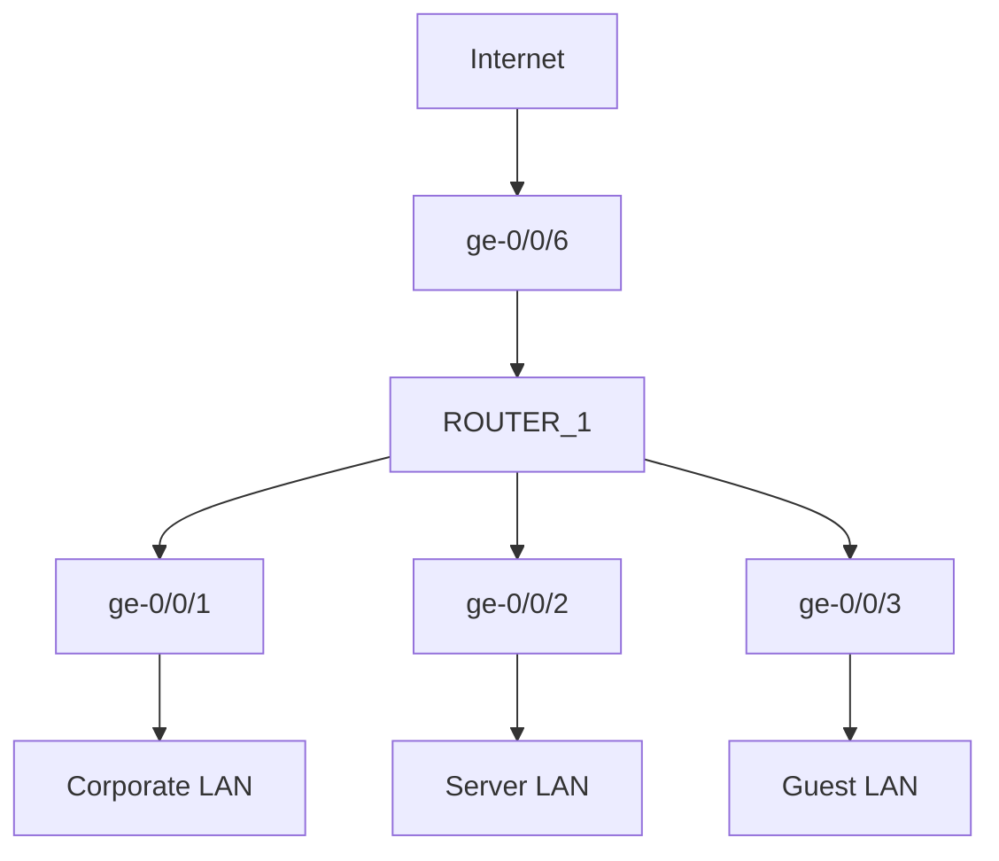

Expected LAN addressing:

```text
Corporate:
172.16.10.1/24
2001:db8:0:10::1/64

Server:
172.16.20.1/24
2001:db8:0:20::1/64

Guest:
172.16.30.1/24
2001:db8:0:30::1/64
```

Management interface:

```text
ge-0/0/6
10.1.25.1/24
2001:db8:0:25::1/64
```

---

# ⭐ JNCIA Quick Revision

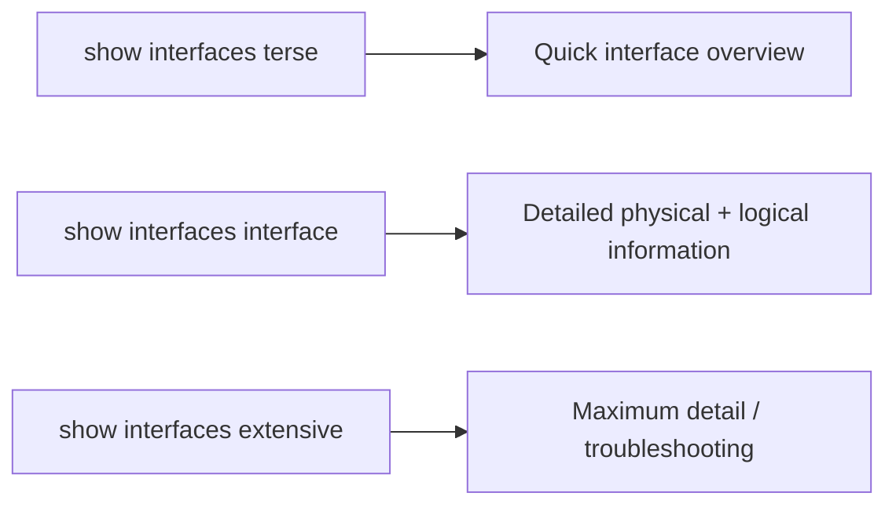

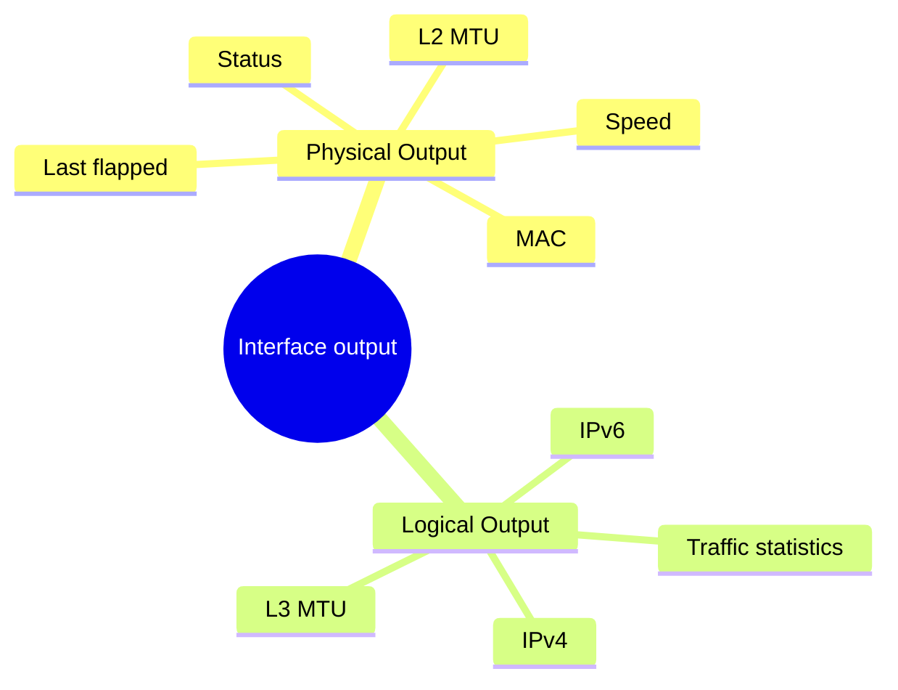

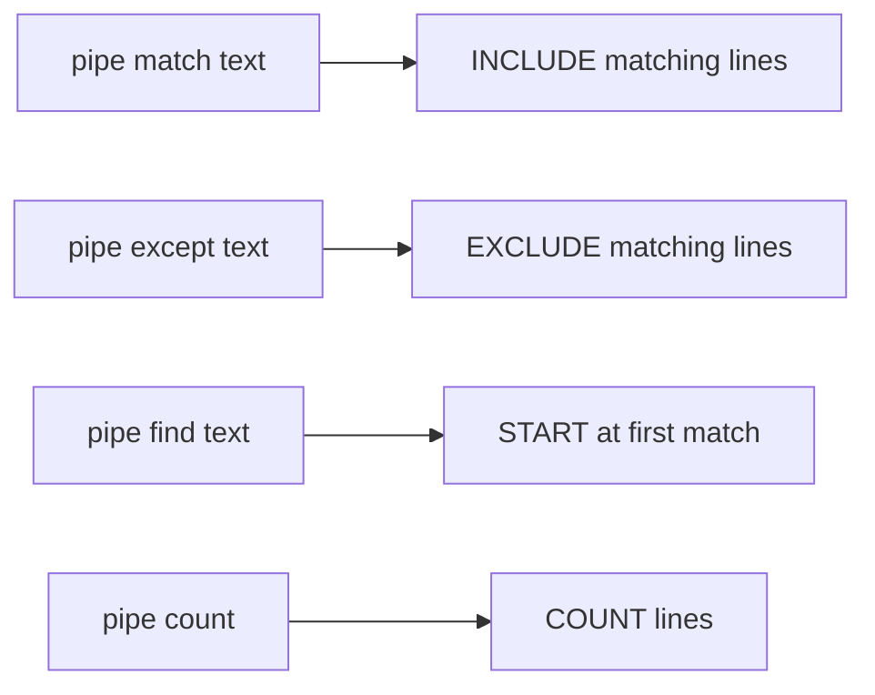

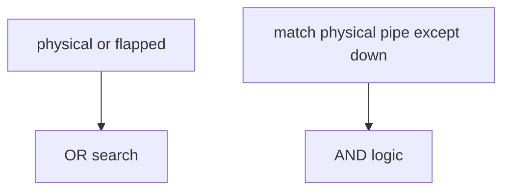

**Most important commands:**

```bash
show interfaces terse
show interfaces xe-0/1/2
show interfaces extensive
show interfaces xe-0/1/* | match down
show interfaces xe-0/1/* | match "physical|flapped"
show interfaces terse xe-0/1/1 | except fe80
show interfaces xe-0/1/* | match physical | except down
show interfaces xe-0/1/* | match physical | count
show interfaces xe-0/1/2 | find logical
```