# Junos Configuration — Hierarchy View & Set View

## 1. Active Configuration

The **active configuration** is the configuration currently committed and running on the Junos device.

```bash
show configuration
```

- Stored internally as a configuration database.
    
- Displayed by default in **hierarchy view**.
    
- Can also be displayed in **set view**.
    

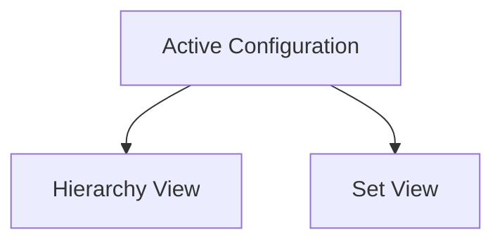

---

## 2. Candidate Configuration

Configuration changes are **not immediately applied**.

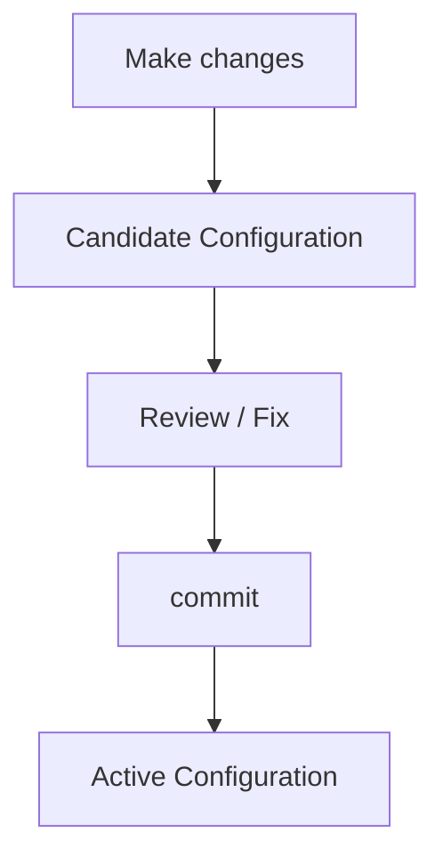

### Benefits

- Review changes before deployment.
    
- Fix mistakes before they affect the device.
    
- Reduces risk of configuration errors.
    

---

# 3. Hierarchy View

Default configuration format:

```bash
show configuration
```

Example:

```text
interfaces {
    xe-0/1/1 {
        description "Corporate LAN";
        mtu 1800;
        unit 0 {
            family inet {
                address 172.16.10.1/24;
            }
            family inet6 {
                address 2001:db8:0:10::1/64;
            }
        }
    }
}
```

### Characteristics

- Uses `{ }` braces.
    
- Uses indentation.
    
- Clearly shows parent → child relationships.
    
- Easier to understand complex configurations.
    

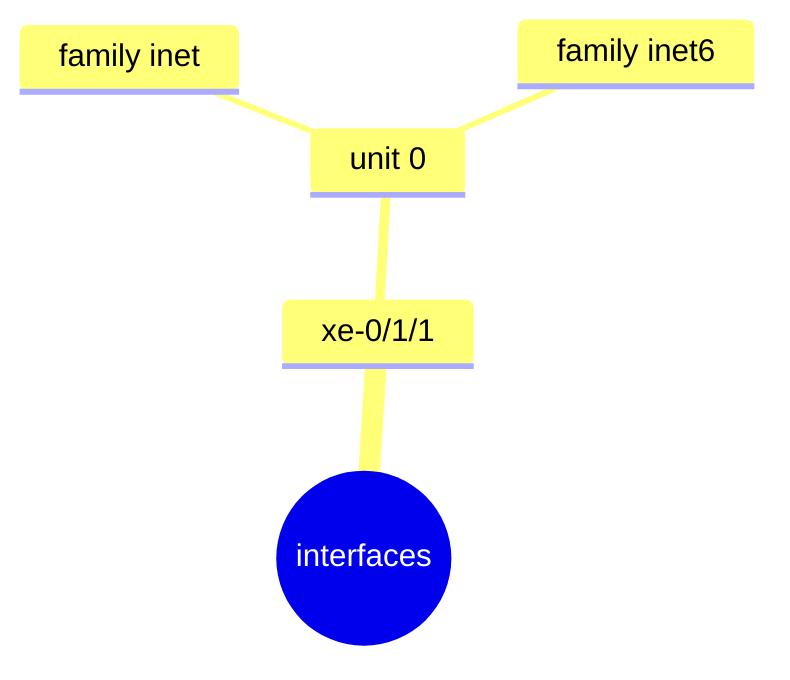

---

# 4. Set View

Displays configuration as individual `set` commands.

```bash
show configuration | display set
```

Example:

```bash
set system host-name R1
set interfaces xe-0/1/1 description "Corporate LAN"
set interfaces xe-0/1/1 mtu 1800
set interfaces xe-0/1/1 unit 0 family inet address 172.16.10.1/24
set interfaces xe-0/1/1 unit 0 family inet6 address 2001:db8:0:10::1/64
```

### Characteristics

- Looks like the commands used to configure Junos.
    
- Excellent for small/simple configurations.
    
- Shows many configuration lines at once.
    
- Large configurations can become difficult to read.
    

---

# 5. Hierarchy vs Set View

|Hierarchy View|Set View|
|---|---|
|`show configuration`|`show configuration \| display set`|
|Indented structure|Individual `set` commands|
|`{ }` braces|No braces|
|Shows relationships clearly|Shows commands directly|
|Better for complex configs|Good for small configs|

**Both represent the same configuration. Only the display format changes.**

---

# 6. Top-Level Hierarchies

Common Junos hierarchies:

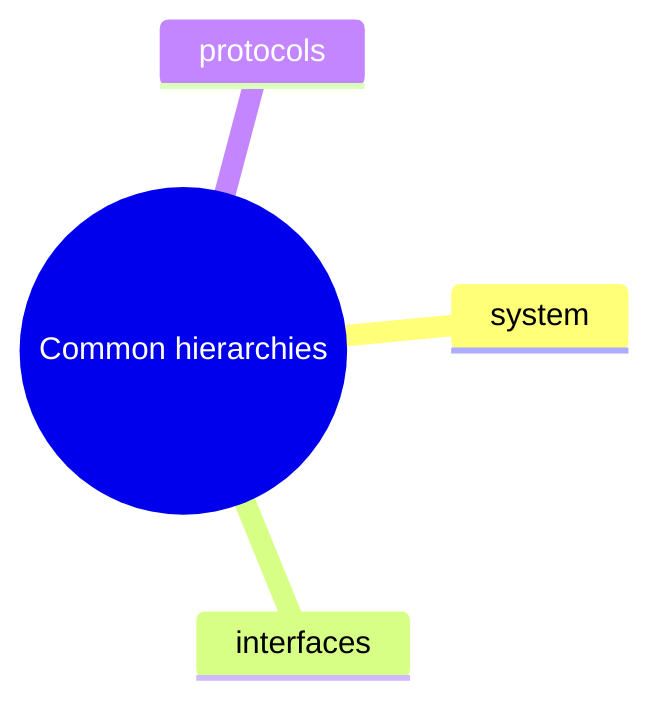

Example:

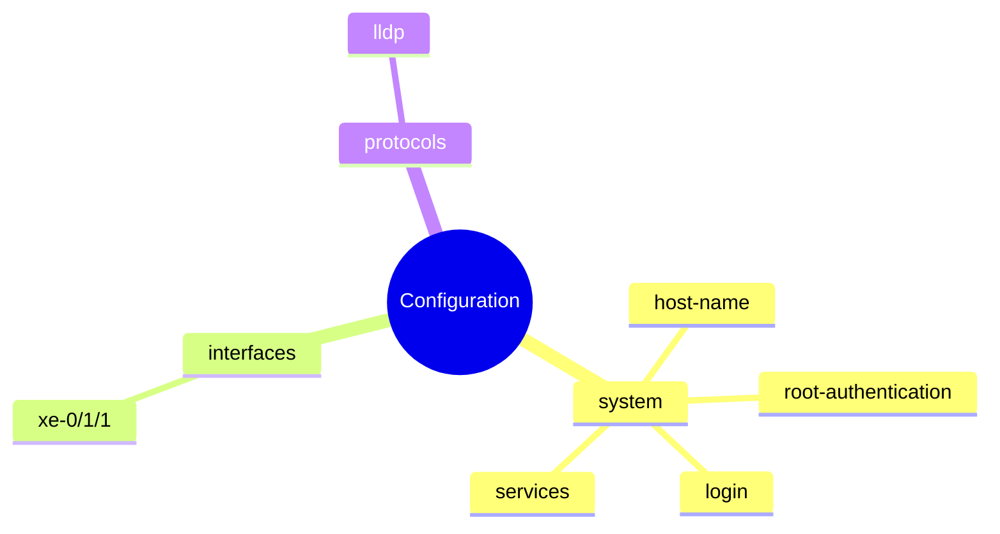

---

# 7. `system` Hierarchy

View:

```bash
show configuration system | display set
```

### Hostname

```bash
set system host-name R1
```

### SSH / Telnet

```bash
set system services ssh
set system services telnet
```

### User

```bash
set system login user employee uid 2000
set system login user employee class super-user
set system login user employee authentication encrypted-password "..."
```

Structure:

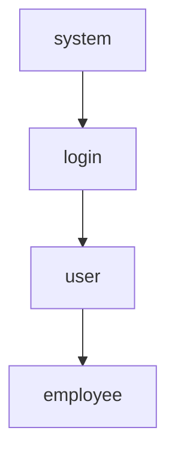

---

# 8. Root Authentication

```bash
set system root-authentication encrypted-password "..."
```

Hierarchy:

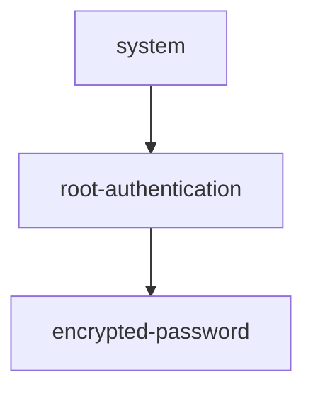

The password is represented as an encrypted/hashed value rather than plaintext.

---

# 9. Syslog Configuration

Example:

```bash
set system syslog file interactive-commands interactive-commands any
set system syslog file messages any notice
set system syslog file messages authorization info
```

Hierarchy:

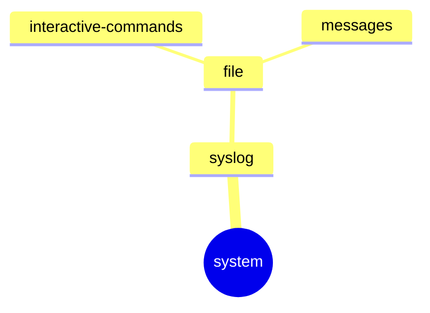

---

# 10. Interface Hierarchy

View:

```bash
show configuration interfaces | display set
```

Example:

```bash
set interfaces xe-0/1/1 description "Corporate LAN"
set interfaces xe-0/1/1 mtu 1800
set interfaces xe-0/1/1 unit 0 family inet address 172.16.10.1/24
set interfaces xe-0/1/1 unit 0 family inet6 address 2001:db8:0:10::1/64
```

Structure:

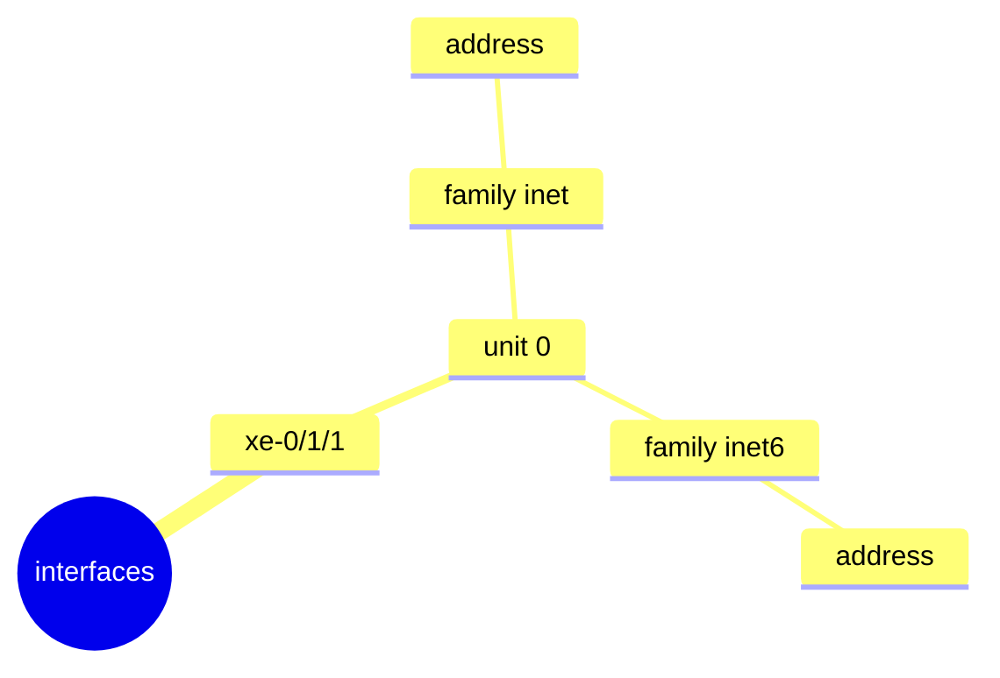

---

# 11. Physical vs Logical Settings

### Physical interface

```bash
set interfaces xe-0/1/1 mtu 1800
```

→ Physical / **Layer 2 MTU**

### Logical interface

```bash
set interfaces xe-0/1/1 unit 0 family inet mtu 900
```

→ IPv4 / **Layer 3 MTU**

### IP addresses

```bash
set interfaces xe-0/1/1 unit 0 family inet address 172.16.10.1/24
```

```bash
set interfaces xe-0/1/1 unit 0 family inet6 address 2001:db8:0:10::1/64
```

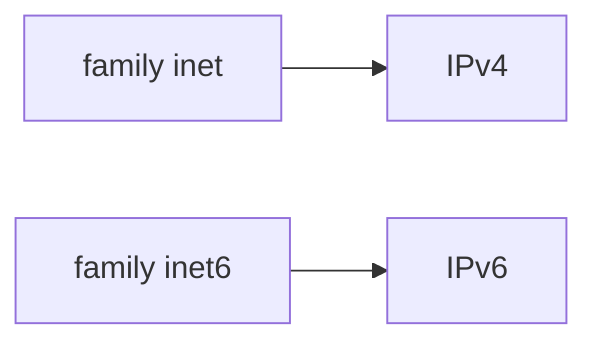

---

# 12. `family inet6` Without an Address

Example:

```bash
set interfaces xe-0/1/3 unit 0 family inet6
```

Enables IPv6 functionality on the logical interface and allows use of an automatically generated IPv6 **link-local address**.

---

# 13. Protocol Hierarchy

Protocols are configured under:

```text
protocols
```

Example — LLDP:

```bash
set protocols lldp interface xe-0/1/1
set protocols lldp interface xe-0/1/2
```

General pattern:

```bash
set protocols <protocol> interface <interface>
```

Examples shown:

```bash
set protocols rstp interface xe-0/1/2
set protocols isis interface xe-0/1/2
set protocols mpls interface xe-0/1/3
```

### Remember

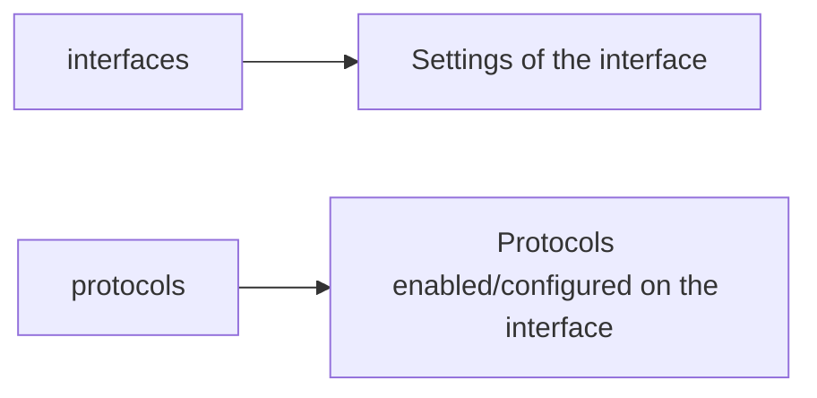

---

# 14. Search Configuration with `match`

Extremely useful command:

```bash
show configuration interfaces | display set | match mtu
```

Finds all interface configuration lines containing `mtu`.

Example:

```text
set interfaces xe-0/1/1 mtu 1800
set interfaces xe-0/1/3 unit 0 family inet mtu 900
```

### General syntax

```bash
show configuration <hierarchy> | display set | match <text>
```

---

# 15. Find All Configuration for an Interface

```bash
show configuration | display set | match xe-0/1/1
```

Can find configuration belonging to the interface across different hierarchies:

```text
set interfaces xe-0/1/1 ...
set protocols lldp interface xe-0/1/1
```

### Why useful?

Interface-related configuration may exist under **multiple top-level hierarchies**.

---

# 16. Display Specific Hierarchies

### System

```bash
show configuration system | display set
```

### Interfaces

```bash
show configuration interfaces | display set
```

### Protocols

```bash
show configuration protocols | display set
```

---

# 17. Display a Specific Interface

### Hierarchy

```bash
show configuration interfaces xe-0/1/2
```

### Set

```bash
show configuration interfaces xe-0/1/2 | display set
```

Hierarchy:

```text
interfaces {
    xe-0/1/2 {
        description "Server LAN";
        unit 0 {
            family inet {
                address 172.16.20.1/24;
            }
        }
    }
}
```

Set:

```bash
set interfaces xe-0/1/2 description "Server LAN"
set interfaces xe-0/1/2 unit 0 family inet address 172.16.20.1/24
```

---

# 18. Reading Hierarchy

Example:

```text
system {
    login {
        user employee {
            uid 2000;
            class super-user;
            authentication {
                encrypted-password "...";
            }
        }
    }
}
```

Read from top → bottom:

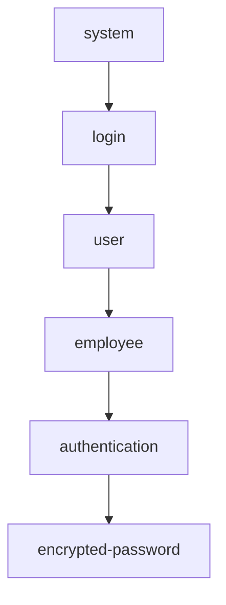

`{ }` indicate the boundaries of each hierarchy level.

---

# 19. Lab Interface Allocation

|Interface|Purpose|IPv4|IPv6|
|---|---|---|---|
|`ge-0/0/1`|Corporate LAN|`172.16.10.1/24`|`2001:db8:0:10::1/64`|
|`ge-0/0/2`|Server LAN|`172.16.20.1/24`|`2001:db8:0:20::1/64`|
|`ge-0/0/3`|Guest LAN|`172.16.30.1/24`|`2001:db8:0:30::1/64`|
|`ge-0/0/6`|WAN|`10.1.254.1/24`|`2001:db8:1:254::1/64`|

---

# ⭐ JNCIA Cheat Sheet

```bash
# Hierarchy view
show configuration

# Set view
show configuration | display set

# Specific hierarchies
show configuration system
show configuration interfaces
show configuration protocols

# Set view of hierarchy
show configuration system | display set
show configuration interfaces | display set
show configuration protocols | display set

# Specific interface
show configuration interfaces ge-0/0/1
show configuration interfaces ge-0/0/1 | display set

# Search configuration
show configuration interfaces | display set | match mtu

# Find all config related to an interface
show configuration | display set | match ge-0/0/1
```

## Must Remember

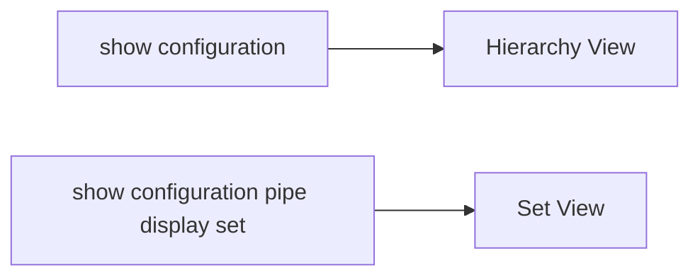

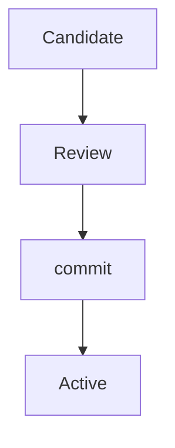

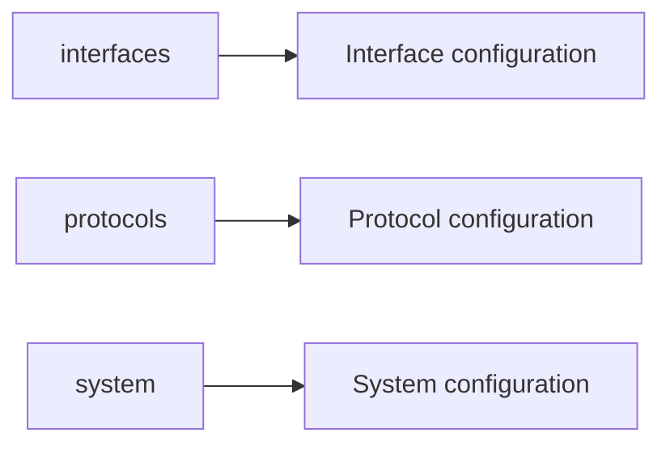

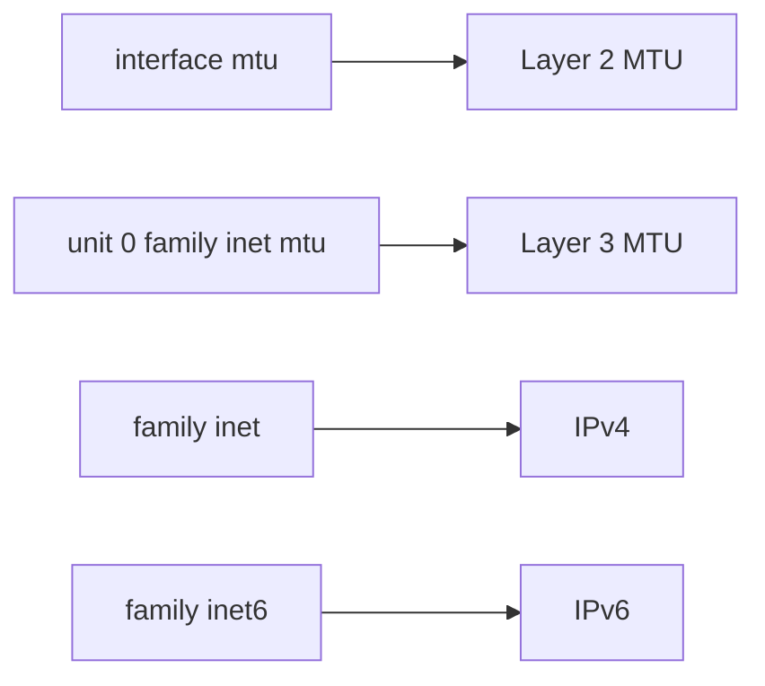

**Most important pattern:**

```bash
show configuration <hierarchy> | display set | match <text>
```