# Junos OS — Candidate Configuration, Commit, Rollback & Configuration Editing

## 1. Candidate Configuration

Junos does **not directly modify the active configuration** when you enter a configuration command.

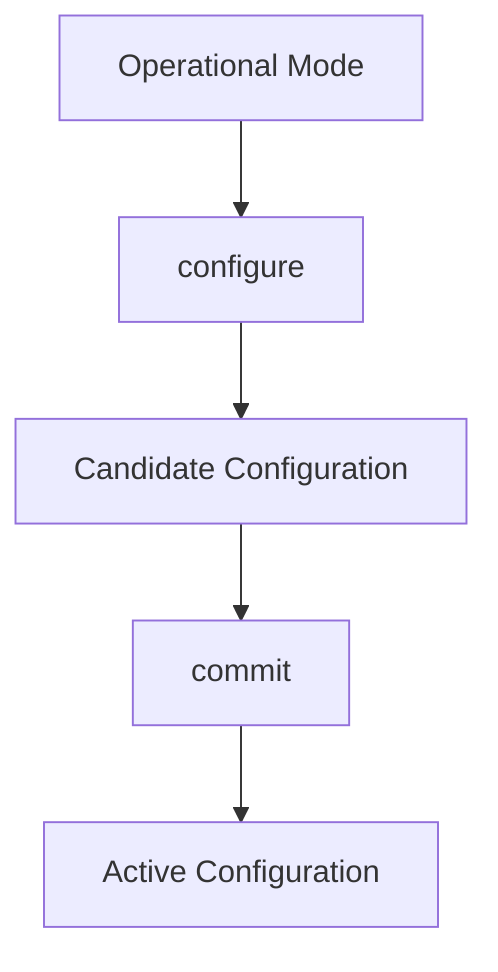

- Configuration commands are stored in the **candidate configuration**.
    
- Candidate changes have **no production effect until committed**.
    
- Junos validates syntax and configuration structure before allowing a commit.
    

---

## 2. Enter Configuration Mode

```bash
configure
```

Prompt changes:

```text
user@router> configure
[edit]
user@router#
```

Configuration mode allows you to:

- Add configuration
    
- Delete configuration
    
- Modify configuration
    
- Rename configuration
    
- Move/copy configuration
    
- Deactivate configuration
    

---

# 3. View Proposed Changes

```bash
show | compare
```

Shows differences between:


Symbols:

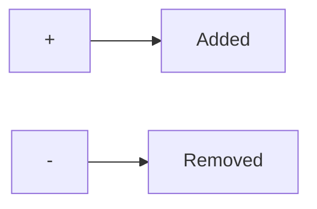

Example:

```text
[edit system]
- host-name R1;
+ host-name ROUTER_1;
```

### Important

```bash
show | compare
```

is one of the **most important commands before `commit`**.

---

# 4. Discard Candidate Changes

```bash
rollback
```

Returns the candidate configuration to match the current active configuration.

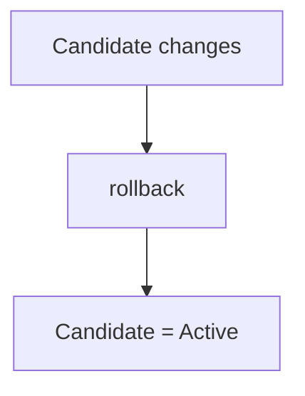

Verify:

```bash
show | compare
```

If nothing is displayed → no pending changes.

---

# 5. `commit`

Saves candidate configuration as the active configuration.

```bash
commit
```

You remain in configuration mode.

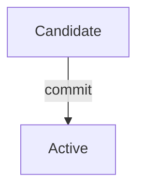

---

# 6. `commit and-quit`

Commit changes and immediately leave configuration mode.

```bash
commit and-quit
```

Equivalent workflow:

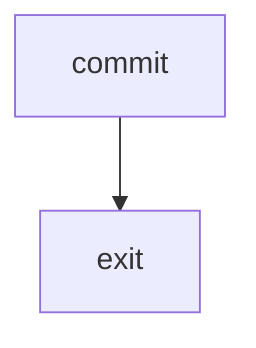

### Difference

```bash
commit
```

→ Commit + stay in `[edit]`

```bash
commit and-quit
```

→ Commit + return to operational mode

---

# 7. Validate Without Saving

```bash
commit check
```

Checks whether the candidate configuration is valid **without committing it**.

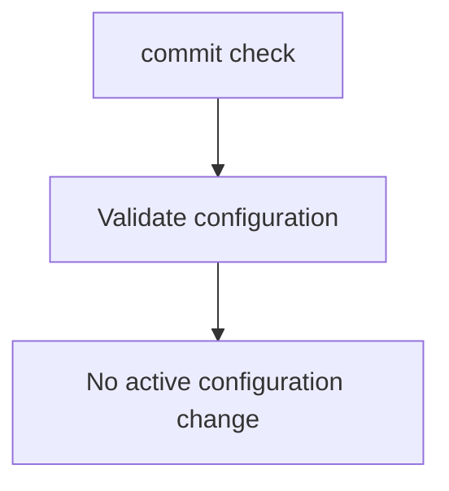

Useful before committing complicated changes.

### Typical workflow

```bash
show | compare
commit check
commit
```

---

# 8. Junos Prevents Invalid Commits

Junos performs configuration validation when committing.

Example:

```bash
set interfaces xe-0/1/1 unit 0 family inet address 192.168.1.0/24
commit
```

If the address is invalid for the subnet/interface configuration, the commit can fail.

Typical error:

```text
error: configuration check-out failed
```

### Key point

```text
Syntax accepted ≠ Configuration valid
```

`commit` performs deeper configuration validation.

---

# 9. Historical Configurations

Junos normally keeps up to **49 previous committed configurations**.

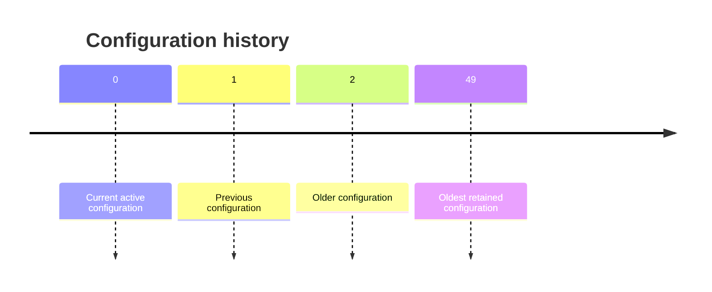

View the history:

```bash
show system commit
```

Output includes information such as:

- Configuration number
    
- Timestamp
    
- User who committed it
    
- How it was committed
    

---

# 10. Roll Back to a Previous Configuration

In configuration mode:

```bash
rollback 1
```

Loads historical configuration **1** into the candidate configuration.

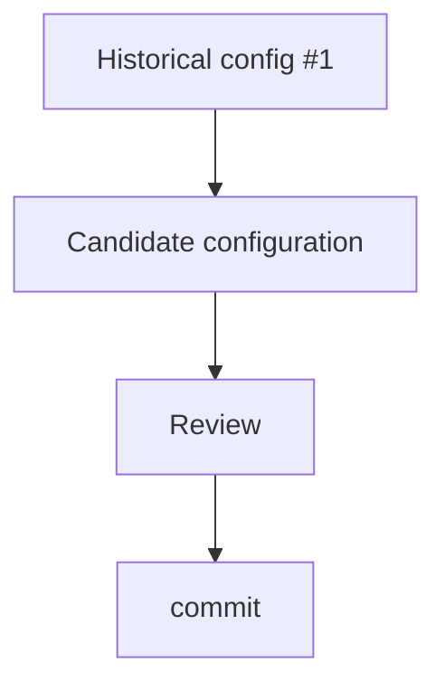

### Important

`rollback 1` **does not immediately make it active**.

You still need:

```bash
commit
```

---

# 11. `rollback` vs `rollback <number>`

```bash
rollback
```

→ Discards **current candidate changes**.

```bash
rollback 1
```

→ Loads **historical configuration #1** into the candidate configuration.

|Command|Purpose|
|---|---|
|`rollback`|Discard current uncommitted changes|
|`rollback 1`|Load previous committed config|
|`rollback 2`|Load configuration #2|
|`rollback 49`|Load oldest retained configuration|

---

# 12. Compare Current Config with Historical Config

Operational mode:

```bash
show configuration | compare rollback 1
```

Useful for determining what changed between the current configuration and an older configuration.

---

# 13. Editing an Existing IP Address

First inspect the existing configuration:

```bash
show configuration interfaces xe-0/1/2 | display set | match 172
```

Example:

```text
set interfaces xe-0/1/2 unit 0 family inet address 172.16.200.1/24
```

Then adding the correct address:

```bash
set interfaces xe-0/1/2 unit 0 family inet address 172.16.20.1/24
```

### Important

The new address is **added**; the old address is not automatically replaced.

Verify:

```bash
show | compare
```

You may see:

```text
+ address 172.16.20.1/24;
+ address 172.16.200.1/24;
```

---

# 14. Delete Specific Configuration

Use:

```bash
delete
```

Example:

```bash
delete interfaces xe-0/1/2 unit 0 family inet address 172.16.200.1/24
```

Then:

```bash
show | compare
```

You should see the unwanted configuration marked with `-`.

Finally:

```bash
commit
```

---

# 15. `delete` Is Hierarchy-Aware

This is extremely important.

Junos `delete` operates at the **hierarchy level specified by the command**.

Example:

```bash
delete interfaces xe-0/1/5 unit 0 family inet6 address 2001:db8:1:2::1/64
```

Deletes only the specified address.

```bash
delete interfaces xe-0/1/5 unit 0 family inet6
```

Deletes the **entire `family inet6` hierarchy**.

```bash
delete interfaces xe-0/1/5 unit 0
```

Deletes the **entire logical unit**.

```bash
delete interfaces xe-0/1/5
```

Deletes the **entire interface configuration**.

```bash
delete interfaces
```

Deletes the **interfaces hierarchy**.

```bash
delete
```

Deletes the **entire candidate configuration**.

---

# 16. Delete Hierarchy — Mental Model

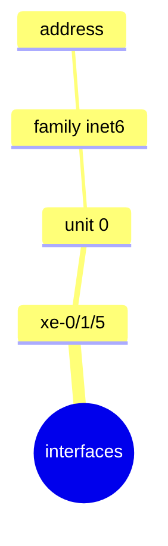

Deleting at different levels:

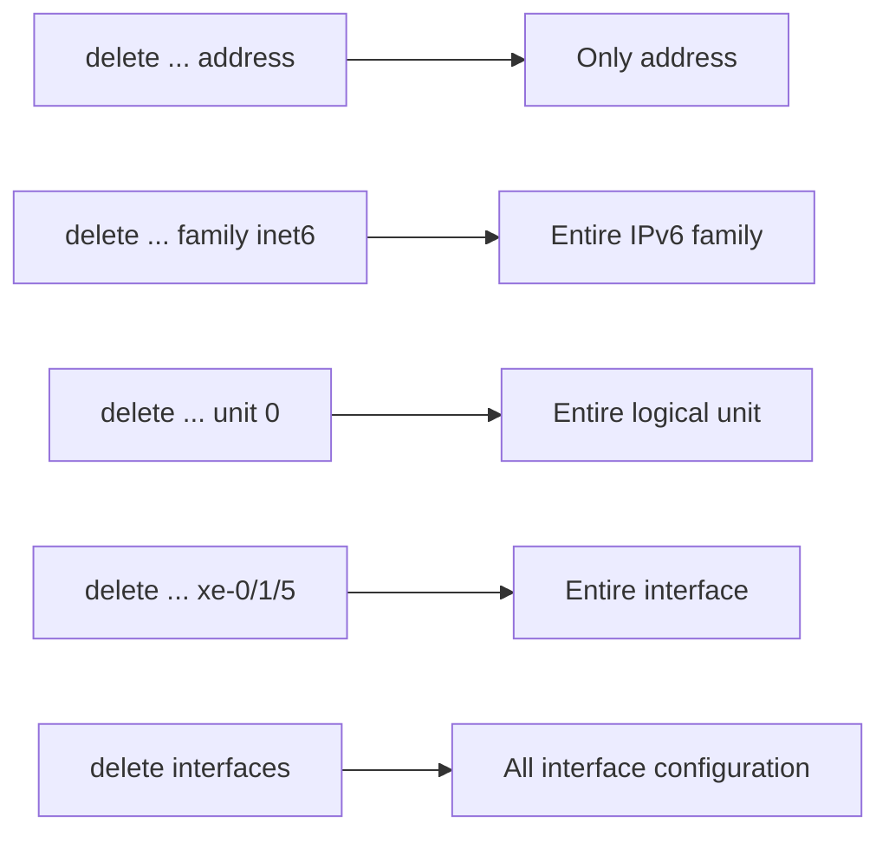

### Rule

> **The deeper the path, the smaller the deletion.**

---

# 17. Delete Entire Configuration

```bash
delete
```

Junos asks for confirmation because this removes the entire configuration under the current hierarchy.

Can be useful when completely rebuilding a device, but is **extremely dangerous in production**.

If done accidentally:

```bash
rollback
```

can restore the candidate configuration before committing.

---

# 18. Best Practice Before Editing

Always inspect the existing configuration first.

```bash
show configuration interfaces xe-0/1/5 | display set
```

Then decide exactly what needs to be changed/deleted.

### Safe workflow

```bash
show configuration <target>
        ↓
Understand hierarchy
        ↓
set / delete
        ↓
show | compare
        ↓
commit check
        ↓
commit
```

---

# 19. Deleting Individual Settings

Example: find all custom MTUs:

```bash
show configuration | display set | match mtu
```

Example output:

```text
set interfaces xe-0/1/1 mtu 1800
set interfaces xe-0/1/3 unit 0 family inet mtu 900
```

Delete individually:

```bash
delete interfaces xe-0/1/1 mtu 1800

delete interfaces xe-0/1/3 unit 0 family inet mtu 900
```

Verify:

```bash
show | compare
```

Then:

```bash
commit
```

---

# 20. `commit confirmed`

One of the **most important Junos safety features** for remote configuration.

```bash
commit confirmed
```

By default, Junos gives you **10 minutes** to confirm the configuration.

If you don't confirm it within the timer:

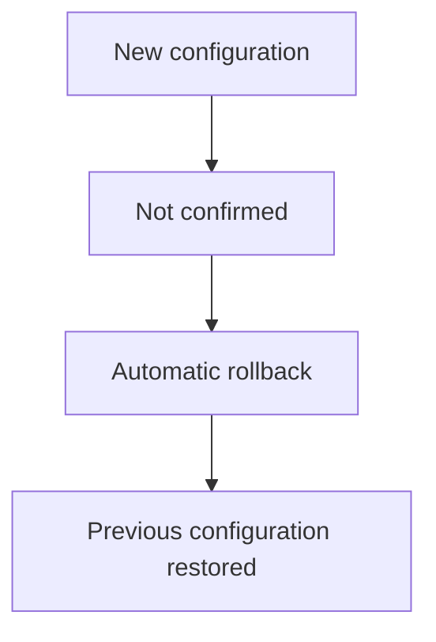

This protects you from accidentally locking yourself out of a remote device.

---

# 21. Specify Confirmation Timer

Example:

```bash
commit confirmed 2
```

Means:

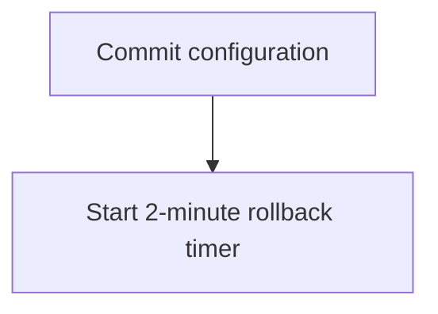

If not confirmed:

```text
Automatically rollback after 2 minutes
```

The module demonstrates the default timer as **10 minutes**.

---

# 22. Confirm a `commit confirmed`

After verifying that everything works:

```bash
commit
```

or:

```bash
commit check
```

The module notes that a normal `commit` or `commit check` can cancel the pending rollback.

### Recommended safe approach

```bash
commit confirmed 10
        ↓
Test connectivity
        ↓
Verify configuration
        ↓
commit
```

---

# 23. Why `commit confirmed` Is Critical

Especially useful when changing:

- WAN interfaces
    
- Management interfaces
    
- Routing
    
- Firewall/security policies
    
- SSH access
    
- Remote network paths
    

Example:

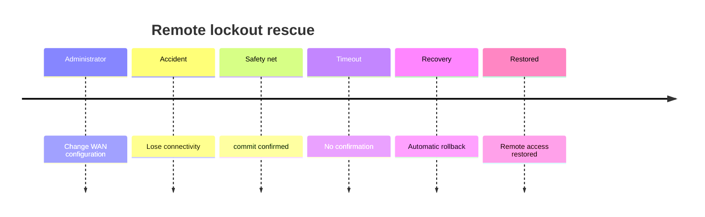

---

# 24. `commit confirmed` + Comment + Quit

Options can be combined.

Example from the module:

```bash
commit confirmed 2 comment "Deleted the Internet" and-quit
```

This performs multiple actions:

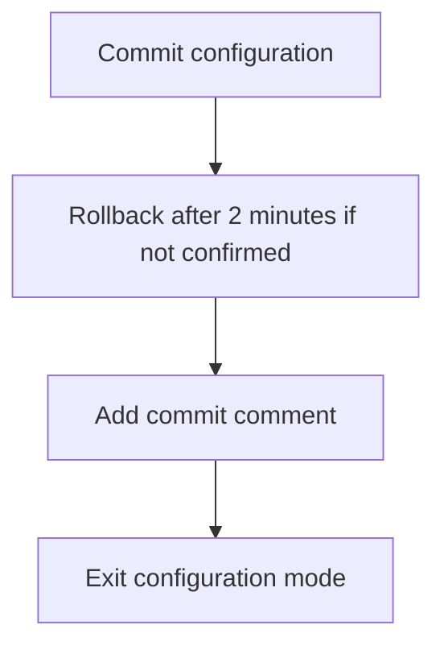

---

# 25. Commit Comments

Add a description to a commit:

```bash
commit comment "Changed WAN interface"
```

View commit history:

```bash
show system commit
```

Commit history can then show:

```text
Timestamp
User
Commit method
Comment
```

### Best practice

Use meaningful comments:

```bash
commit comment "Updated server LAN IPv4 address"
```

instead of:

```bash
commit comment "change"
```

---

# 26. `show system commit`

```bash
show system commit
```

Useful for:

- Finding historical configuration numbers
    
- Seeing who made changes
    
- Checking timestamps
    
- Identifying commit comments
    
- Determining which rollback number to use
    

Example workflow:

```bash
show system commit
```

Find desired revision:

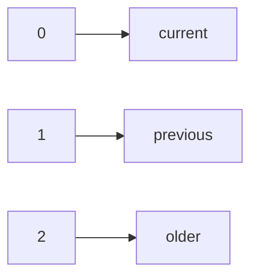

Then:

```bash
rollback 2
```

---

# 27. Operational Commands from Configuration Mode

Normally:

```text
Operational mode
router>
```

commands such as:

```bash
show interfaces terse
```

are executed here.

From configuration mode:

```text
[edit]
router#
```

use:

```bash
run show interfaces terse
```

Example:

```bash
run show interfaces terse xe-0/1/1
```

This executes the operational command **without leaving configuration mode**.

---

# 28. `run` Command

Syntax:

```bash
run <operational-mode-command>
```

Example:

```bash
run show interfaces terse xe-0/1/1
```

Useful for quick verification while configuring.

### But remember

For production work, avoid staying in configuration mode unnecessarily.

Better:

```text
Configure → verify → exit
```

rather than performing everything from `[edit]`.

---

# 29. IPv6 Address Structure

Example:

```text
2001:db8:1:2::1/64
```

Breakdown:

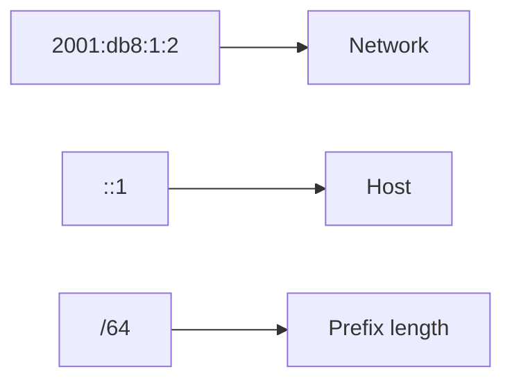

So:

```text
Network = 2001:db8:1:2
Host    = ::1
Prefix  = /64
```

---

# 30. Important Configuration Workflow

### Normal change

```bash
configure

set <configuration>

show | compare

commit
```

### Safe remote change

```bash
configure

set <configuration>

show | compare

commit check

commit confirmed 10

# Test connectivity

commit
```

### Cancel uncommitted changes

```bash
rollback
```

### Restore previous committed configuration

```bash
rollback 1
commit
```

---

# ⭐ JNCIA Command Cheat Sheet

```bash
# Enter configuration mode
configure

# View candidate changes
show | compare

# Discard candidate changes
rollback

# Validate candidate configuration
commit check

# Commit and stay in config mode
commit

# Commit and exit
commit and-quit

# View commit history
show system commit

# Load historical configuration
rollback 1
rollback 2
rollback 49

# Compare current config with historical config
show configuration | compare rollback 1

# Delete configuration
delete <hierarchy>

# Execute operational command from config mode
run show interfaces terse

# Safe remote commit
commit confirmed 10

# Confirm/cancel pending rollback
commit

# Add commit comment
commit comment "Description"

# Combine options
commit confirmed 2 comment "Change description" and-quit
```

---

# ⭐ Exam Quick Revision

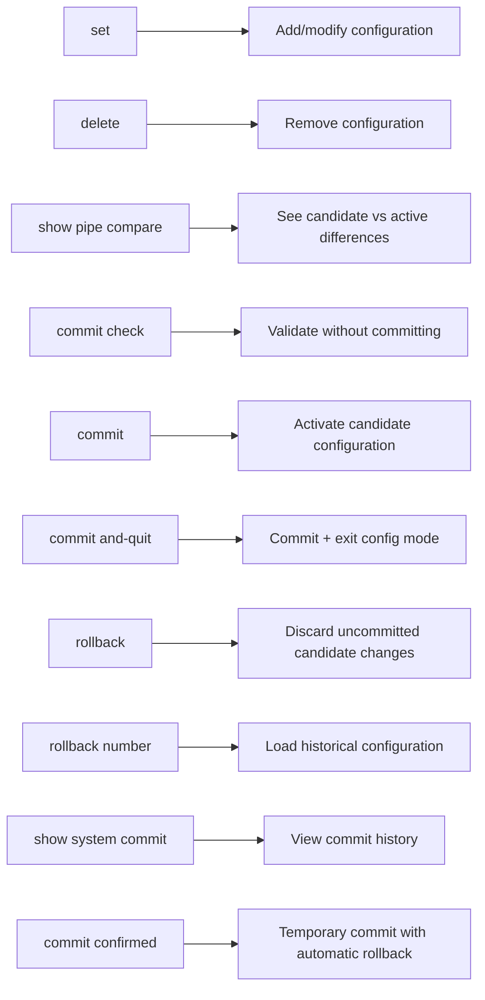

### Most Important Distinctions

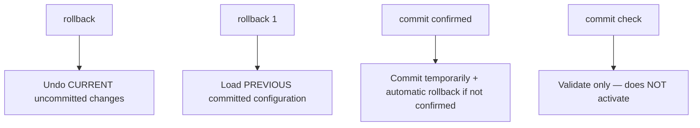

### Safe Production Workflow

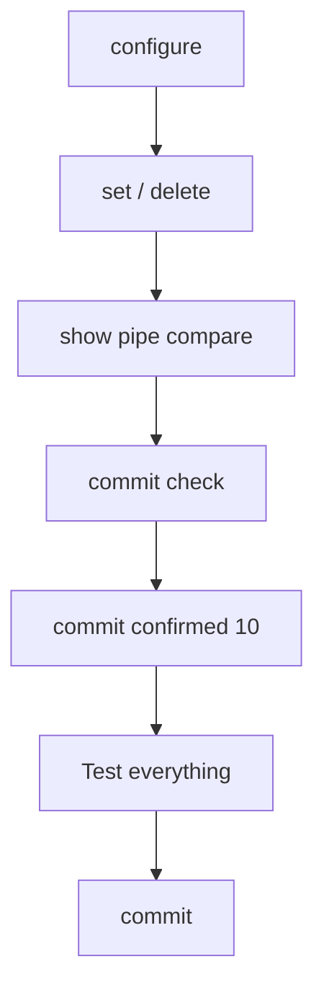